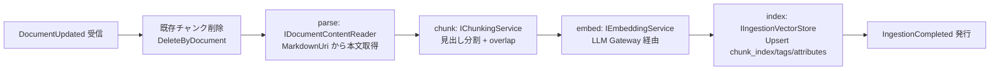

# 作業仕様書: FR-02 取り込みパイプライン

> 本仕様書は実装着手前に作成する。計画書を一次情報とし、本書は「この作業で何をどう実装するか」を確定する作業仕様である。

## 起点となる計画書（トレーサビリティ）

- 機能要求（FR）: FR-02
- ユースケース（UC）: UC-04
- 画面（SC）: （未設定）
- 関連 ADR: ADR-0003, ADR-0009, ADR-0013
- 計画書リンク: `planning/projects/microservices-platform/02_requirements/01_requirements.md`

## 目的・背景

`IngestionService.Worker` は `DocumentUpdated` イベントを受信し、文書本文を **パース → チャンク化 → 埋め込み生成 → 検索インデックス（Qdrant）へ登録** する。
既存スケルトンは消費者・チャンク化・埋め込み・ベクトルストアの各ポートを持つが、パイプラインとして成立させるために以下のギャップがある。本作業でこれを埋め、FR-02 の受け入れ基準を満たす。

## 対象範囲

- 対象（`src/Services/IngestionService/`）
  - パース段の追加（`IDocumentContentReader` ポート + 実装）
  - チャンク化の `overlap` 実装（`MarkdownChunkingService`）
  - 冪等なチャンク ID（documentId + chunkIndex から決定的に生成）
  - Qdrant ペイロード拡充（`chunk_index` / `tags`）
  - Qdrant コレクションの起動時ブートストラップ（`EnsureCollectionAsync`）
  - Qdrant コレクション名の設定不整合の修正（`Qdrant:CollectionName` を正とする）
  - 消費者のパイプライン化（parse→chunk→embed→index）
  - ユニットテスト（受け入れ基準・例外フローの写像）
- 対象外
  - 実際のオブジェクトストレージ（MinIO 等）連携の本実装（dev 環境に未配備のため、HTTP 取得 + プレースホルダーのグレースフルデグレードに留める）
  - 横断検索 UI / 検索 API（FR-05 RetrievalService 側。本作業ではコレクション名整合のみ波及修正）
  - 権限フィルタの評価ロジック（AuthorizationService。本作業はペイロードへ ABAC 属性を保持するのみ）

## 設計

### パイプライン

### 主要な実装判断（詳細は IADR-0002）

1. **パース段**: `IDocumentContentReader` ポートを新設。`MarkdownUri` が `http(s)` の場合は HTTP で取得、それ以外（`storage://` 等、dev 未配備）の場合は警告ログの上でプレースホルダー本文を返す（`PandocConversionService` と同じグレースフルデグレード方針）。消費者はポートに依存し、テストでは本物の Markdown を返すスタブを注入できる。
2. **冪等なチャンク ID**: `documentId` + `chunkIndex` から決定的な GUID を生成。再取り込みでも同一 ID となり、削除漏れ時も上書きで冪等性を担保。
3. **Qdrant ブートストラップ**: `IHostedService`（`QdrantBootstrapHostedService`）が起動時に `EnsureCollectionAsync` を呼び、コレクション未存在なら作成（ベクトル次元 = 設定 `Qdrant:VectorSize` 既定 1536、距離 = Cosine）。
4. **設定キー整合**: コレクション名は `Qdrant:CollectionName` を正とし、後方互換で `Qdrant:Collection` → 既定 `knowledge_chunks` の順にフォールバック。RetrievalService 側も同一解決にして検索との整合を保つ。
5. **ペイロード拡充**: `chunk_index`（整数）・`tags`（文字列配列）を保存。検索結果の出典・並び順・タグ絞り込みに使用。

## 受け入れ基準

計画書（FR-02）の受け入れ基準のうち、本サービス（取り込み）が責務を持つ条件を確定する。

- [ ] 文書本文をパースし、チャンク化・埋め込み生成の上で Qdrant コレクションへ登録できる（パイプライン成立）。
- [ ] 取り込んだチャンクのペイロードに出典（`markdown_uri`）・`document_title`・`chunk_index`・`tags`・ABAC 属性が保持され、検索結果に出典・絞り込み情報を付与できる。
- [ ] 同一文書の再取り込みが冪等である（旧チャンク削除 + 決定的チャンク ID により重複しない）。
- [ ] 検索インデックス（コレクション）が起動時に存在保証され、登録先が未作成で失敗しない。
- [ ] 取り込み完了時に `IngestionCompleted` を発行し、後続（検索反映）へ連鎖できる（更新 → 反映時間の前提を満たす）。
- [ ] 権限属性（ABAC）はペイロードに保持し、検索側でのフィルタ前提を提供する（権限外文書の非表示は検索側で担保）。

## テスト方針

- 消費者がパース→チャンク→埋め込み→索引のパイプラインを実行することをユニットテスト（MassTransit テストハーネス + インメモリストア）で検証。
- `MarkdownChunkingService` の overlap・見出し分割をユニットテストで検証。
- 決定的チャンク ID が再取り込みで一致することを検証。
- ペイロードに `chunk_index`/`tags`/`attributes` が保持されることを検証。
- `MarkdownUri` が null の場合のスキップ（例外フロー）を検証。
- 詳細は `../tests/FR-02_ingestion.md`。

## 計画書との差異

- 差異: あり（軽微）。dev 環境にオブジェクトストレージが未配備のため、パース段は HTTP 取得可能 URI のみ実取得し、それ以外はプレースホルダーへフォールバックする。ストレージ連携の本実装は別 FR/タスクで対応。検索 UI・横断検索の受け入れ基準は Retrieval/BFF 側の責務であり、本作業ではコレクション名整合のみ波及修正する。

## 未決事項

- 埋め込みベクトル次元（既定 1536）は LLM Gateway の埋め込みモデル確定後に再確認する（設定 `Qdrant:VectorSize` で外出し済み）。
