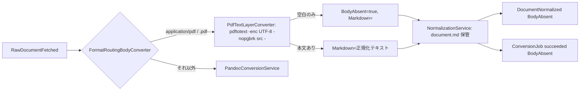

# 作業仕様書: PDF のテキスト層抽出と「本文なしで完了」

## 起点となる計画書（トレーサビリティ）

- 機能要求（FR）: FR-01（取り込み対象に PDF を含める。ADR-0070 決定 1）／ FR-12（原本の正規化変換）
- ユースケース（UC）: UC-06（文書を正規化変換する）
- 画面（SC）: SC-07（変換ジョブ画面。「本文なしで完了」を理由つきで表示する）
- 関連 ADR: ADR-0070（本作業の裁定。ADR-0012 §決定「本文は pandoc」を部分改定）、ADR-0012
- 受け皿 issue: #1192（planning#509 の環流 → planning#521 で ADR-0070 が Accepted）

## 目的・背景

`IADR-0320` 決定 4 は「PDF は pandoc の入力形式にならないので明示的に拒否する」とし、同 §代替案は
「PDF を poppler 等で別経路に回すのは計画外の機能追加」として退けた。**ADR-0070 決定 2 はこの判断を覆した**
（「FR-12 が要求しているのは正規化であり、pandoc は括弧書きで示された手段である。手段が 1 つの形式に
届かないときに別の手段を足すことは、要求の追加ではなく手段の補完である」）。

現状（`develop` `45853885`）の実装は PDF を 1 件残らず `failed` ＋ `deadLettered=true` にする。
ADR-0070 決定 3 が禁じた状態そのものである。

本作業は ADR-0070 の **決定 1・2・3・5** を実装へ降ろす。**決定 4（本文なしの文書をカタログ・検索へ
載せる）は #1193 の射程**であり、本作業はイベントに「本文なし」が判る項目を載せるだけで、
IngestionService / RetrievalService には触れない。

## 母集合（着手前に自分で走査した。issue の本文からは転記していない）

```console
$ git rev-parse --is-shallow-repository
false
```

### 走査 1 — 変換形式の判定（拡張子／MIME）

```console
$ git grep -n "PandocInputFormat\|UnsupportedSourceFormatException\|UnsupportedPdf" -- src/
src/knowledge/backend/Services/ConversionService/ConversionService.csproj:20          （InternalsVisibleTo の説明）
src/knowledge/backend/Services/ConversionService/Domain/Ports/IBodyConverter.cs:27
src/knowledge/backend/Services/ConversionService/Features/ConversionJobs/Normalize/RawDocumentFetchedConsumer.cs:61
src/knowledge/backend/Services/ConversionService/Infrastructure/ExternalServices/PandocConversionService.cs:36,255,289,304,307
src/knowledge/backend/Services/ConversionService/Tests/Infrastructure/ExternalServices/PandocConversionServiceTests.cs:184-206
```

形式の判定点は **`PandocConversionService.PandocInputFormat` の 1 箇所**である。MIME の switch と拡張子の
switch の 2 段で、PDF は両段で `UnsupportedPdf` を投げ、**それ以外の未知は `markdown` へ落ちる**
（投げる形式は PDF だけ。「PDF 以外の未対応形式」は現状 1 つも無い）。

取り込み側の集合は `DataSourceService/Infrastructure/ExternalServices/FileSystemConnector.cs:14-23` の
`ContentTypes`（6 拡張子）。他コネクタ（`WikiConnector` / `SaaSConnector` / `DatabaseConnector`）は
`DefaultContentType = "text/markdown"`。

### 走査 2 — pandoc 呼び出し

`PandocConversionService.RunPandocAsync`（`Process.Start("pandoc")`）と `TryGetPandocVersionAsync`
（`PandocHealthCheck` が同じ口を使う）。**外部プロセス起動の型はこの 2 つ**であり、抽出器も同じ型で足す。

### 走査 3 — 失敗の分類（fail-closed / dead letter）

| 経路 | 例外 | コンシューマの扱い |
| --- | --- | --- |
| pandoc 不在・原本未解決（`Degrade`） | `BodyConversionUnavailableException` | 再送出 → 再試行 → デッドレター（`IADR-0320` 決定 2） |
| pandoc 非 0 終了（`RunPandocAsync`） | `InvalidOperationException` | 同上（UC-06 例外フロー） |
| PDF（`PandocInputFormat`） | `UnsupportedSourceFormatException` | **再送出せず** `FailAsync(deadLettered: true)`（`IADR-0320` 決定 4）← **本作業が覆す対象** |

### 走査 4 — ジョブ状態の DTO と画面の状態表示

```console
$ git grep -n "public const string" -- src/knowledge/backend/Shared/Knowledge.Contracts/Dtos/ConversionJobDto.cs
Queued / Processing / Succeeded / Failed                                       ← 4 値
$ git grep -n "DeadLettered\|DiagramsRetained\|HasCorrection" -- src/knowledge/backend/Shared/Knowledge.Contracts/Dtos/ConversionJobDto.cs
（3 件。いずれも「状態の 5 値目ではない内訳」として末尾に既定値つきで載っている）
$ git grep -n "hasRetainedFigures\|isRetryable\|JOB_STATUSES" -- src/knowledge/frontend/src/features/sc07-conversions/
types/jobStatus.ts / types/jobStatus.test.ts / components/ConversionJobsPage.tsx
```

「本文なしで完了」は `DeadLettered` と同型（`succeeded` の内訳の真偽値）で足せる。画面の導出関数は
`types/jobStatus.ts` に閉じている。

### 走査 5 — 「PDF は拒否する」と述べている文書（誤りの側の文字列で引いた）

```console
$ grep -rniE "\bpdf\b" docs/ --include=*.md -l
docs/functional/FR-01_data-source-catalog.md      :81（「明示的に拒否する」）:104（スコープ外「別経路を足すかどうかは計画側の裁定事項」）
docs/functional/FR-12_document-normalization.md   E5・スコープ外・処理フロー 3
docs/tests/FR-12_document-normalization.md        T-20・T-21・補足
docs/tests/UC-06_document-normalization.md        T-06
docs/how-to/plan-id-range-history-annex.md        （ADR-0070 の行。正しい。触らない）
$ grep -rli "pandoc" docs/ | wc -l          # 陽性対照
13
```

`docs/screens/SC-07_*` / `docs/tests/SC-07_*` / `docs/data/conversion-job.md` / `docs/api/openapi.yaml` は
PDF を述べていないが、**新しい内訳（`bodyAbsent`）を足すので追随が要る**（状態モデルの表・導出標識・列定義・契約）。

### 走査 6 — ADR-0070 の形式集合 × 現行の許可集合（陽性対照つき）

| 拡張子（計画 09_datasource-connectors §対応形式） | 取り込み側 `FileSystemConnector.ContentTypes` | 変換側 `PandocInputFormat` | 差分 |
| --- | --- | --- | --- |
| `.md` / `text/markdown` | 有 | `gfm` | 一致 |
| `.txt` / `text/plain` | 有 | 既定 `markdown`（明示ではなく落ちて当たる） | 一致（明示化する） |
| `.html` `.htm` / `text/html` | 有 | `html` | 一致 |
| `.docx` / `application/vnd…wordprocessingml.document` | 有 | `docx` | 一致 |
| `.pdf` / `application/pdf` | 有 | 🔴 **拒否（例外）** | **本作業で抽出器へ振り分ける** |
| （表に無い）`.rtf` `.epub` `.rst` `.tex` `.org` | 無 | 明示写像あり | 取り込み側が列挙しないため実害なし。**本作業では触らない**（増減は計画側） |
| （表に無い）未知の MIME ＋未知の拡張子 | 無 | 既定 `markdown` | ADR-0070 決定 5「この既定に頼ると静かに壊れた本文になる」→ **拒否へ改める**（陽性対照） |

陽性対照: 同じ突き合わせで `.pdf` が「取り込み側にあって変換側で拒否」と出ること（ADR-0070 §実測と一致）。

### 走査 7 — `DocumentNormalized` の発行口と消費者（イベント項目の追加先）

```console
$ git grep -n "PublishNormalizedAsync" -- src/knowledge/backend
Domain/Ports/IDocumentNormalizedPublisher.cs:25 / Features/.../RawDocumentFetchedConsumer.cs:48 /
Infrastructure/Messaging/MassTransitDocumentNormalizedPublisher.cs:21 /
Tests/Infrastructure/Messaging/MassTransitDocumentNormalizedPublisherTests.cs:37 / Tests/RecordingDocumentNormalizedPublisher.cs:30 /
Tests/Knowledge.IntegrationTests/Fixtures/RawDocumentFetchedEdge.cs:60        ← 宣言領域の外だが、ポート変更で必ず追随する
$ git grep -ln "DocumentNormalized" -- src/knowledge/backend/Services | grep -v ConversionService
DocumentService/Features/Documents/Catalog/DocumentNormalizedConsumer.cs      ← 消費者（#1193 の射程。触らない）
```

消費者は `ev.MarkdownUri` を読み `DocumentUpdated` を再発行し、IngestionService が本文をチャンク化する。
**空の本文はチャンク 0 件で通る**（`DocumentUpdatedConsumer` は `MarkdownUri is null` だけを早期 return する）
—— 本作業後、本文なしの PDF は空の `document.md` で登録され、索引には載らない。**メタデータで検索に載せる
のは #1193**。

## 対象範囲

- 対象: 上記走査 1〜7 の変更点。`ConversionService/**`（Dockerfile 含む）、`Knowledge.Contracts`
  （`ConversionJobDto` / `DocumentNormalized`）、`FileSystemConnector` のコメント、`sc07-conversions/**`、
  `docs/api/openapi.yaml` ＋ orval 生成物、`docs/functional/FR-12*` `FR-01*` / `docs/tests/FR-12*` `UC-06*`
  `SC-07*` / `docs/screens/SC-07*` / `docs/data/conversion-job.md`、`IADR-0356`、索引。
- 対象外: ADR-0070 決定 4（#1193。IngestionService / RetrievalService / SC-02）、OCR（ADR-0070 案 4）、
  `.rtf` 等の表外形式の増減（計画側）、PDF 内画像の図抽出（`pdfimages`。計画に無い）。

## 決めること（実装 ADR: `IADR-0356`）

1. **抽出器は poppler-utils の `pdftotext` を外部プロセスとして起動する。** NuGet は足さない
   （`scripts/backend-library-baseline.json` 不変）。取得元はベースイメージの APT ミラー（`IADR-0320` 決定 1 と同じ線）。
2. **振り分けは `IBodyConverter` の実装 `FormatRoutingBodyConverter` が行う。** PDF → `PdfTextLayerConverter`、
   それ以外 → `PandocConversionService`。`NormalizationService` は `IBodyConverter` しか知らない（`IADR-0008` の
   3 ポートは不変。golden の差し替え点も不変）。
3. **`PandocInputFormat` は PDF で例外を投げず `null`（＝ pandoc の担当ではない）を返す。** 表に無い未知の
   形式（未知 MIME ＋未知拡張子）は **`UnsupportedSourceFormatException` を投げる**（従前の既定 `markdown` を
   やめる。ADR-0070 決定 5）。`.txt` / `text/plain` は明示的に `markdown` へ写す。
4. **「テキスト層なし」の判定は抽出結果が空白のみ**（改頁 `\f` を除いて `IsNullOrWhiteSpace`）。判定は純関数
   `PdfTextLayerConverter.ToBody` に置き、pdftotext 無しで試験できるようにする。
5. **本文なしは `succeeded` の内訳 `BodyAbsent`（真偽値）で運ぶ。** 状態値は 4 値のまま。
   `BodyConversionResult.BodyAbsent` → `NormalizationResult.BodyAbsent` → `ConversionJob.BodyAbsent`（列）→
   `ConversionJobDto.BodyAbsent`（末尾・既定 `false`。`IADR-0122` 決定 2）→ SC-07。`DocumentNormalized.BodyAbsent`
   （末尾・既定 `false`）を後続（#1193）へ渡す。
6. **本文なしでも `document.md` は保管する（内容は空）。** `MarkdownUri` を null にすると `DocumentNormalized` /
   `ConversionJobDto` の契約が破壊的に変わる。空の本文は「本文が無い」の正直な表現であり、作った文を索引に
   載せない。
7. **fail-closed は「本文があるのに作れない」場合に限って維持する。** `pdftotext` 不在 → 既定は
   `BodyConversionUnavailableException`（`AllowDegradedBodyConversion=true` のときだけプレースホルダ）。
   `pdftotext` 非 0 終了（壊れた PDF・暗号化）→ `InvalidOperationException` → 再試行 → デッドレター。
   readiness に `pdftotext` チェックを足す（fail-closed のときだけ。`IADR-0320` 決定 5 と同型）。
8. **図は抽出しない**（`Figures` は空）。PDF 内画像の図抽出は計画に無い。

## 設計

### 処理フロー（PDF）



### 影響ファイル（宣言領域）

| ファイル | 変更 |
| --- | --- |
| `ConversionService/Domain/Ports/IBodyConverter.cs` | `BodyConversionResult.BodyAbsent`（init・既定 false）。`UnsupportedSourceFormatException` の説明を「PDF 以外の未対応形式」へ |
| `ConversionService/Infrastructure/ExternalServices/RawSourceResolver.cs`（新） | 原本の取り寄せ（`IADR-0320` 決定 3）を pandoc から切り出し、両変換器が共用する。`FileName(uriOrPath)` もここ。判定の単一情報源は `PandocInputFormat`（当初案の `Domain/SourceFormat.cs` は写像表が 2 箇所になるため採らない） |
| `ConversionService/Infrastructure/ExternalServices/PdfTextLayerConverter.cs`（新） | pdftotext 起動・`ToBody` 純関数・`TryGetPdfToTextVersionAsync`（在／不在は版の行で判定。xpdf 版は `-v` で 99 を返す） |
| `ConversionService/Infrastructure/ExternalServices/FormatRoutingBodyConverter.cs`（新） | `IBodyConverter` の振り分け |
| `ConversionService/Infrastructure/ExternalServices/PdfToTextHealthCheck.cs`（新） | readiness |
| `ConversionService/Infrastructure/ExternalServices/PandocConversionService.cs` | `PandocInputFormat` を `string?` へ（PDF は null・未知は例外）。`.txt` 明示 |
| `ConversionService/Domain/Ports/INormalizationService.cs` | `NormalizationResult.BodyAbsent`（末尾・既定 false） |
| `ConversionService/Features/ConversionJobs/Normalize/NormalizationService.cs` | `BodyAbsent` の伝搬 |
| `ConversionService/Features/ConversionJobs/Normalize/RawDocumentFetchedConsumer.cs` | `SucceedAsync` / `PublishNormalizedAsync` へ `bodyAbsent` を渡す。PDF 拒否の注記を改める |
| `ConversionService/Domain/ConversionJob.cs` / `Infrastructure/Persistence/ConversionJobStore.cs` / `ConversionJobDbContext.cs` / `Migrations/*AddBodyAbsentMarker*` | 列 `BodyAbsent`（既定 false） |
| `ConversionService/Domain/Ports/IDocumentNormalizedPublisher.cs` / `Infrastructure/Messaging/MassTransitDocumentNormalizedPublisher.cs` | `bodyAbsent` 引数 |
| `ConversionService/Program.cs` | DI（3 クラス）＋ readiness |
| `ConversionService/Dockerfile` | `poppler-utils` |
| `Knowledge.Contracts/Dtos/ConversionJobDto.cs` / `Events/DocumentNormalized.cs` | 末尾に `BodyAbsent = false` |
| `DataSourceService/.../FileSystemConnector.cs` | コメントのみ（正本は計画側） |
| `Tests/Knowledge.IntegrationTests/Fixtures/RawDocumentFetchedEdge.cs` | ポート変更への追随（宣言領域外・必然） |
| `sc07-conversions/types/jobStatus.ts` / `components/ConversionJobsPage.tsx` ＋ テスト、`locales/{ja,en}/messages.po` | `isBodyAbsent` 導出・標識・備考 |
| `docs/api/openapi.yaml` ＋ `platform/frontend/src/lib/api/generated/**` | `bodyAbsent` |
| `scripts/contract-schema-baseline.json` | `--update`（非破壊の追加 2 件） |
| docs 6 件 / `IADR-0356` / 索引 | 追随 |

## 受け入れ基準（#1192 の 10 件の写像）

| # | 基準 | 検証 |
| --- | --- | --- |
| A-1 | テキスト層ありの PDF → 本文 Markdown・`succeeded`・`bodyAbsent=false` | `PdfTextLayerConverterTests`（実 pdftotext）＋ golden `pdf-text-layer` ＋ 稼働 k3s |
| A-2 | テキスト層なしの PDF → `succeeded`・`failed` にならず `deadLettered` も立たない | `RawDocumentFetchedConsumerJobTests`（本文なし）＋ `PdfTextLayerConverterTests`（画像のみ PDF）＋ 稼働 k3s |
| A-3 | `GET /bff/conversion/jobs` で理由が契約から導出でき、状態値は 4 つのまま | `ConversionJobDto.BodyAbsent` ＋ `ConversionJobStoreTests` ＋ `check-openapi-dto-drift` |
| A-4 | SC-07 に「本文なしで完了」が理由つきで出て、`failed` の列に並ばない | `ConversionJobsPage.test.tsx` ＋ `jobStatus.test.ts` |
| A-5 | `PandocInputFormat` は PDF で投げず、PDF 以外の未対応形式では投げる（陽性対照を同じテストに） | `PandocConversionServiceTests` |
| A-6 | 実行時イメージで抽出器の版が返る（PR 本文に貼る）・イメージサイズの増分 | `nerdctl run` / `kubectl exec` / `nerdctl images` |
| A-7 | 抽出器が無ければ既定では縮退せず失敗する | `PdfTextLayerConverterTests`（pdftotext 不在環境で走る側）＋ `PdfToTextHealthCheck` |
| A-8 | `FileSystemConnector.ContentTypes` のコメントが正本の所在（計画）を指し、`.pdf` と矛盾しない | 目視 ＋ diff |
| A-9 | `dotnet build` / `dotnet test knowledge/backend/backend.slnx` | 検証手順 |
| A-10 | `pnpm run lint` / `typecheck` / `test` | 検証手順 |

## テスト方針

- **陽性/陰性の対**: テキスト層あり PDF（本文あり）／画像のみ PDF（本文なし完了）／非 PDF（従来どおり pandoc）。
  PDF は**テスト実行時に生成する**（追跡下にバイナリを置かない。`check-nul-bytes.js` の前提）。
- 実 `pdftotext` を要するケースは `Assert.SkipUnless`（真の Skipped）。空判定（`ToBody`）と振り分け
  （`FormatRoutingBodyConverter`）は pdftotext 無しで走る。
- ゴールデン（`IADR-0298`）に `pdf-text-layer` / `pdf-no-text-layer` の 2 case を足す。器は `bodyAbsent` を
  case から読み `## result` に描く（既存 4 golden は 1 行ずつ増える。`UPDATE_GOLDEN=1` で書き戻す）。
- 変異試験 1 本: `ToBody` の空判定を外す → 陰性（本文なし）が落ちることを確かめ、戻す。

## 検証手順

```
dotnet build src/knowledge/backend/backend.slnx && dotnet test src/knowledge/backend/backend.slnx
dotnet format src/knowledge/backend/backend.slnx --verify-no-changes
node scripts/check-backend-libraries.js && node scripts/check-image-mapping.js
node scripts/check-contract-schema.js && node scripts/check-openapi-dto-drift.js
node scripts/check-test-traceability.js && node scripts/check-trace-blocks.js
node scripts/check-doc-links.js && node scripts/check-doc-updated.js && node scripts/check-doc-type-vocabulary.js
node scripts/gen-knowledge-graph.js --check
cd src && pnpm run codegen && pnpm run i18n && pnpm run typecheck && pnpm run lint && pnpm run test
REQUIRE_REPO_TESTS=1 node scripts/scripts.test.js
```

## 実測（稼働 k3s・2026-09-03 実施）

生出力は PR 本文に載せる。要約:

| # | 結果 |
| --- | --- |
| A-6 | イメージ 504.1MB → **536MB**（＋31.9MB。圧縮 155.5MB → 168.3MB）。`nerdctl run` で `/usr/bin/pdftotext` / `pdftotext version 24.02.0`（poppler）。稼働 Pod でも同じ版。`GET /health/ready` → `200 Healthy`（`pdftotext` チェック込み） |
| A-1 | 既存の failed PDF ジョブ `3005b980`（原本 `raw.pdf`＝テキスト層あり「Hello PDF world」）を `POST /jobs/{id}/retry` → **`succeeded` / `bodyAbsent=false` / `deadLettered=false`**。ログ `pdftotext extracted …: 16 chars`。稼働 Pod で同じ原本に `pdftotext -enc UTF-8 -nopgbrk` を当てると `Hello PDF world\n\n`（17 バイト。`ToBody` の整形後 16 文字と一致） |
| A-2 | 既存の failed PDF ジョブ `95ca110f` の原本を MinIO 上で**描画だけの生成 PDF（テキスト層なし）**へ差し替えて retry → **`succeeded` / `bodyAbsent=true` / `deadLettered=false` / `error=null`**。ログ `pdftotext found no text layer …: completing without a body`。保管された `document.md` は 0 バイト |
| 経路 | Keycloak（`KC_HOSTNAME_URL=https://keycloak.localhost`）は port-forward 越しの `http://localhost` へ 404 を返すため、datasource の登録・同期経由は使えなかった。代わりに conversion-service の `/jobs/{id}/retry`（サービス直。BFF が門）で**同じ変換経路**を通した。他 Pod は再起動していない（イメージ差し替えは `kubectl set image` で conversion-service のみ） |
| 注意 | A-1 と A-2 は同じ `originalPath` なので `DocumentId` が同じであり、後勝ちで `document.md` は A-2 の空本文になっている（検証環境のみ） |

## #1193 への申し送り

- `DocumentNormalized.BodyAbsent`（真偽値・末尾・既定 `false`）が「本文なし」の項目名である。
- 本文なしの文書は **空の `document.md`** を `MarkdownUri` に持つ。IngestionService はチャンク 0 件で通る
  （早期 return は `MarkdownUri is null` のみ）。**メタデータ索引・SC-02 の表示は #1193 の射程。**
