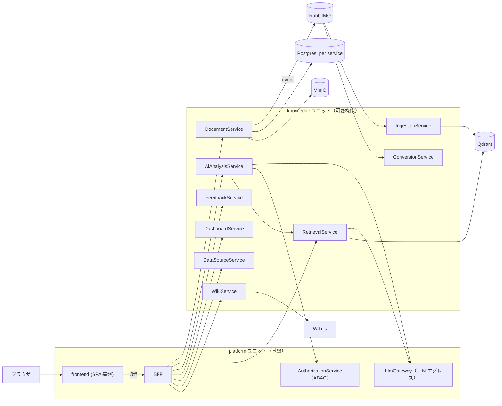

# microservices-platform — マイクロサービスプラットフォーム基盤

**本リポジトリの主たる成果物は、マイクロサービスプラットフォームの基盤（platform ユニット）である。**
認証・認可（ABAC）、LLM エグレス統制、メッセージング、可観測性、エッジ集約（BFF）、SPA 基盤といった
横断能力を、機能ドメインから独立した再利用可能な土台として提供する（別プロジェクトからの再利用前提:
`planning/projects/ai-stock-trading/07_adr/ADR-0001_platform-reuse.md`）。

**ナレッジ活用機能（knowledge ユニット）は、この基盤に付随する必須の可変機能セット**である。
社内ナレッジ（文書・Wiki）の横断検索、AI による回答・出典提示・データ分析を提供するが、
位置づけはあくまで「基盤の上で組み替え可能な一機能ユニット」であり、本リポジトリの主目的ではない
（issue #209 / [IADR-0056](docs/adr/IADR-0056_repo-unit-structure-platform-knowledge.md)）。

このリポジトリは、上流の計画リポジトリ（`project-planning`、`planning/` に git submodule として
参照）で確定した計画書（要求・ユースケース・画面・ADR）を実装する。**実装の進め方・トレーサビリティ
規約・仕様書の作成規約は [`CLAUDE.md`](CLAUDE.md) / [`AGENTS.md`](AGENTS.md) を参照。**

## アーキテクチャ概要

フロントエンド（SPA）→ BFF → 各マイクロサービス、というエッジ集約構成。サービス間は同期 API
（内部専用・ホスト非公開）またはイベント（RabbitMQ / MassTransit）で疎結合に連携する。
**太枠＝基盤（platform ユニット）、それ以外＝可変機能（knowledge ユニット）**という区分で読む。



- **platform ユニット** (`src/platform/`): 基盤。SPA 基盤（foundation + アプリホスト）、BFF（エッジ・
  唯一の入口。Keycloak JWT 検証・集約・構成情報 API）、AuthorizationService（ABAC 属性ポリシー・
  認可判定）、LlmGateway（LLM/埋め込みエグレス集約・機密区分別ルーティング）、共有ライブラリ
  `Platform.Shared.Contracts`（イベント/DTO 契約）・`Platform.Shared.Infrastructure`
  （認証・メッセージング・可観測性・ObjectStorage 等の横断基盤）。
- **knowledge ユニット** (`src/knowledge/`): 付随する可変機能。文書パイプライン（取り込み・正規化・
  索引）、ハイブリッド検索、AI 回答、Wiki 連携、フィードバック、利用ダッシュボードの各サービスと
  ナレッジ画面（SC-01..11）。
- **ユニット規約**: サービス間のコード参照は禁止し、ユニット外参照は `platform/backend/Shared` のみ
  許可（[`src/README.md`](src/README.md)）。追加の可変機能ユニットは `src/<unit>/` へ git submodule
  でリンクする。

### サービス一覧

| ユニット | サービス | 役割 |
| --- | --- | --- |
| platform | `Bff` | エッジ集約（フロントエンドの唯一の入口）・構成情報 API・ドリフト検出 |
| platform | `AuthorizationService` | ABAC 属性ポリシー管理・認可判定 |
| platform | `LlmGateway` | LLM/埋め込みプロバイダへのエグレス集約・機密区分別ルーティング |
| knowledge | `DocumentService` | 文書カタログ・バージョン管理（DB を所有する正） |
| knowledge | `DataSourceService` | データソース登録・同期管理 |
| knowledge | `ConversionService` | 文書の正規化・変換パイプライン（Worker） |
| knowledge | `IngestionService` | 埋め込み生成・Qdrant への索引投入（Worker） |
| knowledge | `RetrievalService` | ハイブリッド検索・AI 回答生成の編成 |
| knowledge | `AiAnalysisService` | データ範囲分析 |
| knowledge | `WikiService` | Wiki.js の同期・ABAC ゲートウェイ（実閲覧/編集 UI は Wiki.js に委譲） |
| knowledge | `FeedbackService` | AI 回答へのフィードバック収集 |
| knowledge | `DashboardService` | 利用状況・検索傾向ダッシュボード集計 |

## リポジトリ構成

```text
.
├── src/                 # ユニット構成（詳細は src/README.md）
│   ├── platform/        #   基盤ユニット（主成果物）: backend/backend.slnx + frontend/
│   ├── knowledge/       #   ナレッジ機能ユニット（付随可変機能）: backend/backend.slnx + frontend/
│   ├── Directory.Build.props / Directory.Packages.props   # バックエンド共通設定（単一情報源）
│   └── package.json     #   フロントエンド pnpm workspace ルート（メンバは pnpm-workspace.yaml）
├── deploy/              # デプロイ定義: docker-compose（dev）、helm/argocd/istio/keycloak（stg/prod）
├── docs/                # 実装仕様書（機能/画面/API/データ/技術/テスト/運用/セキュリティ/ADR）と how-to
├── scripts/             # 補助スクリプト（CHANGELOG/OpenAPI 生成、doc リンク検査、環境セットアップ）
├── planning/            # 計画リポジトリ project-planning（git submodule）
└── CLAUDE.md / AGENTS.md / AI_SETUP.md  # AI 実装エージェント向けの運用規約
```

## 前提ツール

| ツール | バージョン | 用途 |
| --- | --- | --- |
| .NET SDK | 10.0.x（`global.json` は `8.0.0` + `rollForward: latestMajor`） | バックエンドのビルド・テスト（[`src/Directory.Build.props`](src/Directory.Build.props)） |
| Node.js | 22（CI と同一。フロントは `frontend-tests.yml`/`frontend.yml` で node 22） | フロントエンドのビルド・テスト、`scripts/` の補助スクリプト |
| Docker / Docker Compose | 任意（compose v2 相当） | ローカルのインフラ・全サービス起動（`deploy/docker-compose.yml`） |
| git | — | `planning/` submodule の取得を含む |

## ローカル起動手順

詳細な手順（サービス別エンドポイント確認・よくある詰まりを含む）は
[`docs/how-to/local-development.md`](docs/how-to/local-development.md) を参照。ここでは要点のみ示す。

```bash
# 1. clone（計画リポジトリの submodule を含める）
git clone --recurse-submodules <this-repo-url>
# 既に clone 済みの場合:
git submodule update --init --recursive

# 2. バックエンド: ユニット別 slnx でビルド・テスト（.NET 10）
dotnet build src/platform/backend/backend.slnx --configuration Release
dotnet build src/knowledge/backend/backend.slnx --configuration Release
dotnet test src/platform/backend/backend.slnx
dotnet test src/knowledge/backend/backend.slnx

# 3. フロントエンド: pnpm workspace ルート（src/）で依存関係・型チェック・lint・テスト・ビルド
#    （#591: パッケージ管理は pnpm。@platform/ui を workspace: 依存で参照するため npm では解決できない）
cd src
pnpm install
pnpm run typecheck
pnpm run lint
pnpm run test
pnpm run build
cd ..

# 4. インフラ + 全サービスを起動（dev）。scripts/compose-up.sh は実 Git コミット ID を
#    構成情報 API 用に自動注入する compose ラッパ（docker compose への薄いラッパ）。
bash scripts/compose-up.sh up -d

# 5. 起動確認
#   - フロントエンド: http://localhost:3100
#   - BFF:            http://localhost:5000
#   - Keycloak:       http://localhost:8080
#   - Wiki.js（dev限定の管理UI直接アクセス）: http://localhost:3001
#   - Grafana:        http://localhost:3000
```

内部サービス（DocumentService 等）は `expose` のみでホスト非公開（[IADR-0017](docs/adr/IADR-0017_internal-service-auth-network-isolation.md)。
サービス間認証の第一防御は [IADR-0026](docs/adr/IADR-0026_mesh-mtls-supersedes-network-isolation.md) の Istio STRICT mTLS に移行済みで、
ネットワーク分離は多層防御として存続している）。外部からの入口は BFF とフロントエンドのみである。

## 仕様書・ドキュメントの入口

- **仕様書の全体像**: [`docs/README.md`](docs/README.md)（作業仕様書・機能/画面/API/データ/技術/テスト/運用/セキュリティ仕様書・実装ADR の配置規約）
- **ユニット規約（フォルダ構成・依存規則・submodule 追加手順）**: [`src/README.md`](src/README.md)
- **作業仕様書**（作業/PR 単位）: [`docs/specs/`](docs/specs/)
- **機能仕様書**（FR 単位）: [`docs/functional/`](docs/functional/)
- **画面仕様書**（SC 単位）: [`docs/screens/`](docs/screens/)
- **実装ADR**（`IADR-XXXX`、重要な実装判断の記録）: [`docs/adr/`](docs/adr/)
- **技術要件書**: [`docs/tech/tech-requirements.md`](docs/tech/tech-requirements.md)
- **運用仕様書**（デプロイ・監視・障害対応）: [`docs/operations/operations.md`](docs/operations/operations.md)
- **セキュリティ仕様書**（認証・認可・データ保護）: [`docs/security/security.md`](docs/security/security.md)
- **使い方・デプロイの how-to**: [`docs/how-to/local-development.md`](docs/how-to/local-development.md)・[`docs/how-to/deployment.md`](docs/how-to/deployment.md)
- **完了の定義**（PR を出す前のチェックリスト）: [`docs/DEFINITION_OF_DONE.md`](docs/DEFINITION_OF_DONE.md)
- **AI 駆動の実装ワークフロー全体**: [`docs/ai-workflow.md`](docs/ai-workflow.md)
- **計画リポジトリの参照**: `planning/`（submodule、既定パス）。要求・ユースケース・画面設計・ADR の一次情報。

## 技術スタック（要約）

バックエンドは .NET 10 / C# 13、フロントエンドは React 18 + TypeScript 5.6 + Vite 5。詳細な規約
（命名規則・パッケージ管理・lint/format・サービス境界等）は [`CLAUDE.md`](CLAUDE.md) の
「技術スタック別ルール」を参照。

> 注: .NET 名前空間・アセンブリ名・フロント package 名は、ユニット構成に整合する新体系
> （`Platform.*` / `Knowledge.*` / `@platform`・`@knowledge`）へ改名済み（#227 / IADR-0062）。
> Helm チャート名・k8s Namespace・realm 名・イメージ接頭辞・OIDC issuer も `microservices-platform` へ
> 改名済み（#228 / IADR-0061）。stg/prod 未構築のため移行は行わず、初回構築を新名称で行う（旧 `knowledge-platform` 資産は撤去）。
>
> **［2026-08-15 追記 / #578］realm 名だけはその後さらに改名した。** 計画 `ADR-0026` と裁定 決定 31 に従い、
> **realm は `platform`、基盤 SPA のクライアント ID は `platform-spa`** である（IADR-0197）。
> **Helm チャート名・k8s Namespace・イメージ接頭辞・OTEL service_name 接頭辞は `microservices-platform` のままである**
> ——改名したのは realm と当該クライアント ID の 2 つだけであり、上の行の他の項目は変わっていない。

## Git 運用

`develop` を安定版とし、直接コミットしない。作業ブランチ → プルリクエスト経由でマージする。
コミットメッセージ・PR タイトルは `種別(起点ID): 要約`（例: `feat(FR-12): ...`）の規約に従う
（詳細は [`.claude/rules/traceability.md`](.claude/rules/traceability.md)）。

## ライセンス

[MIT License](LICENSE)
