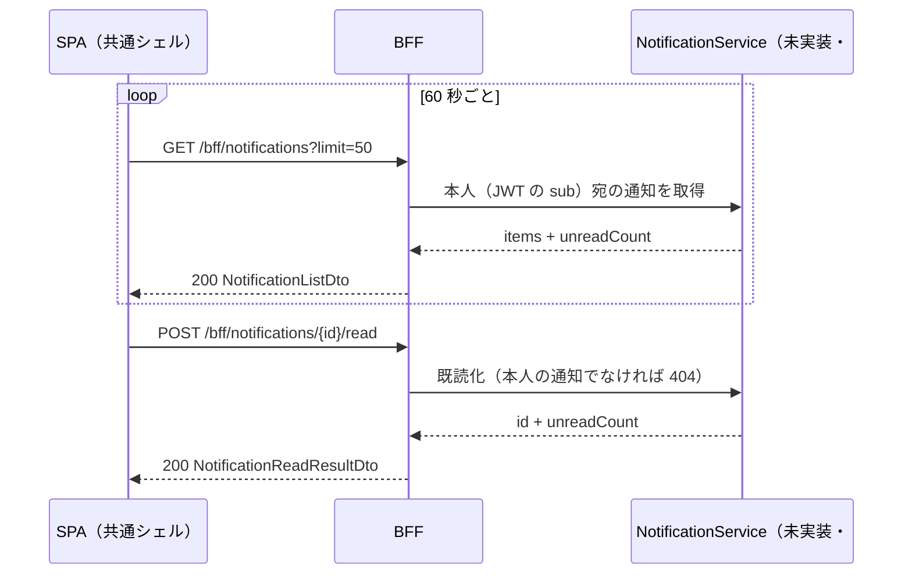

<!-- trace:
ids: [FR-22, UC-11]
adrs: [ADR-0037, ADR-0045]
iadrs: [IADR-0009, IADR-0121, IADR-0131, IADR-0132, IADR-0135, IADR-0215]
specs: [01_requirements, 01_usecases, 20260816_issue-600_fr22-in-app-notifications, ADR-0037_obsidian-sync-method, ADR-0045_mail-delivery-smtp-relay, BFF_bff-surface, FR-22_user-notifications, IADR-0215_notification-service-and-in-app-delivery]
issues: [#788]
-->

# 通信仕様書: BFF 通知（`/bff/notifications`）

> 要求・応答・ステータスの**正は [`openapi.yaml`](openapi.yaml)** である。本書はその上位にある
> 設計の意図（**なぜこの形なのか**）を記す。境界の横断規約は [`BFF_bff-surface.md`](BFF_bff-surface.md)。

> **`status: in-progress` の理由**: **契約は載っているが、後段（`NotificationService`）と BFF 端点の
> 実装は入っていない。** 線引きの正本は [[IADR-0215]] 決定 6。**追跡は #600。**
> **契約先行である**——受け入れ基準「本文が件数と期限のみ」を、実装ではなく契約で守らせるため
> （[[IADR-0215]] 決定 2）、契約を先に置いた。

## 起点となる計画書（トレーサビリティ）

- 関連機能要求（FR）: **FR-22**
- 関連ユースケース（UC）: **UC-11** 例外フロー
- 技術検討 / ADR: ADR-0037（計画リポ） 決定 6・17・18 ／
  ADR-0045（計画リポ） 決定 3 ／ [[IADR-0215]]
- 計画書リンク:
  02_requirements/01_requirements.md（計画リポ） FR-22

## 概要

- **プロトコル**: REST / JSON。`/bff/` 接頭辞の下に置く（BFF 境界。[[IADR-0121]] 決定 3）。
- **配信は SPA からのポーリング**（既定 60 秒）。**SSE は使わない**——移行第 4 段の射程である（[[IADR-0215]] 決定 2）。
  したがって**この 2 本はいずれも orval の生成対象である**（SSE 除外規則に当たらない）。
- **認可は「認証必須・ロールは問わない」**（`x-roles: []`）。**通知は本人のものだけを返す**ため、
  役割ではなく**主体（JWT の `sub`）で絞る**。
- **存在秘匿**: 他人の通知の ID を指定した既読化は **404** を返す（「権限が無い」を出さない。[[IADR-0009]]）。

## エンドポイント一覧

| メソッド | パス | 概要 | 関連 FR/UC | 生成される関数 |
| --- | --- | --- | --- | --- |
| GET | `/bff/notifications` | 本人宛のアプリ内通知一覧（＋未読件数） | —| `useBffNotificationList` |
| POST | `/bff/notifications/{id}/read` | 通知 1 件を既読にする（＋更新後の未読件数） | —| `useBffNotificationMarkRead` |

## エンドポイント詳細

### GET `/bff/notifications`

- 概要: 呼び出した利用者**本人宛**の通知を新しい順に返す。
- 認証・認可: **認証必須**（未認証は 401）。**ロールは問わない。**

リクエスト:

| 区分 | 名前 | 型 | 必須 | 説明 |
| --- | --- | --- | --- | --- |
| クエリ | `unreadOnly` | boolean | — | `true` のとき未読のみ。既定 `false` |
| クエリ | `limit` | integer | — | 取得件数。既定 `50`、下限 `1`、上限 `100` |

レスポンス:

| ステータス | 条件 | ボディ / 説明 |
| --- | --- | --- |
| 200 | 正常 | `NotificationListDto`（`items` ＋ `unreadCount`） |
| 401 | 未認証 | 本文なし |

### POST `/bff/notifications/{id}/read`

- 概要: 通知 1 件を既読にする。**冪等**（既読のものへもう一度呼んでも 200）。
- 認証・認可: **認証必須**。**本人の通知でなければ 404**（存在秘匿）。

リクエスト:

| 区分 | 名前 | 型 | 必須 | 説明 |
| --- | --- | --- | --- | --- |
| パスパラメータ | `id` | uuid | ○ | 通知の識別子 |

レスポンス:

| ステータス | 条件 | ボディ / 説明 |
| --- | --- | --- |
| 200 | 既読化した（または既に既読だった） | `NotificationReadResultDto`（`id` ＋ `unreadCount`） |
| 401 | 未認証 | 本文なし |
| 404 | 存在しない、**または本人の通知でない**（区別しない） | 本文なし |

## **★ スキーマにタイトル／本文の項目を作らない**

FR-22 の受け入れ基準「**本文が件数と期限のみで構成される。資料のタイトル・本文・検索語・回答内容を
含まない**」を、**実装の規律ではなく契約の形で守らせる**（[[IADR-0215]] 決定 2）。

`NotificationDto` の項目は次の 7 つだけである。**自由文のフィールドは 1 つも無い。**

| 項目 | 型 | `required` | 説明 |
| --- | --- | :---: | --- |
| `id` | uuid | ○ | 識別子 |
| `kind` | 列挙 5 値 | ○ | `private-note-purge-weekly` / `private-note-purge-imminent` / `private-note-purge-done` / `storage-quota-warning` / `sync-token-expiry` |
| `count` | integer | — | 件数（①③） |
| `thresholdPercent` | integer | — | 到達した閾値（②。80 / 95） |
| `deadline` | date-time | — | 期限（①-a / ①-b / ③） |
| `occurredAt` | date-time | ○ | 発生時刻 |
| `read` | boolean | ○ | 既読 |

- **`title` / `body` / `message` / `subject` / `text` / `summary` / `detail` / `content` は存在しない。**
- **表示文言はフロントが Lingui カタログから組み立てる。**
- **この不変条件は契約テストが固定する**（テスト仕様書 T-01。`docs/api/openapi.yaml` を読んで
  項目集合を突き合わせる）。**「入れないよう気をつける」ではなく「入れられない」形にした。**
- `required` は応答スキーマに必ず付ける（[[IADR-0132]]。`required` の無いスキーマは orval が全プロパティを
  省略可で生成し、型検査の網にならない）。**nullable な項目は `required` に入れない**（既存の作法どおり）。

## シーケンス

## 非機能・運用

- **ポーリング間隔は 60 秒**（クライアント側の `refetchInterval`）。**契約には現れない**——
  間隔はクライアントの都合であり、サーバの契約ではない。
- **`limit` の上限は 100**。BFF がクランプする（過大な要求で後段を痛めない）。
- **冪等性**: 既読化は冪等。再送しても未読件数は変わらない。
- **バージョニング**: 既存の BFF と同じ（`openapi.yaml` の `info.version`）。

## 関連仕様

- 機能仕様書: [FR-22](../functional/FR-22_user-notifications.md)
- テスト仕様書: [FR-22](../tests/FR-22_user-notifications.md)
- データ仕様書: **未作成**（送出側の永続化は本 PR の射程外）
- 実装 ADR: [[IADR-0215]]

## 未決事項

1. **BFF 端点と後段の実装が無い間、`x-roles: []` の宣言は突合されない**——
   `scripts/check-bff-authz-docs.js` は**実装 → 契約**の一方向しか見ないため、
   **実装の無い端点は検査対象に入らない**（実測）。**この穴をここに開示しておく。**
2. **未読件数だけを返す軽い端点（`/unread-count`）は置いていない。** 一覧が `unreadCount` を返すため、
   面を 2 つに増やす理由が現時点で無い。ポーリングの負荷が問題になったら足す。

<!-- trace-table:
row1: FR-22, UC-11
row2: FR-22, UC-11
-->
