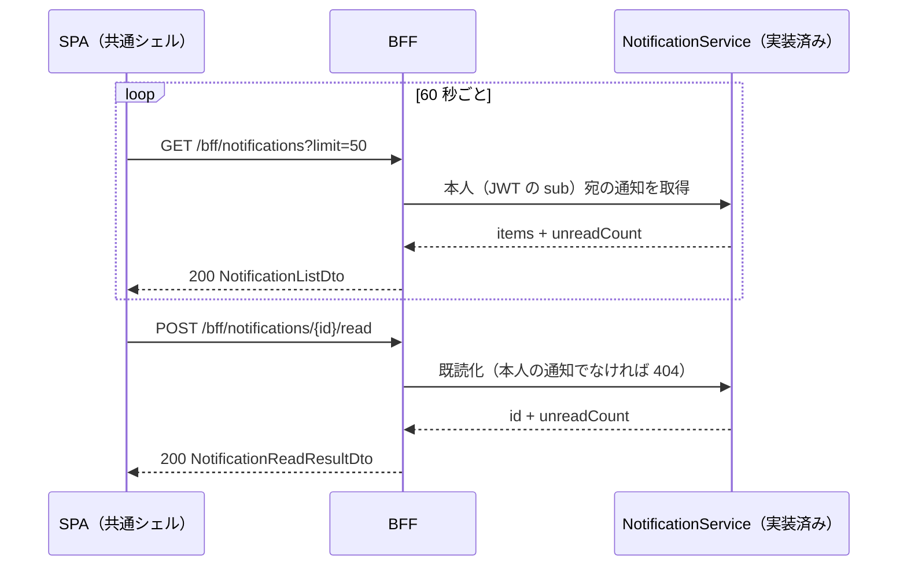

<!-- trace:
ids: [FR-22, UC-11]
adrs: [ADR-0037, ADR-0045]
iadrs: [IADR-0009, IADR-0121, IADR-0131, IADR-0132, IADR-0135, IADR-0215, IADR-0267, IADR-0285, IADR-0347]
specs: [20260816_issue-600_fr22-in-app-notifications, 20260823_issue-600_notification-service-backend, 20260902_issue-600_bff-notifications-relay]
issues: [#600, #788]
-->

# 通信仕様書: BFF 通知（`/bff/notifications`）

> 要求・応答・ステータスの**正は [`openapi.yaml`](openapi.yaml)** である。本書はその上位にある
> 設計の意図（**なぜこの形なのか**）を記す。境界の横断規約は [`BFF_bff-surface.md`](BFF_bff-surface.md)。

> **`status: completed` の理由**: **契約・後段・BFF 端点・生成フック・画面がすべて結線された。**
> **契約先行だった**——受け入れ基準「本文が件数と期限のみ」を、実装ではなく契約で守らせるため
> （通知サービス新設の実装 ADR の決定 2）、契約を先に置いた。BFF は最後に入った
> **集約（主体つきの透過中継）**であり、後段の面（`/notifications` / `/notifications/{id}/read`）へ
> そのまま中継する。**残るのはメール経路（SMTP リレー）の実体だけで、本書の外である。**

## 起点となる計画書（トレーサビリティ）

- 関連機能要求: **利用者本人への通知配信**
- 関連ユースケース: **自分の資料を作成・管理し、公開範囲を自ら設定する**（例外フロー）
- 技術検討 / ADR: Obsidian 同期方式（計画リポ）決定 6・17・18 ／
  メール配信の SMTP リレー（計画リポ）決定 3 ／ 通知サービス新設の実装 ADR
- 計画書リンク:
  02_requirements/01_requirements.md（計画リポ）の通知要求

## 概要

- **プロトコル**: REST / JSON。`/bff/` 接頭辞の下に置く（BFF 境界。SPA からの到達経路を定めた実装判断）。
- **配信は SPA からのポーリング**（既定 60 秒）。**SSE は使わない**——移行第 4 段の射程である。
  したがって**この 2 本はいずれも orval の生成対象である**（SSE 除外規則に当たらない）。
- **認可は「認証必須・ロールは問わない」**（`x-roles: []`）。**通知は本人のものだけを返す**ため、
  役割ではなく**主体（JWT の `sub`）で絞る**。
- **存在秘匿**: 他人の通知の ID を指定した既読化は **404** を返す（「権限が無い」を出さない。権限外は 404 とする存在秘匿の方針）。

## エンドポイント一覧

| メソッド | パス | 概要 | 関連 FR/UC | 生成される関数 |
| --- | --- | --- | --- | --- |
| GET | `/bff/notifications` | 本人宛のアプリ内通知一覧（＋未読件数） | —| `useBffNotificationList` |
| POST | `/bff/notifications/{id}/read` | 通知 1 件を既読にする（＋更新後の未読件数） | —| `useBffNotificationMarkRead` |

## エンドポイント詳細

### GET `/bff/notifications`

- 概要: 呼び出した利用者**本人宛**の通知を新しい順に返す。
- 認証・認可: **認証必須**（未認証は 401）。**ロールは問わない。**

リクエスト:

| 区分 | 名前 | 型 | 必須 | 説明 |
| --- | --- | --- | --- | --- |
| クエリ | `unreadOnly` | boolean | — | `true` のとき未読のみ。既定 `false` |
| クエリ | `limit` | integer | — | 取得件数。既定 `50`、下限 `1`、上限 `100` |

レスポンス:

| ステータス | 条件 | ボディ / 説明 |
| --- | --- | --- |
| 200 | 正常 | `NotificationListDto`（`items` ＋ `unreadCount`） |
| 401 | 未認証 | 本文なし |

### POST `/bff/notifications/{id}/read`

- 概要: 通知 1 件を既読にする。**冪等**（既読のものへもう一度呼んでも 200）。
- 認証・認可: **認証必須**。**本人の通知でなければ 404**（存在秘匿）。

リクエスト:

| 区分 | 名前 | 型 | 必須 | 説明 |
| --- | --- | --- | --- | --- |
| パスパラメータ | `id` | uuid | ○ | 通知の識別子 |

レスポンス:

| ステータス | 条件 | ボディ / 説明 |
| --- | --- | --- |
| 200 | 既読化した（または既に既読だった） | `NotificationReadResultDto`（`id` ＋ `unreadCount`） |
| 401 | 未認証 | 本文なし |
| 404 | 存在しない、**または本人の通知でない**（区別しない） | 本文なし |

## **★ スキーマにタイトル／本文の項目を作らない**

通知要求の受け入れ基準「**本文が件数と期限のみで構成される。資料のタイトル・本文・検索語・回答内容を
含まない**」を、**実装の規律ではなく契約の形で守らせる**（通知サービスの実装 ADR による）。

`NotificationDto` の項目は次の 7 つだけである。**自由文のフィールドは 1 つも無い。**

| 項目 | 型 | `required` | 説明 |
| --- | --- | :---: | --- |
| `id` | uuid | ○ | 識別子 |
| `kind` | 列挙 5 値 | ○ | `private-note-purge-weekly` / `private-note-purge-imminent` / `private-note-purge-done` / `storage-quota-warning` / `sync-token-expiry` |
| `count` | integer | — | 件数（①③） |
| `thresholdPercent` | integer | — | 到達した閾値（②。80 / 95） |
| `deadline` | date-time | — | 期限（①-a / ①-b / ③） |
| `occurredAt` | date-time | ○ | 発生時刻 |
| `read` | boolean | ○ | 既読 |

- **`title` / `body` / `message` / `subject` / `text` / `summary` / `detail` / `content` は存在しない。**
- **表示文言はフロントが Lingui カタログから組み立てる。**
- **この不変条件は契約テストが固定する**（テスト仕様書 T-01。`docs/api/openapi.yaml` を読んで
  項目集合を突き合わせる）。**「入れないよう気をつける」ではなく「入れられない」形にした。**
- `required` は応答スキーマに必ず付ける（C# の非 null 性から起こす方針。`required` の無いスキーマは orval が全プロパティを
  省略可で生成し、型検査の網にならない）。**nullable な項目は `required` に入れない**（既存の作法どおり）。

## シーケンス

## 非機能・運用

- **ポーリング間隔は 60 秒**（クライアント側の `refetchInterval`）。**契約には現れない**——
  間隔はクライアントの都合であり、サーバの契約ではない。
- **`limit` の上限は 100**。**クランプするのは後段である**（既定 50 / 上限 100 は後段の設定値であり、
  BFF は指定されたクエリを載せ替えるだけで既定値を埋めない）。**上限の正を 2 箇所に持たない** ——
  BFF にも同じクランプを置くと、設定を変えたときに BFF 側だけが古い上限で切る。
- **冪等性**: 既読化は冪等。再送しても未読件数は変わらない。
- **バージョニング**: 既存の BFF と同じ（`openapi.yaml` の `info.version`）。

## 関連仕様

- 機能仕様書: [利用者通知](../functional/FR-22_user-notifications.md)
- テスト仕様書: [利用者通知](../tests/FR-22_user-notifications.md)
- データ仕様書: [通知](../data/notification.md)
- 実装 ADR: 通知は NotificationService を新設して担い、アプリ内通知はポーリングで配信する

## 未決事項

1. **未読件数だけを返す軽い端点（`/unread-count`）は置いていない。** 一覧が `unreadCount` を返すため、
   面を 2 つに増やす理由が現時点で無い。ポーリングの負荷が問題になったら足す。
2. **メール経路（SMTP リレー）の実体は入っていない。** 実 SMTP と自社ドメイン名が要るためである。
   **アプリ内通知はこれに従属しない**（メールが送れなくても届く）。

## 実装上の不変条件（**変えるときはここも直す**）

1. 🔴 **後段は主体（トークンの `sub`）でしか宛先を決めない。** BFF は**主体を引数として渡さず、
   利用者のトークンをそのまま後段へ届ける**——主体をパラメータで渡す形にすると、
   後段が守っている境界を BFF が迂回できてしまう。**BFF における本人絞りの実体は
   この資格情報の転送であり、落とすと機能が丸ごと 401 で死ぬ。**
2. 🔴 **BFF は状態コードを作り替えない。** 404（存在秘匿）を 403 へ変えると他人の通知 ID の
   実在が漏れ、200 へ変えると既読化の失敗が隠れる。後段不達は 502 へ縮退する
   （空の 200 で隠すと「通知が 0 件になった」と読ませ、完全削除の期限を見落とさせる）。
3. **読み取りに属性ベースの前段フィルタを置かない。** 通知は文書ではなく属性を持たないため、
   フィルタの安全側（キー欠落＝不一致）へ落ちて**利用者が自分の通知を 1 件も見られなくなる**。
4. `x-roles: []` の宣言と実装の突合は `scripts/check-bff-authz-docs.js` が行う
   （**実装 → 契約**の一方向。BFF 端点が入ったことで、この 2 本も検査対象に入った）。

<!-- trace-table:
row1: FR-22, UC-11
row2: FR-22, UC-11
-->
