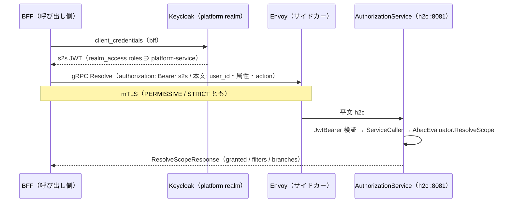

<!-- trace:
ids: [FR-02, FR-03, FR-05, NFR-09, NFR-16]
adrs: [ADR-0004, ADR-0013, ADR-0016, ADR-0017, ADR-0029, ADR-0032, ADR-0075]
iadrs: [IADR-0117, IADR-0122, IADR-0256, IADR-0316, IADR-0379, IADR-0397]
specs: [20260905_issue-1201_east-west-grpc-preconditions, 20260905_issue-1255_east-west-grpc-llm-embedding]
issues: [#1201, #1255]
-->

# 通信仕様書: east-west gRPC（サービス間の同期呼び出し）

> 計画は「サービス間の同期呼び出し（east-west）は gRPC + Protobuf、BFF から SPA・外部公開 API（north-south）は
> REST」と定め、移行の順序を**基盤先行**とした。本書はその**実装ガイド**である —— 基盤（本リポジトリ）が
> 先に決めた 4 点（**proto の置き場・versioning・h2c ポート・サービス間トークン**）を、後から追随する
> 呼び出し元（本リポジトリの残りの経路と、基盤を拡張する別プロジェクト）が同じ形で写せるように書く。
> 判断の論拠は実装 ADR に、作業の母集合は作業仕様書にある（いずれも trace ブロック）。

## 概要

- **プロトコル**: gRPC（HTTP/2）+ Protobuf 3。メッシュ内は **h2c（TLS 無し HTTP/2）** で、mTLS はサイドカーが終端する。
- **対象**: メッシュ内のサービスどうしの**同期**呼び出し。候補／非候補の基準は「同期 ∧ east-west ∧ 応答を待つ」であり、
  呼び出しの頻度やレイテンシ要求では判定しない。外部 SaaS・IdP・オブジェクトストレージ・非同期イベント・SSE は対象外。
- **状態**: gRPC 面を持つのは **2 経路** —— 参照実装（BFF → 認可サービスの権限スコープ解決）と、
  埋め込み生成（取り込み・検索 → LLM ゲートウェイ）である。**並走中の正は REST** であり、gRPC は
  構成で opt-in する。残りの経路の移行は別 issue で展開する。
  🔴 **配備に s2s の資格情報が載っているのは埋め込みの 2 呼び出し元だけである** —— 参照実装の
  `ServiceToken` / gRPC 宛先は helm・compose のどちらにも無く、認可サービスの realm クライアントも
  未整備である（下記「未決事項」）。

## 1. proto の置き場と所有

| 項目 | 規約 |
| --- | --- |
| 所有者 | **呼び出される側**のサービス |
| 置き場 | 所有サービスが属する**ユニットの共有契約プロジェクト**: platform 所有 → `src/platform/backend/Shared/Platform.Shared.Contracts/`、knowledge 所有 → `src/knowledge/backend/Shared/Knowledge.Contracts/` |
| パス | `Protos/<unit>/<service>/v<N>/<name>.proto`（例: `Protos/platform/authz/v1/authz_scope.proto`） |
| 生成 | `<Protobuf Include="Protos/**/*.proto" ProtoRoot="Protos" GrpcServices="Both" />`。クライアントとサーバ基底の両方を契約プロジェクトから生成する。**`*.Client` プロジェクトは作らない** |
| 生成物 | `obj/` に落ち、コミットしない |
| 参照方向 | ユニット外から参照できるのは platform の `Shared/` 3 プロジェクトだけ、platform → 可変ユニットは禁止 —— **現状の HTTP と同じ向き**（platform のサービスが knowledge の gRPC を呼ぶことは無い） |

サービスプロジェクト（`Services/<Name>/`）に proto を置いてはならない。他ユニットの呼び出し元が生成クライアントを参照できなくなる。

## 2. versioning

| 項目 | 規約 |
| --- | --- |
| package | `<unit>.<service>.v<N>`（小文字。パスと一致） |
| C# 名前空間 | `option csharp_namespace = "<ContractsRoot>.Grpc.<Service>.V<N>";`（例: `Platform.Shared.Contracts.Grpc.Authz.V1`） |
| フィールド番号 | **不変**。削除するときは番号と名前を `reserved` に残す |
| 非破壊 | field / message / rpc / enum 値の**追加** |
| 破壊的 | 番号・型・ラベル（`repeated` / `map`）・名前の変更、field / message / rpc / enum 値の削除、rpc の要求／応答型の変更、package・名前空間の変更 |
| メジャー版の上げ方 | **`v<N+1>` のディレクトリと package を並走させる**（in-place で `v<N>` を壊さない）。旧版の撤去は file の削除として承認を要する |

機械検査は `node scripts/check-proto-contracts.js` が行う（配置と名前の一致・番号の一意・`reserved` の再利用禁止・baseline との後方互換）。
非破壊の追加でも baseline（`scripts/proto-contract-baseline.json`）と差分がある限り赤になり、`--update` で差分を PR に載せる。
破壊的変更は `scripts/proto-breaking-allowlist.json` の承認エントリで通す —— ただし**削除時の `reserved` 不在と `reserved` の再利用は承認でも通らない**。
C# 契約（DTO・イベント）の検査器とは母集合を共有しない（構文と互換規則が違う。1 構文 1 パーサ）。

## 3. h2c ポート

| 項目 | 規約 |
| --- | --- |
| リスナ | 構成 `Grpc:Port`（env `Grpc__Port`）で **専用ポート**（既定 8081）に `HttpProtocols.Http2` **だけ**を bind する。未設定・0 なら立てない |
| HTTP/1.1 | 8080（REST・`/health/*`・introspection）は**そのまま残す**。共通ヘルパ `AddPlatformGrpcListener` が HTTP 側のポートを再宣言する（Kestrel は Listen を 1 つでも構成するとホスティング URL を捨てるため） |
| 同居しない理由 | 平文には ALPN が無く、1 ポートで HTTP/1.1 と HTTP/2 を選ばせる形は Kestrel の preface 検出に依存する。**選択を切替ではなく分離で決める** |
| helm | `services.<name>.grpcPort` を宣言したサービスにだけ `containerPort`（名前 `grpc`）・Service ポート（`name: grpc` / `appProtocol: grpc`）・env `Grpc__Port` を描画する。HTTP 側にも `name: http` が付く。**宣言しないサービスは 1 バイトも変わらない** |
| compose | `expose` に h2c ポートを足し `Grpc__Port` を与える。host へは公開しない |
| readiness | **HTTP の `/health/ready`（8080）のまま**。1 プロセスが両ポートを起動時に bind するので、8080 が ready なら h2c ポートも bind 済みである。gRPC ヘルスプロトコルは今は入れない |
| Istio | サイドカーがある限り **PERMISSIVE / STRICT のどちらでも** mTLS は Envoy で終端され、アプリには平文 h2c が届く。アプリ側の設定は両モードで同一。`appProtocol: grpc` でプロトコル推定に頼らない。既存の `DestinationRule`（`ISTIO_MUTUAL`・host ワイルドカード）が全ポートに掛かるので追加は要らない |

実測（2026-09-05・実 Kestrel）: h2c ポートへの HTTP/1.1 要求は **400 Bad Request** で処理されず、同じ要求は 8080 側で 200 を返す。

## 4. サービス間トークン（s2s）

| 項目 | 規約 |
| --- | --- |
| メタデータ | `authorization: Bearer <呼び出し側サービス自身の JWT>` |
| トークンの出所 | platform realm の **confidential client の client credentials**（`ServiceToken:ClientId` / `ClientSecret`。端点は `ServiceToken:TokenEndpoint` か `Auth:Authority` から導く）。期限まで再利用し、30 秒手前で取り直す |
| 呼び出し先の検証 | 既存の JwtBearer（`AddPlatformAuth`。同じ issuer・同じ JWKS）で検証し、gRPC サービス型に **`ServiceCaller` ポリシー**（realm ロール `platform-service`）を掛ける |
| 拒否 | トークン無し → `UNAUTHENTICATED`、`platform-service` 無し → `PERMISSION_DENIED` |
| 🔴 利用者トークン | **メタデータへ載せない。** 利用者のトークン（管理者であっても）はサービス間の面を通らない —— 通すと呼び出し先が「利用者が直接呼んだ」と「サービスが利用者のために呼んだ」を区別できず、利用者ロールがサービス間の面へ漏れる（confused deputy） |
| 利用者の文脈 | **本文で運ぶ**（`user_id` / `user_attributes` / `action`。REST の要求本文と同じ形）。移行は本文を変えないトランスポートの差し替えになる |
| deny-by-default | 該当ポリシーが無ければ `granted=false` を**応答で**返す（エラーではない）。呼び出し側は `UNAUTHENTICATED` / `PERMISSION_DENIED` / `UNAVAILABLE` / トークン取得失敗をすべて「閲覧可能なし」へ縮退する |
| BFF セッション方式との分け方 | セッション Cookie ↔ 利用者トークンは **north-south**、s2s トークンは **east-west**。BFF は自分の confidential client（`bff`）で client credentials を取る（realm の `bff` に service account と `platform-service` を付けてある） |
| 将来 | 呼び出し先が利用者自身の権限で動く必要が出たら RFC 8693 token exchange（`act` claim）へ進む。今は採らない |

呼び出し側の共通部品: `AddPlatformServiceToken`（発行側の登録）と `GrpcClientExtensions.CreatePlatformChannel`（平文 h2c チャネルに
s2s の `CallCredentials` を付ける。平文でトークンを送るには `UnsafeUseInsecureChannelCallCredentials` が要る —— 線上は mTLS である）。
キャッシュ・タイムアウト・リトライ・fail-safe は呼び出し元サービスの Infrastructure に置く（計画の追記どおり）。

## 参照実装: 権限スコープ解決（`platform.authz.v1.AuthzScope/Resolve`）

- 概要: BFF の `BffScopeResolver` が `Services:AuthorizationServiceGrpc`（例: `http://authorization-service:8081`）の
  構成があるときだけ gRPC で解決し、無ければ REST `POST /authz/scope` で解決する。**並走中の正は REST。**
- 認証・認可: `ServiceCaller`（上記）。
- 評価器: REST と**同じ** `AbacEvaluator.ResolveScope` を呼ぶ（評価器を 2 つにしない）。

リクエスト（`ResolveScopeRequest`）:

| 名前 | 型 | 必須 | 説明 |
| --- | --- | --- | --- |
| `user_id` | string | ○ | 利用者識別子（preferred_username） |
| `user_attributes` | map<string,string> | ○ | ABAC 判定に用いる利用者属性（clearance / department ほか） |
| `action` | string | — | read / analyze / manage / write。空文字は read |

レスポンス（`ResolveScopeResponse`）:

| 名前 | 型 | 説明 |
| --- | --- | --- |
| `user_id` | string | 要求の利用者 |
| `allowed_filters` | repeated AttributeFilter | 従来の算出値（キー単位 union の連言） |
| `granted` | bool | マッチするポリシーが 1 つでもあったか。false は閲覧可能なし |
| `branches` | repeated AccessScopeBranch | read の選言（分岐内 AND・分岐間 OR）。1 件以上あればこちらで評価する |

エラー:

| gRPC status | 条件 | 対応 |
| --- | --- | --- |
| `INVALID_ARGUMENT` | action が値域外 | REST の 400 と同値。呼び出し側は deny へ縮退 |
| `UNAUTHENTICATED` | s2s トークン無し・検証失敗 | deny へ縮退 |
| `PERMISSION_DENIED` | `platform-service` ロール無し（利用者トークンの転送を含む） | deny へ縮退 |

## 2 つ目の面: 埋め込み生成（`platform.llmgateway.v1.LlmEmbedding/Embed`）

- 概要: 取り込み・検索の 2 サービスが `Services:LlmGatewayGrpc`（例: `http://llm-gateway:8081`）の構成が
  あるときだけ gRPC で埋め込みを得て、無ければ REST `POST /embed` で得る。**並走中の正は REST。**
- 認証・認可: `ServiceCaller`。REST の `/embed` は無認可のままなので、**gRPC 面のほうが強い**（緩めていない）。
- 判定器: REST と**同じ**越境判定・ルーティング・次元照合を通る（判定器を 2 つにしない）。

リクエスト（`EmbedRequest`）:

| 名前 | 型 | 必須 | 説明 |
| --- | --- | --- | --- |
| `text` | string | ○ | 埋め込む本文（取り込みは文書本文、検索はクエリ） |
| `confidentiality` | string | — | 入力の機密区分。**空文字は restricted**（安全側。REST の null と同じ） |
| `purpose` | EmbedPurpose | — | `INDEX` / `QUERY`。🔴 **`UNSPECIFIED`（既定 0）は `INDEX` として扱う**（REST の既定と同じ） |

レスポンス（`EmbedResponse`）: `vector` / `dimensions` / `model` / `collection` / `embedded` /
`endpoint` / `routing_reason` / `retryable`（REST の応答と 1 対 1）。

🔴 **縮退はエラーではない。** 越境拒否（fail-closed）・プロバイダ未登録・次元不整合・上流不調はいずれも
`embedded=false` の**応答**で返る（REST の 200 ＋ `Embedded=false` と同値）。`retryable` の意味も同じ ——
`true` は一時的な障害（再試行へ回す）、`false` は恒久的な拒否（索引をスキップ）である。

エラー（`RpcException` になるのは輸送と s2s の面だけ）:

| gRPC status | 条件 | 呼び出し側の対応 |
| --- | --- | --- |
| `UNAUTHENTICATED` | s2s トークン無し・検証失敗 | 🔴 **例外のまま上げる**（`[]` や「再試行可」へ縮退させない） |
| `PERMISSION_DENIED` | `platform-service` ロール無し（利用者トークンの転送を含む） | 同上 |
| `UNAVAILABLE` | ゲートウェイ不達 | 同上 |

🔴 **権限スコープ解決とは縮退の向きが逆である。** あちらは「引けなかった」を deny（閲覧可能なし）へ倒すが、
埋め込みは倒さない —— 倒すと検索側では「該当なし」、取り込み側では「送信拒否」と**見分けがつかなくなる**。
続行してよいのは、後段が応答で明示的に「埋め込めなかった」と答えたときだけである。

## シーケンス

## 非機能・運用

- **並走の扱い**: 1 経路について REST と gRPC が並走する期間がある。**正は REST**。gRPC への切替は構成（`Services:<Name>Grpc`）で行い、
  戻すときは構成を外すだけでよい（コードを変えない）。
- **タイムアウト・リトライ・fail-safe**: 呼び出し元の Infrastructure に置く。参照実装は縮退（deny）だけを持ち、リトライは持たない。
- **観測**: gRPC の状態コードは呼び出し側の警告ログに出る。gRPC 専用の計装（OTel の gRPC instrumentation）は展開 issue で扱う。
- **Keycloak**: 呼び出し元サービスごとに confidential client（service account 有効・`platform-service`）を realm へ登録する。
  参照実装では既存の `bff` client を流用した。

## 関連仕様

- 機能仕様書: 権限スコープ解決（ABAC）は認可の機能仕様に従う
- データ仕様書: 該当なし（永続化を伴わない）
- 検査器: `scripts/check-proto-contracts.js`（`scripts/README.md`）

## proto3 の「未指定」を写す

🔴 **proto3 に null は無い。** REST の DTO が持つ既定値（既定引数・`null` の解釈）は、**呼び出し先の
サーバ側で明示的に写す**。写し漏れは例外にならず、意味が静かに変わる形で現れる。

| 契約 | REST の既定 | proto3 の「未指定」 | サーバの写し |
| --- | --- | --- | --- |
| 権限スコープの `action` | `"read"` | `""` | `"" → read`（参照実装が実施済み） |
| 埋め込みの `purpose` | `Index` | `EMBED_PURPOSE_UNSPECIFIED`（0） | 🔴 `UNSPECIFIED → INDEX` |
| 埋め込みの `confidentiality` | `null` → restricted | `""` | 写し不要（`""` も未知値も restricted へ倒れる） |

埋め込みの `purpose` を写し忘れると、未指定が `QUERY` として扱われて越境判定が「public 相当」へ落ち、
**機密文書の本文が外部の埋め込み API へ送られる**。新しい rpc を足す人は、
**REST 側の既定値を一覧してから proto の 0 値と突き合わせること。**

## 未決事項

- gRPC ヘルスプロトコル（`grpc.health.v1`）の要否（今は HTTP の readiness で足りる）。
- 稼働クラスタでの h2c 往復は**未実測**（新イメージの配備＝Pod の再起動を要するため、本作業では行っていない）。
- 🔴 **参照実装（BFF → 認可サービス）の配備上の未配線。** `ServiceToken` の資格情報と gRPC の宛先が
  helm・compose のどちらにも無く、realm 側にも BFF の service account（とサービス用ロールの割当）が無い。
  したがって**この経路は配備上まだ 1 度も走っていない**。埋め込みの側は本書のとおり配線済みである。
  埋め込み以外の呼び出し元を足すときは、**コードだけでなく 4 経路（helm / compose / realm / ローカル供給元）を
  同じ変更で揃えること**（1 つでも欠けると Pod が起動しない、あるいは呼び出しが常に拒否される）。
