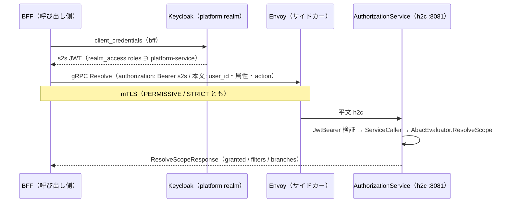

<!-- trace:
ids: [FR-01, FR-02, FR-03, FR-04, FR-05, FR-06, FR-09, FR-10, FR-11, FR-12, FR-13, FR-15, FR-16, FR-17, FR-18, FR-19, FR-20, FR-21, FR-22, NFR-02, NFR-09, NFR-16, NFR-19, NFR-21, SC-03, SC-05, SC-06, SC-10, SC-12, SC-17, SC-18, UC-01, UC-02, UC-03, UC-04, UC-05, UC-07, UC-09, UC-10, UC-11]
adrs: [ADR-0119, ADR-0089, ADR-0050, ADR-0002, ADR-0004, ADR-0010, ADR-0011, ADR-0012, ADR-0013, ADR-0016, ADR-0017, ADR-0025, ADR-0029, ADR-0032, ADR-0034, ADR-0036, ADR-0037, ADR-0038, ADR-0044, ADR-0045, ADR-0054, ADR-0056, ADR-0062, ADR-0064, ADR-0065, ADR-0070, ADR-0074, ADR-0075, ADR-0076, ADR-0080, ADR-0086, ADR-0087, ADR-0088, ADR-0018, ADR-0024, ADR-0109, ADR-0092, ADR-0115, ADR-0096, ADR-0114, ADR-0117]
iadrs: [IADR-0476, IADR-0475, IADR-0465, IADR-0029, IADR-0462, IADR-0269, IADR-0292, IADR-0458, IADR-0403, IADR-0426, IADR-0424, IADR-0009, IADR-0012, IADR-0017, IADR-0026, IADR-0037, IADR-0041, IADR-0044, IADR-0045, IADR-0101, IADR-0104, IADR-0110, IADR-0117, IADR-0122, IADR-0225, IADR-0242, IADR-0253, IADR-0256, IADR-0265, IADR-0272, IADR-0290, IADR-0299, IADR-0316, IADR-0329, IADR-0335, IADR-0353, IADR-0354, IADR-0364, IADR-0378, IADR-0379, IADR-0384, IADR-0385, IADR-0388, IADR-0389, IADR-0395, IADR-0397, IADR-0400, IADR-0401, IADR-0402, IADR-0408, IADR-0410, IADR-0412, IADR-0413, IADR-0415, IADR-0416, IADR-0417, IADR-0418, IADR-0419, IADR-0467, IADR-0472, IADR-0474, IADR-0431]
specs: [20260927_issue-1516_mcp-tool-execution-grpc, 20260927_issue-1614_document-read-authn-private-note, 20260926_issue-1575_document-page-and-fingerprint, 20260926_1515_mcp-tool-declarations-grpc, 20260926_1537_conversion-introspection-grpc-wiring, 20260926_1520_conversion-service-auth, 20260926_1514_introspection-grpc-fanout, 20260925_1397_bff-user-credential-relay-is-edge, 20260911_issue-1255_aianalysis-to-retrieval-search-grpc, 20260909_issue-1364_llmgateway-rest-service-caller, 20260908_issue-1333_authz-resolves-user-attributes, 20260909_issue-1255_document-to-notification-grpc, 20260906_issue-1255_east-west-grpc-authz, 20260906_issue-1255_east-west-grpc-bff, 20260905_issue-1255_east-west-grpc-llm-completion, 20260905_issue-1255_east-west-grpc-llm-embedding, 20260905_issue-1201_east-west-grpc-preconditions, 20260906_issue-1255_knowledge-health-grpc, 20260909_issue-1255_retrieval-grpc-attribute-values, 20260909_issue-1318_retrieval-rest-face-authorization, 20260908_issue-1255_tag-dictionary-grpc, 20260907_issue-1255_user-context-in-body, 20260926_issue-336_multi-collection-rrf-fusion, 20260926_issue-1557_department-domain-validation, 20260926_issue-1532_sync-token-rejected-after-disable]
issues: [#1516, #1614, #1575, #1515, #1537, #1520, #1514, #1397, #1201, #1255, #1333, #1318, #1364, #336, #1557, #1532]
-->

# 通信仕様書: east-west gRPC（サービス間の同期呼び出し）

> 計画は「サービス間の同期呼び出し（east-west）は gRPC + Protobuf、BFF から SPA・外部公開 API（north-south）は
> REST」と定め、移行の順序を**基盤先行**とした。本書はその**実装ガイド**である —— 基盤（本リポジトリ）が
> 先に決めた 4 点（**proto の置き場・versioning・h2c ポート・サービス間トークン**）を、後から追随する
> 呼び出し元（本リポジトリの残りの経路と、基盤を拡張する別プロジェクト）が同じ形で写せるように書く。
> 判断の論拠は実装 ADR に、作業の母集合は作業仕様書にある（いずれも trace ブロック）。

## 概要

- **プロトコル**: gRPC（HTTP/2）+ Protobuf 3。メッシュ内は **h2c（TLS 無し HTTP/2）** で、mTLS はサイドカーが終端する。
- **対象**: メッシュ内のサービスどうしの**同期**呼び出し。候補／非候補の基準は「同期 ∧ east-west ∧ 応答を待つ」であり、
  呼び出しの頻度やレイテンシ要求では判定しない。外部 SaaS・IdP・オブジェクトストレージ・非同期イベント・SSE は対象外。
  ［2026-09-25 追記］🔴 **BFF が利用者の資格情報を後段へ付けて中継する呼び出しも対象外である**（BFF はエッジ。
  north-south の続きとして扱う。オーナー裁定）。**BFF 自身の s2s で呼ぶ呼び出しは対象のまま**である。
  分け方は §4「BFF セッション方式との分け方」の行と §5 の判定表の直後を参照。
- **状態**: gRPC 面を持つのは **13 経路**（［2026-09-26 更新］従前 11 → 12 → 13）—— 参照実装（BFF → 認可サービスの権限スコープ解決）、
  埋め込み生成（取り込み・検索 → LLM ゲートウェイ）、テキスト生成（AI 分析・グラフ・変換 →
  LLM ゲートウェイ。一括と**逐次**）、**認可サービスの 5 呼び出し元**
  （AI 分析・グラフ・Wiki のスコープ解決＋データソース・MCP の利用者名簿）、そして
  **BFF の文書読み取り 4 箇所**（一覧・詳細・版履歴・特定版）、そして
  **ナレッジ健全性の観測値の報告**（グラフ → ダッシュボード）、そして
  ［2026-09-07 追記］**利用者の権限で動く 2 経路**（検索 → グラフの近傍展開・グラフ → 文書のタグ反映）、
  そして［2026-09-08 追記］**タグ辞書の読み取り**（グラフ → 文書）、
  そして［2026-09-09 追記］**権限内属性値の照会**（BFF → 検索）、そして［2026-09-09 追記］**個人資料の通知の受け付け**（文書 → 通知）、
  そして［2026-09-11 追記］**RAG の文脈収集の検索**（AI 分析 → 検索）、
  そして［2026-09-26 追記］**実効構成の収集**（構成情報 API → 自己申告を持つ全サービス。**扇形**）、
  そして［2026-09-26 追記］**MCP のツール申告の収集**（MCP サーバー → 申告を持つ 3 サービス。**扇形**）である。
  **並走中の正は REST** であり、gRPC は構成で opt-in する。残りの経路の移行は別 issue で展開する。
  ［2026-09-06 追記］🔴 **BFF の s2s 資格情報の未配線は閉じた。** realm に BFF の service account が
  無く、`ServiceToken` が helm・compose のどちらにも無かったため、参照実装（BFF → 認可サービス）は
  配備上 1 度も走っていなかった。BFF が文書読み取りの呼び出し元になるのに合わせ、
  **realm の割当と `ServiceToken` の注入を入れた**。**認可サービス宛の gRPC アドレスは
  意図的に入れていない** —— 参照実装の切替はこのスライスの射程外である。

## 1. proto の置き場と所有

| 項目 | 規約 |
| --- | --- |
| 所有者 | **呼び出される側**のサービス |
| 置き場 | 所有サービスが属する**ユニットの共有契約プロジェクト**: platform 所有 → `src/platform/backend/Shared/Platform.Shared.Contracts/`、knowledge 所有 → `src/knowledge/backend/Shared/Knowledge.Contracts/` |
| パス | `Protos/<unit>/<service>/v<N>/<name>.proto`（例: `Protos/platform/authz/v1/authz_scope.proto`） |
| 生成 | `<Protobuf Include="Protos/**/*.proto" ProtoRoot="Protos" GrpcServices="Both" />`。クライアントとサーバ基底の両方を契約プロジェクトから生成する。**`*.Client` プロジェクトは作らない** |
| 生成物 | `obj/` に落ち、コミットしない |
| 参照方向 | ユニット外から参照できるのは platform の `Shared/` 3 プロジェクトだけ、platform → 可変ユニットは禁止 —— **現状の HTTP と同じ向き**（platform のサービスが knowledge の gRPC を呼ぶことは無い） |

サービスプロジェクト（`Services/<Name>/`）に proto を置いてはならない。他ユニットの呼び出し元が生成クライアントを参照できなくなる。

## 2. versioning

| 項目 | 規約 |
| --- | --- |
| package | `<unit>.<service>.v<N>`（小文字。パスと一致） |
| C# 名前空間 | `option csharp_namespace = "<ContractsRoot>.Grpc.<Service>.V<N>";`（例: `Platform.Shared.Contracts.Grpc.Authz.V1`） |
| フィールド番号 | **不変**。削除するときは番号と名前を `reserved` に残す |
| 非破壊 | field / message / rpc / enum 値の**追加** |
| 破壊的 | 番号・型・ラベル（`repeated` / `map`）・名前の変更、field / message / rpc / enum 値の削除、rpc の要求／応答型の変更、package・名前空間の変更 |
| メジャー版の上げ方 | **`v<N+1>` のディレクトリと package を並走させる**（in-place で `v<N>` を壊さない）。旧版の撤去は file の削除として承認を要する |

機械検査は `node scripts/check-proto-contracts.js` が行う（配置と名前の一致・番号の一意・`reserved` の再利用禁止・baseline との後方互換）。
非破壊の追加でも baseline（`scripts/proto-contract-baseline.json`）と差分がある限り赤になり、`--update` で差分を PR に載せる。
破壊的変更は `scripts/proto-breaking-allowlist.json` の承認エントリで通す —— ただし**削除時の `reserved` 不在と `reserved` の再利用は承認でも通らない**。
C# 契約（DTO・イベント）の検査器とは母集合を共有しない（構文と互換規則が違う。1 構文 1 パーサ）。

## 3. h2c ポート

| 項目 | 規約 |
| --- | --- |
| リスナ | 構成 `Grpc:Port`（env `Grpc__Port`）で **専用ポート**（既定 8081）に `HttpProtocols.Http2` **だけ**を bind する。未設定・0 なら立てない |
| HTTP/1.1 | 8080（REST・`/health/*`・introspection）は**そのまま残す**。共通ヘルパ `AddPlatformGrpcListener` が HTTP 側のポートを再宣言する（Kestrel は Listen を 1 つでも構成するとホスティング URL を捨てるため） |
| 同居しない理由 | 平文には ALPN が無く、1 ポートで HTTP/1.1 と HTTP/2 を選ばせる形は Kestrel の preface 検出に依存する。**選択を切替ではなく分離で決める** |
| helm | `services.<name>.grpcPort` を宣言したサービスにだけ `containerPort`（名前 `grpc`）・Service ポート（`name: grpc` / `appProtocol: grpc`）・env `Grpc__Port` を描画する。HTTP 側にも `name: http` が付く。**宣言しないサービスは 1 バイトも変わらない** |
| compose | `expose` に h2c ポートを足し `Grpc__Port` を与える。host へは公開しない |
| readiness | **HTTP の `/health/ready`（8080）のまま**。1 プロセスが両ポートを起動時に bind するので、8080 が ready なら h2c ポートも bind 済みである。gRPC ヘルスプロトコルは今は入れない |
| Istio | サイドカーがある限り **PERMISSIVE / STRICT のどちらでも** mTLS は Envoy で終端され、アプリには平文 h2c が届く。アプリ側の設定は両モードで同一。`appProtocol: grpc` でプロトコル推定に頼らない。既存の `DestinationRule`（`ISTIO_MUTUAL`・host ワイルドカード）が全ポートに掛かるので追加は要らない |

実測（2026-09-05・実 Kestrel）: h2c ポートへの HTTP/1.1 要求は **400 Bad Request** で処理されず、同じ要求は 8080 側で 200 を返す。

## 4. サービス間トークン（s2s）

| 項目 | 規約 |
| --- | --- |
| メタデータ | `authorization: Bearer <呼び出し側サービス自身の JWT>` |
| トークンの出所 | platform realm の **confidential client の client credentials**（`ServiceToken:ClientId` / `ClientSecret`。端点は `ServiceToken:TokenEndpoint` か `Auth:Authority` から導く）。期限まで再利用し、30 秒手前で取り直す |
| 呼び出し先の検証 | 既存の JwtBearer（`AddPlatformAuth`。同じ issuer・同じ JWKS）で検証し、gRPC サービス型に **`ServiceCaller` ポリシー**（realm ロール `platform-service`）を掛ける |
| 拒否 | トークン無し → `UNAUTHENTICATED`、`platform-service` 無し → `PERMISSION_DENIED` |
| 🔴 利用者トークン | **メタデータへ載せない。** 利用者のトークン（管理者であっても）はサービス間の面を通らない —— 通すと呼び出し先が「利用者が直接呼んだ」と「サービスが利用者のために呼んだ」を区別できず、利用者ロールがサービス間の面へ漏れる（confused deputy） |
| 利用者の文脈 | **本文で運ぶ**（`user_id` / `user_attributes` / `action`。REST の要求本文と同じ形）。移行は本文を変えないトランスポートの差し替えになる。［2026-09-08 追記］🔴 **ただし `user_attributes` は権限スコープ解決では評価に用いられなくなった**（下の「利用者の権限で動く呼び出し先」の行を参照）。契約からは消していない |
| deny-by-default | 該当ポリシーが無ければ `granted=false` を**応答で**返す（エラーではない）。呼び出し側は `UNAUTHENTICATED` / `PERMISSION_DENIED` / `UNAVAILABLE` / トークン取得失敗をすべて「閲覧可能なし」へ縮退する |
| BFF セッション方式との分け方 | セッション Cookie ↔ 利用者トークンは **north-south**、s2s トークンは **east-west**。BFF は自分の confidential client（`bff`）で client credentials を取る（realm の `bff` に service account と `platform-service` を付けてある）。［2026-09-25 追記］🔴 **BFF が利用者の資格情報を後段へ付けて中継する呼び出しは north-south の続き（エッジ）であり、east-west に数えない**（gRPC 化の対象外。オーナー裁定）。east-west に数えるのは BFF 自身の s2s で呼ぶものだけである |
| 利用者の権限で動く呼び出し先 | **利用者文脈を本文で運ぶ**（上の行と同じ形）。呼び出し先は受け取った文脈で**自分の判定を行う**ので、ホップごと ABAC は満たされる。［2026-09-08 追記］🔴 **権限スコープ解決だけは「主張された属性」を使わない** —— 認可サービスが `user_id` から IdP へ引き直す。運ぶのは**引き直しの鍵**としての `user_id` であり、属性は根拠ではなくなった |
| RFC 8693 token exchange | 🔴 **今は採らない。**［2026-09-08 更新］従前ここは「入れても閉じないから」と書いていた —— 認可サービスが主張された属性をそのまま評価していたためである。**その半分は閉じた**（属性は IdP から引き直す）。**残るのは `user_id` の詐称であり、それを閉じる手段は token exchange しかない。** 採らない理由は変わったが結論は変わらない（着手可否の 2 条件のうち①は動いていない） |

呼び出し側の共通部品: `AddPlatformServiceToken`（発行側の登録）と `GrpcClientExtensions.CreatePlatformChannel`（平文 h2c チャネルに
s2s の `CallCredentials` を付ける。平文でトークンを送るには `UnsafeUseInsecureChannelCallCredentials` が要る —— 線上は mTLS である）。
キャッシュ・タイムアウト・リトライ・fail-safe は呼び出し元サービスの Infrastructure に置く（計画の追記どおり）。

## 参照実装: 権限スコープ解決（`platform.authz.v1.AuthzScope/Resolve`）

- 概要: BFF の `BffScopeResolver` が `Services:AuthorizationServiceGrpc`（例: `http://authorization-service:8081`）の
  構成があるときだけ gRPC で解決し、無ければ REST `POST /authz/scope` で解決する。**並走中の正は REST。**
- 認証・認可: `ServiceCaller`（上記）。
- 評価器: REST と**同じ** `AbacEvaluator.ResolveScope` を呼ぶ（評価器を 2 つにしない）。

リクエスト（`ResolveScopeRequest`）:

| 名前 | 型 | 必須 | 説明 |
| --- | --- | --- | --- |
| `user_id` | string | ○ | 利用者識別子（preferred_username） |
| `user_attributes` | map<string,string> | ○ | ［2026-09-08 更新］🔴 **評価に用いられない。** 認可サービスが `user_id` から IdP へ引き直す。**契約からは消していない**（フィールド削除は破壊的変更であり、撤去は並走が終わった段の判断である）|
| `action` | string | — | read / analyze / manage / write。空文字は read |

レスポンス（`ResolveScopeResponse`）:

| 名前 | 型 | 説明 |
| --- | --- | --- |
| `user_id` | string | 要求の利用者 |
| `allowed_filters` | repeated AttributeFilter | 従来の算出値（キー単位 union の連言） |
| `granted` | bool | マッチするポリシーが 1 つでもあったか。false は閲覧可能なし |
| `branches` | repeated AccessScopeBranch | read の選言（分岐内 AND・分岐間 OR）。1 件以上あればこちらで評価する |

エラー:

| gRPC status | 条件 | 対応 |
| --- | --- | --- |
| `INVALID_ARGUMENT` | action が値域外 | REST の 400 と同値。呼び出し側は deny へ縮退 |
| `UNAUTHENTICATED` | s2s トークン無し・検証失敗 | deny へ縮退 |
| `PERMISSION_DENIED` | `platform-service` ロール無し（利用者トークンの転送を含む） | deny へ縮退 |

## 2 つ目の面: 埋め込み生成（`platform.llmgateway.v1.LlmEmbedding/Embed`）

- 概要: 取り込み・検索の 2 サービスが `Services:LlmGatewayGrpc`（例: `http://llm-gateway:8081`）の構成が
  あるときだけ gRPC で埋め込みを得て、無ければ REST `POST /embed` で得る。**並走中の正は REST。**
- 認証・認可: `ServiceCaller`。［2026-09-10 更新 / #1364］**REST の `/embed` も同じ 1 つのポリシーを要する。**
  従前ここには「REST は無認可のままなので gRPC 面のほうが強い」と書いてあったが、**その非対称は解消した** ——
  2 つの面は同じ 1 つのポリシーで判定される（呼び出し側は REST 経路でも s2s トークンを載せる）。
- 判定器: REST と**同じ**越境判定・ルーティング・次元照合を通る（判定器を 2 つにしない）。

リクエスト（`EmbedRequest`）:

| 名前 | 型 | 必須 | 説明 |
| --- | --- | --- | --- |
| `text` | string | ○ | 埋め込む本文（取り込みは文書本文、検索はクエリ） |
| `confidentiality` | string | — | 入力の機密区分。**空文字は restricted**（安全側。REST の null と同じ） |
| `purpose` | EmbedPurpose | — | `INDEX` / `QUERY`。🔴 **`UNSPECIFIED`（既定 0）は `INDEX` として扱う**（REST の既定と同じ） |
| `target_collection` | string | — | 検索クエリが**読むコレクション**（`QUERY` のときだけ効く）。越境判定と有効化の篩を通った候補を、そのコレクションの送信先へ**絞るだけ**で、許されていない区分を開くことはない。**空文字＝未指定**（従来どおり優先度順）。`INDEX` では無視する。検索サービスは、束ねて読む追加のコレクション用の要求にだけ載せる |

レスポンス（`EmbedResponse`）: `vector` / `dimensions` / `model` / `collection` / `embedded` /
`endpoint` / `routing_reason` / `retryable`（REST の応答と 1 対 1）。

🔴 **縮退はエラーではない。** 越境拒否（fail-closed）・プロバイダ未登録・次元不整合・上流不調はいずれも
`embedded=false` の**応答**で返る（REST の 200 ＋ `Embedded=false` と同値）。`retryable` の意味も同じ ——
`true` は一時的な障害（再試行へ回す）、`false` は恒久的な拒否（索引をスキップ）である。

エラー（`RpcException` になるのは輸送と s2s の面だけ）:

| gRPC status | 条件 | 呼び出し側の対応 |
| --- | --- | --- |
| `UNAUTHENTICATED` | s2s トークン無し・検証失敗 | 🔴 **例外のまま上げる**（`[]` や「再試行可」へ縮退させない） |
| `PERMISSION_DENIED` | `platform-service` ロール無し（利用者トークンの転送を含む） | 同上 |
| `UNAVAILABLE` | ゲートウェイ不達 | 同上 |

🔴 **権限スコープ解決とは縮退の向きが逆である。** あちらは「引けなかった」を deny（閲覧可能なし）へ倒すが、
埋め込みは倒さない —— 倒すと検索側では「該当なし」、取り込み側では「送信拒否」と**見分けがつかなくなる**。
続行してよいのは、後段が応答で明示的に「埋め込めなかった」と答えたときだけである。

## 3 つ目の面: テキスト生成（`platform.llmgateway.v1.LlmCompletion`）

- 概要: AI 分析・グラフ・変換の 3 サービスが `Services:LlmGatewayGrpc` の構成があるときだけ gRPC で
  生成を得て、無ければ REST `POST /complete` / `POST /complete/stream` で得る。**並走中の正は REST。**
- 認証・認可: `ServiceCaller`。［2026-09-10 更新 / #1364］**REST の `/complete` 系も同じ 1 つのポリシーを要する。**
  従前の「REST は無認可のまま」という記述は解消した —— 3 口（`/complete`・`/complete/stream`・`/embed`）は
  いずれも端点ごとに `ServiceCaller` を要求する。
- 判定器: REST と**同じ**越境判定・ルーティング・フォールバック鎖・計器を通る（判定器を 2 つにしない）。

rpc は 2 本ある。

| rpc | 形 | REST の対応 |
| --- | --- | --- |
| `Complete` | unary | `POST /complete` |
| `CompleteStream` | 🔴 **server-streaming** | `POST /complete/stream`（SSE） |

🔴 **`CompleteStream` を unary へ潰してはならない。** 初回トークンの境界は「最初の `delta` メッセージの
到着」であり、SSE の「最初の `data:` 行」と同じ位置にある。unary にすると最初の `delta` が生成完了後にしか
届かず、性能要求の SLI（初回応答）が**応答完了 p95** を測ることになる —— 計画が明示的に却下した
「長い回答ほど SLO 違反になる」形である。判断の記録は trace ブロックの実装 ADR にある。

🔴 **サーバが早く書くことはプロトコルの保証ではない。** gRPC が保証するのは順序だけである。
`delta` ごとに `WriteAsync` を呼ぶことは**コードの性質**であり、
「最初の `delta` が `done` より前に到着する」ことを観測する試験でしか守れない。

リクエスト（`CompleteRequest`。両 rpc 共通）:

| 名前 | 型 | 必須 | 説明 |
| --- | --- | --- | --- |
| `prompt` | string | ○ | 送信する本文 |
| `max_tokens` | int32 | — | 🔴 **`0` は「未指定」であり「0 トークン」ではない。** 既定 4096 として扱う。負数は `INVALID_ARGUMENT` |
| `model` | string | — | 空文字は未指定（ゲートウェイが用途で選ぶ） |
| `confidentiality` | string | — | **空文字は restricted**（安全側。REST の null と同じ） |
| `purpose` | string | — | 空文字は `"default"`。**enum にしない**（値域を閉じるのは設定と計器であって契約ではない） |

レスポンス: `CompleteResponse`（`text` / `model` / `input_tokens` / `output_tokens` / `sent` /
`endpoint` / `routing_reason` / `stop_reason`）と `CompletionStreamEvent`（`delta` / `done` / `sent` /
`text` / `model` / `input_tokens` / `output_tokens` / `routing_reason` / `stop_reason`）。いずれも REST と 1 対 1。

🔴 **縮退はエラーではない。** 越境拒否・プロバイダ未登録・上流不調はいずれも `sent=false` の**応答**
（一括）または `done=true, sent=false` の**メッセージ**（逐次。ストリームは正常終了する）で返る。
REST が 500 を伝播させないのと同値である。

🔴 **埋め込みとは縮退の向きが逆である。** 埋め込みの呼び出し元は `UNAUTHENTICATED` /
`PERMISSION_DENIED` / `UNAVAILABLE` を**例外のまま上げる**が、生成の呼び出し元は上げない ——
REST 実装がそれぞれ「出典のみ返す」「提案 0 件」「画像として保持」へ縮退させているからであり、
**移行の不変条件は「挙動を変えない」であって「輸送ごとに一貫させる」ではない。**
呼び出し元ごとの落とし先は下表のとおりである。

| 呼び出し元 | 輸送の失敗（`RpcException` 全 status ＋ s2s トークン取得失敗）の落とし先 |
| --- | --- |
| AI 分析（逐次） | `done(sent=false, "LLM が現在利用できません。")`。**受信途中**の失敗だけ `"LLM 応答の受信に失敗しました。"` |
| AI 分析（一括） | 出典のみ返す（REST の非 2xx と同じ枝） |
| グラフ（提案） | 提案 0 件 |
| 変換（図のコード化） | 画像として保持（理由コードも REST と同じ） |

## 4 つ目の面: 利用者名簿の狭い読み口（`platform.authz.v1.UserDirectory`）

- 概要: データソース登録の**写像先の実在検証**と、MCP クライアント登録の**登録者属性の解決**が使う。
  `Services:AuthorizationServiceGrpc` の構成があるときだけ gRPC で、無ければ REST のまま。
  ［2026-09-26 追記］**文書サービスも呼び出し元である**（`GetUserAttributes` の `found` / `enabled` と
  退職の窓の判定を読む）。こちらには REST の経路が無く、構成が無ければ縮退する（下の表）。
- 認証・認可: `ServiceCaller`。
- 後段: 従来どおり `IIdentityAdminClient`（`view-users` を持つ主体は 1 つのまま）。

🔴 **これは `GET /authz/users`（AdminOnly・全件列挙）を写したものではない。**

従来この 2 呼び出し元は**利用者の `Authorization` を後段へ転送**して AdminOnly の門を通していた。
§4 の 🔴「利用者トークンはメタデータへ載せない」と正面から衝突する形である。
転送をやめる代わりに、**呼び出し先の読み口を「呼び出し元が実際に要る問い」まで狭めた** ——
転送されたトークンは呼び出し先で「**列挙してよいか**」の門にしか使われておらず（列挙のハンドラは
主体を一切読まない）、呼び出し元が要るのは次の 2 つだけだったからである。

| rpc | 問い | 照合 |
| --- | --- | --- |
| `CheckUsernames` | 「これらの利用者名は実在するか」 | **序数一致**。🔴 無効化された利用者も**実在として数える** |
| `GetUserAttributes` | 「この 1 人の ABAC 属性は何か」 | **大小文字無視**。属性は REST と同じ線上表現（集合値キーはカンマ連結） |
| `CheckDepartmentCodes` | 「これらの部門コードは値域（realm の `/department/<code>` の `<code>`）に在るか」 | **序数一致**。`/department` の**直下だけ**が値域で、`/` を含む値・空文字・前後空白を含む値は後段を引かずに `exists=false` |

［2026-09-26 追記］**3 つ目の問い `CheckDepartmentCodes` を足した。** データソースの既定属性で**明示した部門**を、
書き込み時に値域で検証するためである。**部門グループの一覧は返さない**（照会であって列挙ではない。上の 2 つと同じ狭め方）。
後段は同じ `IIdentityAdminClient` の読み取り（フルパスでグループを 1 つ引く）であり、realm を読む主体は増えない。
**呼び出し側に REST の兄弟実装は無い** —— `Services:AuthorizationServiceGrpc` を宣言していない配備では
「引けなかった」に倒れ、明示した部門の書き込みは 502 で保存されない（予約値・空白・未指定の部門は照会しないので通る）。

🔴 **列挙と書き込みはこの面に存在しない。** だからサービス専用の資格情報を新設しても、
その主体は名簿を引けない —— 「データソース登録・MCP クライアント登録を触れない主体が名簿を引ける
経路を作らない」という呼び出し元のコード注記が守ろうとした線は、ここで保たれている。人の側の門
（データソースの Create / Update / Patch / Disable、MCP の `/mcp-clients` の AdminOnly）は
呼び出し元の端点に残る。

🔴 **残余リスク（受容済み）**: `platform-service` を持つサービスは「名指しした 1 人の**真の**属性」を
読める。判断の記録は trace ブロックの実装 ADR にある。
［2026-09-08 更新］🔴 **従前ここは「`AuthzScope/Resolve` が主張された属性をそのまま評価するのと同じ信頼である」
と書いていたが、その比較対象のほうが解消された。** スコープ解決は IdP から引き直すようになったので、
**いま残っているのはこちらの読み口だけである** —— `platform-service` を持つサービスは
名指しした 1 人の真の属性を読める。境界は同じ内周であり、受容は続く。

🔴 **「居ない」と「引けなかった」を分ける。** 居ないのは応答（`exists=false` / `found=false`）、
引けなかったのは gRPC status である。呼び出し側は**後者だけ**を自分の「Unavailable」へ倒す ——
混ぜると認可サービスの障害が「その利用者は存在しません」という嘘の理由になる
（データソースは 502 と 400 で分ける）。

🔴 **`CheckUsernames` は要求と同じ順・同じ数を返す。** 呼び出し元は位置ではなく名前で読むが、
「送った名前がすべて答えに現れる」ことは結果を集合へ畳むときの前提である。

### 同じスライスで移した `AuthzScope/Resolve` の 3 呼び出し元

AI 分析・グラフ・Wiki は**参照実装と同じ rpc**を使う（proto の追加は 0）。本文は現行の REST と同一で、
移行は本文を変えないトランスポートの差し替えである。

| 呼び出し元 | 輸送の失敗（`RpcException` 全 status ＋ s2s トークン取得失敗）の落とし先 |
| --- | --- |
| AI 分析・グラフ・Wiki（スコープ解決） | deny-by-default（`granted=false`）。REST の非 2xx・不達と同じ枝 |
| データソース（実在検証・部門コードの値域検証） | `Unavailable` → 502。**「実在しない」「値域の外」（400）と混ぜない** |
| MCP（登録者属性） | `Unavailable`（何も配らない）。🔴 **deny へ畳まない** —— 畳むと障害中に「機密区分は空だがタグは配れる」という緩む向きの挙動になる |
| 文書（同期トークンの所有者が有効か。同期要求ごと） | 判定不能 → **同期を 401**（通さない）。🔴 **5 秒の上限**を掛け、超えたら判定不能。名簿に居ない・`enabled=false` も 401。構成が無い配備では常に判定不能 |
| 文書（退職者の個人資料の完全削除。日次） | 引けなかった → **削除しない**。構成が無い配備では 1 件も削除しない |

🔴 **Wiki の未認証短絡は輸送の手前にある。** 認証されていない要求では gRPC を**1 度も呼ばない**
（短絡の後ろへ滑り込むと「未認証時の応答がポリシーの内容次第で変わる」欠陥が再発する）。
🔴 **`action` は既定へ丸めない。** 読み取り経路も `read` を明示して送る。

## 5 つ目の面: 文書台帳の読み取り（`knowledge.document.v1.DocumentRead`）

- 概要: **BFF の文書閲覧経路**（一覧・詳細・版履歴・特定版）が使う。
  `Services:DocumentServiceGrpc` の構成があるときだけ gRPC で、無ければ REST のまま。
- 認証・認可: `ServiceCaller`。［2026-09-27 追記］**読み取りの主体は要求の利用者文脈（`user`）で決まる**（下記）。
- 置き場: **knowledge ユニットの共有契約プロジェクト**（`Knowledge.Contracts`）。所有者は呼び出し先であり、
  置き場はその所有者が属するユニットである（§1）。platform 側へ置いてはならない。

**これは「呼び出し元 = BFF」の最初の面である。** 前の 4 面はサービス → サービスだった。
BFF は north-south の入口でもあるため、**どの呼び出しが移せるかを 1 本ずつ判定した**（下表）。

| BFF の後段呼び出し | 移せるか | 理由 |
| --- | --- | --- |
| 文書の**読み取り** 4 箇所 | **移した** | 資格情報を運んでいない。ABAC の実施点は BFF 側にあり、後段の読み取り群はロールで塞いでいない |
| 文書の**書き込み**・本文投入・タグ辞書・個人資料 | 移さない | 利用者の資格情報を運び、後段が `AdminOnly` などを二重ゲートで強制する |
| 検索・グラフ・Wiki・AI 分析・通知・変換・データソース・MCP・利用者管理・ABAC 管理 | 移さない | 同上（ホップごと ABAC・主体絞り・管理系の二重ゲート） |
| introspection の収集 | 移さない | 呼び出し先集合が構成で開いており、**本リポジトリが著述できないユニットのサービスを含む**。一部だけ移すと「到達不能」が 2 つの意味を持つ |

［2026-09-25 追記］🔴 **上表の「移さない」のうち、利用者の資格情報を運ぶ行は「移せない」から「移す対象でない」へ変わった。**
BFF はエッジであり、BFF が利用者の資格情報を後段へ付けて中継する呼び出しは east-west に数えない（オーナー裁定）。
後段はその資格情報で自分の門（管理者ロール・ABAC・主体の絞り込み）を判定し続ける —— s2s へ替えて門を 1 枚にする作業は発生しない。
🔴 **ただし変換のワーカーだけは後段が認証を持たず、門は BFF の 1 枚である**（ワーカーの最小 HTTP サーフェスとして据え置かれている）。
「全 API で OIDC/JWT」の残差として、east-west gRPC への移行で閉じる見込みだったが、この裁定でその移行は起きない。閉じ方は計画への
環流として残る。
［2026-09-26 追記］🔴 **閉じた。** 計画の裁定で「エッジの後段は、中継された利用者の資格情報を自ら検証する」と決まり、変換のワーカーも
他の後段と同じ JwtBearer の検証と、BFF と同じロールの門（照会は管理者・運用者、再変換・人手補正は管理者のみ）を 5 口すべてに持つ
ようになった。**15 本の後段はいずれも、中継された利用者の資格情報で自分の門を判定する。** `platform-service` だけを持つサービス間トークンは変換の口を通らない
（門はロールで判定するので、門のロールを持つ realm のサービスアカウントは他の後段と同じく通る）。
該当は BFF の名前付き HTTP クライアント **15 本**（AI 分析・フィードバック・ダッシュボード・認可〔管理面の代理〕・検索・グラフ・
MCP・通知・Wiki・文書・変換・データソース、基盤を拡張する別プロジェクトの 3 サービス）で、利用者の資格情報を付ける
呼び出し箇所は 27 である（2026-09-25 の実測）。

- 🔴 **分けるのは名前付きクライアントではなく呼び出し箇所である。** 文書のクライアントは書き込み側で資格情報を付けるが、
  **読み取り 4 箇所（本面の REST 並走側）は付けない**。この 4 箇所と、BFF 自身の s2s で呼ぶ権限スコープ解決の REST 側は
  east-west のままであり、REST 退役の規則で数える。
- 🔴 **introspection の収集は利用者の資格情報を運ばない**ので、上の 15 本に入らない。east-west の扇形として残る（§未決事項）。

🔴 **この面は認可の判定を持たない。** 文書単位の ABAC（属性合致 ∧ 個人資料でないこと）は
**呼び出し元の 1 か所**が実施点であり、移行で位置を動かしていない。書き込みプリフライト
（変更前にスコープを確かめる往復）もそのまま残る。

［2026-09-27 追記］🔴 **個人資料の除外は、文書サービスの中でも行うようになった**（計画の裁定。読み取りの全ての口で認証を求め、
個人資料は所有者と共有先にだけ返す）。上の段落のうち「個人資料でないこと」は呼び出し元だけの判定ではなくなった。
組織文書の内容による絞り込み（機密・部門）は引き続き呼び出し元が実施点である（文書サービス側へも入れる予定。別の作業）。

- **主体**: 4 つの要求に**利用者文脈 `user`**（利用者識別子・利用者属性・アクションの 3 項目。検索・グラフの面と同じ形）を足した。
  在れば**その利用者**、無ければ**呼び出し元サービス自身**（機械の主体）として読む。利用者識別子が空文字なら `INVALID_ARGUMENT`。
  利用者識別子がサービスアカウントの形（`service-account-` で始まる）なら機械として扱う。
- **個人資料**は所有者と共有先の利用者にだけ返る。機械の主体・管理者ロールの利用者には返らない。
  読めない文書は一覧から除き、個別は `found=false`（「無い」と区別しない）。
  グループへの共有は、文書サービスが権限スコープ解決（`AuthzScope/Resolve`）へ利用者を名指して問い、所属は認可サービスが引く。
- **BFF は呼び出し元の利用者を `user` で運ぶ**（呼び出し元が機械なら運ばない）。運ばないと BFF 自身として読まれ、
  所有者が自分の個人資料を文書詳細で開けなくなる。
- **REST 並走側の読み取り 4 箇所も利用者の資格情報を付けるようになった**（文書サービスの読み取りが認証を要するため）。
  上の「読み取り 4 箇所（本面の REST 並走側）は付けない」は過去の記述であり、この 4 箇所はエッジの中継（15 本の側）に数える。

🔴 **proto3 の既定と DTO の既定が逆向きの真偽値が 1 つある。**
「原本が本文を持っていたか」は DTO の既定が `true`・proto3 の既定が `false` である。
サーバが明示代入を落とすと**全文書が「本文なし」に見え**、文書詳細が本文の位置へ
「本文なし（原本を参照）」を出す —— テキスト生成の `sent` と同型の、**静かな**壊れ方である。
本文の参照 URI と変更メモは `null` と `""` が画面で別物なので `optional`（field presence）で運ぶ。
本文指紋も同じく `optional` で運ぶ —— 本文の無い文書の `null` を `""` へ化けさせると、呼び出し側は空文字を指紋として突き合わせ、常に「古い」と判定する。
**組織文書の絞り込み・ページングの REST の口はこの面に足していない**（呼び出し元が居ない。一覧の rpc は従来どおり全件を返す）。

🔴 **縮退の向きは呼び出し箇所ごとに違う（一般化しない）。** 実測すると 4 箇所は
「一覧＝空一覧」「詳細＝404 秘匿」「版履歴＝隠さず失敗させる」「特定版＝不在は 404・不達は失敗」と
4 通りに割れている。**gRPC のクライアントは事実（無い／引けなかった）だけを返し、畳むのは呼び出し元**である。

🔴 **チャネルは宛先ごとに分ける。** BFF は認可サービス宛（参照実装・キー無し）と文書サービス宛を
**同時に持ち得る最初のホスト**である。キー無しを共有すると片方のクライアントがもう片方の宛先へ繋がる。

## 6 つ目の面: ナレッジ健全性の報告（`knowledge.dashboard.v1.KnowledgeHealthReport/Report`）

- 呼び出し元: グラフの定期処理（指標 4 つ分の観測値を周期ごとに送る生産者）。
- 呼び出し先: ダッシュボード集計サービスの内部受け口。REST は `POST /internal/knowledge-health/observations`。
- 切替の構成キー: `Services:DashboardServiceGrpc`（h2c のアドレス）。**未設定なら REST のまま。**
- 認証・認可: `ServiceCaller`。
- 置き場: **knowledge ユニットの共有契約プロジェクト**（`Knowledge.Contracts`）。所有者は呼び出し先である（§1）。

**これは「一方向の報告」の最初の面である。** 前の 5 面はすべて問い合わせ（応答の中身を使う）だったが、
本経路は応答を受理の確認にしか使わない。**利用者の文脈を本文で運ぶ項目が 1 つも無い**ことが特徴で、
これは呼び出し元が利用者の要求の外で走る定期処理だからである（個人資料を集計から外す判定は**受け手**が持つ）。
したがって s2s トークンだけで移せる —— 利用者トークンの転送が問題になる経路とは初めから性質が違う。

| 要求フィールド | 型 | 必須 | 説明 |
| --- | --- | --- | --- |
| `indicator` | string | ○ | 指標名。値域外は `INVALID_ARGUMENT`（REST の 400 と同値） |
| `observations` | repeated Observation | — | 当該指標の観測値の**全量**。**空でも送る**（0 件という事実を運ぶ） |
| `threshold_days` | 🔴 **optional** int32 | — | 判定に使った日数。**未指定はしきい値の行を削除する。** `0` は「未指定」ではなく `INVALID_ARGUMENT` |

| `Observation` | 型 | 説明 |
| --- | --- | --- |
| `subject_key` | string | 重複排除のための不透明な鍵。**応答には現れない** |
| `doc_scope` | 🔴 **optional** string | 個人資料は `"private-note"`、それ以外は**未設定**（`""` ではない） |
| `dimension` | 🔴 **optional** string | 内訳の軸。持たない指標では**未設定**（`""` ではない） |

🔴 **REST の「項目そのものを出さない」を presence で運ぶ。この面は 3 箇所ある。**
非 `optional` へ落とすと、`threshold_days` の未指定が `0` になって受け口の検証器に弾かれ、
**しきい値を持たない 3 指標の報告が全部 `INVALID_ARGUMENT` になる**。
しかも呼び出し元は fail-open（ログを出して続行）なので、**赤くならないまま報告が止まる** ——
受け口は全量スナップショット置換なので、数字は 0 にすらならず**最後の値で凍る**。
`doc_scope` / `dimension` の未指定が `""` に潰れる方は、台帳での区別と内訳の軸を壊す。

🔴 **判定の位置を動かさない。** 個人資料を集計から外すのは受け手であり、生産者は
「対象の集合と各対象の文書スコープを正しく添える」だけである。移行はこの分担を変えない。
REST の受け口は**認証を持たない**（利用者裁定で認証を外した経路である）ので、
この面に `ServiceCaller` を掛けるのは**現状より狭い**向きである。**REST 側は変えない。**

🔴 **縮退の枝を 1 つも増やさず・1 つも減らさない。** 現行の枝は 3 つ（受理された／受理されない／
到達できない）＋「呼び出し元のキャンセルだけは伝播させる」であり、gRPC 版はこれを写す。
**受理されたときだけ計器を数える** —— 失敗時に数えると、受け口が死んでいる間も系列が生き続けて
**不在アラートが沈黙する**。送出のタイムアウト（5 秒）は `HttpClient.Timeout` の代わりに
**deadline** で与え、値は REST 実装の定数を**そのまま引く**（書き写さない）。

🔴 **チャネルは宛先ごとに分ける。** 呼び出し元は認可サービス宛（キー無し）と LLM ゲートウェイ宛
（キー付き）を既に持つ **3 つ目の宛先を持つ最初のサービス**である。

🔴 **切替の試験は「登録関数」に対して置く。** 呼び出し元の選択は組み立て時に構成を読むため、
テストホストが差し込む構成（Build 時に載る）では DI の切り替わりを測れない。

## 7 つ目の面: 利用者の権限で動く 2 経路（`knowledge.graph.v1.GraphNeighbors` / `knowledge.document.v1.DocumentTagWrite`）

- 呼び出し元と呼び出し先: **検索 → グラフ**（二段検索の近傍展開）と **グラフ → 文書**（AI タグ提案の承認の反映）。
- 切替の構成キー: `Services:GraphServiceGrpc` / `Services:DocumentServiceGrpc`。**未設定なら REST のまま。**
- 認証・認可: `ServiceCaller`。
- 置き場: いずれも **knowledge ユニットの共有契約プロジェクト**（`Knowledge.Contracts`）。所有者は呼び出し先である（§1）。

**これは「呼び出し先が利用者自身の権限で判定する」最初の面である。** 前の 6 面は、呼び出し先が
主体を読まない（読み口を狭められた・報告だけ）か、実施点が呼び出し元にあるかのどちらかだった。

🔴 **手段は「利用者文脈を本文で運ぶ」である**（`user_id` / `user_attributes` / `action`。§4 と同じ形）。
利用者のトークンは面を通らない。**新しい形ではない** —— `AuthzScope/Resolve` が既にこの形であり、
本面はその射程を**ホップごと ABAC の呼び出し先**へ広げたものである。

🔴 **判定の位置は動かない。** グラフは受け取った文脈で `AuthzScope/Resolve` を**自分で**呼んで
スコープを解決し、文書は所有者束縛と管理者ロールを**自分で**再判定する（最終防衛線）。
🔴 **呼び出し元が解決したスコープを運ぶ形は採らない** —— 受け取った scope をそのまま信じる口を
開くと、そこへ到達できる誰もが任意の scope を主張できる。

🔴 **realm ロールは `user_attributes` へ混ぜない。** タグ反映の認可は「①所有者の動的束縛 または
②管理者ロール」の選言であり、②は ABAC ではない。属性の線上表現の規則（集合値キーは 2 つだけ）とも
食い違うため、**`user_roles` の別欄で運ぶ**。

| rpc | 問い | 利用者文脈 |
| --- | --- | --- |
| `GraphNeighbors/ExpandNeighbors` | 「この起点から見える辺は何か」 | **持つ**（呼び出し先がスコープを解決する） |
| `GraphNeighbors/ListEdgeTypeWeights` | 「辺の型ごとの重みは何か」 | 🔴 **持たない** —— REST の描画用カタログは主体を 1 バイトも読まない。転送トークンは認証の門にしか使われていなかったので、`ServiceCaller` がそれを**より狭く**置き換える |
| `DocumentTagWrite/AddTag` | 「この承認者はこの文書へこのタグを足せるか」 | **持つ**（`user_roles` を含む） |

🔴 **「見えない」「書けない」は応答であって status ではない。** 起点の不在・不可視・スコープ無しは
すべて `found=false`、「所有者でも管理者でもない」と「文書が無い」はどちらも `NOT_WRITABLE` である。
status で割ると、**割り方そのものが存在を漏らす**（1 種類しかない 404 を写している）。
`PERMISSION_DENIED` を返すのは **s2s の門だけ**である。

🔴 **縮退の枝を 1 つも増やさず・1 つも減らさない。** 近傍展開の失敗は空 ＋ 警告（検索は落とさない）、
タグ反映の失敗は `Unavailable`（成功へ縮退しない）。**利用者文脈の欠落だけは `INVALID_ARGUMENT`** で
あり deny へ畳まない —— 畳むと呼び出し元の配線誤りが「グラフには何も無い」に化ける。

🔴 **チャネルは宛先ごとに分ける。** グラフは 4 つ目の宛先（認可・LLM・ダッシュボード・文書）を持つ
最初のサービスである。キー無しを共有すると、タグの反映が認可サービスへ繋がる。

## 8 つ目の面: タグ辞書の読み取り（`knowledge.document.v1.TagDictionary`）

- 呼び出し元と呼び出し先: **グラフ → 文書**（AI タグ提案の**生成段**が「LLM に選ばせる値集合」として引く）。
- 切替の構成キー: `Services:DocumentServiceGrpc`。**未設定なら REST のまま。**
- 認証・認可: `ServiceCaller`。REST の受け口は**認証を持たない**メッシュ内部 API なので、**狭まる向き**である。
- 置き場: `Knowledge.Contracts` の `Protos/knowledge/document/v1/tag_dictionary.proto`。

**この面は「呼び出し元が要らないものを面へ出さない」の教科書的な例である。** rpc は 1 本、
要求は**空**、応答は**名前の配列だけ**である。`user_id` も `user_attributes` も無い ——
読む主体は呼び出し元サービス自身であり、辞書は利用者へ返るものではないからである。
使用件数（管理面の集計値）も出さない。

🔴 **既存 2 本の proto へ相乗りしない。** 同じ呼び出し先へ 3 本目の面を作る判断である。
文書読み取りの面は「書き込み・本文・共有の口はこの面に存在しない」と宣言しており、
タグ書き込みの面は「一覧・本文・共有・**タグ辞書**の口はこの面に存在しない」と自ら書いている ——
どちらへ足しても**その宣言が嘘になる**。面の名が体を表さなくなる改名は破壊的変更でもある。

🔴 **「引けなかった」と「空」を分ける。** 辞書が空なのは**応答**（配列が空）、引けなかったのは
**status** である。呼び出し元は前者を空集合・後者を `null` へ落とし、`null` のときだけ
タグ提案を 1 件も作らない（fail-closed）。**混ぜると「辞書が空だからタグを付けない」と
「引けなかったからタグを付けない」が区別できなくなる。** 縮退は片方向では固定できない ——
**両方向の試験を対で置く**（実測: 空集合へ倒す変異は片方だけ、`null` へ倒す変異はもう片方だけを殺す）。

🔴 **チャネルは宛先ごとに 1 本。** 呼び出し元は**同じ呼び出し先へ 2 つ目のクライアント**を
持つ最初のサービスである。登録関数を 2 つに分けたまま両方がチャネルを作ると、
**登録順しだいで同じ宛先へ 2 本**張られる —— 解決は最後の登録を返すので障害としては現れず、
規約だけが静かに破れる。**両方の登録を「既に在れば足さない」形にする**のが唯一の直し方である。
🔴 **構成キーも共有する** —— 1 つの宛先を 2 つの鍵で切り替えると、片方だけが gRPC へ倒れた状態が作れる。

🔴 **この移行は危険を 1 つ減らす。** 移行前、読み取りと書き込みは**同じ名前つき HTTP クライアント**を
共有しながら資格情報の意味論が逆だった（書き込みは承認者の資格を付け、読み取りは付けない）。
共有インスタンス化する改修が入れば、承認者のトークンが**認証を持たない内部口**へ漏れる。
読み取りを別の輸送へ移すことは、その共有を実際に解くことである。

## 9 つ目の面: 権限内属性値の照会（`knowledge.retrieval.v1.AttributeValues`）

- 呼び出し元と呼び出し先: **BFF → 検索**（対象範囲フィルタの候補一覧）。
- 切替の構成キー: `Services:RetrievalServiceGrpc`。**未設定なら REST のまま。**
- 認証・認可: `ServiceCaller`。［2026-09-09 更新 / #1318］**REST の受け口も認証を要するようになった**
  （ポリシー無し —— realm の任意の認証済み主体を通し、見えるものは ABAC が決める）。
  gRPC 面はサービス自身の資格情報だけを通すので、**依然として狭まる向き**である。
  この非対称は**並走の期間だけ**続く（REST が運ぶのは利用者トークン、gRPC が運ぶのは s2s ＋ 本文の利用者文脈）。
- 置き場: `Knowledge.Contracts` の `Protos/knowledge/retrieval/v1/attribute_values.proto`。

🔴 **RetrievalService が受け口として立つのはこれが最初である**（従前は LlmGateway 宛・グラフ宛・
認可宛の**呼び出し元**でしかなかった）。h2c リスナ・helm の `grpcPort`・compose の `Grpc__Port`・
実 Kestrel の試験の器が、この面で初めて入る。

🔴 **面が運ぶのは利用者文脈だけであり、解決済みのスコープを受ける口は開かない。**
`ListValuesRequest` は `key` / `user` / `narrow_to` の
3 項目で、**`scope` という項目が存在しない**。受け口は受け取った `user` で `AuthzScope/Resolve` を
**自分で**呼ぶ —— 判定の位置は移行の前後で動いていない。

🔴 **絞り込みは権限とは別項目で運ぶ。** 混ぜたものが REST 面の `Scope` であり、
それが信じられてしまった原因である（#1339）。別項目にすると、受け口は「これは権限ではない」と
型で知る —— **何を書いても許可は広がらない**（narrowing のみ）。
**BFF はこの項目を使わない** —— 解決済みスコープを写すと**分岐をキー単位の集合へ潰す**ことになり、
「キー単位の和は分岐の和の上位集合ではない」ため、分岐単独で到達できる文書の値が候補から落ちる。

🔴 **REST と gRPC は同じ問い合わせ関数を通る**（`AttributeValuesEndpoint.ListAsync`）。
解決も**入口 2 つ・本体 1 つ**である（`ResolveAsync(HttpContext)` と `ResolveForUserAsync`）。
写すと、片方だけ分岐の扱いが変わった状態が作れる。

🔴 **「候補が無い」と「権限が無い」を区別させない** —— どちらも空の配列である。
**「利用者が分からない」だけは `INVALID_ARGUMENT`** であり deny へ畳まない ——
畳むと呼び出し元の配線誤りが「候補が 1 件も無い」と見分けられなくなる。

🔴 **辞書は面に出さない。** REST の応答は管理者向けの `Dictionary` 欄を持つが、
**添えるのは BFF であり後段ではない。**

🔴 **呼び出し元の縮退は REST の 2 つの枝を潰さない。** REST は「後段が返した非 2xx」を透過し、
「到達できない」ときだけ空配列へ落とす。gRPC はどちらも `RpcException` に畳むので、
`UNAVAILABLE` / `DEADLINE_EXCEEDED` と s2s トークン取得失敗だけを空配列、それ以外を **502** へ分け直した。
**縮退の向きは呼び出し元の call site ごとに違う**（文書読み取りが全 status を畳むのは、
あちらの REST が `GetFromJsonAsync` で非 2xx でも例外を投げ、**元から 1 つの枝**だったからである）。

🔴 **検索そのもの（`/search`）はこの面に無い。** 近傍展開が**呼び出し元の転送トークン**で動いており
（計画は「経路 1 が利用者の同一性の唯一の供給路である」と定めている）、s2s だけで移すと
**展開が黙って空になる**。`Search` rpc は**別の proto**で新設する ——
ここへ足すと「この面に無い」という宣言が嘘になる（タグ辞書のときと同じ判断である）。

## 10 つ目の面: 個人資料の通知の受け付け（`platform.notification.v1.NotificationIngress/Accept`）

- 呼び出し元と呼び出し先: **文書 → 通知**（論理削除の予告・完全削除・容量警告・同期トークン期限の 4 契機）。
- 切替の構成キー: `Services:NotificationServiceGrpc`。**未設定なら REST のまま。**
- 認証・認可: `ServiceCaller`。REST の受け口は**認証を課していない**（内部 API の既存の扱い）ので、**狭まる向き**である。
- 置き場: `Platform.Shared.Contracts` の `Protos/platform/notification/v1/notification_ingress.proto`。

🔴 **この面が持ち込むのは輸送ではなく資格情報である。** 先行 9 面はすべて呼び出し元が
既に s2s の資格情報を持っていたが、**文書サービスは呼び出し元として 1 度も立っていない**
（受け口を 3 つ持ちながら、realm に機密クライアントが無かった）。したがってこの面は
**新しい主体を 1 つ増やす**作業を伴う —— realm の `clients[]` **と `users[]`**、helm の
`serviceToken`、compose の `ServiceToken__*`、ローカル供給元（Vault seed ＋ ExternalSecret ＋
素の Secret）を**同じ変更で揃える**。🔴 **`users[]` を落とすと service account に
サービス用ロールが付かず、面は常に拒否を返す** —— 送出は fail-open なので**エラーログと計器に
しか出ない**（同型の穴を過去に踏んでいる）。

🔴 **この面は書き込み専用である。** 閲覧・既読・削除の口を置かない ——
読み出しは認証必須の `GET /notifications`（主体で絞る）だけであり、s2s の面から他人の通知を
覗く経路を作らない。**同じ理由で応答に通知の識別子を出さない** ——
識別子は受け手が保持する実体への handle であり、配ると「作った通知を後から指す」経路が生まれる。
応答が持つのは `duplicate`（同一事象の再送を畳んだか）**だけ**である。

🔴 **自由文の項目は 1 つも無い。** 計画は「本文が件数と期限のみで構成される。資料のタイトル・
本文・検索語・回答内容を含まない」と定めており、それを**型の形**で守る
（要求は宛先・種別・検知時刻・件数・閾値・期限の 6 項目ちょうど）。

🔴 **null は presence で運ぶ。** 件数と閾値は `optional`（field presence）である ——
素の整数にすると未設定が `0` に化けるが、**受け口の検証は通る**（0 以上という規則は
未設定にも 0 にも真）ので**例外は 1 つも起きない**。割れるのは重複判定だけであり、
**同じ事象が新規として二重に積まれる**（最も分かりにくい壊れ方である）。
時刻は `google.protobuf.Timestamp` で、未設定は必須検査へそのまま落ちる。

🔴 **REST と gRPC は同じ受理関数を通る**（検証器も重複判定も 2 つにしない）。
面の試験は「呼び出しが返ったこと」ではなく**台帳に 1 件積まれたこと**を見る ——
返り値だけを見る器では、本体を通らない実装でも緑になる。
**鍵ごとの検証本文は輸送を跨いで再現しない** —— REST は鍵の辞書を返し得るが gRPC に対応する
構造は無いので、鍵と本文を status の detail へ連結して載せる（検証メッセージは静的な文字列だけで、
利用者の資料名も本文も混ざらない）。

🔴 **呼び出し元の 3 つの結末を status で分け直す。** 送出側は結末（`sent` / `rejected` /
`unreachable`）を計器の属性に載せている。gRPC では非 2xx も不達も同じ例外に畳まれるので、
`UNAVAILABLE` / `DEADLINE_EXCEEDED` と s2s トークン取得失敗だけを `unreachable`、
それ以外の status を `rejected` とした。**全 status を「不達」へ畳まない** ——
畳むとペイロード・配備の不整合が「届かなかった」に見え、**打つ手が違う 2 つが混ざる**。
🔴 とりわけ `UNAUTHENTICATED` / `PERMISSION_DENIED` を不達に入れない ——
**service account の配線漏れはまさにこの枝に出る。**

🔴 **送出の期限は REST と同じ 5 秒**であり、REST 側の定数を**そのまま引く**（値を書き写さない）。
既定の 100 秒のままだと、受け口が応答しない間に同期 push や完全削除の要求が止まる ——
fail-open は「落ちない」だけでなく「待たせない」ことも要る。

## 11 つ目の面: RAG の文脈収集の検索（`knowledge.retrieval.v1.DocumentSearch/Search`）

- 呼び出し元と呼び出し先: **AI 分析 → 検索**（`RagOrchestrator` の文脈収集。質問回答・分析・逐次回答の 3 経路が通る）。
- 切替の構成キー: `Services:RetrievalServiceGrpc`。**未設定なら REST のまま。**
- 認証・認可: `ServiceCaller`。REST の受け口は realm の認証済み主体を要する（利用者トークンの転送）ので、**狭まる向き**である。
- 置き場: `Knowledge.Contracts` の `Protos/knowledge/retrieval/v1/document_search.proto`
  （`attribute_values.proto` と同じ package の別ファイル。`UserContext` / `NarrowTo` は import して共有する）。

🔴 **この面が持ち込むのは輸送ではなく「利用者の在り処」である。** 検索の受け口は、
二段検索の近傍展開のために利用者を**周辺の器（`IHttpContextAccessor`）から拾っていた**。
REST の入口ではそれで正しいが、**この面を足した瞬間に同じコードが別の意味になる** ——
器に居るのは**呼び出し元サービスの s2s 主体**だからである。

| 実装 | 器から拾っていたもの | この面の入口では |
| --- | --- | --- |
| REST の近傍展開 | `Authorization` ヘッダ | **s2s トークンを下流へ転送する**（confused deputy） |
| gRPC の近傍展開 | `HttpContext.User` | **サービスアカウントが ABAC の主体に化ける** |

🔴 **どちらも例外にならない。** 見えるのは「グラフ展開が常に空」という静かな故障だけである。
したがって利用者文脈は**入口が決め、既定値の無い必須引数で段まで運ぶ** ——
渡し忘れがコンパイルで止まる形にしてある。**転送できる利用者の資格情報は
REST の入口でだけ非 null** であり、この面から入った検索で REST の近傍展開が選ばれていると
**呼ばずに警告する**（手元の s2s で代用しない）。

🔴 **絞り込みは交差前の値で運ぶ。** 呼び出し元が交差した実効スコープは送らない ——
送ると分岐を平坦化して運ぶことになり、分岐の混成（キー単位 union）を許す。
交差は呼び出し先が REST と同じ `ScopeNarrowing` で行う。

🔴 **面に出さないもの**: 検索モード・並び順・総ヒット数・所要時間。呼び出し元（RAG の文脈収集）が
1 つも使っていない。後から足すのは非破壊の追加である。

🔴 **REST と gRPC は同じ検索を通る**（`SearchEndpoint.ExecuteAsync`）。**REST の口は残す** ——
並走中の正は REST であり、経路が「解けた」と数えられるのは REST 実装の退役をもってである。

## 12 つ目の面: 実効構成の収集（`platform.introspection.v1.ServiceIntrospection/Get`）

- 呼び出し元と呼び出し先: **構成情報 API（BFF 同居）→ 自己申告を持つ全サービス**（定期ドリフト検出・構成情報の照会・適用直後の即時検出が同じ経路を通る）。
- 切替の構成キー: 🔴 **宛先ごと**の `Introspection:GrpcServices:<サービス名>`（h2c のアドレス）。**在る宛先だけが gRPC、無い宛先は
  `Introspection:Services:<サービス名>` の REST のまま**（両方に在れば gRPC）。戻すのは宛先ごとに 1 行を消すだけでよい。
- 認証・認可: `ServiceCaller`。REST の受け口は認証を持たない（メッシュ内部限定）ので、**狭まる向き**である。
- 置き場: `Platform.Shared.Contracts` の `Protos/platform/introspection/v1/service_introspection.proto`。

🔴 **この面は扇形である。** これまでの 11 面はいずれも呼び出し元と呼び出し先が 1 対 1（か少数）だったが、
この面は**呼び出し元が 1 つで、宛先の集合が構成で開く**。扇形は**宛先の側が同じ面を実装しないと 1 経路も移らない**ので、
次の 2 つを形として決めてある。

| 決めたこと | 形 | 採らなかった形と理由 |
| --- | --- | --- |
| 面をどこに置くか | **共通基盤に 1 つ。自己申告を張る唯一の口（`MapPlatformIntrospection`）が REST と gRPC を必ず対で張る** | 各サービスの `Program.cs` に 1 行ずつ足す —— 張り忘れた宛先は**到達不能としか見えない**（収集器は失敗を到達不能へ隔離し、ドリフト検出は Info に留める） |
| 切替の単位 | **宛先ごとの opt-in** | 経路全体を 1 キーで切り替える（先行 11 面の形）—— 面をまだ持たない宛先が 1 つでもある間は切り替えられず、切り替えた瞬間にその宛先だけが恒久的に到達不能になる |

🔴 **所有者は特定のサービスではなく基盤である**（全サービスへ配る面）。knowledge のサービスも同じ proto から受け口を得る
（knowledge → platform の共有 3 プロジェクトへの参照は許されている）。

🔴 **受け口の前提が欠ける宛先を揃えてある。** 収集先のうち h2c リスナを持たなかった 5 サービス（AI 分析・データソース・
フィードバック・取り込み・Wiki）に h2c リスナ・helm の `grpcPort`・compose の `Grpc__Port` を足し、認証を持たなかった取り込みに
JwtBearer と認可の登録を足した —— 無いと面への要求は**毎回**「認可の登録が無い」例外で落ち、
呼び出し側からは到達不能にしか見えない。既存の REST 端点は認可を要求しないので挙動は変わらない。
🔴 **変換サービスだけは REST のまま残してある。** 変換サービスも認証を持たないが、その認証は「BFF が中継する利用者の資格情報を
後段が自ら検証する」という計画の裁定に沿って**別の作業が実装する**。共通基盤が張る gRPC 面は変換サービスにも在るが、
認可の登録が無いので **fail-closed**（どの要求も成功しない。匿名で申告が読めることは無い）であり、BFF の gRPC 宛先にも入れていない。
認証が着地した段で h2c リスナ・`grpcPort`・gRPC 宛先を足す。
［2026-09-26 追記］**認証は着地した。** 変換サービスの gRPC 面は他サービスと同じくサービス間トークンを判定する
（無し → `UNAUTHENTICATED`、利用者のトークン → `PERMISSION_DENIED`）。残るのは h2c リスナ・`grpcPort`・gRPC 宛先の配線だけである。
［2026-09-26 追記］**配線も済んだ。** 変換サービスに h2c リスナ・helm の `grpcPort`・compose の `Grpc__Port` を足し、BFF の gRPC 宛先へ加えた。
これで**収集先 13 のすべてが gRPC で収集される**（REST の宛先は残す。並走中の正は REST）。配線の検査に保留の宛先は残っていない。
**MCP サーバーは自己申告を持つが収集先に無い**ので、h2c リスナは足していない（面は共通基盤が張る）。

🔴 **失敗の畳み方は REST と同じ 2 値である**（申告を得た / 得られなかった）。全 status・s2s トークン取得失敗・期限切れ・
**空の `service`**（申告として無効）を到達不能へ隔離する —— ドリフト検出の入力の値域を輸送で変えない。
**ログだけは status で分ける**: `UNAUTHENTICATED` / `PERMISSION_DENIED` と **s2s トークンの取得失敗**は**配線不備**
（service account・`platform-service`・Secret や `ServiceToken` の注入漏れ。再起動では直らない）なので Error、それ以外は Warning。
取得失敗は gRPC クライアントの中で包み直されて型では見分けられないので、発行側を包んで印を付けて見分ける。REST には無かった失敗の種類であり、
一過性の到達不能に紛れさせない。

| 項目 | 値 |
| --- | --- |
| 期限 | REST のタイムアウトと**同じ** `Introspection:TimeoutSeconds`（既定 5 秒。値を書き写さない） |
| リトライ | 持たない（REST も持たない）。定期検出の次の周期が再試行である |
| 取り消し | 呼び出し側の取り消し（停止要求）だけを外へ出す。到達不能へ畳まない |
| 資格情報 | BFF の既存の `bff` client（`platform-service` 付き）。realm・Secret は増やしていない |

🔴 **gRPC の宛先が構成されているのに gRPC の収集器が組まれていなければ起動時に落とす。** 黙って REST へ倒すと
「gRPC へ移したつもりで REST のまま」になり、REST の口を退役させた段で初めて到達不能として現れる。

🔴 **REST と gRPC は同じ 1 つの申告を返す**（DI の同じ `ServiceIntrospectionDto` を写す）。**REST の口は残す** ——
並走中の正は REST であり、経路が「解けた」と数えられるのは REST 実装の退役をもってである。

## 13 つ目の面: MCP のツール申告の収集（`platform.mcp.v1.McpToolDeclarations/Declare`）

- 呼び出し元と呼び出し先: **MCP サーバー → ツールを申告する 3 サービス**（文書・検索・グラフ）。起動時と定期（既定 5 分）の収集が同じ経路を通る。
- 切替の構成キー: 🔴 **宛先ごと**の `Mcp:GrpcServices:<サービス名>`（h2c のアドレス）。**在る宛先だけが gRPC、無い宛先は
  `Mcp:Services:<サービス名>` の REST のまま**（両方に在れば gRPC）。戻すのは宛先ごとに 1 行を消すだけでよい。
- 認証・認可: `ServiceCaller`。REST の受け口は認証を持たない（メッシュ内部限定）ので、**狭まる向き**である。
- 置き場: `Platform.Shared.Contracts` の `Protos/platform/mcp/v1/mcp_tool_declarations.proto`。

**形は 12 つ目の面（実効構成の収集）と同じである**（扇形・宛先ごとの opt-in・失敗の 2 値への畳み方・構成が在るのに収集器が無ければ起動時に落とす）。
違うのは次の 3 点だけである。

| 違い | 形 | 理由 |
| --- | --- | --- |
| 面の置き場 | **申告する 3 サービスがそれぞれ持つ。** ただし申告を張る唯一の口（各サービスの申告の端点の登録）が REST と gRPC を必ず対で張る | 申告の中身はサービスごとに違い、共通基盤が持つ申告は無い。張り忘れを構造で起こさない点は 12 つ目の面と同じ |
| 契約の所有 | ツール定義の規約を定める **MCP サーバー（platform）**。この proto が**申告スキーマの共有契約への昇格**を兼ねる | 申告元は規約に合わせて自己申告する側である。REST の受け口が使う C# の写しは REST の退役で消える |
| 期限 | REST の HTTP クライアントの**タイムアウトと同じ値**（書き写さない） | REST 側にタイムアウトの構成キーが無く、既定値で動いている。同じ値を引けば「挙動を変えない」が保たれる |

- 🔴 **失敗は REST と同じく「申告なし」へ畳む**（全 status・期限切れ・トークン取得失敗・空の `service`）。申告の無いツールは公開構成が要求していても
  **公開されない**（推測で公開しない）。ログは資格情報の拒否とトークン取得失敗を Error、それ以外を Warning に分ける。
- 資格情報: MCP サーバーの既存の `mcp-server` client（`platform-service` 付き。認可サービスの gRPC 経路と同じもの）。realm・Secret は増やしていない。
- 宛先の 3 サービスは既に h2c リスナ・helm の `grpcPort`・compose の `Grpc__Port` と認証を持っていたので、宛先の側に足した配線は面だけである。
- ［2026-09-27 改訂］従前ここに書いた「申告の `endpoint` は文字列のまま運ぶ。ツールの実行はまだ移していない」は解消した。
  `endpoint`（番号 4）は規約から外して番号と名前を予約に残し、ツールの実行は §14 つ目の面へ移した。

## 14 つ目の面: MCP のツール実行（`platform.mcp.v1.McpToolExecution/Execute`）

- 呼び出し元と呼び出し先: **MCP サーバー → ツールを申告したサービス**（文書・検索・グラフ）。外部エージェントの `tools/call` 1 回につき 1 呼び出し。
- 🔴 **宛先の決め方**: 公開構成で申告を突き合わせた**サービス**の h2c アドレス（13 つ目の面と同じ `Mcp:GrpcServices:<サービス名>`）へ送り、要求に**申告名**を載せる。
  **申告の中身から宛先を作らない** —— 申告の実行先 URL（旧 `endpoint`）は規約から外した（URL のままだと、あるサービスが別のサービスの内部経路を
  自分のツールとして申告でき、申告元と実行先が食い違う）。
- 置き場: `Platform.Shared.Contracts` の `Protos/platform/mcp/v1/mcp_tool_execution.proto`（所有は 13 つ目の面と同じ MCP サーバー）。
- 認証・認可: 呼び出し側は MCP サーバー自身のサービス間トークン（`mcp-server` client）。受け口は `ServiceCaller` を要求すること。利用者のトークンは運ばない。
- 🔴 **受け口はまだどのサービスにも無い**（別の作業で作る）。今は呼び出しが `UNIMPLEMENTED` で終わり、MCP サーバーは実行を拒否する（fail-closed）。
  3 サービスの本番の起動処理のまま `UNIMPLEMENTED` であることを試験で固定した（受け口を作る作業で反転する）。

**13 つ目の面（申告の収集）との違い**は次のとおりである。

| 違い | 形 | 理由 |
| --- | --- | --- |
| 切替 | **無い**（REST の並走を持たない）。gRPC のアドレスが構成されていない宛先は実行を拒否する | REST の実行経路は宛先に受け口が 1 つも無く常に失敗していた。並走させて守る挙動が無い |
| 失敗の畳み方 | 「申告なし」ではなく**拒否**（結果を返さない）。利用者へ返す文言は内部の宛先を含めない | 利用者が応答を待つ呼び出しであり、拒否の理由（受け口が無い・時間切れ・拒否・到達不能）を区別して返す |
| 期限 | 別のキー `Mcp:ToolExecutionTimeoutSeconds`（既定 30 秒、1 未満は 1 秒） | 収集は背景処理、実行は下流の処理を待つ呼び出しで、所要時間の桁が違う |
| リトライ | 持たない | ツールの実行は冪等とは限らない |

- 🔴 **要求本文の `scope` は暫定である。** 従前の REST の本文と同じ意味（MCP サーバーが解決した実行スコープ）を写しただけであり、受け口を作る作業で
  **利用者文脈（利用者と操作）とツールの引数**へ改め、この項目は番号ごと予約へ移す。**それまで、本文の `scope` を信じて認可する受け口を作らない。**
- 配備: 新しい構成は要らない（`Mcp__GrpcServices__*` とサービス間トークンは 13 つ目の面のために既に在る）。宛先の Istio の認可（文書サービスの DENY のみのポリシー）は
  MCP サーバーから h2c ポートへの呼び出しを通す（試験の呼び出し元の一覧を実行の面へ差し替えた）。

## シーケンス

## 非機能・運用

- **並走の扱い**: 1 経路について REST と gRPC が並走する期間がある。**正は REST**。gRPC への切替は構成（`Services:<Name>Grpc`）で行い、
  戻すときは構成を外すだけでよい（コードを変えない）。
- **タイムアウト・リトライ・fail-safe**: 呼び出し元の Infrastructure に置く。参照実装は縮退（deny）だけを持ち、リトライは持たない。
- **観測**: gRPC の状態コードは呼び出し側の警告ログに出る。gRPC 専用の計装（OTel の gRPC instrumentation）は展開 issue で扱う。
- **Keycloak**: 呼び出し元サービスごとに confidential client（service account 有効・`platform-service`）を realm へ登録する。
  参照実装では既存の `bff` client を流用した。

## 関連仕様

- 機能仕様書: 権限スコープ解決（ABAC）は認可の機能仕様に従う
- データ仕様書: 該当なし（永続化を伴わない）
- 検査器: `scripts/check-proto-contracts.js`（`scripts/README.md`）

## proto3 の「未指定」を写す

🔴 **proto3 に null は無い。** REST の DTO が持つ既定値（既定引数・`null` の解釈）は、**呼び出し先の
サーバ側で明示的に写す**。写し漏れは例外にならず、意味が静かに変わる形で現れる。

| 契約 | REST の既定 | proto3 の「未指定」 | サーバの写し |
| --- | --- | --- | --- |
| 権限スコープの `action` | `"read"` | `""` | `"" → read`（参照実装が実施済み） |
| 埋め込みの `purpose` | `Index` | `EMBED_PURPOSE_UNSPECIFIED`（0） | 🔴 `UNSPECIFIED → INDEX` |
| 埋め込みの `confidentiality` | `null` → restricted | `""` | 写し不要（`""` も未知値も restricted へ倒れる） |
| 生成の `max_tokens` | 4096 | `0` | 🔴 `0 → 4096`（負数は `INVALID_ARGUMENT`） |
| 生成の `model` / `confidentiality` / `purpose` | `null` | `""` | 写し不要（受け側が null と空文字を同じに扱う。実測） |
| 生成の `sent` | DTO 既定 **`true`** | **`false`** | 🔴 **向きが逆。** 増分メッセージにも `sent=true` を明示的に書く |
| 報告の `threshold_days` | 項目を出さない = しきい値なし | `0` | 🔴 **`optional`（presence）で運ぶ。** `0` は値域外であり、潰すと報告が `INVALID_ARGUMENT` になる |
| 報告の `doc_scope` | `null` = 個人資料でない | `""` | 🔴 **`optional`。** `""` を書くと台帳で `null` と区別できない |
| 報告の `dimension` | 項目を出さない = 軸なし | `""` | 🔴 **`optional`。** `""` という軸が 1 本生まれ内訳が割れる |
| 自己申告のポートの `target` | `null` = 接続先を申告しない | `""` | 🔴 **`optional`。** `""` の接続先と区別できなくなる |
| 自己申告の `service` | 空応答 = 到達不能 | `""` | 🔴 **呼び出し側で到達不能へ落とす。** 空文字のサービスとして集約へ入れると、どの宣言にも突合されない申告が 1 件増える |

埋め込みの `purpose` を写し忘れると、未指定が `QUERY` として扱われて越境判定が「public 相当」へ落ち、
**機密文書の本文が外部の埋め込み API へ送られる**。新しい rpc を足す人は、
**REST 側の既定値を一覧してから proto の 0 値と突き合わせること。**

🔴 **`sent` は向きまで逆である。** DTO の既定は `true`・proto3 の既定は `false` であり、
増分メッセージへ書き忘れると例外は 1 つも起きず、**すべての増分が「縮退」に見える** ——
呼び出し元は縮退表示・提案 0 件・画像保持へ静かに倒れる。

## 未決事項

- gRPC ヘルスプロトコル（`grpc.health.v1`）の要否（今は HTTP の readiness で足りる）。
- 稼働クラスタでの h2c 往復は**未実測**（新イメージの配備＝Pod の再起動を要するため、本作業では行っていない）。
- 🔴 **参照実装（BFF → 認可サービス）の配備上の未配線。**
  ［2026-09-06 追記］**資格情報の側は閉じた** —— realm に BFF の service account
  （サービス用ロール付き）が入り、`ServiceToken` が helm・compose の両方で注入される。
  **残っているのは宛先の側だけ**であり、認可サービス宛の gRPC アドレスは helm・compose のどちらにも
  意図的に入れていない（参照実装の切替はその段の判断である）。したがって**この経路は配備上まだ
  1 度も走っていない**。
  新しい呼び出し元を足すときは、**コードだけでなく 4 経路（helm / compose / realm / ローカル供給元）を
  同じ変更で揃えること**（1 つでも欠けると Pod が起動しない、あるいは呼び出しが常に拒否される）。
  🔴 **BFF の s2s は既存の `bff` client を使い回す**（セッション方式が使う confidential client を
  そのまま使える）ので、ローカル供給元は増えない —— ExternalSecret も Vault の seed も既存の 1 本のままである。
- **残っている経路の内訳**（2026-09-06 に呼び出し箇所単位で数え直した実測。基点 `2bb41b6d`）:
  east-west 同期呼び出しは **49 箇所**で、**移行済み 17 / 利用者の資格情報を運ぶ 27 / 残 5** である。
  残 5 は ①検索サービスの属性値照会（BFF）②文書 → 通知の送出 ③グラフ → 文書のタグ辞書読み
  ④MCP のツール申告の収集 ⑤実効構成の収集 で、④⑤ は**宛先集合が構成で開く扇形**であり
  本リポジトリだけでは完結しない。**issue 本文に残る古い数字（31 本）は登録単位・別時点のものである。**
  ［2026-09-08 追記］🔴 **③（グラフ → 文書のタグ辞書読み）が移った。残 4 である**
  （①検索サービスの属性値照会 ②文書 → 通知の送出 ④MCP のツール申告の収集 ⑤実効構成の収集）。
  ［2026-09-09 追記］🔴 **①（検索サービスの属性値照会）が移った。残 3 である**
  （②文書 → 通知の送出 ④MCP のツール申告の収集 ⑤実効構成の収集）。
  ［2026-09-09 追記］🔴 **②（文書 → 通知の送出）が移った。残 2 である**
  （④MCP のツール申告の収集 ⑤実効構成の収集）。**残る 2 つはどちらも扇形であり、
  宛先集合が公開構成（`Introspection__Services__*` / MCP のツール公開構成）で開く** ——
  したがって**本リポジトリだけでは完結しない**（宛先の側が同じ面を実装しないと 1 経路も移らない）。
  この 2 つを閉じるまでは、`AddHttpClient` を全走査して数え直すのが**移行の残りを測る唯一の手**である。
  🔴 **AI 分析 → 検索（`/search`）はこの 3 に含まれない** —— 上の「利用者の資格情報を運ぶ 27」の側であり、
  **近傍展開が転送トークンで動いている**ため、文脈の受け渡しを直してからでないと移せない（§9 つ目の面）。
  ［2026-09-11 追記］🔴 **その AI 分析 → 検索が移った**（§11 つ目の面）。**文脈の受け渡しを
  「器から拾う」から「引数で運ぶ」へ変えたことで移せるようになった**（近傍展開の主体が
  入口によって変わらなくなった）。**扇形の 2 つ（④⑤）は依然として残る。**
  🔴 **BFF → 各サービスの利用者資格情報を運ぶ経路は、この数え直しでも残っている** ——
  計画 `ADR-0086` 決定 3 の対象 2 経路に含まれず、扱いは未定である。
  **上の 49 / 17 / 27 / 5 は 2026-09-06 時点の実測であり、書き換えない** —— 数え直しは基点ごとに行う。
  ［2026-09-25 追記］🔴 **直前の「BFF → 各サービスの利用者資格情報を運ぶ経路は…扱いは未定である」は解消した。**
  BFF はエッジであり、この経路（名前付き HTTP クライアント 15 本・呼び出し箇所 27）は **east-west に数えない**
  （オーナー裁定。§5 の判定表の直後を参照）。**したがって east-west の残りは次の 2 つである** ——
  ①扇形の 2 経路（MCP のツール申告の収集・実効構成の収集）を**全宛先に gRPC の口を実装して移す**こと
  （同日のオーナー裁定。従前ここに書いた「本リポジトリだけでは完結しない」は、宛先の側も実装する方針に改まった）、
  ②gRPC 面を持つ経路の **REST 実装の退役**（並走中の正を gRPC へ反転する段）。
  🔴 **introspection の収集は利用者の資格情報を運ばないので上の 15 本に入らない** —— 数を 15 のまま中身を取り違えないこと。
  🔴 **計画側の gRPC / REST の使い分け基準は、BFF → 各サービスを east-west の該当経路として名指ししたままである**
  （反映は計画側の判断を待っている）。
  ［2026-09-26 追記］🔴 **①のうち実効構成の収集が移った**（§12 つ目の面）。**残る扇形は MCP のツールの経路で、2 つに分かれる** ——
  ツール申告の収集（宛先 3 つがいずれも h2c リスナを既に持つ。同じ形で写せる）と、**ツールの実行**である。
  🔴 **ツールの実行は宛先に実行口が 1 つも無い**（申告された実行先の路を、どの宛先も張っていない）。今の REST の実行経路は
  常に失敗しており、**輸送だけを差し替えても 1 経路も通らない** —— 申告の実行先の扱いと実行口の実装主体の判断が先に要る。
  ［2026-09-26 追記］🔴 **ツール申告の収集も移った**（§13 つ目の面）。**扇形で残るのはツールの実行だけであり、判断待ちのまま変わらない。**
  ［2026-09-27 追記］🔴 **ツールの実行も移った**（§14 つ目の面）。判断は下りた —— 申告の実行先の URL は規約から外し、実行先は申告したサービスとツール名で決める。
  実行口（受け口）は別の作業で作る。**輸送は gRPC だけになり、受け口ができるまで実行は拒否で終わる**（従前の REST の実行経路も常に失敗していた）。
  REST の退役（②）は、扇形 2 経路の REST と移行済み経路の REST をまとめて同じ段で行う。
- ［2026-09-07 更新］🔴 **利用者の権限で動く呼び出し先（ホップごと ABAC）の扱いは裁定された。**
  計画がその手段を「**利用者文脈を本文で運ぶ**」と定め（§7 つ目の面を参照）、
  **token exchange は今は採らない**とした。従前ここに書いていた「未決である」は解消した。
  **内訳は 3 箇所ではなく 2 箇所である** —— AI 分析 → 検索は**中継**であり
  （`/search` は転送トークンを自分の認可に使っておらず、本文の `scope` で絞る）、
  検索 → グラフが移った時点で不要になる。**その転送を落とすのは移行の後**である。
