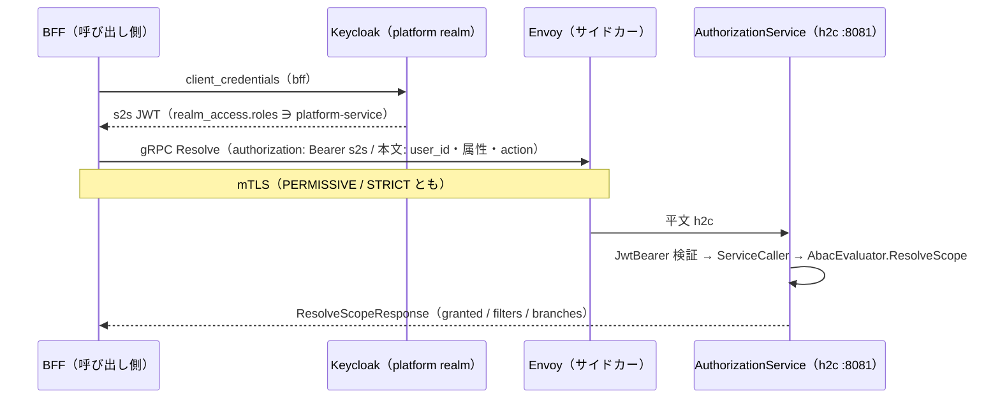

<!-- trace:
ids: [FR-01, FR-02, FR-03, FR-04, FR-05, FR-06, FR-09, FR-10, FR-11, FR-12, FR-13, FR-16, FR-17, FR-18, FR-19, NFR-02, NFR-09, NFR-16, NFR-21, SC-03, SC-05, SC-06, SC-10, SC-12, SC-17, SC-18, UC-01, UC-02, UC-03, UC-04, UC-05, UC-07, UC-09, UC-10]
adrs: [ADR-0002, ADR-0004, ADR-0010, ADR-0011, ADR-0012, ADR-0013, ADR-0016, ADR-0017, ADR-0025, ADR-0029, ADR-0032, ADR-0034, ADR-0036, ADR-0038, ADR-0044, ADR-0054, ADR-0056, ADR-0062, ADR-0064, ADR-0065, ADR-0070, ADR-0074, ADR-0075, ADR-0076, ADR-0080, ADR-0086]
iadrs: [IADR-0009, IADR-0012, IADR-0037, IADR-0041, IADR-0044, IADR-0045, IADR-0101, IADR-0104, IADR-0110, IADR-0117, IADR-0122, IADR-0225, IADR-0242, IADR-0253, IADR-0256, IADR-0265, IADR-0272, IADR-0290, IADR-0299, IADR-0316, IADR-0329, IADR-0335, IADR-0353, IADR-0354, IADR-0364, IADR-0378, IADR-0379, IADR-0384, IADR-0385, IADR-0388, IADR-0389, IADR-0395, IADR-0397, IADR-0400, IADR-0401, IADR-0402, IADR-0408, IADR-0410, IADR-0412]
specs: [20260905_issue-1201_east-west-grpc-preconditions, 20260905_issue-1255_east-west-grpc-llm-embedding, 20260905_issue-1255_east-west-grpc-llm-completion, 20260906_issue-1255_east-west-grpc-authz, 20260906_issue-1255_east-west-grpc-bff, 20260906_issue-1255_knowledge-health-grpc, 20260907_issue-1255_user-context-in-body, 20260908_issue-1255_tag-dictionary-grpc]
issues: [#1201, #1255]
-->

# 通信仕様書: east-west gRPC（サービス間の同期呼び出し）

> 計画は「サービス間の同期呼び出し（east-west）は gRPC + Protobuf、BFF から SPA・外部公開 API（north-south）は
> REST」と定め、移行の順序を**基盤先行**とした。本書はその**実装ガイド**である —— 基盤（本リポジトリ）が
> 先に決めた 4 点（**proto の置き場・versioning・h2c ポート・サービス間トークン**）を、後から追随する
> 呼び出し元（本リポジトリの残りの経路と、基盤を拡張する別プロジェクト）が同じ形で写せるように書く。
> 判断の論拠は実装 ADR に、作業の母集合は作業仕様書にある（いずれも trace ブロック）。

## 概要

- **プロトコル**: gRPC（HTTP/2）+ Protobuf 3。メッシュ内は **h2c（TLS 無し HTTP/2）** で、mTLS はサイドカーが終端する。
- **対象**: メッシュ内のサービスどうしの**同期**呼び出し。候補／非候補の基準は「同期 ∧ east-west ∧ 応答を待つ」であり、
  呼び出しの頻度やレイテンシ要求では判定しない。外部 SaaS・IdP・オブジェクトストレージ・非同期イベント・SSE は対象外。
- **状態**: gRPC 面を持つのは **8 経路** —— 参照実装（BFF → 認可サービスの権限スコープ解決）、
  埋め込み生成（取り込み・検索 → LLM ゲートウェイ）、テキスト生成（AI 分析・グラフ・変換 →
  LLM ゲートウェイ。一括と**逐次**）、**認可サービスの 5 呼び出し元**
  （AI 分析・グラフ・Wiki のスコープ解決＋データソース・MCP の利用者名簿）、そして
  **BFF の文書読み取り 4 箇所**（一覧・詳細・版履歴・特定版）、そして
  **ナレッジ健全性の観測値の報告**（グラフ → ダッシュボード）、そして
  ［2026-09-07 追記］**利用者の権限で動く 2 経路**（検索 → グラフの近傍展開・グラフ → 文書のタグ反映）、
  そして［2026-09-08 追記］**タグ辞書の読み取り**（グラフ → 文書）である。
  **並走中の正は REST** であり、gRPC は構成で opt-in する。残りの経路の移行は別 issue で展開する。
  ［2026-09-06 追記］🔴 **BFF の s2s 資格情報の未配線は閉じた。** realm に BFF の service account が
  無く、`ServiceToken` が helm・compose のどちらにも無かったため、参照実装（BFF → 認可サービス）は
  配備上 1 度も走っていなかった。BFF が文書読み取りの呼び出し元になるのに合わせ、
  **realm の割当と `ServiceToken` の注入を入れた**。**認可サービス宛の gRPC アドレスは
  意図的に入れていない** —— 参照実装の切替はこのスライスの射程外である。

## 1. proto の置き場と所有

| 項目 | 規約 |
| --- | --- |
| 所有者 | **呼び出される側**のサービス |
| 置き場 | 所有サービスが属する**ユニットの共有契約プロジェクト**: platform 所有 → `src/platform/backend/Shared/Platform.Shared.Contracts/`、knowledge 所有 → `src/knowledge/backend/Shared/Knowledge.Contracts/` |
| パス | `Protos/<unit>/<service>/v<N>/<name>.proto`（例: `Protos/platform/authz/v1/authz_scope.proto`） |
| 生成 | `<Protobuf Include="Protos/**/*.proto" ProtoRoot="Protos" GrpcServices="Both" />`。クライアントとサーバ基底の両方を契約プロジェクトから生成する。**`*.Client` プロジェクトは作らない** |
| 生成物 | `obj/` に落ち、コミットしない |
| 参照方向 | ユニット外から参照できるのは platform の `Shared/` 3 プロジェクトだけ、platform → 可変ユニットは禁止 —— **現状の HTTP と同じ向き**（platform のサービスが knowledge の gRPC を呼ぶことは無い） |

サービスプロジェクト（`Services/<Name>/`）に proto を置いてはならない。他ユニットの呼び出し元が生成クライアントを参照できなくなる。

## 2. versioning

| 項目 | 規約 |
| --- | --- |
| package | `<unit>.<service>.v<N>`（小文字。パスと一致） |
| C# 名前空間 | `option csharp_namespace = "<ContractsRoot>.Grpc.<Service>.V<N>";`（例: `Platform.Shared.Contracts.Grpc.Authz.V1`） |
| フィールド番号 | **不変**。削除するときは番号と名前を `reserved` に残す |
| 非破壊 | field / message / rpc / enum 値の**追加** |
| 破壊的 | 番号・型・ラベル（`repeated` / `map`）・名前の変更、field / message / rpc / enum 値の削除、rpc の要求／応答型の変更、package・名前空間の変更 |
| メジャー版の上げ方 | **`v<N+1>` のディレクトリと package を並走させる**（in-place で `v<N>` を壊さない）。旧版の撤去は file の削除として承認を要する |

機械検査は `node scripts/check-proto-contracts.js` が行う（配置と名前の一致・番号の一意・`reserved` の再利用禁止・baseline との後方互換）。
非破壊の追加でも baseline（`scripts/proto-contract-baseline.json`）と差分がある限り赤になり、`--update` で差分を PR に載せる。
破壊的変更は `scripts/proto-breaking-allowlist.json` の承認エントリで通す —— ただし**削除時の `reserved` 不在と `reserved` の再利用は承認でも通らない**。
C# 契約（DTO・イベント）の検査器とは母集合を共有しない（構文と互換規則が違う。1 構文 1 パーサ）。

## 3. h2c ポート

| 項目 | 規約 |
| --- | --- |
| リスナ | 構成 `Grpc:Port`（env `Grpc__Port`）で **専用ポート**（既定 8081）に `HttpProtocols.Http2` **だけ**を bind する。未設定・0 なら立てない |
| HTTP/1.1 | 8080（REST・`/health/*`・introspection）は**そのまま残す**。共通ヘルパ `AddPlatformGrpcListener` が HTTP 側のポートを再宣言する（Kestrel は Listen を 1 つでも構成するとホスティング URL を捨てるため） |
| 同居しない理由 | 平文には ALPN が無く、1 ポートで HTTP/1.1 と HTTP/2 を選ばせる形は Kestrel の preface 検出に依存する。**選択を切替ではなく分離で決める** |
| helm | `services.<name>.grpcPort` を宣言したサービスにだけ `containerPort`（名前 `grpc`）・Service ポート（`name: grpc` / `appProtocol: grpc`）・env `Grpc__Port` を描画する。HTTP 側にも `name: http` が付く。**宣言しないサービスは 1 バイトも変わらない** |
| compose | `expose` に h2c ポートを足し `Grpc__Port` を与える。host へは公開しない |
| readiness | **HTTP の `/health/ready`（8080）のまま**。1 プロセスが両ポートを起動時に bind するので、8080 が ready なら h2c ポートも bind 済みである。gRPC ヘルスプロトコルは今は入れない |
| Istio | サイドカーがある限り **PERMISSIVE / STRICT のどちらでも** mTLS は Envoy で終端され、アプリには平文 h2c が届く。アプリ側の設定は両モードで同一。`appProtocol: grpc` でプロトコル推定に頼らない。既存の `DestinationRule`（`ISTIO_MUTUAL`・host ワイルドカード）が全ポートに掛かるので追加は要らない |

実測（2026-09-05・実 Kestrel）: h2c ポートへの HTTP/1.1 要求は **400 Bad Request** で処理されず、同じ要求は 8080 側で 200 を返す。

## 4. サービス間トークン（s2s）

| 項目 | 規約 |
| --- | --- |
| メタデータ | `authorization: Bearer <呼び出し側サービス自身の JWT>` |
| トークンの出所 | platform realm の **confidential client の client credentials**（`ServiceToken:ClientId` / `ClientSecret`。端点は `ServiceToken:TokenEndpoint` か `Auth:Authority` から導く）。期限まで再利用し、30 秒手前で取り直す |
| 呼び出し先の検証 | 既存の JwtBearer（`AddPlatformAuth`。同じ issuer・同じ JWKS）で検証し、gRPC サービス型に **`ServiceCaller` ポリシー**（realm ロール `platform-service`）を掛ける |
| 拒否 | トークン無し → `UNAUTHENTICATED`、`platform-service` 無し → `PERMISSION_DENIED` |
| 🔴 利用者トークン | **メタデータへ載せない。** 利用者のトークン（管理者であっても）はサービス間の面を通らない —— 通すと呼び出し先が「利用者が直接呼んだ」と「サービスが利用者のために呼んだ」を区別できず、利用者ロールがサービス間の面へ漏れる（confused deputy） |
| 利用者の文脈 | **本文で運ぶ**（`user_id` / `user_attributes` / `action`。REST の要求本文と同じ形）。移行は本文を変えないトランスポートの差し替えになる |
| deny-by-default | 該当ポリシーが無ければ `granted=false` を**応答で**返す（エラーではない）。呼び出し側は `UNAUTHENTICATED` / `PERMISSION_DENIED` / `UNAVAILABLE` / トークン取得失敗をすべて「閲覧可能なし」へ縮退する |
| BFF セッション方式との分け方 | セッション Cookie ↔ 利用者トークンは **north-south**、s2s トークンは **east-west**。BFF は自分の confidential client（`bff`）で client credentials を取る（realm の `bff` に service account と `platform-service` を付けてある） |
| 利用者の権限で動く呼び出し先 | **利用者文脈を本文で運ぶ**（上の行と同じ形）。呼び出し先は受け取った文脈で**自分の判定を行う**ので、ホップごと ABAC は満たされる |
| RFC 8693 token exchange | 🔴 **採らない。** 理由は preview だからではなく、**入れても閉じないから**である —— 認可サービスは呼び出し元の主張する `user_id` / `user_attributes` をそのまま評価するので、交換トークンを入れてもサービスはその隣で任意の利用者を主張できる。覆るには 2 条件が**ともに**要る |

呼び出し側の共通部品: `AddPlatformServiceToken`（発行側の登録）と `GrpcClientExtensions.CreatePlatformChannel`（平文 h2c チャネルに
s2s の `CallCredentials` を付ける。平文でトークンを送るには `UnsafeUseInsecureChannelCallCredentials` が要る —— 線上は mTLS である）。
キャッシュ・タイムアウト・リトライ・fail-safe は呼び出し元サービスの Infrastructure に置く（計画の追記どおり）。

## 参照実装: 権限スコープ解決（`platform.authz.v1.AuthzScope/Resolve`）

- 概要: BFF の `BffScopeResolver` が `Services:AuthorizationServiceGrpc`（例: `http://authorization-service:8081`）の
  構成があるときだけ gRPC で解決し、無ければ REST `POST /authz/scope` で解決する。**並走中の正は REST。**
- 認証・認可: `ServiceCaller`（上記）。
- 評価器: REST と**同じ** `AbacEvaluator.ResolveScope` を呼ぶ（評価器を 2 つにしない）。

リクエスト（`ResolveScopeRequest`）:

| 名前 | 型 | 必須 | 説明 |
| --- | --- | --- | --- |
| `user_id` | string | ○ | 利用者識別子（preferred_username） |
| `user_attributes` | map<string,string> | ○ | ABAC 判定に用いる利用者属性（clearance / department ほか） |
| `action` | string | — | read / analyze / manage / write。空文字は read |

レスポンス（`ResolveScopeResponse`）:

| 名前 | 型 | 説明 |
| --- | --- | --- |
| `user_id` | string | 要求の利用者 |
| `allowed_filters` | repeated AttributeFilter | 従来の算出値（キー単位 union の連言） |
| `granted` | bool | マッチするポリシーが 1 つでもあったか。false は閲覧可能なし |
| `branches` | repeated AccessScopeBranch | read の選言（分岐内 AND・分岐間 OR）。1 件以上あればこちらで評価する |

エラー:

| gRPC status | 条件 | 対応 |
| --- | --- | --- |
| `INVALID_ARGUMENT` | action が値域外 | REST の 400 と同値。呼び出し側は deny へ縮退 |
| `UNAUTHENTICATED` | s2s トークン無し・検証失敗 | deny へ縮退 |
| `PERMISSION_DENIED` | `platform-service` ロール無し（利用者トークンの転送を含む） | deny へ縮退 |

## 2 つ目の面: 埋め込み生成（`platform.llmgateway.v1.LlmEmbedding/Embed`）

- 概要: 取り込み・検索の 2 サービスが `Services:LlmGatewayGrpc`（例: `http://llm-gateway:8081`）の構成が
  あるときだけ gRPC で埋め込みを得て、無ければ REST `POST /embed` で得る。**並走中の正は REST。**
- 認証・認可: `ServiceCaller`。REST の `/embed` は無認可のままなので、**gRPC 面のほうが強い**（緩めていない）。
- 判定器: REST と**同じ**越境判定・ルーティング・次元照合を通る（判定器を 2 つにしない）。

リクエスト（`EmbedRequest`）:

| 名前 | 型 | 必須 | 説明 |
| --- | --- | --- | --- |
| `text` | string | ○ | 埋め込む本文（取り込みは文書本文、検索はクエリ） |
| `confidentiality` | string | — | 入力の機密区分。**空文字は restricted**（安全側。REST の null と同じ） |
| `purpose` | EmbedPurpose | — | `INDEX` / `QUERY`。🔴 **`UNSPECIFIED`（既定 0）は `INDEX` として扱う**（REST の既定と同じ） |

レスポンス（`EmbedResponse`）: `vector` / `dimensions` / `model` / `collection` / `embedded` /
`endpoint` / `routing_reason` / `retryable`（REST の応答と 1 対 1）。

🔴 **縮退はエラーではない。** 越境拒否（fail-closed）・プロバイダ未登録・次元不整合・上流不調はいずれも
`embedded=false` の**応答**で返る（REST の 200 ＋ `Embedded=false` と同値）。`retryable` の意味も同じ ——
`true` は一時的な障害（再試行へ回す）、`false` は恒久的な拒否（索引をスキップ）である。

エラー（`RpcException` になるのは輸送と s2s の面だけ）:

| gRPC status | 条件 | 呼び出し側の対応 |
| --- | --- | --- |
| `UNAUTHENTICATED` | s2s トークン無し・検証失敗 | 🔴 **例外のまま上げる**（`[]` や「再試行可」へ縮退させない） |
| `PERMISSION_DENIED` | `platform-service` ロール無し（利用者トークンの転送を含む） | 同上 |
| `UNAVAILABLE` | ゲートウェイ不達 | 同上 |

🔴 **権限スコープ解決とは縮退の向きが逆である。** あちらは「引けなかった」を deny（閲覧可能なし）へ倒すが、
埋め込みは倒さない —— 倒すと検索側では「該当なし」、取り込み側では「送信拒否」と**見分けがつかなくなる**。
続行してよいのは、後段が応答で明示的に「埋め込めなかった」と答えたときだけである。

## 3 つ目の面: テキスト生成（`platform.llmgateway.v1.LlmCompletion`）

- 概要: AI 分析・グラフ・変換の 3 サービスが `Services:LlmGatewayGrpc` の構成があるときだけ gRPC で
  生成を得て、無ければ REST `POST /complete` / `POST /complete/stream` で得る。**並走中の正は REST。**
- 認証・認可: `ServiceCaller`。REST の `/complete` 系は無認可のままなので、**gRPC 面のほうが強い**。
- 判定器: REST と**同じ**越境判定・ルーティング・フォールバック鎖・計器を通る（判定器を 2 つにしない）。

rpc は 2 本ある。

| rpc | 形 | REST の対応 |
| --- | --- | --- |
| `Complete` | unary | `POST /complete` |
| `CompleteStream` | 🔴 **server-streaming** | `POST /complete/stream`（SSE） |

🔴 **`CompleteStream` を unary へ潰してはならない。** 初回トークンの境界は「最初の `delta` メッセージの
到着」であり、SSE の「最初の `data:` 行」と同じ位置にある。unary にすると最初の `delta` が生成完了後にしか
届かず、性能要求の SLI（初回応答）が**応答完了 p95** を測ることになる —— 計画が明示的に却下した
「長い回答ほど SLO 違反になる」形である。判断の記録は trace ブロックの実装 ADR にある。

🔴 **サーバが早く書くことはプロトコルの保証ではない。** gRPC が保証するのは順序だけである。
`delta` ごとに `WriteAsync` を呼ぶことは**コードの性質**であり、
「最初の `delta` が `done` より前に到着する」ことを観測する試験でしか守れない。

リクエスト（`CompleteRequest`。両 rpc 共通）:

| 名前 | 型 | 必須 | 説明 |
| --- | --- | --- | --- |
| `prompt` | string | ○ | 送信する本文 |
| `max_tokens` | int32 | — | 🔴 **`0` は「未指定」であり「0 トークン」ではない。** 既定 4096 として扱う。負数は `INVALID_ARGUMENT` |
| `model` | string | — | 空文字は未指定（ゲートウェイが用途で選ぶ） |
| `confidentiality` | string | — | **空文字は restricted**（安全側。REST の null と同じ） |
| `purpose` | string | — | 空文字は `"default"`。**enum にしない**（値域を閉じるのは設定と計器であって契約ではない） |

レスポンス: `CompleteResponse`（`text` / `model` / `input_tokens` / `output_tokens` / `sent` /
`endpoint` / `routing_reason` / `stop_reason`）と `CompletionStreamEvent`（`delta` / `done` / `sent` /
`text` / `model` / `input_tokens` / `output_tokens` / `routing_reason` / `stop_reason`）。いずれも REST と 1 対 1。

🔴 **縮退はエラーではない。** 越境拒否・プロバイダ未登録・上流不調はいずれも `sent=false` の**応答**
（一括）または `done=true, sent=false` の**メッセージ**（逐次。ストリームは正常終了する）で返る。
REST が 500 を伝播させないのと同値である。

🔴 **埋め込みとは縮退の向きが逆である。** 埋め込みの呼び出し元は `UNAUTHENTICATED` /
`PERMISSION_DENIED` / `UNAVAILABLE` を**例外のまま上げる**が、生成の呼び出し元は上げない ——
REST 実装がそれぞれ「出典のみ返す」「提案 0 件」「画像として保持」へ縮退させているからであり、
**移行の不変条件は「挙動を変えない」であって「輸送ごとに一貫させる」ではない。**
呼び出し元ごとの落とし先は下表のとおりである。

| 呼び出し元 | 輸送の失敗（`RpcException` 全 status ＋ s2s トークン取得失敗）の落とし先 |
| --- | --- |
| AI 分析（逐次） | `done(sent=false, "LLM が現在利用できません。")`。**受信途中**の失敗だけ `"LLM 応答の受信に失敗しました。"` |
| AI 分析（一括） | 出典のみ返す（REST の非 2xx と同じ枝） |
| グラフ（提案） | 提案 0 件 |
| 変換（図のコード化） | 画像として保持（理由コードも REST と同じ） |

## 4 つ目の面: 利用者名簿の狭い読み口（`platform.authz.v1.UserDirectory`）

- 概要: データソース登録の**写像先の実在検証**と、MCP クライアント登録の**登録者属性の解決**が使う。
  `Services:AuthorizationServiceGrpc` の構成があるときだけ gRPC で、無ければ REST のまま。
- 認証・認可: `ServiceCaller`。
- 後段: 従来どおり `IIdentityAdminClient`（`view-users` を持つ主体は 1 つのまま）。

🔴 **これは `GET /authz/users`（AdminOnly・全件列挙）を写したものではない。**

従来この 2 呼び出し元は**利用者の `Authorization` を後段へ転送**して AdminOnly の門を通していた。
§4 の 🔴「利用者トークンはメタデータへ載せない」と正面から衝突する形である。
転送をやめる代わりに、**呼び出し先の読み口を「呼び出し元が実際に要る問い」まで狭めた** ——
転送されたトークンは呼び出し先で「**列挙してよいか**」の門にしか使われておらず（列挙のハンドラは
主体を一切読まない）、呼び出し元が要るのは次の 2 つだけだったからである。

| rpc | 問い | 照合 |
| --- | --- | --- |
| `CheckUsernames` | 「これらの利用者名は実在するか」 | **序数一致**。🔴 無効化された利用者も**実在として数える** |
| `GetUserAttributes` | 「この 1 人の ABAC 属性は何か」 | **大小文字無視**。属性は REST と同じ線上表現（集合値キーはカンマ連結） |

🔴 **列挙と書き込みはこの面に存在しない。** だからサービス専用の資格情報を新設しても、
その主体は名簿を引けない —— 「データソース登録・MCP クライアント登録を触れない主体が名簿を引ける
経路を作らない」という呼び出し元のコード注記が守ろうとした線は、ここで保たれている。人の側の門
（データソースの Create / Update / Patch / Disable、MCP の `/mcp-clients` の AdminOnly）は
呼び出し元の端点に残る。

🔴 **残余リスク（受容済み）**: `platform-service` を持つサービスは「名指しした 1 人の**真の**属性」を
読める。これは `AuthzScope/Resolve` が呼び出し元の**主張する**属性をそのまま評価に使うのと同じ信頼であり
（偽の属性を主張できる方が強い）、境界も同じ内周である。判断の記録は trace ブロックの実装 ADR にある。

🔴 **「居ない」と「引けなかった」を分ける。** 居ないのは応答（`exists=false` / `found=false`）、
引けなかったのは gRPC status である。呼び出し側は**後者だけ**を自分の「Unavailable」へ倒す ——
混ぜると認可サービスの障害が「その利用者は存在しません」という嘘の理由になる
（データソースは 502 と 400 で分ける）。

🔴 **`CheckUsernames` は要求と同じ順・同じ数を返す。** 呼び出し元は位置ではなく名前で読むが、
「送った名前がすべて答えに現れる」ことは結果を集合へ畳むときの前提である。

### 同じスライスで移した `AuthzScope/Resolve` の 3 呼び出し元

AI 分析・グラフ・Wiki は**参照実装と同じ rpc**を使う（proto の追加は 0）。本文は現行の REST と同一で、
移行は本文を変えないトランスポートの差し替えである。

| 呼び出し元 | 輸送の失敗（`RpcException` 全 status ＋ s2s トークン取得失敗）の落とし先 |
| --- | --- |
| AI 分析・グラフ・Wiki（スコープ解決） | deny-by-default（`granted=false`）。REST の非 2xx・不達と同じ枝 |
| データソース（実在検証） | `Unavailable` → 502。**「実在しない」（400）と混ぜない** |
| MCP（登録者属性） | `Unavailable`（何も配らない）。🔴 **deny へ畳まない** —— 畳むと障害中に「機密区分は空だがタグは配れる」という緩む向きの挙動になる |

🔴 **Wiki の未認証短絡は輸送の手前にある。** 認証されていない要求では gRPC を**1 度も呼ばない**
（短絡の後ろへ滑り込むと「未認証時の応答がポリシーの内容次第で変わる」欠陥が再発する）。
🔴 **`action` は既定へ丸めない。** 読み取り経路も `read` を明示して送る。

## 5 つ目の面: 文書台帳の読み取り（`knowledge.document.v1.DocumentRead`）

- 概要: **BFF の文書閲覧経路**（一覧・詳細・版履歴・特定版）が使う。
  `Services:DocumentServiceGrpc` の構成があるときだけ gRPC で、無ければ REST のまま。
- 認証・認可: `ServiceCaller`。
- 置き場: **knowledge ユニットの共有契約プロジェクト**（`Knowledge.Contracts`）。所有者は呼び出し先であり、
  置き場はその所有者が属するユニットである（§1）。platform 側へ置いてはならない。

**これは「呼び出し元 = BFF」の最初の面である。** 前の 4 面はサービス → サービスだった。
BFF は north-south の入口でもあるため、**どの呼び出しが移せるかを 1 本ずつ判定した**（下表）。

| BFF の後段呼び出し | 移せるか | 理由 |
| --- | --- | --- |
| 文書の**読み取り** 4 箇所 | **移した** | 資格情報を運んでいない。ABAC の実施点は BFF 側にあり、後段の読み取り群はロールで塞いでいない |
| 文書の**書き込み**・本文投入・タグ辞書・個人資料 | 移さない | 利用者の資格情報を運び、後段が `AdminOnly` などを二重ゲートで強制する |
| 検索・グラフ・Wiki・AI 分析・通知・変換・データソース・MCP・利用者管理・ABAC 管理 | 移さない | 同上（ホップごと ABAC・主体絞り・管理系の二重ゲート） |
| introspection の収集 | 移さない | 呼び出し先集合が構成で開いており、**本リポジトリが著述できないユニットのサービスを含む**。一部だけ移すと「到達不能」が 2 つの意味を持つ |

🔴 **この面は認可の判定を持たない。** 文書単位の ABAC（属性合致 ∧ 個人資料でないこと）は
**呼び出し元の 1 か所**が実施点であり、移行で位置を動かしていない。書き込みプリフライト
（変更前にスコープを確かめる往復）もそのまま残る。

🔴 **proto3 の既定と DTO の既定が逆向きの真偽値が 1 つある。**
「原本が本文を持っていたか」は DTO の既定が `true`・proto3 の既定が `false` である。
サーバが明示代入を落とすと**全文書が「本文なし」に見え**、文書詳細が本文の位置へ
「本文なし（原本を参照）」を出す —— テキスト生成の `sent` と同型の、**静かな**壊れ方である。
本文の参照 URI と変更メモは `null` と `""` が画面で別物なので `optional`（field presence）で運ぶ。

🔴 **縮退の向きは呼び出し箇所ごとに違う（一般化しない）。** 実測すると 4 箇所は
「一覧＝空一覧」「詳細＝404 秘匿」「版履歴＝隠さず失敗させる」「特定版＝不在は 404・不達は失敗」と
4 通りに割れている。**gRPC のクライアントは事実（無い／引けなかった）だけを返し、畳むのは呼び出し元**である。

🔴 **チャネルは宛先ごとに分ける。** BFF は認可サービス宛（参照実装・キー無し）と文書サービス宛を
**同時に持ち得る最初のホスト**である。キー無しを共有すると片方のクライアントがもう片方の宛先へ繋がる。

## 6 つ目の面: ナレッジ健全性の報告（`knowledge.dashboard.v1.KnowledgeHealthReport/Report`）

- 呼び出し元: グラフの定期処理（指標 4 つ分の観測値を周期ごとに送る生産者）。
- 呼び出し先: ダッシュボード集計サービスの内部受け口。REST は `POST /internal/knowledge-health/observations`。
- 切替の構成キー: `Services:DashboardServiceGrpc`（h2c のアドレス）。**未設定なら REST のまま。**
- 認証・認可: `ServiceCaller`。
- 置き場: **knowledge ユニットの共有契約プロジェクト**（`Knowledge.Contracts`）。所有者は呼び出し先である（§1）。

**これは「一方向の報告」の最初の面である。** 前の 5 面はすべて問い合わせ（応答の中身を使う）だったが、
本経路は応答を受理の確認にしか使わない。**利用者の文脈を本文で運ぶ項目が 1 つも無い**ことが特徴で、
これは呼び出し元が利用者の要求の外で走る定期処理だからである（個人資料を集計から外す判定は**受け手**が持つ）。
したがって s2s トークンだけで移せる —— 利用者トークンの転送が問題になる経路とは初めから性質が違う。

| 要求フィールド | 型 | 必須 | 説明 |
| --- | --- | --- | --- |
| `indicator` | string | ○ | 指標名。値域外は `INVALID_ARGUMENT`（REST の 400 と同値） |
| `observations` | repeated Observation | — | 当該指標の観測値の**全量**。**空でも送る**（0 件という事実を運ぶ） |
| `threshold_days` | 🔴 **optional** int32 | — | 判定に使った日数。**未指定はしきい値の行を削除する。** `0` は「未指定」ではなく `INVALID_ARGUMENT` |

| `Observation` | 型 | 説明 |
| --- | --- | --- |
| `subject_key` | string | 重複排除のための不透明な鍵。**応答には現れない** |
| `doc_scope` | 🔴 **optional** string | 個人資料は `"private-note"`、それ以外は**未設定**（`""` ではない） |
| `dimension` | 🔴 **optional** string | 内訳の軸。持たない指標では**未設定**（`""` ではない） |

🔴 **REST の「項目そのものを出さない」を presence で運ぶ。この面は 3 箇所ある。**
非 `optional` へ落とすと、`threshold_days` の未指定が `0` になって受け口の検証器に弾かれ、
**しきい値を持たない 3 指標の報告が全部 `INVALID_ARGUMENT` になる**。
しかも呼び出し元は fail-open（ログを出して続行）なので、**赤くならないまま報告が止まる** ——
受け口は全量スナップショット置換なので、数字は 0 にすらならず**最後の値で凍る**。
`doc_scope` / `dimension` の未指定が `""` に潰れる方は、台帳での区別と内訳の軸を壊す。

🔴 **判定の位置を動かさない。** 個人資料を集計から外すのは受け手であり、生産者は
「対象の集合と各対象の文書スコープを正しく添える」だけである。移行はこの分担を変えない。
REST の受け口は**認証を持たない**（利用者裁定で認証を外した経路である）ので、
この面に `ServiceCaller` を掛けるのは**現状より狭い**向きである。**REST 側は変えない。**

🔴 **縮退の枝を 1 つも増やさず・1 つも減らさない。** 現行の枝は 3 つ（受理された／受理されない／
到達できない）＋「呼び出し元のキャンセルだけは伝播させる」であり、gRPC 版はこれを写す。
**受理されたときだけ計器を数える** —— 失敗時に数えると、受け口が死んでいる間も系列が生き続けて
**不在アラートが沈黙する**。送出のタイムアウト（5 秒）は `HttpClient.Timeout` の代わりに
**deadline** で与え、値は REST 実装の定数を**そのまま引く**（書き写さない）。

🔴 **チャネルは宛先ごとに分ける。** 呼び出し元は認可サービス宛（キー無し）と LLM ゲートウェイ宛
（キー付き）を既に持つ **3 つ目の宛先を持つ最初のサービス**である。

🔴 **切替の試験は「登録関数」に対して置く。** 呼び出し元の選択は組み立て時に構成を読むため、
テストホストが差し込む構成（Build 時に載る）では DI の切り替わりを測れない。

## 7 つ目の面: 利用者の権限で動く 2 経路（`knowledge.graph.v1.GraphNeighbors` / `knowledge.document.v1.DocumentTagWrite`）

- 呼び出し元と呼び出し先: **検索 → グラフ**（二段検索の近傍展開）と **グラフ → 文書**（AI タグ提案の承認の反映）。
- 切替の構成キー: `Services:GraphServiceGrpc` / `Services:DocumentServiceGrpc`。**未設定なら REST のまま。**
- 認証・認可: `ServiceCaller`。
- 置き場: いずれも **knowledge ユニットの共有契約プロジェクト**（`Knowledge.Contracts`）。所有者は呼び出し先である（§1）。

**これは「呼び出し先が利用者自身の権限で判定する」最初の面である。** 前の 6 面は、呼び出し先が
主体を読まない（読み口を狭められた・報告だけ）か、実施点が呼び出し元にあるかのどちらかだった。

🔴 **手段は「利用者文脈を本文で運ぶ」である**（`user_id` / `user_attributes` / `action`。§4 と同じ形）。
利用者のトークンは面を通らない。**新しい形ではない** —— `AuthzScope/Resolve` が既にこの形であり、
本面はその射程を**ホップごと ABAC の呼び出し先**へ広げたものである。

🔴 **判定の位置は動かない。** グラフは受け取った文脈で `AuthzScope/Resolve` を**自分で**呼んで
スコープを解決し、文書は所有者束縛と管理者ロールを**自分で**再判定する（最終防衛線）。
🔴 **呼び出し元が解決したスコープを運ぶ形は採らない** —— 受け取った scope をそのまま信じる口を
開くと、そこへ到達できる誰もが任意の scope を主張できる。

🔴 **realm ロールは `user_attributes` へ混ぜない。** タグ反映の認可は「①所有者の動的束縛 または
②管理者ロール」の選言であり、②は ABAC ではない。属性の線上表現の規則（集合値キーは 2 つだけ）とも
食い違うため、**`user_roles` の別欄で運ぶ**。

| rpc | 問い | 利用者文脈 |
| --- | --- | --- |
| `GraphNeighbors/ExpandNeighbors` | 「この起点から見える辺は何か」 | **持つ**（呼び出し先がスコープを解決する） |
| `GraphNeighbors/ListEdgeTypeWeights` | 「辺の型ごとの重みは何か」 | 🔴 **持たない** —— REST の描画用カタログは主体を 1 バイトも読まない。転送トークンは認証の門にしか使われていなかったので、`ServiceCaller` がそれを**より狭く**置き換える |
| `DocumentTagWrite/AddTag` | 「この承認者はこの文書へこのタグを足せるか」 | **持つ**（`user_roles` を含む） |

🔴 **「見えない」「書けない」は応答であって status ではない。** 起点の不在・不可視・スコープ無しは
すべて `found=false`、「所有者でも管理者でもない」と「文書が無い」はどちらも `NOT_WRITABLE` である。
status で割ると、**割り方そのものが存在を漏らす**（1 種類しかない 404 を写している）。
`PERMISSION_DENIED` を返すのは **s2s の門だけ**である。

🔴 **縮退の枝を 1 つも増やさず・1 つも減らさない。** 近傍展開の失敗は空 ＋ 警告（検索は落とさない）、
タグ反映の失敗は `Unavailable`（成功へ縮退しない）。**利用者文脈の欠落だけは `INVALID_ARGUMENT`** で
あり deny へ畳まない —— 畳むと呼び出し元の配線誤りが「グラフには何も無い」に化ける。

🔴 **チャネルは宛先ごとに分ける。** グラフは 4 つ目の宛先（認可・LLM・ダッシュボード・文書）を持つ
最初のサービスである。キー無しを共有すると、タグの反映が認可サービスへ繋がる。

## 8 つ目の面: タグ辞書の読み取り（`knowledge.document.v1.TagDictionary`）

- 呼び出し元と呼び出し先: **グラフ → 文書**（AI タグ提案の**生成段**が「LLM に選ばせる値集合」として引く）。
- 切替の構成キー: `Services:DocumentServiceGrpc`。**未設定なら REST のまま。**
- 認証・認可: `ServiceCaller`。REST の受け口は**認証を持たない**メッシュ内部 API なので、**狭まる向き**である。
- 置き場: `Knowledge.Contracts` の `Protos/knowledge/document/v1/tag_dictionary.proto`。

**この面は「呼び出し元が要らないものを面へ出さない」の教科書的な例である。** rpc は 1 本、
要求は**空**、応答は**名前の配列だけ**である。`user_id` も `user_attributes` も無い ——
読む主体は呼び出し元サービス自身であり、辞書は利用者へ返るものではないからである。
使用件数（管理面の集計値）も出さない。

🔴 **既存 2 本の proto へ相乗りしない。** 同じ呼び出し先へ 3 本目の面を作る判断である。
文書読み取りの面は「書き込み・本文・共有の口はこの面に存在しない」と宣言しており、
タグ書き込みの面は「一覧・本文・共有・**タグ辞書**の口はこの面に存在しない」と自ら書いている ——
どちらへ足しても**その宣言が嘘になる**。面の名が体を表さなくなる改名は破壊的変更でもある。

🔴 **「引けなかった」と「空」を分ける。** 辞書が空なのは**応答**（配列が空）、引けなかったのは
**status** である。呼び出し元は前者を空集合・後者を `null` へ落とし、`null` のときだけ
タグ提案を 1 件も作らない（fail-closed）。**混ぜると「辞書が空だからタグを付けない」と
「引けなかったからタグを付けない」が区別できなくなる。** 縮退は片方向では固定できない ——
**両方向の試験を対で置く**（実測: 空集合へ倒す変異は片方だけ、`null` へ倒す変異はもう片方だけを殺す）。

🔴 **チャネルは宛先ごとに 1 本。** 呼び出し元は**同じ呼び出し先へ 2 つ目のクライアント**を
持つ最初のサービスである。登録関数を 2 つに分けたまま両方がチャネルを作ると、
**登録順しだいで同じ宛先へ 2 本**張られる —— 解決は最後の登録を返すので障害としては現れず、
規約だけが静かに破れる。**両方の登録を「既に在れば足さない」形にする**のが唯一の直し方である。
🔴 **構成キーも共有する** —— 1 つの宛先を 2 つの鍵で切り替えると、片方だけが gRPC へ倒れた状態が作れる。

🔴 **この移行は危険を 1 つ減らす。** 移行前、読み取りと書き込みは**同じ名前つき HTTP クライアント**を
共有しながら資格情報の意味論が逆だった（書き込みは承認者の資格を付け、読み取りは付けない）。
共有インスタンス化する改修が入れば、承認者のトークンが**認証を持たない内部口**へ漏れる。
読み取りを別の輸送へ移すことは、その共有を実際に解くことである。

## シーケンス

## 非機能・運用

- **並走の扱い**: 1 経路について REST と gRPC が並走する期間がある。**正は REST**。gRPC への切替は構成（`Services:<Name>Grpc`）で行い、
  戻すときは構成を外すだけでよい（コードを変えない）。
- **タイムアウト・リトライ・fail-safe**: 呼び出し元の Infrastructure に置く。参照実装は縮退（deny）だけを持ち、リトライは持たない。
- **観測**: gRPC の状態コードは呼び出し側の警告ログに出る。gRPC 専用の計装（OTel の gRPC instrumentation）は展開 issue で扱う。
- **Keycloak**: 呼び出し元サービスごとに confidential client（service account 有効・`platform-service`）を realm へ登録する。
  参照実装では既存の `bff` client を流用した。

## 関連仕様

- 機能仕様書: 権限スコープ解決（ABAC）は認可の機能仕様に従う
- データ仕様書: 該当なし（永続化を伴わない）
- 検査器: `scripts/check-proto-contracts.js`（`scripts/README.md`）

## proto3 の「未指定」を写す

🔴 **proto3 に null は無い。** REST の DTO が持つ既定値（既定引数・`null` の解釈）は、**呼び出し先の
サーバ側で明示的に写す**。写し漏れは例外にならず、意味が静かに変わる形で現れる。

| 契約 | REST の既定 | proto3 の「未指定」 | サーバの写し |
| --- | --- | --- | --- |
| 権限スコープの `action` | `"read"` | `""` | `"" → read`（参照実装が実施済み） |
| 埋め込みの `purpose` | `Index` | `EMBED_PURPOSE_UNSPECIFIED`（0） | 🔴 `UNSPECIFIED → INDEX` |
| 埋め込みの `confidentiality` | `null` → restricted | `""` | 写し不要（`""` も未知値も restricted へ倒れる） |
| 生成の `max_tokens` | 4096 | `0` | 🔴 `0 → 4096`（負数は `INVALID_ARGUMENT`） |
| 生成の `model` / `confidentiality` / `purpose` | `null` | `""` | 写し不要（受け側が null と空文字を同じに扱う。実測） |
| 生成の `sent` | DTO 既定 **`true`** | **`false`** | 🔴 **向きが逆。** 増分メッセージにも `sent=true` を明示的に書く |
| 報告の `threshold_days` | 項目を出さない = しきい値なし | `0` | 🔴 **`optional`（presence）で運ぶ。** `0` は値域外であり、潰すと報告が `INVALID_ARGUMENT` になる |
| 報告の `doc_scope` | `null` = 個人資料でない | `""` | 🔴 **`optional`。** `""` を書くと台帳で `null` と区別できない |
| 報告の `dimension` | 項目を出さない = 軸なし | `""` | 🔴 **`optional`。** `""` という軸が 1 本生まれ内訳が割れる |

埋め込みの `purpose` を写し忘れると、未指定が `QUERY` として扱われて越境判定が「public 相当」へ落ち、
**機密文書の本文が外部の埋め込み API へ送られる**。新しい rpc を足す人は、
**REST 側の既定値を一覧してから proto の 0 値と突き合わせること。**

🔴 **`sent` は向きまで逆である。** DTO の既定は `true`・proto3 の既定は `false` であり、
増分メッセージへ書き忘れると例外は 1 つも起きず、**すべての増分が「縮退」に見える** ——
呼び出し元は縮退表示・提案 0 件・画像保持へ静かに倒れる。

## 未決事項

- gRPC ヘルスプロトコル（`grpc.health.v1`）の要否（今は HTTP の readiness で足りる）。
- 稼働クラスタでの h2c 往復は**未実測**（新イメージの配備＝Pod の再起動を要するため、本作業では行っていない）。
- 🔴 **参照実装（BFF → 認可サービス）の配備上の未配線。**
  ［2026-09-06 追記］**資格情報の側は閉じた** —— realm に BFF の service account
  （サービス用ロール付き）が入り、`ServiceToken` が helm・compose の両方で注入される。
  **残っているのは宛先の側だけ**であり、認可サービス宛の gRPC アドレスは helm・compose のどちらにも
  意図的に入れていない（参照実装の切替はその段の判断である）。したがって**この経路は配備上まだ
  1 度も走っていない**。
  新しい呼び出し元を足すときは、**コードだけでなく 4 経路（helm / compose / realm / ローカル供給元）を
  同じ変更で揃えること**（1 つでも欠けると Pod が起動しない、あるいは呼び出しが常に拒否される）。
  🔴 **BFF の s2s は既存の `bff` client を使い回す**（セッション方式が使う confidential client を
  そのまま使える）ので、ローカル供給元は増えない —— ExternalSecret も Vault の seed も既存の 1 本のままである。
- **残っている経路の内訳**（2026-09-06 に呼び出し箇所単位で数え直した実測。基点 `2bb41b6d`）:
  east-west 同期呼び出しは **49 箇所**で、**移行済み 17 / 利用者の資格情報を運ぶ 27 / 残 5** である。
  残 5 は ①検索サービスの属性値照会（BFF）②文書 → 通知の送出 ③グラフ → 文書のタグ辞書読み
  ④MCP のツール申告の収集 ⑤実効構成の収集 で、④⑤ は**宛先集合が構成で開く扇形**であり
  本リポジトリだけでは完結しない。**issue 本文に残る古い数字（31 本）は登録単位・別時点のものである。**
  ［2026-09-08 追記］🔴 **③（グラフ → 文書のタグ辞書読み）が移った。残 4 である**
  （①検索サービスの属性値照会 ②文書 → 通知の送出 ④MCP のツール申告の収集 ⑤実効構成の収集）。
  **上の 49 / 17 / 27 / 5 は 2026-09-06 時点の実測であり、書き換えない** —— 数え直しは基点ごとに行う。
- ［2026-09-07 更新］🔴 **利用者の権限で動く呼び出し先（ホップごと ABAC）の扱いは裁定された。**
  計画がその手段を「**利用者文脈を本文で運ぶ**」と定め（§7 つ目の面を参照）、
  **token exchange は今は採らない**とした。従前ここに書いていた「未決である」は解消した。
  **内訳は 3 箇所ではなく 2 箇所である** —— AI 分析 → 検索は**中継**であり
  （`/search` は転送トークンを自分の認可に使っておらず、本文の `scope` で絞る）、
  検索 → グラフが移った時点で不要になる。**その転送を落とすのは移行の後**である。
