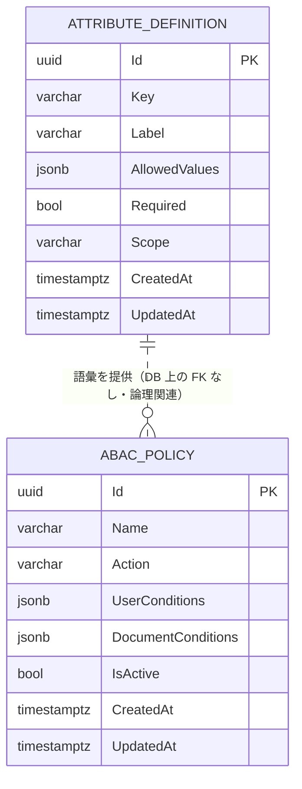

<!-- trace:
ids: [FR-05, FR-09]
adrs: [ADR-0004]
iadrs: []
specs: [01_requirements, 07_abac-attribute-model, ADR-0004_authz-abac]
issues: []
-->

# データ仕様書: ABAC 属性辞書・ポリシー（AttributeDefinition / AbacPolicy）

> AuthorizationService が所有する ABAC の属性辞書とポリシー（利用者属性 × 文書属性 → 許可アクション）を扱う。

## 起点となる計画書（トレーサビリティ）

- **関連機能要求(FR)**: FR-05（ABAC によるアクセス制御・検索フィルタ）、FR-09（ABAC 属性・ポリシーの管理）
- **技術検討(06_technical)・ADR**:
  - ADR-0004 認可＝ABAC（属性ベースアクセス制御）
  - 技術検討 `06_technical/07_abac-attribute-model.md`（属性モデル）
  - 関連: ADR-0002 DB per Service（AuthorizationService 専用 DB）
- **計画書リンク**: `01_requirements.md`（計画リポ）、`07_abac-attribute-model.md`（計画リポ）

## 概要

AttributeDefinition は管理者が定義する**属性辞書エントリ**で、属性キー・ラベル・取りうる値（AllowedValues）・必須有無・スコープ（`document` / `user`）を保持する。文書側の属性（`Document.Attributes`）と利用者側の属性の両方の語彙を定義する。

AbacPolicy は評価ルールで、アクション（`read` / `analyze` / `manage`）ごとに、**利用者属性条件（UserConditions）**と**文書属性条件（DocumentConditions）**を保持する。条件は「キー → 許容値リスト」の辞書で、評価エンジン（AbacEvaluator）がこれを突き合わせて許可判定を行う。文書の属性は `document-and-version.md` の `Document.Attributes`、検索フィルタは `data-source.md` の payload `attributes.<key>` と対応する。

## エンティティ定義

### AttributeDefinition（テーブル `AttributeDefinitions`）

| 属性 | 型 | 必須 | 制約（一意/既定値/範囲） | 説明 |
| --- | --- | --- | --- | --- |
| Id | Guid (uuid) | ○ | 主キー。既定 `Guid.NewGuid()` | 属性定義の識別子 |
| Key | string (varchar(100)) | ○ | 最大長 100。`(Key, Scope)` で一意。同一性・一意制約の基礎のため不変 | 属性キー（例: `confidentiality`, `department`） |
| Label | string (varchar(200)) | ○ | 最大長 200 | 表示ラベル |
| AllowedValues | List&lt;string&gt; (jsonb) | ○ | NULL 不可 | 取りうる値（例: `public`/`internal`/`confidential`/`restricted`） |
| Required | bool (boolean) | ○ | 既定 false | 必須属性か |
| Scope | string (varchar(50)) | ○ | 最大長 50。既定 `document`。値: `document` / `user`。不変 | 属性の適用対象 |
| CreatedAt | DateTimeOffset (timestamptz) | ○ | 既定 `now()`（DB 既定値）／`UtcNow` | 作成時刻（後続マイグレーションで追加） |
| UpdatedAt | DateTimeOffset (timestamptz) | ○ | 既定 `now()`。`Update()` で更新 | 更新時刻（後続マイグレーションで追加） |

### AbacPolicy（テーブル `Policies`）

| 属性 | 型 | 必須 | 制約（一意/既定値/範囲） | 説明 |
| --- | --- | --- | --- | --- |
| Id | Guid (uuid) | ○ | 主キー。既定 `Guid.NewGuid()` | ポリシー識別子 |
| Name | string (varchar(200)) | ○ | 最大長 200 | ポリシー名 |
| Action | string (varchar(50)) | ○ | 最大長 50。既定 `read`。値: `read` / `analyze` / `manage` | 許可対象アクション |
| UserConditions | Dictionary&lt;string,List&lt;string&gt;&gt; (jsonb) | ○ | NULL 不可（省略時は空辞書＝条件なし） | 利用者属性条件（例: `{"clearance":["confidential","restricted"]}`） |
| DocumentConditions | Dictionary&lt;string,List&lt;string&gt;&gt; (jsonb) | ○ | NULL 不可（省略時は空辞書＝条件なし） | 文書属性条件（例: `{"confidentiality":["public","internal"]}`） |
| IsActive | bool (boolean) | ○ | 既定 true。`SetActive()` で切替 | 有効／無効（削除せず一時停止） |
| CreatedAt | DateTimeOffset (timestamptz) | ○ | 既定 `UtcNow` | 作成時刻 |
| UpdatedAt | DateTimeOffset (timestamptz) | ○ | 既定 `now()`。`Update()` / `SetActive()` で更新 | 更新時刻（後続マイグレーションで追加） |

## ER 図

> AttributeDefinition と AbacPolicy の間に DB 外部キーはない。ポリシー条件のキー／値は属性辞書の語彙（Key・AllowedValues）に整合させる運用上の関連。

## キー・インデックス・関連

| 種別 | 対象 | 定義 |
| --- | --- | --- |
| 主キー | `AttributeDefinitions.Id` | `HasKey(a => a.Id)` |
| 主キー | `Policies.Id` | `HasKey(p => p.Id)` |
| 一意インデックス | `AttributeDefinitions (Key, Scope)` | `IX_AttributeDefinitions_Key_Scope` — 同一スコープ内でキー一意 |
| 外部キー | なし | 2 エンティティ間に FK 関連なし（論理的整合のみ） |

## 整合性・制約ルール

- **属性キーの一意性**: `(Key, Scope)` 一意制約により、同一スコープ内での属性キー重複を DB で防止。`Key` / `Scope` はエンティティ上も不変。
- **条件の NULL を保存しない**: `UserConditions` / `DocumentConditions` は `Create` / `Update` で `?? []` により空辞書化。評価エンジンが null を foreach して落ちるのを防ぐ（「条件なし」＝空辞書＝無制約）。
- **有効／無効の分離**: ポリシーは物理削除せず `IsActive` で一時停止できる。
- **アクション・スコープの妥当性**: `PolicyAction.IsValid` / `AttributeScope.IsValid` で列挙値を検証（`read`/`analyze`/`manage`、`document`/`user`）。
- **文書属性との整合**: `DocumentConditions` のキーは `Document.Attributes` のキー、検索時は Qdrant payload `attributes.<key>` と突き合わせる（越境整合、FR-05）。

## 永続化方針

- **DB**: PostgreSQL、EF Core（`AuthorizationDbContext`）。ADR-0002 に従い AuthorizationService 専用 DB。
- **JSON カラム**: `AllowedValues`（List）、`UserConditions` / `DocumentConditions`（Dictionary&lt;string,List&lt;string&gt;&gt;）は `ValueConverter` で JSON 文字列化し `jsonb` 格納。`ValueComparer`（listComparer / dictListComparer）を設定。
- **時刻の DB 既定**: `AddAbacManagementFields` マイグレーションで追加した `CreatedAt`/`UpdatedAt` は `defaultValueSql: "now()"`。

## マイグレーション・初期データ

- `20260626150853_InitialCreate` — `AttributeDefinitions` / `Policies` テーブル作成。
- `20260702133000_AddAbacManagementFields` — `Policies.UpdatedAt`、`AttributeDefinitions.CreatedAt`/`UpdatedAt`（既定 `now()`）を追加し、`IX_AttributeDefinitions_Key_Scope` 一意インデックスを作成。
- 初期データ（シード）はマイグレーションでは定義していない。

## 関連仕様

- 機能仕様書: `../functional/FR-05_abac-access-control.md`、`../functional/FR-09_abac-attribute-policy-management.md`
- 権限・認可仕様書: `../authz/`（存在する場合）
- 通信仕様書: `../api/openapi.yaml`
- 技術要件書: `../tech/tech-requirements.md`
- 関連データ仕様: `./document-and-version.md`（文書属性の源泉）、`./data-source.md`（検索フィルタ用属性 payload）

## 未決事項

- ポリシー条件のキー／値が属性辞書（AllowedValues）に存在することのバリデーション実施箇所・タイミングは未確定。
- ポリシー評価の優先順位・競合（複数ポリシー該当時の allow/deny 合成規則）の DB 表現は未定。
- 利用者属性の保存主体（本サービスか外部 IdP か）は本データ仕様の対象外。
