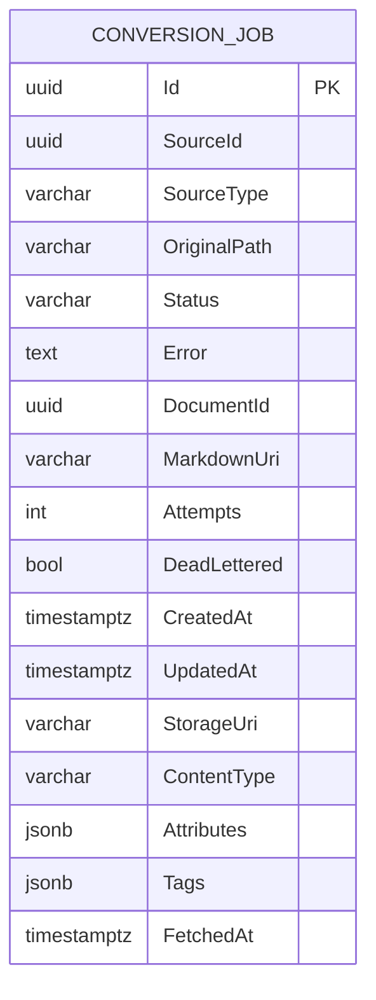

<!-- trace:
ids: [FR-12, SC-07, UC-06]
adrs: [ADR-0002]
iadrs: [IADR-0042, IADR-0043, IADR-0137, IADR-0154]
specs: [01_requirements, 01_screens, 01_usecases]
issues: []
-->

# データ仕様書: 変換ジョブ（ConversionJob）

> ConversionService が変換ライフサイクル（受信・成功・失敗・再変換）を記録する読み取りモデル。
> SC-07（変換状況・失敗一覧・人手補正）と UC-06 の状況照会・再変換に用いる。

## 起点となる計画書（トレーサビリティ）

- **関連機能要求(FR)**: FR-12（文書正規化＝pandoc 本文変換・図のコード化・オブジェクトストレージ保管）
- **関連ユースケース(UC)**: UC-06（変換・正規化の状況確認・人手補正）
- **関連画面(SC)**: SC-07（変換ジョブ画面）
- **ADR / 実装ADR**:
  - [[IADR-0042]] 変換ジョブ読み取りモデル（MVP インメモリ）
  - [[IADR-0043]] 変換ジョブ読み取りモデルの永続化（Postgres+EF）＋非同期ストア（本仕様書の対象）
  - [[IADR-0137]] デッドレター標識と試行上限（2026-08-06 / #533。`DeadLettered` 列の追加）
  - ADR-0002 DB per Service（ConversionService 専用 DB `conversion_svc`）
  - ADR-0003 メッセージング（`RawDocumentFetched` 受信・再変換再発行・**再試行→デッドレター**。Superseded by ADR-0027・注記は #580）

## 概要

ConversionService はイベント駆動の fire-and-forget ワーカーで、`RawDocumentFetched` を受信して正規化変換
（本文 Markdown 化・図のコード化・オブジェクトストレージ保管）を行い `DocumentNormalized` を発行する。
変換状況を照会する手段が無かったため（[[IADR-0042]]）、変換コンシューマ（`RawDocumentFetchedConsumer`）が
受信・成功・失敗の各ライフサイクルを **ConversionJob** に記録する。

[[IADR-0043]] により、当初のインメモリ MVP を **Postgres + EF Core** へ永続化した。id は `RawDocumentFetched.FetchId`
を主キーとし、再変換（人手補正）のため原本イベントを再構成できる列を保持する。

## エンティティ定義

### ConversionJob（テーブル `ConversionJobs`、ConversionService）

| 属性 | 型 | 必須 | 制約（一意/既定値/範囲） | 説明 |
| --- | --- | --- | --- | --- |
| Id | Guid (uuid) | ○ | 主キー。`RawDocumentFetched.FetchId` と同値 | 変換ジョブ＝原本取得の一意識別子 |
| SourceId | Guid (uuid) | ○ | | 由来データソース ID |
| SourceType | string (varchar(50)) | ○ | 最大長 50。値例: `filesystem` / `wiki` / `saas` / `db` | ソース種別 |
| OriginalPath | string (varchar(2048)) | ○ | 最大長 2048 | 原本のパス/識別 |
| Status | string (varchar(20)) | ○ | 最大長 20。既定 `queued`。値: `queued` / `processing` / `succeeded` / `failed` | 変換状態 |
| Error | string? (text) | - | NULL 可。失敗時のみ。1 行・最大 300 文字に要約済み | 失敗理由（UI 露出のため要約） |
| DocumentId | Guid? (uuid) | - | NULL 可。成功時に設定 | 生成された文書 ID（冪等） |
| MarkdownUri | string? (varchar(2048)) | - | NULL 可。成功時に設定 | 正規化本文（Markdown）の URI |
| Attempts | int | ○ | 既定 0。受信・再試行の都度 +1。**手動再変換でリセットしない**（累積） | 変換試行回数 |
| DeadLettered | bool | ○ | 既定 `false`（列の DEFAULT も false）。`Status = failed` のときのみ true になり得る | **デッドレター標識**（自動再試行を使い切って `<queue>_error` へ送られたか。SC-07・[[IADR-0137]]） |
| CreatedAt | DateTimeOffset (timestamptz) | ○ | 既定 `UtcNow` | 初回受信時刻 |
| UpdatedAt | DateTimeOffset (timestamptz) | ○ | 既定 `UtcNow`。状態遷移の都度更新 | 最終更新時刻 |
| StorageUri | string (varchar(2048)) | ○ | 再変換のため保持（`RawDocumentFetched.StorageUri`） | 原本の保管 URI |
| ContentType | string (varchar(255)) | ○ | 再変換のため保持 | 原本の MIME |
| Attributes | Dictionary&lt;string,string&gt; (jsonb) | ○ | 既定 空辞書。NULL 不可 | 原本 ABAC 属性（再変換時に再発行） |
| Tags | List&lt;string&gt; (jsonb) | ○ | 既定 空配列。NULL 不可 | 原本タグ（再変換時に再発行） |
| FetchedAt | DateTimeOffset (timestamptz) | ○ | 再変換のため保持 | 原本取得時刻 |

> `ConversionJobDto`（BFF↔SPA 契約）には Id / SourceId / SourceType / OriginalPath / Status / Error /
> DocumentId / MarkdownUri / Attempts / CreatedAt / UpdatedAt / **DeadLettered** を射影し、加えて
> **MaxAttempts**（自動再試行の試行上限。エンティティの列ではなく設定値）を載せる。原本イベント再構成用の
> StorageUri / ContentType / Attributes / Tags / FetchedAt は DTO に含めない（再変換にのみ用いる内部列）。

## ER 図

> ConversionJob は他サービスの DB エンティティと FK を持たない（ADR-0002 DB per Service）。
> `DocumentId` は成功時に文書サービスの文書 ID を論理参照するのみ（DB 越境・FK なし）。

## キー・インデックス・関連

| 種別 | 対象 | 定義 |
| --- | --- | --- |
| 主キー | `ConversionJobs.Id` | `HasKey(j => j.Id)`。値は `RawDocumentFetched.FetchId`（イベント冪等キー） |
| インデックス | （追加インデックスなし） | InitialCreate は主キーのみ。`Status` 絞り込みは件数小のため未インデックス |

## ConversionJobFigures（子テーブル。[[IADR-0154]] 決定 1・#543）

**人手補正 Phase 1（図のコード化のやり直し）の対象**を記録する。
**従前は記録が無かった** —— `NormalizationService` は図ごとの結果を返していたが、
`RawDocumentFetchedConsumer` が `SucceedAsync` へ渡さず**ログ行へ出して捨てて**おり、
「どの図が画像保持へ縮退したか」を後から引く手段が無かった。

| 列 | 型 | 制約 | 意味 |
| --- | --- | --- | --- |
| `Id` | uuid | PK・`ValueGeneratedNever` | エンティティ側で採番する（`ConversionJob.Id` と同じ扱い） |
| `JobId` | uuid | FK → `ConversionJobs.Id`・**Cascade** | 親ジョブ。ジョブが消えれば図も消える |
| `FigureId` | varchar(255) | NOT NULL・`(JobId, FigureId)` で **UNIQUE** | 原本から抽出したときの図 ID。**本文の埋め込み位置を突き止める鍵**でもあるため重複を許さない |
| `Coded` | boolean | NOT NULL | LLM がコード化できたか。**`false` が補正の対象** |
| `Language` | varchar(50) | NULL 可 | `plantuml` / `mermaid` |
| `Code` | text | NULL 可 | コード片（自動コード化または人手補正の結果） |
| `ImageUri` | varchar(2048) | NULL 可 | 縮退した図の画像参照。コード化済みの図は NULL |
| `ImageContentType` | varchar(255) | NULL 可 | |
| `Caption` | varchar(2048) | NULL 可 | キャプション・近傍テキスト（補正の手がかり） |
| `Corrected` | boolean | NOT NULL・**既定 `false`** | **人手補正で `Code` が入ったか**（自動コード化と区別する）。既存行は「未補正」として読む |
| `CorrectedAt` | timestamptz | NULL 可 | |

- **マイグレーション**: `AddConversionJobFigures`（2026-08-10）。
- **洗い替え**: 変換が成功するたびに当該ジョブの行を全削除して入れ直す
  （再変換は図を作り直すため、前回の図を残すと「どの図が今の本文に居るか」が割れる）。
- **`ConversionJobDto` への射影**: `DiagramsCoded` = `Coded` が真の件数／`DiagramsRetained` = 偽の件数／
  `HasCorrection` = `Corrected` が 1 件以上。**一覧の各行に載せる**のは、画面が全ジョブ分の図を
  引かずに状態表示を作れるようにするためである（[[IADR-0127]]）。

## 整合性・制約ルール

- **状態遷移**: `queued` →（受信）→ `processing` →（成功）→ `succeeded` ／（失敗）→ `failed`。
  失敗ジョブは人手補正（再変換）で `queued` に戻せる（[[IADR-0042]]）。
- **再変換は失敗ジョブ限定**: `PrepareRetryAsync` は `failed` 以外（`processing`/`succeeded`/`queued`）を
  再変換不可（null 返却＝API 409）とし、処理中の二重発行・成功済みの不要な再処理を防ぐ。

  > **［2026-08-10 追記 / #543・[[IADR-0154]] 決定 5］本項は「再変換」の説明である。**
  > 従前ここは「**人手補正**は失敗ジョブ限定」と書いていたが、**人手補正 Phase 1（図のコード化の
  > やり直し）の対象は `succeeded` のジョブ**である。UC-06 は「図コード化（LLM）の失敗は画像保持へ
  > 縮退し、**後日の人手補正・再登録でコード化する**」と定めており、**縮退は例外ではなく正常な収束**
  > だからである（実装も縮退を例外にせず本文を完成させて成功として記録する）。
  > **同じ語で 2 つの操作を指さない。**

- **再変換は補正を破棄する前に確認を求める**（[[IADR-0154]] 決定 4）: 補正のある行の `PrepareRetryAsync` は
  `discardCorrections` が真でない限り null を返す（＝API 409 `corrections_would_be_lost`）。
  確認つきなら `DiscardCorrection()` で補正を落としてから `queued` へ戻す
  ——**再変換は図を作り直すため、残すと古い補正が復活して見える。**
- **失敗理由の要約**: `Error` はコンシューマ側で 1 行・最大 300 文字に丸めた文言のみを保存する
  （内部詳細・スタック様文言の UI 露出抑制）。
- **デッドレター標識の生存期間**（[[IADR-0137]]）: `DeadLettered` は「この失敗で自動再試行を使い切った」
  ことをコンシューマから受け取って立てる。**`MarkProcessing`（再受信）と `TryRequeue`（手動再変換）で
  false へ戻す**——`processing` / `queued` なのに標識が立った行は自己矛盾するためである。
  **`Attempts` からは導出しない**（`Attempts` は手動再変換をまたいで累積するため上限との比較が成立しない）。
- **属性・タグの NULL 非許容**: `Attributes` / `Tags` はカラム上 NOT NULL。未設定時は空 JSON（`{}` / `[]`）。
- **並行性（既知の制約）**: `StartAsync` の attempts++ は read-modify-write で楽観的並行制御を持たない。
  単一インスタンス（dev）前提。水平スケール時は行ロックまたは並行トークンを要する（[[IADR-0043]] follow-up）。

## 永続化方針

- PostgreSQL、EF Core（`ConversionJobDbContext`）。ADR-0002 に従い ConversionService 専用 DB `conversion_svc`。
- `Attributes` / `Tags` は `ValueConverter` で `jsonb` に格納（`ValueComparer` 設定済み。DataSourceService 準拠）。
- 起動時に `MigrateAsync` でスキーマを最新化。`AddNpgSql` ヘルスチェック（tag `ready`）で DB 到達性を監視。

## マイグレーション・初期データ

- `InitialCreate` — `ConversionJobs` テーブル作成（主キーのみ）。シードなし。
- `AddDeadLetteredMarker`（2026-08-06 / #533）— `DeadLettered`（boolean NOT NULL DEFAULT false）を追加。
  **既存行は「デッドレターへ送っていない」として読む**（過去の失敗が本当に上限到達だったかは記録が無く、
  遡って復元できないため。既定値で偽陽性を出さない側に倒す）。

## 関連仕様

- 実装ADR: `../../.ai-context/adr/IADR-0042_conversion-job-read-model.md`、`../../.ai-context/adr/IADR-0043_conversion-job-persistence.md`、
  `../../.ai-context/adr/IADR-0137_conversion-dead-letter-marker.md`
- 画面仕様書: `../screens/SC-07_conversion-jobs.md`
- テスト仕様書: `../tests/SC-07_conversion-jobs.md`
- 通信仕様書: `../api/openapi.yaml`

## 未決事項

- デッドレター（`<queue>_error`）との突合による失敗ジョブ網羅性（本 PR 対象外）。
  **#533 が加えた `DeadLettered` は「送られたはず」を読み取りモデル側で記録するものであり、
  キューの実体との突合ではない**（コンシューマの記録が落ちれば標識も落ちる）。
- ジョブ履歴の保持期間・アーカイブ（監査・長期保全）。
- `Status` 絞り込みのインデックス要否（件数増加時）。
