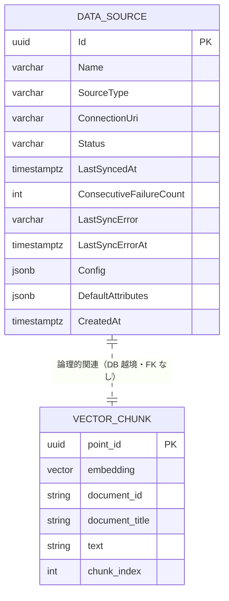

<!-- trace:
ids: [FR-01, FR-02, FR-05, SC-06, SC-17, UC-04]
adrs: [ADR-0002, ADR-0003, ADR-0009, ADR-0013, ADR-0027, ADR-0036, ADR-0064, ADR-0074]
iadrs: [IADR-0019, IADR-0136, IADR-0148, IADR-0199, IADR-0295, IADR-0364]
specs: [20260903_issue-1194_sc06-owner-mapping-table]
issues: [#458, #516, #537, #538, #580, #752, #754, #767, #796, #1194, planning#344, planning#361, planning#372, planning#518]
-->

# データ仕様書: データソース・取り込みチャンク（DataSource / Vector Chunk）

> データソースのカタログ（DataSourceService）と、取り込み時に生成するベクトルチャンク（IngestionService → Qdrant）を扱う。

## 起点となる計画書（トレーサビリティ）

- **関連機能要求**: データソースの登録・接続・同期カタログ化、および取り込み（チャンク分割・埋め込み・ベクトルストア upsert）
- **技術検討(06_technical)・ADR**:
  - メッセージング（MassTransit + RabbitMQ。同期／正規化イベントの非同期連携。後継の Wolverine 採用により Superseded・注記は #580）
  - 関連: DB per Service（DataSourceService 専用 DB）、ベクトルストア Qdrant、埋め込みモデル
- **計画書リンク**: `01_requirements.md`（計画リポ）、`09_datasource-connectors.md`（計画リポ）

## 概要

DataSource は登録済みデータソースのカタログエントリで、名前・種別・接続 URI・状態・最終同期時刻・接続設定（Config）を保持する。DataSourceService が専用 DB（PostgreSQL）で永続化する。

IngestionService はリレーショナル DB を持たない Worker で、`DocumentUpdated` 相当のイベント受信時に本文を取得・チャンク分割・埋め込みし、結果を **Qdrant のコレクション**（既定 `knowledge_chunks`）へ upsert する。
チャンクはリレーショナルエンティティではなくベクトルポイント（＋ payload）として保持される。

## エンティティ定義

### DataSource（テーブル `DataSources`、DataSourceService）

| 属性 | 型 | 必須 | 制約（一意/既定値/範囲） | 説明 |
| --- | --- | --- | --- | --- |
| Id | Guid (uuid) | ○ | 主キー。既定 `Guid.NewGuid()` | データソースの一意識別子 |
| Name | string (varchar(200)) | ○ | 最大長 200 | 表示名 |
| SourceType | string (varchar(50)) | ○ | 最大長 50。値例: `filesystem` / `wiki` / `saas` / `db` | ソース種別 |
| ConnectionUri | string (varchar(2048)) | ○ | 最大長 2048。**資格情報を含む値は書き込み時に 400 で拒否**（`ConnectionUriPolicy`） | 接続先 URI。**応答では資格情報つき URI・接続文字列の秘密を伏せる**（既存行の保護） |
| Status | string (varchar(50)) | ○ | 最大長 50。既定 `active`。値: `active` / `disabled` | 稼働状態 |
| LastSyncedAt | DateTimeOffset? (timestamptz) | - | NULL 可（未同期）。`RecordSync()` で更新 | 最終同期時刻 |
| ConsecutiveFailureCount | int | ○ | 既定 `0`。`RecordSyncFailure()` で増え、完全成功の `ClearSyncFailures()` で `0` へ戻る | 連続同期失敗回数（データソース管理画面 / 裁定 Q14 / #537。健全性はエンティティへ永続化する実装判断） |
| LastSyncError | string? (varchar(500)) | - | NULL 可。**保存時点でマスク済み**（`SyncErrorRedactor`。接続文字列・資格情報つき URI・HTTP 認証スキームを伏せ、500 字で丸める） | 直近の同期エラー |
| LastSyncErrorAt | DateTimeOffset? (timestamptz) | - | NULL 可 | 直近の同期エラーの発生時刻 |
| Config | Dictionary&lt;string,string&gt; (jsonb) | ○ | 既定 空辞書。NULL 不可 | 接続・同期設定（コネクタ固有）。**秘密とみなすキーの値は応答で伏せる**（集合の単一情報源は `SecretMask.KeyMarkers`）。**保存は平文である** |
| DefaultAttributes | Dictionary&lt;string,string&gt; (jsonb) | ○ | 既定 空辞書。NULL 不可。**必須属性のフェイルセーフを必ず通す**（下表。`Create` / `Update` / `Patch` / `GetEffectiveAttributes` の 4 経路で同一。データソースが原本へ既定 ABAC 属性を付与する方針と、その必須属性フェイルセーフの拡張による） | このデータソース由来の原本へ既定で付与する ABAC 文書属性 |
| OwnerMappings | Dictionary&lt;string,string&gt; (jsonb) | ○ | 既定 空辞書（`{}`）。NULL 不可。**キーは前後空白を落とす。空キー・空値の対は 400 で拒否する**（黙って捨てない） | **所有者の写像表**（ソース側の利用者識別子 → 基盤の利用者識別子）。取り込み経路の解決順②に当たる。**`DefaultAttributes` とは別の列である**（下の注記） |
| CreatedAt | DateTimeOffset (timestamptz) | ○ | 既定 `UtcNow` | 登録時刻 |

#### `DefaultAttributes` の必須属性フェイルセーフ（ABAC アクセス制御／データソース登録・同期／#516）

計画が**必須**と定める文書属性 4 種を欠落させない。**明示指定は上書きしない**（空白のみは未設定と同じ扱い）。
補完は **`Create` / `Update` / `Patch` / `GetEffectiveAttributes` の 4 経路で同一**である
（1 箇所でも漏れると「登録時は付くが更新すると消える」という気づきにくい壊れ方になる）。

| 属性 | 計画が定めた解決順 | 実装での段 | 終端 |
| --- | --- | --- | --- |
| `confidentiality` | 明示指定 | 明示指定 | `internal`（既定 ABAC 属性の付与規則による） |
| `department` | 投入元（ソース）の所属 → データソース既定属性 | **本欄の値のみ**（前段は**未実装**） | **`unassigned`** |
| `owner` | ソース側の更新者 → 予約値 | 本欄の値 ＋ **写像表で解決したアイテム単位の更新者**（解決器は在るが**更新者を載せるコネクタがまだ無い**） | **`system`** |
| `lifecycle` | データソース既定属性 → 終端値 | 本欄の値（**1 段目が無い**） | **`active`**（**既定値。予約値ではない**） |

> **前段が効かない理由は 2 属性で異なる。混同しないこと。**
>
> - **`owner`**: ［2026-08-21 更新］コネクタ契約は**更新者を運べるようになった**（`SourceItem.UpdatedBy`）。
>   **ただし 4 実装のうち値を載せているものは 1 つも無い。** 3 本は構造上取れず（ファイルサーバーは
>   Linux で所有者を取る自明な手段が無く、かつ「ファイル所有者」は「最終更新者」ではない。
>   Wiki / SaaS は REST 契約に更新者フィールドが無い）、残る 1 本は**別の名前空間の識別子を
>   利用者識別子として扱ってよいかが未裁定**である。**したがって実運用では引き続き予約値へ倒れる。**
>   🔴 **倒れる理由が変わった点に注意する** —— 「器が無い」のではなく「**載せるコネクタが無い**」。
>   この 2 つは対処が違う（前者は契約変更、後者はコネクタ実装と裁定）。追跡は **#752**。
>   **［2026-09-03］「別の名前空間の識別子を扱ってよいかが未裁定」は誤りになった。** 裁定は下りており
>   （解決順 ① 身元プロバイダの検索 → ② データソース単位の写像表 → 予約値）、**②の器と解決器は本表の
>   `OwnerMappings` 列として実装された。** 取り込み経路は**写像表を引いた結果だけ**を `owner` にし、
>   **当たらなければ予約値へ倒す** —— 生のソース側識別子が `owner` へ入る経路はもう無い。
>   🔴 **それでも予約値は 1 件も減らない。** ファイルサーバーは構造上更新者を運べず、計画はこれを
>   **意図的な縮退**と裁定した。**②が効くのは業務DB コネクタと、Wiki / SaaS の契約が拡張されたときである。**
>   **件数を完了判定に使わない**（使うと、構造上減らないものを待って永久に閉じられない）。
> - **`department`**: **供給源は存在するが写像が未実装である。** `SourceItem.Path` はフォルダを運んでおり、
>   計画は「ソースのメタ（所在・**部門**・**フォルダ**・更新者等）を ABAC 基本属性へマッピングする」
>   （`09_datasource-connectors.md` L51）・ファイルサーバーは「**フォルダ単位の既定属性を継承**」（同 L34）と
>   定めている。欠けているのは**フォルダ → 部門コードの写像規則**であり、
>   加えて **データソース管理画面の登録フォームに `department` の入力欄が無い**。追跡は **#754**。
>   **［2026-08-15 追記 / #767］入力欄は足した。** データソース管理画面の登録フォームから
>   `defaultAttributes.department` を送れるようになった（**非空のときだけ送る**。未入力なら
>   キーごと送らないため、この欄の値は「管理者が明示的に指定した」ことだけを意味する）。
>   **残るのは①フォルダ → 部門コードの写像規則**（計画側の裁定待ち。**実装側で
>   推定規則を決めない**）**と②更新経路**（データソース管理画面に編集フォームが無く、登録時にしか指定できない）
>   **の 2 つであり、#754 はこれらを引き受けたまま open である。**
>   ［2026-08-28 追記 / #1021］②更新経路は解消した —— データソース管理画面に既定属性の
>   編集フォーム（PATCH・全置換の土台維持・予約値は送らない）が実装された。残るのは
>   ①フォルダ → 部門コードの写像規則（計画側の値域裁定待ち）のみである。
>   **したがって上表「実装での段」は変わらない** —— 前段（ソースからの解決）は依然として未実装で、
>   本欄の値だけが効く。**変わったのは「本欄に値を入れる経路が画面にもある」ことである。**
>   理由書きの正は、必須属性フェイルセーフを広げた実装 ADR の §`department` —— 供給源がある の追記であり、ここへ複写しない。
>
> **したがって `department` は「実装が見落としている」で正しい。** `owner` と同じ扱いにしない。

> **`system` / `unassigned` は「既定」ではなく「解決できなかったことの記録」である**（計画側で確定）。
> **どちらも実運用では予約値へ倒れる。ただし［2026-08-15 / #767］以降、2 属性で度合いが違う。**
>
> | 属性 | 倒れる度合い | 逃れる手段 |
> | --- | --- | --- |
> | `owner` | **事実上 100%** | API・**データソース管理画面の写像表**から明示指定できる。ただし写像表が効くのは**ソース側が更新者を運ぶとき**であり、**載せるコネクタがまだ無い**（#752） |
> | `department` | **管理者がデータソース管理画面で値を入れなければ倒れる** | **画面（同登録フォーム）または API から明示指定する**（#767 で画面の経路が開いた） |
>
> **`department` は「もう倒れない」のではない。** 開いたのは供給源 3 つのうち**登録フォームの 1 つだけ**で、
> フォルダ写像（計画側の裁定待ち）とソース側権限情報の取り込みは入っていない。
> **入力しなければ従来どおり `unassigned` へ倒れる**（既存の登録済みソースも遡って値を得ることはない）。
> 恒久的に積み上がるなら**コネクタが更新者・部門を運んでいないという報告**であり、正常な状態ではない。
> 件数は `scripts/measure-abac-combinations.js` が**環流債務の測定値**として出力する。
>
> **どちらも「常に」ではない。** `DefaultAttributes` に明示指定があればそれが保持される。
> 予約値へ倒れるのは**明示指定が無いとき**である。

> **`lifecycle` の終端 `active` は「予約値」ではなく「既定値」である**（計画側の裁定・2026-08-15 追補）。
> `system` / `unassigned` が「解決できなかったことの記録」であるのに対し、**`active` はそう決めた値**であり、
> **件数を環流債務として数えない。**
> **`active` にしても無制限に公開にはならない** —— `read` は属性の連言で、`confidentiality` と
> `department`（未解決は deny 側の `unassigned`）が同時にかかる。
> **ソース単位で下書き扱いにしたい場合は既定属性で `draft` を指定する**（終端は指定が無いときだけ効く）。
> **［2026-08-16 / #796］この指定はデータソース管理画面の登録フォームからも行える**（従前は API を直接叩くほかなかった）。
> **未指定ならキーごと送らない** —— `department` の予約値と違い**終端が正規の値**なので、
> 値では「指定しなかった」と「`active` を選んだ」を見分けられず、**キーの有無だけが区別を持つ**。
> 理由書きの正は、必須属性フェイルセーフを広げた実装 ADR の決定 4 であり、ここへ複写しない。

> **`NextSyncAt`（応答 `DataSourceDto.nextSyncAt`）は列ではない**（データソース管理画面 / #538。ワーカーの位相から導出する実装判断）。
> 定期同期は全ソース共通の間隔で回るため、次回実行時刻は**ワーカーの位相から導出できる値**であり、
> 状態として持たない（永続化するとプロセス再起動のたびに実体とずれる）。全ソース同値で、
> 定期同期が無効なときは `null` を返す。したがって本テーブルにマイグレーションは生じない。

### ベクトルチャンク（Qdrant コレクション `knowledge_chunks`、IngestionService）

リレーショナルではなく Qdrant のポイント。ポイント ID とベクトル、および payload フィールドで構成される（`QdrantIngestionVectorStore`）。

| フィールド | 型 | 説明 |
| --- | --- | --- |
| point id | Uuid | チャンク ID。`ChunkId.Derive(documentId, chunkIndex)`（MD5 由来の決定的 Guid）で冪等に導出 |
| vector | float[]（既定 1536 次元、距離 Cosine） | 埋め込みベクトル。次元は `Qdrant:VectorSize`（既定 1536） |
| payload `document_id` | string | 元文書 ID |
| payload `document_title` | string | 文書タイトル |
| payload `text` | string | チャンク本文 |
| payload `markdown_uri` | string | 本文 Markdown の URI（未設定時は空文字） |
| payload `chunk_index` | integer | 文書内のチャンク並び順 |
| payload `tags` | list&lt;string&gt; | タグ（存在時のみ。絞り込み・表示用） |
| payload `attributes.<key>` | string | ABAC 属性（キーごとに `attributes.` 接頭辞で展開。検索時のアクセス制御フィルタ用） |

## ER 図

> DataSource（DataSourceService の PostgreSQL）とベクトルチャンク（Qdrant）は物理的に別ストアであり、DB 上の外部キー関連は存在しない。文書 → チャンクの対応は payload `document_id` で表現する。

## キー・インデックス・関連

| 種別 | 対象 | 定義 |
| --- | --- | --- |
| 主キー | `DataSources.Id` | `HasKey(d => d.Id)` |
| インデックス | （追加インデックスなし） | InitialCreate は主キーのみ。`Name` 等の一意制約は未設定 |
| Qdrant ポイント ID | `knowledge_chunks` point id | `ChunkId.Derive(documentId, chunkIndex)` により決定的。再取り込み時は同一 ID で upsert（冪等） |
| Qdrant 論理キー | payload `document_id` | 文書単位の削除（`DeleteByDocumentAsync`）のフィルタキー |

## 整合性・制約ルール

- **冪等な再取り込み**: チャンク ID を `documentId + chunkIndex` から決定的に導出。旧チャンク削除に失敗しても upsert が上書きとなり重複を防ぐ。
- **コレクション名の解決**: `Qdrant:CollectionName` を正とし、後方互換で `Qdrant:Collection`、既定 `knowledge_chunks` の順（RetrievalService と整合）。
- **コレクション自動作成**: `EnsureCollectionAsync` で未作成なら `VectorParams { Size, Distance = Cosine }` で作成。
- **状態遷移**: DataSource は `active` →（`Disable()`）→ `disabled`。`RecordSync()` で `LastSyncedAt` を更新。
  **同期健全性は状態と直交する**——`Status` は設定状態（`active` / `disabled`）だけを表し、
  健全性は `ConsecutiveFailureCount` が表す。**再試行上限（＝継続失敗のしきい値）は列ではない**
  ——`DataSourceSyncHealth.DefaultRetryLimit` の定数であり、応答（`DataSourceDto.retryLimit`）にだけ載る
  （画面が「3/5」の分母を契約から得るため。同健全性の実装判断による）。
  **更新（`Update()` / `Patch()`。#534）は健全性・`LastSyncedAt`・`CreatedAt` を変えない**
  ——更新で履歴を巻き戻さないためである。
- **設定の NULL 非許容**: `Config` はカラム上 NOT NULL。未設定時は空 JSON（`{}`）。

## 永続化方針

- **DataSource**: PostgreSQL、EF Core（`DataSourceDbContext`）。DB per Service の方針に従い DataSourceService 専用 DB。`Config` は `ValueConverter` で `jsonb` に格納（`ValueComparer` 設定済み）。
- **ベクトルチャンク**: Qdrant。IngestionService は RDB を持たず、埋め込み結果を Qdrant コレクションへ直接 upsert。
- **越境**: 両者は別ストアのため、整合はイベント（メッセージング基盤。後継の Wolverine 採用により Superseded・注記は #580）と決定的 ID で担保する。

## マイグレーション・初期データ

- DataSourceService: `20260626150848_InitialCreate` — `DataSources` テーブル作成（主キーのみ）。シードなし。
- IngestionService: マイグレーションなし（RDB 非使用）。Qdrant コレクションは実行時に `EnsureCollectionAsync` で確保。

## 関連仕様

- 機能仕様書: `../functional/FR-01_data-source-catalog.md`、`../functional/FR-02_ingestion.md`
- 通信仕様書: `../api/openapi.yaml`
- 技術要件書: `../tech/tech-requirements.md`
- 関連データ仕様: `./document-and-version.md`（正規化文書・属性／タグの源泉）、`./abac-policy.md`（payload の属性フィルタ）

## 未決事項

- `DataSources.Name` / `ConnectionUri` の一意制約は未設定（重複登録の可否は要検討）。
- DataSource と実際に取り込まれたチャンク／文書の突合（どのソース由来かの追跡属性）は payload に未保持。
- Qdrant コレクションのシャーディング・レプリカ・保持方針は未定。
