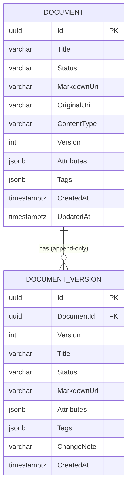

# データ仕様書: 文書・版履歴（Document / DocumentVersion）

> エンティティ（集約）単位のデータ仕様。DocumentService が所有する正規化文書と、その append-only な版履歴を扱う。

## 起点となる計画書（トレーサビリティ）

- **関連機能要求(FR)**: FR-06（正規化文書の CRUD・版管理・メタデータ／ABAC 属性付与）、FR-12（文書正規化。変換パイプラインが採番した DocumentId でカタログ文書を生成）
- **技術検討(06_technical)・ADR**:
  - ADR-0002 サービス境界／DB per Service（DocumentService 専用 DB・専用 `DocumentDbContext`）
  - ADR-0014 オブジェクトストレージ（本文 Markdown・原本は URI 参照で保持し、本文実体は DB に置かない）
  - 関連: IADR-0001（変換側採番の DocumentId をパイプライン全体で一貫させる）
- **計画書リンク**: `../../planning/projects/microservices-platform/02_requirements/01_requirements.md`

## 概要

Document はカタログ化された正規化文書の集約ルートである。タイトル・状態・本文（Markdown）URI・原本 URI・コンテンツ種別に加え、ABAC 判定に用いる**属性（Attributes）**とタグ（Tags）を保持する。本文実体は保持せず、`MarkdownUri` / `OriginalUri` によりオブジェクトストレージ（ADR-0014）を参照する。

DocumentVersion は Document 集約配下の**確定版スナップショット**で、作成・各更新のたびに現在状態を追記する append-only コレクションである（`Snapshot()`）。任意時点のタイトル・状態・本文 URI・メタデータを「DocumentId ＋版番号」で再構成できる。

## エンティティ定義

### Document（テーブル `Documents`）

| 属性 | 型 | 必須 | 制約（一意/既定値/範囲） | 説明 |
| --- | --- | --- | --- | --- |
| Id | Guid (uuid) | ○ | 主キー。既定 `Guid.NewGuid()`。正規化経由（`CreateNormalized`）では変換側採番の ID を指定 | 文書の一意識別子 |
| Title | string (varchar(500)) | ○ | 最大長 500 | 文書タイトル |
| Status | string (varchar(50)) | ○ | 最大長 50。既定 `draft`。値: `draft` / `normalized` / `published` | 文書状態 |
| MarkdownUri | string? (varchar(2048)) | - | 最大長 2048 | 正規化 Markdown 本文の URI（オブジェクトストレージ） |
| OriginalUri | string? (varchar(2048)) | - | 最大長 2048 | 原本ファイルの URI |
| ContentType | string? (varchar(200)) | - | 最大長 200 | 原本の MIME/コンテンツ種別 |
| Version | int (integer) | ○ | 既定 1。更新（`Touch()`）ごとに +1 | 現在の版番号 |
| Attributes | Dictionary&lt;string,string&gt; (jsonb) | ○ | 既定 空辞書。NULL 不可（空 JSON を保存） | ABAC 属性（例: `confidentiality`, `department`） |
| Tags | List&lt;string&gt; (jsonb) | ○ | 既定 空リスト。NULL 不可 | 分類タグ |
| CreatedAt | DateTimeOffset (timestamptz) | ○ | 既定 `UtcNow` | 作成時刻 |
| UpdatedAt | DateTimeOffset (timestamptz) | ○ | 既定 `UtcNow`。更新ごとに更新 | 最終更新時刻 |

### DocumentVersion（テーブル `DocumentVersions`）

| 属性 | 型 | 必須 | 制約（一意/既定値/範囲） | 説明 |
| --- | --- | --- | --- | --- |
| Id | Guid (uuid) | ○ | 主キー。EF の `ValueGeneratedOnAdd` で採番（初期化子で非デフォルト値を入れない） | 版レコードの識別子 |
| DocumentId | Guid (uuid) | ○ | 外部キー → `Documents.Id`（Cascade 削除） | 所属文書 |
| Version | int (integer) | ○ | `(DocumentId, Version)` で一意 | スナップショット時点の版番号 |
| Title | string (varchar(500)) | ○ | 最大長 500 | 版のタイトル |
| Status | string (varchar(50)) | ○ | 最大長 50 | 版の状態 |
| MarkdownUri | string? (varchar(2048)) | - | 最大長 2048 | 版時点の本文 URI |
| Attributes | Dictionary&lt;string,string&gt; (jsonb) | ○ | NULL 不可。防御的コピーで保持 | 版時点の ABAC 属性 |
| Tags | List&lt;string&gt; (jsonb) | ○ | NULL 不可 | 版時点のタグ |
| ChangeNote | string? (varchar(500)) | - | 最大長 500 | 変更理由（例: `created`, `normalized`, `published`, `updated`, `metadata-updated`, `re-normalized`） |
| CreatedAt | DateTimeOffset (timestamptz) | ○ | 文書の `UpdatedAt` を写像 | 版確定時刻 |

## ER 図

## キー・インデックス・関連

| 種別 | 対象 | 定義 |
| --- | --- | --- |
| 主キー | `Documents.Id` | `HasKey(d => d.Id)` |
| 主キー | `DocumentVersions.Id` | `HasKey(v => v.Id)`、EF 採番 |
| 外部キー | `DocumentVersions.DocumentId` → `Documents.Id` | `HasMany(Versions).WithOne().HasForeignKey(DocumentId)`、`OnDelete(Cascade)` |
| 一意インデックス | `DocumentVersions (DocumentId, Version)` | `IX_DocumentVersions_DocumentId_Version` — 同一文書内で版番号が重複しない |

- `Versions` ナビゲーションはバッキングフィールド（`_versions`）経由でアクセス（`PropertyAccessMode.Field`）。

## 整合性・制約ルール

- **版は append-only**: 更新系メソッド（`Update` / `UpdateMetadata` / `ApplyNormalized` / `SetMarkdownUri` / `Publish`）は必ず `Touch()`（Version++・UpdatedAt 更新）と `Snapshot()` を行い、履歴を書き換えない。
- **版番号の一意性**: `(DocumentId, Version)` 一意制約により、集約内で版番号が単調増加・重複なしを DB でも担保。
- **正規化の冪等性**: 同一文書の `DocumentNormalized` 再配信時は `ApplyNormalized()` で内容を反映し、`re-normalized` の版を追記（FR-12, UC-04）。
- **状態遷移**: `draft` →（正規化）→ `normalized` →（`Publish`）→ `published`。
- **NULL 非許容の JSON**: `Attributes` / `Tags` はカラム上 NOT NULL。未設定時は空 JSON（`{}` / `[]`）を保存。

## 永続化方針

- **DB**: PostgreSQL、EF Core（`DocumentDbContext`）。ADR-0002 に従い DocumentService 専用データベース（DB per Service）。
- **JSON カラム**: `Attributes`（Dictionary）・`Tags`（List）は `ValueConverter` で JSON 文字列化し、`jsonb` 型として格納。変更検知のため `ValueComparer` を設定。
- **本文の非保持**: Markdown 本文・原本ファイル実体は DB に格納せず、`MarkdownUri` / `OriginalUri` でオブジェクトストレージ（ADR-0014）を参照する。
- **削除連動**: 文書削除時、`OnDelete(Cascade)` により版履歴も連動削除。

## マイグレーション・初期データ

- `20260626150838_InitialCreate` — `Documents` テーブル作成。
- `20260627130000_AddDocumentVersions` — `DocumentVersions` テーブル・一意インデックス作成、`Documents` への FK（Cascade）追加。
- 初期データ（シード）は定義していない。文書は API 作成（`Document.Create`）または正規化イベント（`CreateNormalized`）で生成される。

## 関連仕様

- 機能仕様書: `../functional/FR-06_document-crud-versioning.md`、`../functional/FR-12_document-normalization.md`
- 通信仕様書: `../api/openapi.yaml`
- 技術要件書: `../tech/tech-requirements.md`
- 関連データ仕様: `./data-source.md`（ベクトルチャンク・取り込み）、`./abac-policy.md`（属性・ポリシー評価）

## 未決事項

- 文書の物理削除（ハードデリート）／論理削除（アーカイブ）の運用ポリシーは未確定（現状はカスケード物理削除）。
- 版履歴の長期保持・剪定（リテンション）方針は未定。
- `Attributes` のキー・値と AuthorizationService の属性辞書（`AttributeDefinition`）の整合検証タイミングは未整理。
