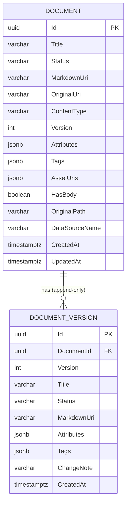

<!-- trace:
ids: [FR-02, FR-03, FR-06, FR-09, FR-12, SC-03, SC-05, SC-09, UC-04]
adrs: [ADR-0002, ADR-0014, ADR-0057, ADR-0070]
iadrs: [IADR-0001, IADR-0152, IADR-0153, IADR-0290, IADR-0296, IADR-0381]
specs: [20260828_issue-1011_version-body-contract, 20260828_issue-451_deletion-propagation-to-object-storage, 20260905_issue-1253-1254_bodyless-index-and-hasbody-vocabulary]
issues: [#634, #635, #637, #1011, #1253, #1254, planning#473]
-->

# データ仕様書: 文書・版履歴（Document / DocumentVersion）

> エンティティ（集約）単位のデータ仕様。DocumentService が所有する正規化文書と、その append-only な版履歴を扱う。

## 起点となる計画書（トレーサビリティ）

- **関連機能要求**: 正規化文書の CRUD・版管理・メタデータ／ABAC 属性付与、および文書正規化（変換パイプラインが採番した `DocumentId` でカタログ文書を生成）
- **技術検討(06_technical)・ADR**:
  - サービス境界／DB per Service（DocumentService 専用 DB・専用 `DocumentDbContext`）
  - オブジェクトストレージ（本文 Markdown・原本は URI 参照で保持し、本文実体は DB に置かない）
  - 関連: 変換側で採番した `DocumentId` をパイプライン全体で一貫させる（実装判断）
- **計画書リンク**: `01_requirements.md`（計画リポ）

## 概要

Document はカタログ化された正規化文書の集約ルートである。タイトル・状態・本文（Markdown）URI・原本 URI・コンテンツ種別に加え、ABAC 判定に用いる**属性（Attributes）**とタグ（Tags）を保持する。

**［2026-08-09 追記 / #635］タグは表示名ではなく識別子で持つ**（タグの正本は識別子とする実装判断。計画確定「辺は型の識別子を参照して保持し、表示名を複写しない」）。
表示名を複写すると、管理者設定画面が定めた「改名は既存文書へ追随する」を満たすために全文書を書き換える経路が別に要り、取りこぼした文書が古い名前のまま残る。
**表示名への解決は `DocumentEndpoints`（`TagResolver`）が行い、DTO・イベントは従来どおり表示名を運ぶ**（同判断。下流サービスと画面の契約は変わらない）。
本文実体は保持せず、`MarkdownUri` / `OriginalUri` によりオブジェクトストレージを参照する。

DocumentVersion は Document 集約配下の**確定版スナップショット**で、作成・各更新のたびに現在状態を追記する append-only コレクションである（`Snapshot()`）。「DocumentId ＋版番号」で再構成できるのは**メタデータ（タイトル・状態・属性・タグ・変更メモ）だけ**である。

**［2026-08-28 追記 / #1011］版ごとの本文は保持しない。** 本文のオブジェクトキーは文書 ID だけで決まり（`documents/{id}/body.md`）、再投入は同じキーを上書きする。参照 URI（`storage://<bucket>/<key>`）は versionId を持たず、読み取り経路も versionId を受けないため、**「その版の本文」を指せる値が存在しない**。これは欠陥ではなく計画と整合する —— バージョン管理の射程は版の作成・一覧・取得までで、版の復元は含まない（利用者裁定 2026-08-23）。**API の版応答は本文の参照を返さない**（`DocumentVersionDto` から削除済み）。

## エンティティ定義

### Document（テーブル `Documents`）

| 属性 | 型 | 必須 | 制約（一意/既定値/範囲） | 説明 |
| --- | --- | --- | --- | --- |
| Id | Guid (uuid) | ○ | 主キー。既定 `Guid.NewGuid()`。正規化経由（`CreateNormalized`）では変換側採番の ID を指定 | 文書の一意識別子 |
| Title | string (varchar(500)) | ○ | 最大長 500 | 文書タイトル |
| Status | string (varchar(50)) | ○ | 最大長 50。既定 `draft`。値: `draft` / `normalized` / `published` | 文書状態 |
| MarkdownUri | string? (varchar(2048)) | - | 最大長 2048 | 正規化 Markdown 本文の URI（オブジェクトストレージ） |
| OriginalUri | string? (varchar(2048)) | - | 最大長 2048 | 原本ファイルの URI |
| ContentType | string? (varchar(200)) | - | 最大長 200 | 原本の MIME/コンテンツ種別 |
| Version | int (integer) | ○ | 既定 1。更新（`Touch()`）ごとに +1 | 現在の版番号 |
| Attributes | Dictionary&lt;string,string&gt; (jsonb) | ○ | 既定 空辞書。NULL 不可（空 JSON を保存） | ABAC 属性（例: `confidentiality`, `department`） |
| Tags | List&lt;Guid&gt; (jsonb) | ○ | 既定 空リスト。NULL 不可。要素は `Tags.Id` を指す（**FK は張らない**。後述） | 分類タグの**識別子**（#635。表示名を複写しない） |
| AssetUris | List&lt;string&gt; (jsonb) | ○ | 既定 空リスト。NULL 不可（空 JSON `[]` を保存） | 図表資産の参照 URI。**変換経路が生んだ資産の在り処であり、完全削除で実体を消すための台帳**である。🔴 **遡及付与しない**——本欄の追加以前に取り込まれた文書は空のままで、その資産は実体が残る |
| HasBody | bool (boolean) | ○ | 既定 `true`（列の DEFAULT も true） | **原本が本文を持っていたか。** `false` はテキスト層を持たない PDF 等で、文書詳細は本文の位置へ「本文なし（原本を参照）」を出す（検索結果と同じ文言・同じ導出）。`false` になるのは変換経路だけで、本文の直接投入は常に `true` である。🔴 **本欄の追加以前の文書は `true`（本文あり）として読む**——遡及付与しない |
| OriginalPath | string? (varchar(2048)) | - | 最大長 2048 | **原本の所在**（取り込み元のパス）。本文を持たない文書を検索に載せる索引テキストの材料である。台帳に持つのは、属性編集やタグ改名による `DocumentUpdated` の**再発行でも同じ値を運ぶ**ためである。直接投入・画面からの作成では NULL |
| DataSourceName | string? (varchar(200)) | - | 最大長 200 | **データソースの表示名。** 上と同じ用途。**表示名の複写であり、改名に遡及しない**（次の同期で上書きされる） |
| CreatedAt | DateTimeOffset (timestamptz) | ○ | 既定 `UtcNow` | 作成時刻 |
| UpdatedAt | DateTimeOffset (timestamptz) | ○ | 既定 `UtcNow`。更新ごとに更新 | 最終更新時刻 |

### Tag（テーブル `Tags`。#634 / #635）

**タグ辞書のエントリ。所有は DocumentService である**（使用件数が文書の局所クエリになるため。タグ辞書の所有に関する実装判断）。

| 属性 | 型 | 必須 | 制約（一意/既定値/範囲） | 説明 |
| --- | --- | --- | --- | --- |
| Id | Guid (uuid) | ○ | 主キー。既定 `Guid.NewGuid()` | 識別子。**改名で変わらない**（管理者設定画面「改名は既存文書へ追随する」の土台） |
| Name | string (varchar(200)) | ○ | 最大長 200。**一意**（`IX_Tags_Name`）。正規化（`Trim`）後の値で比較 | 表示名。**改名で変わるのはこちらだけである** |
| CreatedAt | DateTimeOffset (timestamptz) | ○ | 既定 `UtcNow` | 登録時刻 |
| UpdatedAt | DateTimeOffset (timestamptz) | ○ | 既定 `UtcNow`。改名ごとに更新 | 最終改名時刻 |

### DocumentVersion（テーブル `DocumentVersions`）

| 属性 | 型 | 必須 | 制約（一意/既定値/範囲） | 説明 |
| --- | --- | --- | --- | --- |
| Id | Guid (uuid) | ○ | 主キー。EF の `ValueGeneratedOnAdd` で採番（初期化子で非デフォルト値を入れない） | 版レコードの識別子 |
| DocumentId | Guid (uuid) | ○ | 外部キー → `Documents.Id`（Cascade 削除） | 所属文書 |
| Version | int (integer) | ○ | `(DocumentId, Version)` で一意 | スナップショット時点の版番号 |
| Title | string (varchar(500)) | ○ | 最大長 500 | 版のタイトル |
| Status | string (varchar(50)) | ○ | 最大長 50 | 版の状態 |
| MarkdownUri | string? (varchar(2048)) | - | 最大長 2048 | スナップショット時点で**文書が指していた**本文 URI。キーが文書 ID で固定のため**現行版の本文と同じ値になる**。**API 応答には出さない**（#1011。版ごとの本文は保持しない） |
| Attributes | Dictionary&lt;string,string&gt; (jsonb) | ○ | NULL 不可。防御的コピーで保持 | 版時点の ABAC 属性 |
| Tags | List&lt;Guid&gt; (jsonb) | ○ | NULL 不可。要素は `Tags.Id` を指す | 版時点のタグの**識別子** |
| ChangeNote | string? (varchar(500)) | - | 最大長 500 | 変更理由（例: `created`, `normalized`, `published`, `updated`, `metadata-updated`, `re-normalized`） |
| CreatedAt | DateTimeOffset (timestamptz) | ○ | 文書の `UpdatedAt` を写像 | 版確定時刻 |

## ER 図

## キー・インデックス・関連

| 種別 | 対象 | 定義 |
| --- | --- | --- |
| 主キー | `Documents.Id` | `HasKey(d => d.Id)` |
| 主キー | `DocumentVersions.Id` | `HasKey(v => v.Id)`、EF 採番 |
| 外部キー | `DocumentVersions.DocumentId` → `Documents.Id` | `HasMany(Versions).WithOne().HasForeignKey(DocumentId)`、`OnDelete(Cascade)` |
| 一意インデックス | `DocumentVersions (DocumentId, Version)` | `IX_DocumentVersions_DocumentId_Version` — 同一文書内で版番号が重複しない |
| 一意インデックス | `Tags.Name` | `IX_Tags_Name` — 表示名は一意（管理者設定画面「新しい名前は既存値と重複しない」。#634） |

**［#635］`Documents.Tags` / `DocumentVersions.Tags` から `Tags.Id` への外部キーは張っていない。**
jsonb 配列の要素に FK は張れない（PostgreSQL の制約が要素単位に及ばない）ためである。
**代わりに削除側で守る**——`DELETE /tags/{id}` は使用件数が 0 件のときだけ許し、1 件以上なら件数を添えて 409 を返す
（タグの正本を識別子とする実装判断）。

**穴は 2 つ残る。どちらも FK を張らない以上避けられない。**

1. **手作業の DB 操作**（辞書の行を直接消す）。
2. **稀な同時実行**（[#639](https://github.com/endazon/microservices-platform/pull/639) の AI レビュー指摘）。
   `POST /documents` が `TagResolver.ToIdsAsync` で識別子を解決した**直後・`SaveChangesAsync` の前**に、
   `DELETE /tags/{id}` が使用件数 0 件と判定して削除を確定させると、
   コミット後の文書に解決できない識別子が残る。

**どちらも `TagResolver.ToNames` が黙って落として吸収する**（古い識別子を画面へ出すより落とすほうがよい）。
**タグが 1 つ静かに消えるだけで、文書そのものは壊れない。**

- `Versions` ナビゲーションはバッキングフィールド（`_versions`）経由でアクセス（`PropertyAccessMode.Field`）。

## 整合性・制約ルール

- **版は append-only**: 更新系メソッド（`Update` / `UpdateMetadata` / `ApplyNormalized` / `SetMarkdownUri` / `Publish`）は必ず `Touch()`（Version++・UpdatedAt 更新）と `Snapshot()` を行い、履歴を書き換えない。
- **版番号の一意性**: `(DocumentId, Version)` 一意制約により、集約内で版番号が単調増加・重複なしを DB でも担保。
- **正規化の冪等性**: 同一文書の `DocumentNormalized` 再配信時は `ApplyNormalized()` で内容を反映し、`re-normalized` の版を追記。
- **状態遷移**: `draft` →（正規化）→ `normalized` →（`Publish`）→ `published`。
- **NULL 非許容の JSON**: `Attributes` / `Tags` / `AssetUris` はカラム上 NOT NULL。未設定時は空 JSON（`{}` / `[]`）を保存。
- **［#635］タグは辞書に在る識別子しか入らない**: 画面・API からの入力は表示名で受け、`TagResolver.ToIdsAsync` が辞書を引いて識別子へ解決する。
  **辞書に無い名前は 400 で拒否する**（文書管理画面「既定タグ辞書に整合」。**黙って落とさない**——落とすと「保存できたのにタグが付いていない」という説明のつかない結果になる）。
  **取り込み経路はタグを生成しない**（同実装判断・#637）。

- **完全削除は実体まで及ぶ**: 文書行を消す**前に**、台帳（`Document.MarkdownUri` ＋ 全
  `DocumentVersion.MarkdownUri` ＋ `Document.AssetUris`）から逆引きしたオブジェクトを
  **全バージョン**削除する。🔴 **順序は入れ替えない**——台帳を先に消すと実体を指す値が失われ、
  残留を誰も観測できなくなる。実体を消せなければ行は残る（利用者には失敗が返る）。
  **`OriginalUri` は対象外**である（API 要求からしか入らず、実体が別サービス所有の原本であり得る）。

## 永続化方針

- **DB**: PostgreSQL、EF Core（`DocumentDbContext`）。DB per Service の方針に従い DocumentService 専用データベース。
- **JSON カラム**: `Attributes`（Dictionary）・`Tags`（List）は `ValueConverter` で JSON 文字列化し、`jsonb` 型として格納。変更検知のため `ValueComparer` を設定。
  - **［#635］変換器の型を列の型と合わせること自体が守りである。** `HasConversion` には非ジェネリックの多重定義があり、`List<string>` 用の変換器を `List<Guid>` の列へ渡しても**コンパイルは通ってしまう**（実測）。壊れるのは実行時なので、ズレると気づくのがずっと後になる。
- **本文の非保持**: Markdown 本文・原本ファイル実体は DB に格納せず、`MarkdownUri` / `OriginalUri` でオブジェクトストレージを参照する。
- **削除連動**: 文書削除時、`OnDelete(Cascade)` により版履歴も連動削除。

## マイグレーション・初期データ

- `20260626150838_InitialCreate` — `Documents` テーブル作成。
- `20260627130000_AddDocumentVersions` — `DocumentVersions` テーブル・一意インデックス作成、`Documents` への FK（Cascade）追加。
- `20260809092529_AddTagDictionary`— `Tags` テーブルと `Name` の一意インデックス作成。
- `20260809123339_MigrateTagsToIdentifiers`— `Tags.UpdatedAt` 列追加 ＋ **データ移行**（後述）。
- 初期データ（シード）は定義していない。文書は API 作成（`Document.Create`）または正規化イベント（`CreateNormalized`）で生成される。

### `MigrateTagsToIdentifiers` のデータ移行

**本リポジトリで最初のデータ移行つきマイグレーションである**（着手時の実測: `grep "Sql(" Migrations/*.cs` は 0 件）。
**列の型は変わらない**——`Tags` は前後とも `jsonb` の配列であり、変わるのは中身
（`["経理","規程"]` → `["3fa8…","9c1b…"]`）だけである。**したがって EF は差分を検出せず、手で書くしかない。**

1. `Tags.UpdatedAt` を足し、既存行を `CreatedAt` と同じ値にする（未改名のタグが「西暦 1 年に改名された」ように見えないようにする）。
2. `Documents` と **`DocumentVersions` の双方**から表示名を集め、辞書に無いものを登録する。
   版履歴にしか現れない名前（付け外しされたタグ）も登録しないと、過去版が参照先を失う。
   **登録しても使用件数は 0 件である**（現行版だけを数えるため。タグ辞書の実装判断による）ので、直後に削除できる。
3. 両テーブルの配列を識別子へ書き換える。**並びと重複はそのまま保つ**（並びは画面の表示順である）。

**正規化は C# の `string.Trim()` と同じ集合で行う**（`btrim` の既定は半角空白しか落とさない）。
ズレると、移行で登録した名前と実行時に C# が正規化した名前が食い違い、
**辞書に在るのに「辞書に無いタグです」と 400 になる**。

**検証は実 PostgreSQL でしか行えない**——EF InMemory はマイグレーションの SQL を実行しない。
`Knowledge.IntegrationTests/DocumentService/TagIdentityMigrationTests.cs`（`[DockerFact]`）が
上り・下りの双方を検証する（#634 の一意インデックスと同じ型の限界である）。

## 関連仕様

- 機能仕様書: `../functional/FR-06_document-crud-versioning.md`、`../functional/FR-12_document-normalization.md`
- 通信仕様書: `../api/openapi.yaml`
- 技術要件書: `../tech/tech-requirements.md`
- 関連データ仕様: `./data-source.md`（ベクトルチャンク・取り込み）、`./abac-policy.md`（属性・ポリシー評価）

## 未決事項

- 文書の物理削除（ハードデリート）／論理削除（アーカイブ）の運用ポリシーは未確定（現状はカスケード物理削除）。
- 版履歴の長期保持・剪定（リテンション）方針は未定。
- `Attributes` のキー・値と AuthorizationService の属性辞書（`AttributeDefinition`）の整合検証タイミングは未整理。
