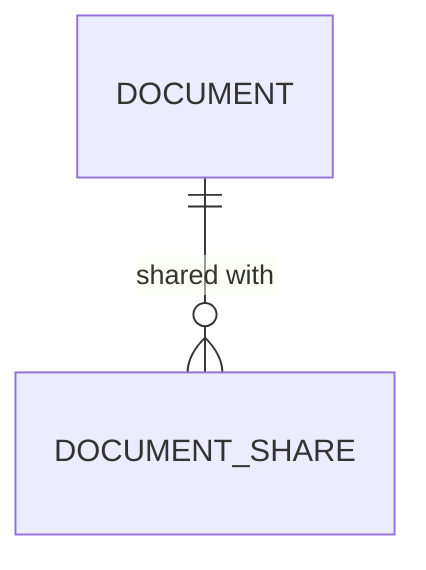

<!-- trace:
ids: [FR-19, FR-20, UC-11]
adrs: [ADR-0002, ADR-0036, ADR-0046]
iadrs: [IADR-0253]
specs: [20260823_issue-989_authz-scope-disjunction-stages]
issues: [#989]
-->

# データ仕様書: 文書共有先（DocumentShare）

> DocumentService が所有する、文書の共有先（文書 × 被共有主体）の記録を扱う。

## 概要

個人資料の「非公開＝所有者と、所有者が明示的に共有した相手のみが閲覧できる」を成立させるための、
共有先の永続記録である。共有の単位は**個人とグループの両方**。

**共有先は文書の属性辞書（`Document.Attributes`）には持たない** —— 属性の値は単一文字列であり
集合を保持できないうえ、共有は付与・取り消し・監査というライフサイクルを持つ（属性とは出どころが
違う）。属性辞書へ多値を持ち込むと、属性を読むすべての面（検索・グラフ・Wiki ゲートウェイ・BFF）の
契約が変わるため、専用のテーブルとして分離した。

共有の変更（付与・取り消し）は**文書の所有者のみ**が行える（所有者ベースの動的束縛
`doc.owner ∈ { ${current_user} }` で判定する。判定関数は本文書き込み経路と共用）。
**再共有は不可**（被共有者は所有者ではないため変更経路が無い）。取り消しは行削除で行う。
共有相手の退職・アカウント無効化時の自動解除は人事連携側の作業であり、本テーブルは
行削除できる形でそれに備える。

🔴 **本記録はまだ認可スコープの解決（共有先ベースの分岐）には接続されていない。**
消費側サービスが共有記録へ到達する方式（DB per Service の越境）が未決であり、
方式の確定後に別作業で配線する。それまで共有先ベースの閲覧は実効しない
（deny 側に倒れており、情報が漏れる向きではない）。

## エンティティ定義

### DocumentShare（テーブル `DocumentShares`）

| 属性 | 型 | 必須 | 制約（一意/既定値/範囲） | 説明 |
| --- | --- | --- | --- | --- |
| Id | Guid (uuid) | ○ | 主キー | 共有記録 ID |
| DocumentId | Guid (uuid) | ○ | 外部キー（Documents.Id、連動削除） | 共有対象の文書 |
| SubjectType | string (varchar(20)) | ○ | 値: `user` / `group` | 被共有主体の種別 |
| SubjectId | string (varchar(200)) | ○ | — | 被共有主体の識別子（利用者 ID / グループ ID） |
| GrantedBy | string (varchar(200)) | ○ | — | 共有を付与した主体（所有者）。監査用 |
| CreatedAt | DateTimeOffset (timestamptz) | ○ | 既定: 現在時刻 | 付与日時 |

## ER 図

## キー・インデックス・関連

| 種別 | 対象 | 説明 |
| --- | --- | --- |
| 主キー | Id | — |
| 外部キー | DocumentId → Documents.Id | 文書削除で連動削除（共有だけが残ると、存在しない文書への到達権が記録として残る） |
| インデックス | (DocumentId, SubjectType, SubjectId) 一意 | 同一文書 × 同一主体の重複付与を構造で防ぐ |

## 整合性・制約ルール

- 同一文書 × 同一主体（種別＋識別子）の共有は 1 行。重複付与は API 層で 409、DB 層で一意制約が防ぐ。
- `SubjectType` の値域は `user` / `group` の 2 値（API 層で検証。「全員」のような主体は表現できない
  ——共有が公開へ化けることを防ぐ）。
- 共有の付与・取り消し・一覧参照は所有者（`Attributes["owner"]` が要求主体と一致する場合）のみ。
  ロールによる迂回は無い（管理者ロールでも所有者でなければ 403）。
- `owner` 属性を持たない文書（システム投入経路の既定）は共有の入口が無い（deny-by-default）。

## 永続化方針

DocumentService 専用 DB（PostgreSQL。DB per Service）。テーブル `DocumentShares`。

## マイグレーション・初期データ

- マイグレーション `20260822202722_AddDocumentShares` で新設。シードデータ無し。

## 関連仕様

- データ仕様書: [document-and-version.md](document-and-version.md)（共有対象の文書）
- データ仕様書: [abac-policy.md](abac-policy.md)（認可スコープの評価モデル。共有先ベースの分岐の接続先）

## 未決事項

- 共有先ベースの閲覧分岐を認可スコープ解決へ接続する方式（消費側サービスが共有記録へ到達する
  経路。イベントによる複製か、解決時の文書 ID 展開か）。
- グループ識別子の正（Keycloak グループとの対応）と、退職時の自動解除の配線。
