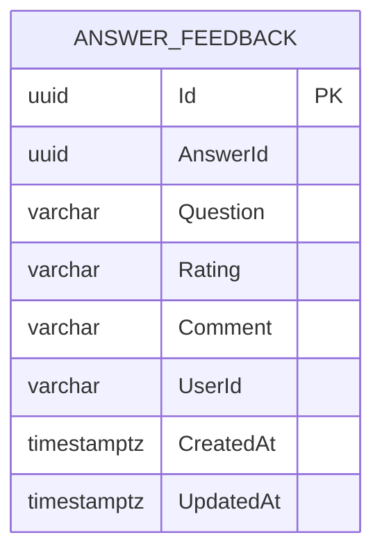

# データ仕様書: 回答フィードバック（AnswerFeedback）

> FeedbackService が所有する、AI 回答への 👍/👎・コメントを扱う。

## 起点となる計画書（トレーサビリティ）

- **関連機能要求(FR)**: FR-08（AI 回答へのフィードバック＝👍/👎・コメント）
- **技術検討(06_technical)・ADR**:
  - ADR-0002 DB per Service（FeedbackService 専用 DB）
  - 関連: IADR-0010（同一 (AnswerId, UserId) を 1 行に upsert し二重計上しない）
- **計画書リンク**: `../../planning/projects/microservices-platform/02_requirements/01_requirements.md`

## 概要

AnswerFeedback は、特定の AI 回答（AnswerId）に対する利用者の評価（Rating: `up` / `down`）とコメントを保持する単一エンティティである。品質レビューの文脈として、対象となった質問文（Question）も保持する。同一利用者による同一回答への再送信は新規行を作らず既存行を上書き（upsert）する。

## エンティティ定義

### AnswerFeedback（テーブル `Feedback`）

| 属性 | 型 | 必須 | 制約（一意/既定値/範囲） | 説明 |
| --- | --- | --- | --- | --- |
| Id | Guid (uuid) | ○ | 主キー。既定 `Guid.NewGuid()` | フィードバック識別子 |
| AnswerId | Guid (uuid) | ○ | `(AnswerId, UserId)` で一意 | 対象 AI 回答の ID |
| Question | string? (varchar(1000)) | - | 最大長 1000（`MaxQuestionLength`）。超過分は切り詰め | 品質レビュー用の質問文 |
| Rating | string (varchar(4)) | ○ | 最大長 4。値: `up` / `down`（小文字正規化済み） | 評価（👍/👎） |
| Comment | string? (varchar(2000)) | - | 最大長 2000（`MaxCommentLength`） | 自由記述コメント |
| UserId | string (varchar(256)) | ○ | 最大長 256。`(AnswerId, UserId)` で一意 | 投稿者 |
| CreatedAt | DateTimeOffset (timestamptz) | ○ | 既定 `UtcNow`。更新（上書き）時は保持 | 作成時刻 |
| UpdatedAt | DateTimeOffset (timestamptz) | ○ | 既定 `UtcNow`。`Update()` で更新 | 最終更新時刻 |

## ER 図

> AnswerId は他サービスが生成した AI 回答の ID を参照する論理キーで、DB 上の外部キーは持たない（DB per Service）。

## キー・インデックス・関連

| 種別 | 対象 | 定義 |
| --- | --- | --- |
| 主キー | `Feedback.Id` | `HasKey(f => f.Id)` |
| 一意インデックス | `Feedback (AnswerId, UserId)` | `IX_Feedback_AnswerId_UserId` — 1 ユーザー 1 回答 1 フィードバック（upsert 基盤、IADR-0010） |
| 外部キー | なし | AnswerId は越境参照（FK なし） |

## 整合性・制約ルール

- **1 ユーザー 1 回答 1 フィードバック（FR-08 / IADR-0010）**: `(AnswerId, UserId)` 一意制約。再送信は `Update()` で上書きし、`CreatedAt` を保持・`UpdatedAt` のみ更新（二重計上しない）。
- **Rating 正規化**: `up` / `down` に小文字正規化してから保存（カラム長 4 と整合）。
- **長さ制限**: `Question` は保存前に 1000 文字へ切り詰め（`Truncate`）。`Comment` は 2000 文字（バリデーションとカラム長を一致）。

## 永続化方針

- **DB**: PostgreSQL、EF Core（`FeedbackDbContext`）。ADR-0002 に従い FeedbackService 専用 DB。
- JSON カラムなし（全カラムがスカラ／文字列）。
- upsert は一意インデックスを基盤に、アプリ層（サービス）で「取得 → 更新 or 新規」を行う。

## マイグレーション・初期データ

- `20260703000000_InitialCreate` — `Feedback` テーブル・`IX_Feedback_AnswerId_UserId`（一意）作成。
- 初期データ（シード）なし。

## 関連仕様

- 機能仕様書: `../functional/FR-08_answer-feedback.md`
- 通信仕様書: `../api/openapi.yaml`
- 技術要件書: `../tech/tech-requirements.md`
- 関連データ仕様: `./usage-event.md`（回答品質・利用状況の集計）

## 未決事項

- フィードバックとダッシュボード集計（回答品質）の連携方式（イベント連携か横断クエリか）は未確定。
- 回答（AnswerId）の実体・存在検証の要否は本サービスでは行っていない。
- コメントの PII／不適切表現フィルタリング方針は未定。
