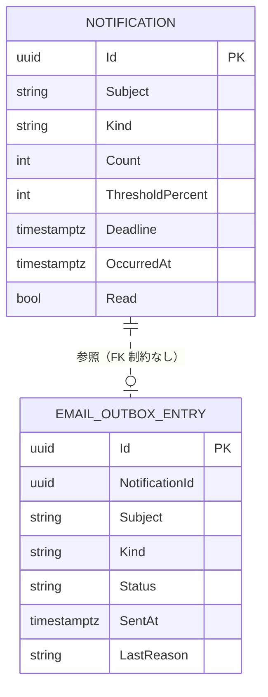

<!-- trace:
ids: [FR-19, FR-20, FR-22, SC-10, UC-11]
adrs: [ADR-0002, ADR-0004, ADR-0037, ADR-0045]
iadrs: [IADR-0009, IADR-0215, IADR-0267, IADR-0270]
specs: [20260823_issue-600_notification-service-backend, 20260828_issue-600_notification-triggers]
issues: [#451, #600]
-->

# データ仕様書: 通知（Notification / EmailOutboxEntry）

> NotificationService が所有する 2 つのエンティティを扱う。
> **アプリ内通知の実体**（`Notification`）と、**メール送出の記録**（`EmailOutboxEntry`）である。

> **`status: in-progress` の理由**: **通知サービスがまだ配備されていない。**
> **発火の結線（通知を作る側）は 2026-08-28 に入った** —— 検知・送出・受理の経路は繋がっており、
> 配備が入るまで送出は受け口へ到達しない（届かなかったことは発火側の計器に残る）。
> 本書が定めるのは**通知が作られたあとの永続化・既読・送出・保持**である。線引きの正本は
> 送出側の実装 ADR であり、追跡は関連 issue で行う。

## 起点となる計画書（トレーサビリティ）

- **関連機能要求**: 利用者本人への通知配信（発火源は個人資料・保存容量・同期トークン）
- **技術検討 / ADR**: DB per Service（NotificationService 専用 DB）／
  Obsidian 同期方式（削除通知・容量警告・トークン期限予告）／
  メール配信の SMTP リレー（送信上限・送信失敗の観測）
- **計画書リンク**: `02_requirements/01_requirements.md`（計画リポ）

## 概要

| エンティティ | 役割 | 寿命 |
| --- | --- | --- |
| `Notification` | **アプリ内通知 1 件**。これが永続化された時点で「通知が届いた」と定義する | **保持期間（既定 90 日）で物理削除** |
| `EmailOutboxEntry` | **メール送出の要求と結末**。補助経路の記録であり、送出の観測面でもある | **通知より長く残す**（保持の掃除の対象外） |

**2 つは別トランザクションで書かれる。** メール側で何が起きても `Notification` は取り消されない ——
これが「メールが送れなくてもアプリ内通知は届く」の実体である。

## エンティティ定義

### Notification（テーブル `Notifications`）

★ **タイトル・本文に相当する属性を 1 つも持たない。** 「本文が件数と期限のみで構成される」という
受け入れ基準を、**実装の規律ではなくスキーマの形**で守らせている。自由文の列が 1 つでもあれば、
いつか誰かがそこへ資料のタイトルを入れる。**メールは本システムの ABAC の外側へ出る**ため、
ここが最も守られるべき境界である。

| 属性 | 型 | 必須 | 制約（一意/既定値/範囲） | 説明 |
| --- | --- | --- | --- | --- |
| Id | Guid (uuid) | ○ | 主キー。既定 `Guid.NewGuid()` | 通知の識別子 |
| Subject | string(255) | ○ | — | **宛先。所有者本人ただ 1 人**（トークンの主体と突き合わせる） |
| Kind | string(100) | ○ | **閉じた列挙にしない** | 種別（削除通知 3 種・容量警告・トークン期限予告） |
| Count | int | — | `null` 可・0 以上 | 件数（削除通知・トークン期限予告） |
| ThresholdPercent | int | — | `null` 可・0〜100 | 到達した閾値（容量警告。80 / 95） |
| Deadline | timestamptz | — | `null` 可 | 期限（完全削除の実行時刻・トークンの失効時刻） |
| OccurredAt | timestamptz | ○ | 既定 `UtcNow` | 発生時刻。**保持期間の起点でもある** |
| Read | bool | ○ | 既定 `false` | 既読フラグ |

**利用者 × 通知の関連表は持たない。** 宛先が本人 1 人なので、通知は最初から 1 人に属する。
多対多にする理由が無い。

### EmailOutboxEntry（テーブル `EmailOutbox`）

| 属性 | 型 | 必須 | 制約（一意/既定値/範囲） | 説明 |
| --- | --- | --- | --- | --- |
| Id | Guid (uuid) | ○ | 主キー | 送出要求の識別子 |
| NotificationId | Guid (uuid) | ○ | **外部キー制約は張らない**（後述） | 対応するアプリ内通知 |
| Subject | string(255) | ○ | — | 宛先の主体 |
| Kind | string(100) | ○ | — | 種別（本文の組み立てに使う） |
| Count | int | — | `null` 可 | 件数 |
| ThresholdPercent | int | — | `null` 可 | 閾値 |
| Deadline | timestamptz | — | `null` 可 | 期限。**繰り越しの打ち切り条件でもある** |
| Status | string(20) | ○ | 既定 `pending` | `pending` / `sent` / `deferred` / `dropped` / `failed` |
| AttemptCount | int | ○ | 既定 0 | 送信を試みた回数 |
| DeferralCount | int | ○ | 既定 0 | 繰り越した回数 |
| CreatedAt | timestamptz | ○ | 通知の発生時刻 | 送出待ちの取り出し順 |
| SentAt | timestamptz | — | `null` 可 | 送れた時刻。**日次上限の消費を数える基準** |
| LastOutcomeAt | timestamptz | — | `null` 可 | 直近の結末の時刻 |
| LastReason | string(200) | — | `null` 可 | 結末の理由。**機械的な理由語だけ**（資料由来の文字列を入れない） |

## ER 図

## キー・インデックス・関連

| 種別 | 対象 | 説明 |
| --- | --- | --- |
| 主キー | `Notifications.Id` / `EmailOutbox.Id` | — |
| 外部キー | **無し** | `EmailOutbox.NotificationId` は追跡用の値である（後述の理由による） |
| インデックス | `Notifications (Subject, OccurredAt)` | **読み出しは常に主体で絞り新しい順に並べる**。索引もその形に合わせる |
| インデックス | `Notifications (OccurredAt)` | 保持期間を過ぎたものを掃く |
| インデックス | `EmailOutbox (Status, CreatedAt)` | 送出待ちを古い順に取り出す |
| インデックス | `EmailOutbox (SentAt)` | **当日の送信数**を数える（日次上限の消費） |

## 整合性・制約ルール

1. **読み出しは必ず `Subject` で絞る。** 絞りの無い読み出し口をアプリケーション側に公開しない。
   未読件数も本人の分だけを数える —— **バッジの数字だけが他人の分を漏らす**事故を防ぐためである。
2. **既読化は冪等**である。既読のものへ再度実行しても状態は変わらない。
3. **本人の通知でない ID への既読化は「存在しない」と同じ扱い**にする（存在秘匿）。
4. **`Kind` を DB で検証しない。** 契約が種別を開いている以上、後段の値域も開いていなければならない。
5. **`EmailOutbox` に外部キー制約を張らない。** 通知は保持期間で消えるが、**送出の記録は残す必要がある** ——
   同時に消すと、時間が経つほど「送れなかった」と「静かに落ちた」の区別がつかなくなる。

## 永続化方針

- **PostgreSQL**。サービス専用のデータベース（`notification_svc`）を持つ（DB per Service）。
- **`Notification` と `EmailOutboxEntry` は別のトランザクションで書く。**
  1 つ目が成功した時点で通知は届いており、2 つ目の失敗は 1 つ目に伝播しない。
- 実際の送信は永続化とは別の処理が後から行う。**永続化と送信は時間的にも分離している。**

## マイグレーション・初期データ

- スキーマは EF Core のマイグレーション（`Migrations/` 配下）で作る。起動時に最新へ更新する。
- **初期データは無い。** 通知は発火によってのみ作られる。

## 保持と掃除

| 対象 | 方針 |
| --- | --- |
| `Notifications` | **既定 90 日**（設定値）を過ぎたものを物理削除する。個人資料の論理削除の保管期間へ揃えた**実装側の判断**であり、計画に根拠は無い |
| `EmailOutbox` | **掃除しない**（本書の射程では方針を決めていない。未決事項 1） |

## 関連仕様

- 機能仕様書: [利用者通知](../functional/FR-22_user-notifications.md)
- 通信仕様書: [BFF 通知](../api/BFF_notifications.md)
- テスト仕様書: [利用者通知](../tests/FR-22_user-notifications.md)
- 技術要件書: [技術要件](../tech/tech-requirements.md)

## 未決事項

1. **`EmailOutbox` をいつまで残すか**は決めていない。「通知より長く」までしか決めておらず、
   放置すると単調増加する。運用仕様の側で決める必要がある。
2. **メールの宛先アドレスの解決元**（Keycloak の利用者属性か独自の連絡先か）は未決であり、
   本書のエンティティは宛先アドレスそのものを持たない（送出の直前に解決する）。
3. **日次送信上限の実値**は運用テナントの確定後に合わせる。既定は最も厳しい値を採っている。
