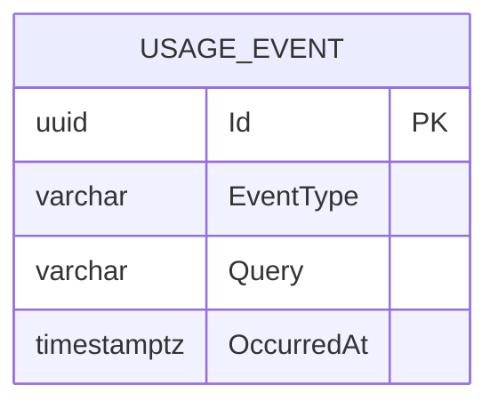

<!-- trace:
ids: [FR-10, SC-10, UC-05]
adrs: [ADR-0002, ADR-0006, ADR-0072]
iadrs: [IADR-0368]
specs: [20260904_issue-1198_usage-event-subject-and-retention]
issues: [#1198, planning#515, planning#526]
-->

# データ仕様書: 利用イベント（UsageEvent）

> DashboardService が所有する、利用状況・検索傾向・回答品質の集計元となる利用イベントを扱う。

## 起点となる計画書（トレーサビリティ）

- **関連機能要求**: 利用状況ダッシュボード（利用状況・検索傾向・回答品質の可視化）
- **技術検討(06_technical)・ADR**:
  - 可観測性（OpenTelemetry / Prometheus / Loki）
  - 関連: DB per Service（DashboardService 専用 DB）
- **計画書リンク**: `01_requirements.md`（計画リポ）

## 概要

UsageEvent は「検索実行」「AI 回答生成」といった利用イベントを 1 行として蓄積する単一エンティティである。日次件数（利用状況）・トップ検索語（検索傾向）などの集計元になる。
集計は保存済み UsageEvent 群に対するクエリで行い、事前集計テーブルは持たない（現状のスキーマ上は生イベントのみ）。

🔴 **利用者を識別する列を持たない。** 受け口は認証必須のままで（認証済みでなければ記録できない）、
変わったのは**解決した主体を列へ書かないこと**だけである。**行は 90 日を超えて保持しない**
（後述「保持期間」）。

## エンティティ定義

### UsageEvent（テーブル `UsageEvents`）

| 属性 | 型 | 必須 | 制約（一意/既定値/範囲） | 説明 |
| --- | --- | --- | --- | --- |
| Id | Guid (uuid) | ○ | 主キー。既定 `Guid.NewGuid()` | イベント識別子 |
| EventType | string (varchar(16)) | ○ | 最大長 16。値: `search` / `answer`（小文字正規化済み） | 利用イベント種別 |
| Query | string? (varchar(512)) | - | 最大長 512（`MaxQueryLength`）。超過分は切り詰め | 検索語（検索傾向の集計に使用） |
| OccurredAt | DateTimeOffset (timestamptz) | ○ | 既定 `UtcNow`。`(OccurredAt, EventType)` インデックス対象 | 発生時刻 |

## ER 図

> 単一テーブル。ダッシュボードの集計値（日次件数・トップ検索語・回答品質）はこの生イベントへのクエリ結果として算出され、集計専用テーブルは現状存在しない。

## キー・インデックス・関連

| 種別 | 対象 | 定義 |
| --- | --- | --- |
| 主キー | `UsageEvents.Id` | `HasKey(u => u.Id)` |
| インデックス | `UsageEvents (OccurredAt, EventType)` | `IX_UsageEvents_OccurredAt_EventType`（非一意）— 期間フィルタ・種別集計を効率化 |
| 外部キー | なし | 他エンティティを参照しない（**利用者を識別する列を持たない**） |

## 整合性・制約ルール

- **種別の正規化**: `EventType` は `search` / `answer` に小文字正規化してから保存（カラム長 16 と整合）。
- **検索語の長さ制限**: `Query` は保存前に 512 文字へ切り詰め（`Truncate`）。集計対象の検索語として保持。
- **集計クエリ最適化**: `(OccurredAt, EventType)` インデックスにより、期間指定＋種別ごとの日次件数・傾向集計を効率化。
- **一意制約なし**: 同一時刻の重複記録は許容（生イベントログ）。**同一利用者かどうかは判別できない**（識別子を持たない）。

## 永続化方針

- **DB**: PostgreSQL、EF Core（`DashboardDbContext`）。DB per Service の方針に従い DashboardService 専用 DB。
- JSON カラムなし（全カラムがスカラ／文字列）。
- 事前集計（マテビュー等）は未導入。集計は API 呼び出し時にクエリで実施する方針。
- メトリクス・トレースは OTel / Prometheus / Loki の可観測性基盤で別途扱い、本テーブルは業務的な利用イベントを保持する。

## 保持期間

| 項目 | 値 |
| --- | --- |
| 保持期間 | **90 日**（画面から照会できる最大期間と**同じ 1 つの定数**。別々には変更できない） |
| 削除の基準時刻 | 集計の起点と同じ 1 点（UTC の日境界）。**基準時刻ちょうどの行は残る**（集計が読む側と同じ境界） |
| 実施 | `dashboard-service` の常駐処理（起動直後に 1 周、以後は既定 6 時間ごと）。1 周 500 行ずつ物理削除する |
| 構成 | `UsageRetention__Enabled`（既定 `true`）／ `UsageRetention__IntervalMinutes`（既定 `360`）。**保持日数の構成キーは無い** |

**削除の述語は集計の否定である** —— 集計は `OccurredAt >= 起点`、削除は `OccurredAt < 起点`。
同じ式から得るため、集計に必要な行を落とすことはない。
運用手順（失敗時の見え方を含む）は `../operations/operations.md` の §データ保持期間（利用イベント）。

## マイグレーション・初期データ

- `20260703010000_InitialCreate` — `UsageEvents` テーブル・`IX_UsageEvents_OccurredAt_EventType`（非一意）作成。
- `20260904100741_DropUsageEventUserId` — 利用者識別子の列を削除（**移送。既存行の値は失われ、復元できない**。
  **行そのものは残り、件数は前後で変わらない**）。
- 初期データ（シード）なし。

## 関連仕様

- 機能仕様書: `../functional/FR-10_dashboard.md`
- ログ・可観測性仕様書: `../observability/`（存在する場合）
- 通信仕様書: `../api/openapi.yaml`
- 技術要件書: `../tech/tech-requirements.md`
- 関連データ仕様: `./feedback.md`（回答品質のフィードバック源）

## 未決事項

- 回答品質の集計は UsageEvent（`answer`）と AnswerFeedback（別サービス）の突合が前提だが、その連携方式（イベント／横断集計）は未確定。
- アーカイブ（削除前の退避）は行わない。**保持期間を過ぎた行は物理削除する**（上記「保持期間」）。
- 高頻度書き込み時のパーティショニング・時系列最適化（例: 月次パーティション）は未検討。
