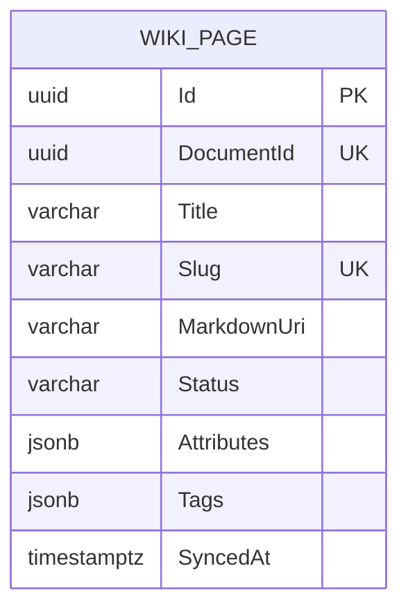

<!-- trace:
ids: [FR-13]
adrs: [ADR-0002]
iadrs: [IADR-0009, IADR-0020, IADR-0021, IADR-0023]
specs: []
issues: [#88, #118]
-->

# データ仕様書: Wiki ページ同期メタデータ（WikiPage）

> WikiService が所有する。Issue #118 監査で欠落が判明したため後追いで作成（実装は Wiki 閲覧の段 2 /
> Issue #88 で完了済み）。

## 起点となる計画書（トレーサビリティ）

- **関連機能要求**: 正規化文書の Wiki 閲覧（ABAC・横断検索・AI 回答と統合）
- **技術検討(06_technical)・ADR**:
  - DB per Service（WikiService 専用 DB `wiki_svc`）
  - WikiService は同期・統合・ABAC ゲートウェイに縮退する（閲覧本文の実体は Wiki.js）
  - Wiki.js への GraphQL push 同期（`WikiPath` は `DocumentId` 由来の正準パス）
  - 権限外は 404 で存在を秘匿する（本メタデータが ABAC 判定の根拠）
- **計画書リンク**: `01_requirements.md`（計画リポ）

## 概要

WikiPage は、文書管理（DocumentService）から同期された文書の **ABAC 判定用メタデータ**である。
上記の縮退により閲覧本文の実体は Wiki.js が保持し、本エンティティは「ゲートウェイでの認可判定・
存在秘匿・同期状態の追跡」に必要な属性のみを保持する（本文は保持しない）。
`DocumentUpdated` イベントで upsert（`DocumentId` 一意）、`DocumentDeleted` でアーカイブ／削除される。

## エンティティ定義

### WikiPage（テーブル `Pages`）

| 属性 | 型 | 必須 | 制約（一意/既定値/範囲） | 説明 |
| --- | --- | --- | --- | --- |
| Id | Guid (uuid) | ○ | 主キー。既定 `Guid.NewGuid()` | ページ識別子 |
| DocumentId | Guid (uuid) | ○ | 一意インデックス | 同期元文書 ID |
| Title | string (varchar(500)) | ○ | 最大長 500 | 文書タイトル |
| Slug | string (varchar(500)) | ○ | 一意インデックス。タイトル由来のケバブケース | 人間可読の索引・メタデータ用途 |
| MarkdownUri | string? | - | `storage://` 参照 | 正規化本文の所在（実体は MinIO） |
| Status | string | ○ | `active` / `archived`。既定 `active` | アーカイブは可逆（再公開で解除） |
| Attributes | jsonb | ○ | 既定 `{}` | ABAC 属性（clearance / department 等）。deny-by-default 判定の根拠 |
| Tags | jsonb | ○ | 既定 `[]` | 文書タグ |
| SyncedAt | DateTimeOffset (timestamptz) | ○ | 既定 `UtcNow`。同期・アーカイブで更新 | 最終同期時刻 |
| WikiPath | —（計算値・非永続） | — | `doc/{DocumentId}`（`PathFor` と同一導出） | Wiki.js 上の正準パス。列として保持しない |

## ER 図

## ライフサイクル・業務ルール

- `DocumentUpdated` → `CreateFromDocument` / `Sync`（upsert）。再公開でアーカイブ解除（Issue #88）。
- `DocumentDeleted` → アーカイブまたは削除し、Wiki.js 側へも伝播する（削除・アーカイブの伝播に関する実装判断。`PathFor(DocumentId)`
  でメタデータ未同期でも正準パスを導出可能）。
- ゲートウェイの一覧・個別取得は `Status = active` かつ ABAC 許可のもののみ可視。
  それ以外は 404（存在秘匿）。

## 関連仕様

- 機能仕様書: [FR-13_wiki-browsing](../functional/FR-13_wiki-browsing.md)
- データ仕様書: [document-and-version](document-and-version.md)（同期元）
- テスト仕様書: [FR-13_wiki-browsing-abac](../tests/FR-13_wiki-browsing-abac.md)
