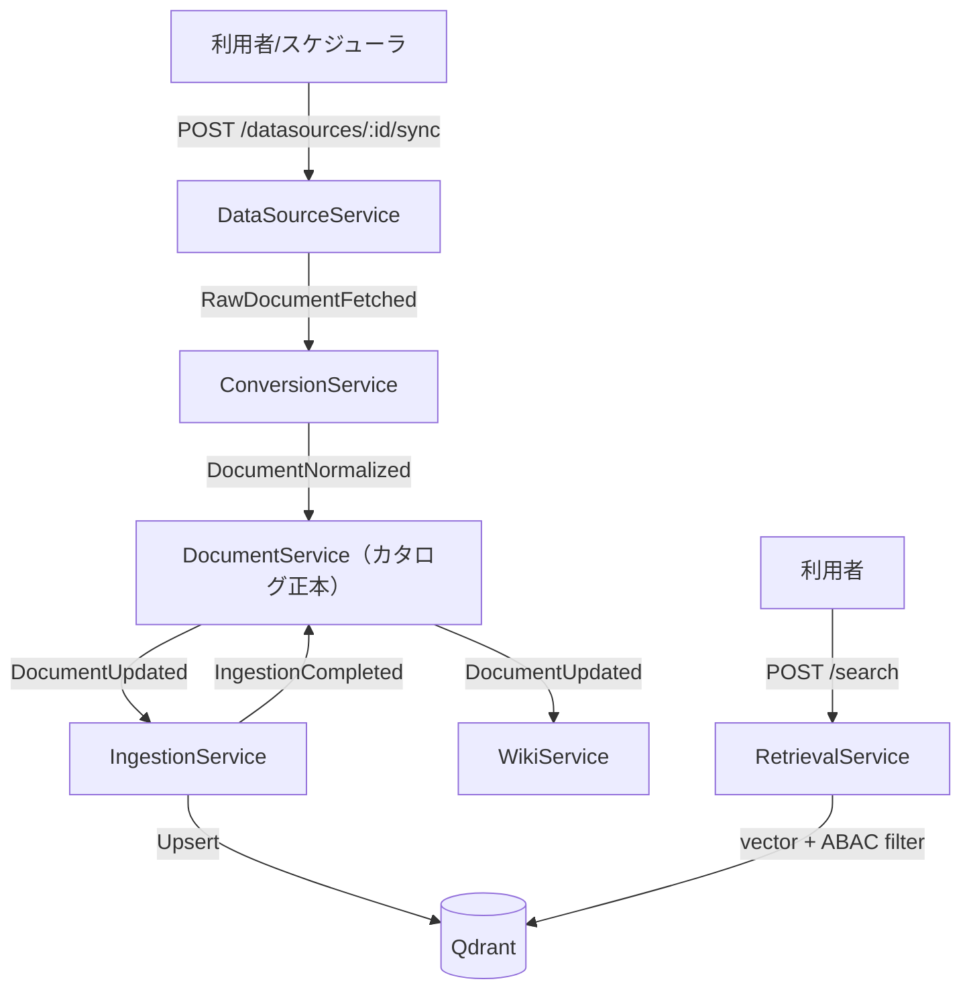

# 機能仕様書: データソース登録・同期・カタログ化

> 機能（FR-01）単位の仕様。計画リポジトリの要求・ユースケースを実装向けに詳細化する。

## 起点となる計画書（トレーサビリティ）

- 機能要求（FR）: FR-01
- ユースケース（UC）: UC-04
- 関連 ADR: ADR-0002（DB per Service）、ADR-0003（MassTransit + RabbitMQ）
- 実装 ADR: [IADR-0001](../adr/IADR-0001_document-service-owns-catalog.md)
- 作業仕様書: [20260627_FR-01_data-source-catalog-pipeline](../specs/20260627_FR-01_data-source-catalog-pipeline.md)

## 概要

複数の社内データソース（ファイルサーバー／Wiki／業務DB／SaaS）を登録し、同期によって取得した
文書を正規化（Markdown 化）してカタログに登録し、検索インデックスへ取り込む。
利用者は権限内の全データソースを横断検索でき、結果に出典が付く。

本機能はイベント駆動マイクロサービス（ADR-0003）で構成され、各サービスが疎結合に連携する。

## 機能詳細

| 項目 | 内容 |
| --- | --- |
| 入力 | データソース定義（名称・種別・接続URI・接続設定）、同期トリガ |
| 処理 | 登録 → 同期（原本取得）→ 変換（Markdown 正規化）→ **カタログ登録** → チャンク化・埋め込み → ベクトルストア登録 |
| 出力 | カタログ文書（正規化済）、検索可能なチャンク、横断検索結果（出典付き） |
| 業務ルール | 権限外文書は検索結果・AI回答に一切現れない（ABAC, FR-05）。更新は定義時間内に検索へ反映する。 |

## サービス構成とイベントフロー

## 処理フロー（同期→カタログ化）

1. `POST /datasources` でデータソースを登録（種別: `filesystem` / `wiki` / `db` / `saas`）。
2. `POST /datasources/{id}/sync` で同期を起動 → `RawDocumentFetched` を発行。
3. `ConversionService` が原本を Markdown へ正規化 → `DocumentNormalized` を発行。
4. **`DocumentService` が `DocumentNormalized` を購読し、カタログへ登録**（`status=normalized`、`MarkdownUri` 付き）→ `DocumentUpdated` を発行。
5. `IngestionService` が `DocumentUpdated` を購読し、チャンク化・埋め込み・Qdrant 登録 → `IngestionCompleted`。
6. `WikiService` が `DocumentUpdated` を購読し Wiki ページへ同期。
7. `RetrievalService` の `POST /search` がベクトル検索＋ABAC 属性フィルタで横断検索結果を返す。

## 実装状況（2026-06-27 時点）

| 区間 | 状態 | 備考 |
| --- | --- | --- |
| データソース CRUD | ✅ 実装済 | DataSourceService |
| 同期トリガ（`/sync`） | ⚠️ スタブ | 固定ダミー文書を発行。実コネクタは後続。 |
| 変換（pandoc） | ⚠️ スタブ | 変換ロジックの実体は後続。 |
| **正規化文書→カタログ登録** | ✅ **本 PR で実装** | `DocumentNormalizedConsumer` を新設。 |
| カタログ CRUD | ✅ 実装済 | DocumentService |
| チャンク化・埋め込み・Qdrant | ✅ 実装済 | IngestionService（Markdown 取得はスタブ） |
| 検索＋ABAC フィルタ | ✅ 実装済 | RetrievalService（結果の属性復元に既知欠陥） |

## 未決事項 / 後続タスク

- 各データソースの実コネクタ（FTP/Confluence/DB/SaaS API）。
- オブジェクトストレージからの実ファイル取得・pandoc 実変換・Markdown 実取得。
- 同期ジョブの進捗・状態管理。
- 検索結果への属性・タグ復元（`QdrantVectorStore`）。
- 出典（出自データソース）の永続化と検索結果への整形表示。
- 負荷試験による p95 レイテンシ確認。
