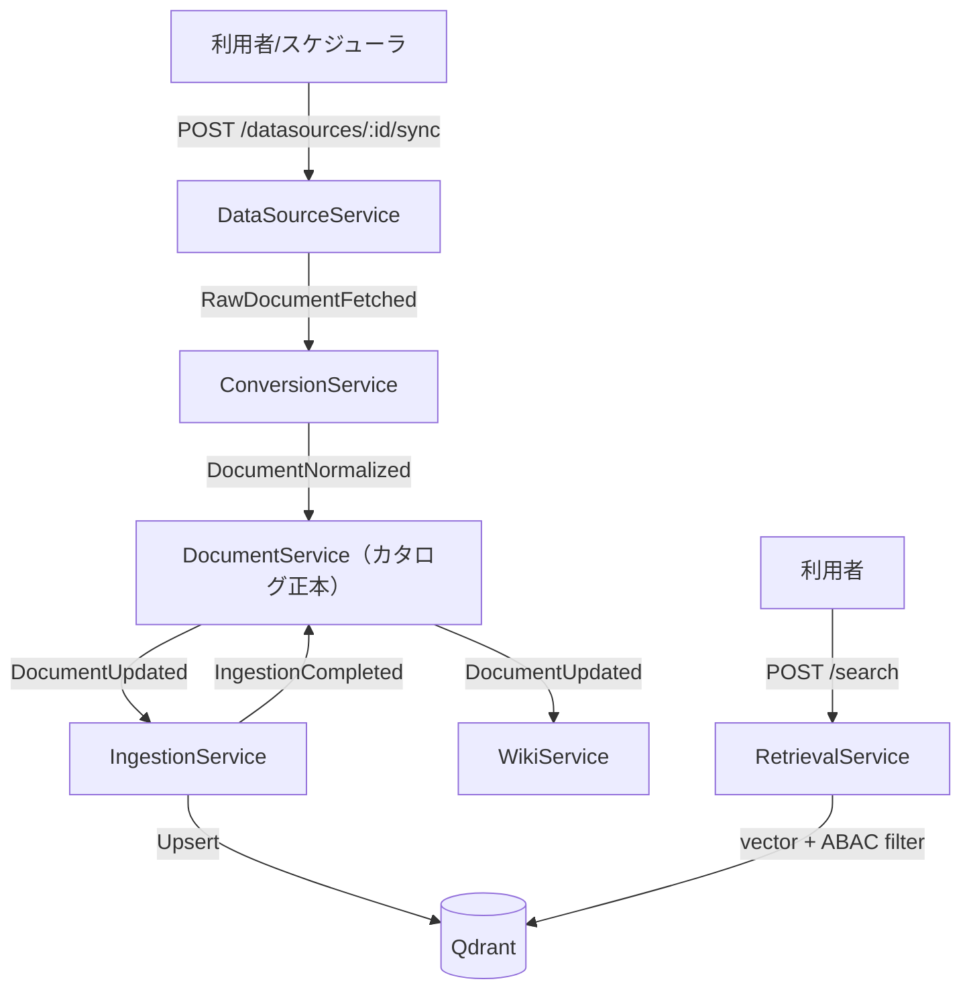

<!-- trace:
ids: [FR-01, UC-04]
adrs: []
iadrs: [IADR-0001, IADR-0055]
specs: [01_requirements, 20260627_FR-01_data-source-catalog-pipeline]
issues: [#195, #217, #218, #219, #546, planning#200]
-->

# 機能仕様書: データソース登録・同期・カタログ化

> 機能単位の仕様。計画リポジトリの要求・ユースケースを実装向けに詳細化する。

## 起点となる計画書（トレーサビリティ）

- 機能要求（FR）: FR-01
- ユースケース（UC）: UC-04
- 関連 ADR: ADR-0002（DB per Service）、ADR-0003（MassTransit + RabbitMQ。Superseded by ADR-0027・注記は #580）
- 実装 ADR: IADR-0001: カタログの正本所有と DocumentNormalized の購読責務
- 作業仕様書: 作業仕様書: FR-01 データソース同期→カタログ化パイプラインの接続

## 概要

複数の社内データソース（ファイルサーバー／Wiki／業務DB／SaaS）を登録し、同期によって取得した
文書を正規化（Markdown 化）してカタログに登録し、検索インデックスへ取り込む。
利用者は権限内の全データソースを横断検索でき、結果に出典が付く。

本機能はイベント駆動マイクロサービス（ADR-0003。Superseded by ADR-0027・注記は #580）で構成され、各サービスが疎結合に連携する。

## 機能詳細

| 項目 | 内容 |
| --- | --- |
| 入力 | データソース定義（名称・種別・接続URI・接続設定）、同期トリガ |
| 処理 | 登録 → 同期（原本取得）→ 変換（Markdown 正規化）→ **カタログ登録** → チャンク化・埋め込み → ベクトルストア登録 |
| 出力 | カタログ文書（正規化済）、検索可能なチャンク、横断検索結果（出典付き） |
| 業務ルール | 権限外文書は検索結果・AI回答に一切現れない（ABAC, FR-05）。更新は定義時間内に検索へ反映する。 |

## サービス構成とイベントフロー

## 処理フロー（同期→カタログ化）

1. `POST /datasources` でデータソースを登録（種別: `filesystem` / `wiki` / `db` / `saas`）。
2. `POST /datasources/{id}/sync` で同期を起動 → `RawDocumentFetched` を発行。
3. `ConversionService` が原本を Markdown へ正規化 → `DocumentNormalized` を発行。
4. **`DocumentService` が `DocumentNormalized` を購読し、カタログへ登録**（`status=normalized`、`MarkdownUri` 付き）→ `DocumentUpdated` を発行。
5. `IngestionService` が `DocumentUpdated` を購読し、チャンク化・埋め込み・Qdrant 登録 → `IngestionCompleted`。
6. `WikiService` が `DocumentUpdated` を購読し Wiki ページへ同期。
7. `RetrievalService` の `POST /search` がベクトル検索＋ABAC 属性フィルタで横断検索結果を返す。

## 実装状況（2026-07-19 時点）

| 区間 | 状態 | 備考 |
| --- | --- | --- |
| データソース CRUD | ✅ 実装済 | DataSourceService |
| 同期トリガ（`/sync`） | ✅ **実コネクタ経由（filesystem / wiki / saas / db）** | IADR-0051・#195（filesystem）／IADR-0053・#217（Wiki＝汎用 REST 契約）／IADR-0054・#218（SaaS＝汎用契約＋カーソルページング＋429 バックオフ）／IADR-0055・#219（業務DB＝参照専用 SQL・行→文書化）。実データを列挙・取得しストレージ格納＋実メタ付き `RawDocumentFetched` を発行。 |
| 定期同期（スケジューラ） | ✅ **HostedService（既定無効）** | `DataSourceSyncHostedService`（`DataSourceSync:Enabled`）。UC-04 基本フロー。 |
| 同期健全性（連続失敗回数・再試行上限・直近エラー） | ✅ **エンティティへ永続化し `DataSourceDto` で返す** | #537 / 裁定 Q14。**継続失敗のしきい値は再試行上限（5）に達した時点**。直近エラーは保存時点でマスクする。UC-04 例外フロー「継続失敗はアラートする」の表示側の土台（[[IADR-0148]]）。発報は構造化ログ（`Alert=true`。[[IADR-0051]] 決定 3a）で、Alertmanager への配線は未配備。 |
| 更新（`PUT` 全置換 / `PATCH` 部分更新） | ✅ **管理者限定** | #534 / 裁定 Q16。従前は「削除→再登録」しかなく **ID と履歴が切れた**（認証情報のローテーションのたびに文書の出所の追跡が切れる）。**更新は `Id` / `CreatedAt` / `LastSyncedAt` / 健全性を変えない**。 |
| 接続失敗の継続アラート | ✅ **インメモリ追跡** | 連続失敗閾値超過で構造化アラートログ（UC-04 例外フロー）。DB 永続化は follow-up。 |
| 変換（pandoc） | ✅ **実装済（pandoc 実変換・`--extract-media` 図抽出）** | `PandocConversionService`。pandoc 未導入／原本がローカル解決不能（実オブジェクトストレージ未接続・ADR-0014）の dev 環境ではプレースホルダ本文へグレースフルデグレード。 |
| **正規化文書→カタログ登録** | ✅ 実装済 | `DocumentNormalizedConsumer`。 |
| カタログ CRUD | ✅ 実装済 | DocumentService |
| チャンク化・埋め込み・Qdrant | ✅ 実装済 | IngestionService（Markdown 本文は `StorageDocumentContentReader` が取得。実オブジェクトストレージ未接続時はプレースホルダへデグレード） |
| 検索＋ABAC フィルタ | ✅ 実装済 | RetrievalService（結果の属性復元に既知欠陥） |

## 未決事項 / 後続タスク

- filesystem・Wiki・SaaS・業務DBの 4 コネクタは実装済み（優先1〜4）。
- 業務DB の実 SQL 正当性・参照専用ユーザー権限は実 PostgreSQL 統合テスト（DockerFact）で確認する follow-up。
- 他 DB プロバイダ（SQL Server/MySQL 等）アダプタ・CDC は follow-up。
- 製品固有アダプタ（Wiki=Confluence/MediaWiki 等・IADR-0053／SaaS=Salesforce/Notion 等・IADR-0054）・OAuth 更新・Webhook・
  実 API/コンテナ統合テストは follow-up。
- 実 filesystem 同期の対象ファイル共有（SMB/NFS）マウント手順（PVC）と、増分 watermark のスキャン開始時刻厳密化。
- 接続失敗状態・最終エラーの DB 永続化（SC-06 データソース管理 UI での可視化）。
- Vault 連携（接続情報の集中管理）。現状は `Config` からの取得（DB 平文保存・API 応答はマスク）に留める。Vault / External Secrets 移行は **#310** で一元追跡する。
- 実オブジェクトストレージ（ADR-0014・製品未確定）クライアントの接続。pandoc 実変換（`PandocConversionService`）・
  Markdown 本文取得（`StorageDocumentContentReader`）は実装済みだが、実ストレージ未接続時（`file://` 以外）はプレースホルダへデグレードする。
- 同期ジョブの進捗・状態管理。
- 検索結果への属性・タグ復元（`QdrantVectorStore`）。
- 出典（出自データソース）の永続化と検索結果への整形表示。
- 負荷試験による p95 レイテンシ確認。
