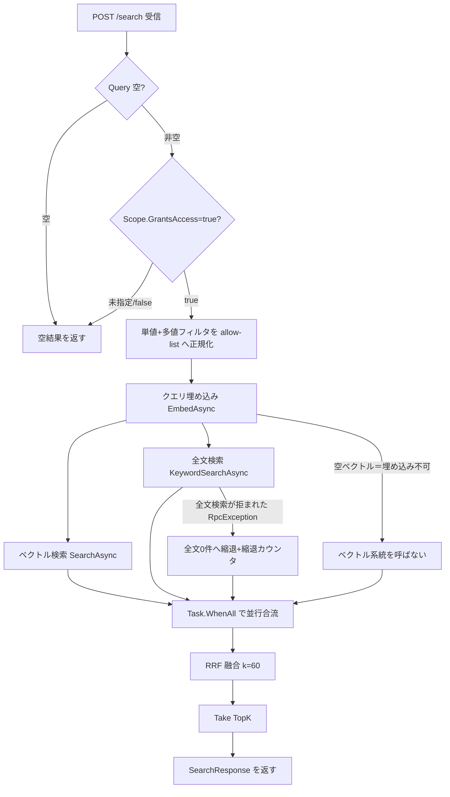

<!-- trace:
ids: [FR-03, FR-02, UC-01]
adrs: [ADR-0009, ADR-0016, ADR-0070]
iadrs: [IADR-0012, IADR-0014, IADR-0149, IADR-0150, IADR-0256, IADR-0313, IADR-0318, IADR-0339, IADR-0358]
specs: [20260809_issue-532_search-sort-order, 20260809_issue-536_search-result-updated-at, 20260823_issue-995_bff-search-500, 20260831_issue-1116_qdrant-fulltext-payload-index, 20260902_issue-1118_japanese-bigram-fulltext, 20260903_issue-1193_bodyless-document-metadata-index]
issues: [#536, #995, #1116, #1118, #1193]
-->

# 機能仕様書: ハイブリッド検索

## 起点となる計画書（トレーサビリティ）

- 機能要求: 「キーワードと自然文の双方で横断検索できる（ベクトル検索＋全文検索のハイブリッド）」
- ユースケース: 検索・質問する
- 業務フロー（04_workflows）: 横断検索 → 根拠提示付き AI 回答
- 計画書リンク: `02_requirements/01_requirements.md`、`07_adr/ADR-0009`（Qdrant ベクトルDB）

## 概要

利用者が 1 つの検索窓（`POST /search`）から、**自然文（意味検索＝ベクトル）** と **キーワード（語句一致＝全文検索）** の
双方で権限内データを横断検索できるようにする。ベクトル検索は型番・固有名詞・略語など埋め込みが苦手な語に弱く、
全文検索は同義・言い換えに弱いため、両系統を並行実行し **Reciprocal Rank Fusion（RRF）** で統合して双方の長所を併せ持つ。
権限制御は ABAC 属性フィルタを両系統に適用し、権限外の文書は候補にも融合結果にも一切現れない（deny-by-default）。
実装は `RetrievalService`（`HybridSearchService` / `IVectorStore`）に閉じ、ベクトルDB は Qdrantを用いる。

## 機能詳細

| 項目 | 内容 |
| --- | --- |
| 入力 | `SearchRequest`（`Query` 必須, `TopK`=10 既定, 後方互換の単値 `AttributeFilters`, ABAC `Scope`） |
| 処理 | fail-closed 検証（`Scope.GrantsAccess=true` のみ実行）→ 単値/多値フィルタを 1 本の allow-list へ正規化 → クエリ埋め込み → ベクトル検索と全文検索を候補数 `max(TopK*4, TopK)` で並行実行 → RRF（k=60）で統合 → `TopK` 件へ切り詰め |
| 出力 | `SearchResponse`（`Results: SearchResultDto[]`, `TotalHits`, `ElapsedMs`）。各結果に出典（`DocumentTitle`/`MarkdownUri`）と融合スコアを付与 |
| 業務ルール | ①`Query` 空・`Scope` 未指定/`GrantsAccess=false` は結果 0 件。②ABAC フィルタは両系統へ適用（フィルタ間 AND、値集合内 OR）。属性キーを持たない文書は不一致。③RRF は順位ベース（`score += 1/(60+rank+1)` を `ChunkId` 単位で加算）でスコアのスケール差を正規化なしに吸収。④全文検索は 2 系統のペイロードの全文インデックスを前提とする —— **識別子・型番・略語・英単語**は `text`（トークナイザ `multilingual`）、**日本語（CJK）の語**は `text_ngram`（取り込み時にアプリ側で CJK の連なりを 2-gram に割って空白区切りで並べた文字列。トークナイザ `prefix`・1〜2 文字）。クエリも同じ規則で CJK 以外と CJK に割り、それぞれの系統へ Match する（両方在れば両方必須）。公式イメージの `multilingual` は日本語の分かち書きを持たず、日本語の語が `text` で当たるかは連なりの切れ目次第で、実配備のチャンクではほぼ当たらない（実機で実測）。索引は取り込みサービスが起動時に、新規・既存のコレクションへ無条件・冪等に張り、`text_ngram` を持たない既存の点には起動後に後付けする（再取り込み不要）。索引が無いと全文側は全文検索として機能しない（ベクトルDB の版により、例外になる場合と、部分文字列の全走査へ黙って落ちる場合がある）。ベクトルDB が全文検索の要求を拒んだ場合はベクトルのみへ縮退し検索全体は失敗させない。⑤クエリ埋め込みが得られない（ゲートウェイが空ベクトルで応答）ときは意味検索の系統を落とし、全文のみで続行する（`semantic` 指定時は 0 件）。**空ベクトルをベクトルDB へ渡さない。** |

### SearchResultDto（検索結果 1 件＝チャンク単位）

| フィールド | 意味 |
| --- | --- |
| `ChunkId` / `DocumentId` | 該当チャンク・元文書の識別子（RRF は `ChunkId` を融合キーとする） |
| `DocumentTitle` | 元文書タイトル（出典表示） |
| `Text` | チャンク本文。**本文を持たない文書（`HasBody=false`）では空文字列**である（索引テキストは題名由来なので抜粋として返さない） |
| `Score` | 融合後スコア（RRF 合算値。順位ベースで再計算） |
| `MarkdownUri` | 正規化 Markdown へのリンク（出典。無い場合あり） |
| `Attributes` | ABAC 属性（`confidentiality`/`department` 等。Qdrant ペイロードから復元） |
| `Tags` | タグ |
| `UpdatedAt` | 文書の更新日時（Qdrant ペイロード `updated_at` から復元。#536 / 裁定 Q6）。**未再索引のチャンクは `null`** とし、`0001-01-01` で埋めない |
| `HasBody` | この結果が**本文由来か**（Qdrant ペイロード `has_body` から復元）。`false` は「本文を持たない文書をメタデータだけで索引した点」で、画面は抜粋の位置へ「本文なし（原本を参照）」を示す。**キーを持たない点は本文ありとして扱う**（既存の点はすべて本文チャンクである） |

## 処理フロー / 状態遷移

### 本文を持たない文書

本文が取り出せない原本（テキスト層を持たない PDF など）は、取り込み側が**題名・タグから作った索引テキストを
持つ点を 1 つだけ**索引へ載せる（本文由来のチャンク・埋め込みは 0 件）。検索から見ると:

- **通常の点と同じ 1 点**である —— ABAC フィルタ・削除・並び順・RRF はいずれも書き足しなしで効く。
  **本文が無いことを理由に権限判定は緩めない。**
- 全文検索は索引テキスト（題名・タグ）に当たる。**返す `Text` は空**で、`HasBody` が `false` になる。
- **結果からは除外しない**（存在を知る手段を残す）。ただし **RAG 回答の文脈・出典には入らない** ——
  根拠に使える本文が無いためである。

## 例外・エラー処理

| 条件 | 振る舞い | 備考 |
| --- | --- | --- |
| `Query` が空/空白 | 空結果（`[]`） | 防御。埋め込み・検索を呼ばない |
| `Scope` 未指定（null） | 空結果 | fail-closed。呼び出し側 Scope を無検証で信任しない |
| `Scope.GrantsAccess=false` | 空結果 | 許可ポリシー無し＝閲覧可能文書なし |
| 全文検索の要求が拒まれた（`RpcException`） | 全文 0 件へ縮退しベクトルのみで融合 | `LogWarning` ＋ **縮退カウンタ（理由 `backend_error`）**。検索全体は成功 |
| 🔴 **全文インデックスが無い** | **例外にならない。** ベクトルDB の版により、全文 `Match` が部分文字列の全走査へ黙って落ちる（語でない断片に当たり、語順に依存し、全点を走査する） | **応答からもログからも分からない。** 検索サービスの readiness（`qdrant-fulltext-index` ／ 日本語 2-gram 側は `qdrant-cjk-ngram-index`）が **Degraded** を返し、縮退カウンタ（理由 `missing_index` ／ `missing_ngram_index`）が上がる。**Unhealthy にはしない**（ベクトル側は生きており、検索は継続する） |
| **クエリ埋め込みが得られない（ゲートウェイが 200 ＋ 空ベクトル）** | **意味検索の系統を落とし全文のみで続行**（`semantic` 指定時は 0 件）。HTTP 200 | 送信拒否（越境ポリシーの fail-closed）・次元不整合・呼び出し失敗はいずれもこの形。**故障ではなく設計上の縮退**。`LogWarning` を出力 |
| **埋め込みゲートウェイへ到達できない／非 2xx** | **例外を伝播（HTTP 500）** | 🔴 **潰さない。** 200 ＋ 空へ縮退させると、後段が死んでいても検索が緑に見える |
| **ベクトル検索の `RpcException`** | **例外を伝播（HTTP 500）** | 同上。空ベクトルを渡さなくなったので、残るのは実際のベクトルDB 障害だけである |
| 両系統 0 件 | 空結果（HTTP 200） | エラーにしない |

## 受け入れ基準

- [x] 利用者は 1 つの検索窓（`POST /search`）からキーワード・自然文の双方で横断検索でき、結果に出典（`MarkdownUri`/`DocumentTitle`）が付く。
- [x] ベクトル検索結果と全文検索結果が RRF で統合され、両系統に現れる文書ほど上位になる。
- [x] 権限の無い文書は検索結果に現れない（ABAC 属性フィルタを両系統へ適用、deny-by-default）。**本文の有無で判定は変わらない。**
- [x] 本文を持たない文書が、その題名で検索結果に現れる（除外されない）。抜粋は空で `HasBody=false` を伴う。
- [ ] 文書更新後 15 分以内に反映（インジェスト経路の責務。本サービスは最新インデックスを参照するのみ）。
- [ ] p95 レイテンシ目標（負荷試験で別途確認。並行実行・候補数制限で素地を用意）。

## 関連仕様

- 作業仕様書: `../../.ai-context/specs/20260627_FR-03_hybrid-search.md`
- テスト仕様書: `../tests/FR-03_hybrid-search.md`
- 通信仕様書: `../api/openapi.yaml`（`/search`）
- データ仕様書: `../data/document-and-version.md`（未整備の場合あり）
- 関連機能: `../functional/FR-05_abac-access-control.md`（ABAC）、`../functional/FR-04_ai-answer-citations.md`（検索結果を出典化）

## 未決事項

- **日本語の全文検索は 2-gram（部分文字列一致に近い意味論）である**（業務ルール④）。実配備のチャンクで
  実在する日本語 25 語が全て当たり、在らない 5 語は 0 件であることを実機で測った。**精度は形態素解析に劣る**
  （`京都` は `東京都` に当たる。助詞を含むクエリはその並びのまま要求する）。ハイブリッド既定では
  ベクトル側と順位融合するため単独の誤ヒットが上位を占めにくいが、キーワード単独モードでは現れる。
  実運用で誤ヒットが問題になるなら、形態素解析器を積んだビルドか別エンジンの採否を計画側の裁定に掛ける
  （どちらも実装裁量の外）。
- RRF の k 値（現状 60）・候補数（`TopK*4`）の最終チューニングは負荷/精度試験の結果で見直す。
- Qdrant ペイロードのドット表現（フラット／ネスト構造体）の実機格納形は統合テストで確認する。
</content>
