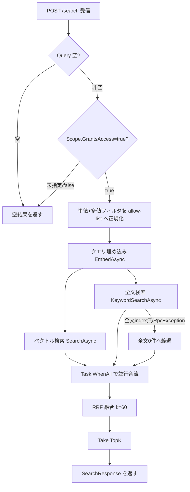

# 機能仕様書: ハイブリッド検索

## 起点となる計画書（トレーサビリティ）

- 機能要求（FR）: FR-03「キーワードと自然文の双方で横断検索できる（ベクトル検索＋全文検索のハイブリッド）」
- ユースケース（UC）: UC-01
- 業務フロー（04_workflows）: 横断検索 → 根拠提示付き AI 回答
- 計画書リンク: `02_requirements/01_requirements.md`、`07_adr/ADR-0009`（Qdrant ベクトルDB）

## 概要

利用者が 1 つの検索窓（`POST /search`）から、**自然文（意味検索＝ベクトル）** と **キーワード（語句一致＝全文検索）** の
双方で権限内データを横断検索できるようにする。ベクトル検索は型番・固有名詞・略語など埋め込みが苦手な語に弱く、
全文検索は同義・言い換えに弱いため、両系統を並行実行し **Reciprocal Rank Fusion（RRF）** で統合して双方の長所を併せ持つ。
権限制御は ABAC 属性フィルタを両系統に適用し、権限外の文書は候補にも融合結果にも一切現れない（deny-by-default）。
実装は `RetrievalService`（`HybridSearchService` / `IVectorStore`）に閉じ、ベクトルDB は Qdrant（ADR-0009）を用いる。

## 機能詳細

| 項目 | 内容 |
| --- | --- |
| 入力 | `SearchRequest`（`Query` 必須, `TopK`=10 既定, 後方互換の単値 `AttributeFilters`, ABAC `Scope`） |
| 処理 | fail-closed 検証（`Scope.GrantsAccess=true` のみ実行）→ 単値/多値フィルタを 1 本の allow-list へ正規化 → クエリ埋め込み → ベクトル検索と全文検索を候補数 `max(TopK*4, TopK)` で並行実行 → RRF（k=60）で統合 → `TopK` 件へ切り詰め |
| 出力 | `SearchResponse`（`Results: SearchResultDto[]`, `TotalHits`, `ElapsedMs`）。各結果に出典（`DocumentTitle`/`MarkdownUri`）と融合スコアを付与 |
| 業務ルール | ①`Query` 空・`Scope` 未指定/`GrantsAccess=false` は結果 0 件。②ABAC フィルタは両系統へ適用（フィルタ間 AND、値集合内 OR）。属性キーを持たない文書は不一致。③RRF は順位ベース（`score += 1/(60+rank+1)` を `ChunkId` 単位で加算）でスコアのスケール差を正規化なしに吸収。④全文インデックス未作成時はベクトルのみへ縮退し検索全体は失敗させない。 |

### SearchResultDto（検索結果 1 件＝チャンク単位）

| フィールド | 意味 |
| --- | --- |
| `ChunkId` / `DocumentId` | 該当チャンク・元文書の識別子（RRF は `ChunkId` を融合キーとする） |
| `DocumentTitle` | 元文書タイトル（出典表示） |
| `Text` | チャンク本文 |
| `Score` | 融合後スコア（RRF 合算値。順位ベースで再計算） |
| `MarkdownUri` | 正規化 Markdown へのリンク（出典。無い場合あり） |
| `Attributes` | ABAC 属性（`confidentiality`/`department` 等。Qdrant ペイロードから復元） |
| `Tags` | タグ |
| `UpdatedAt` | 文書の更新日時（Qdrant ペイロード `updated_at` から復元。#536 / 裁定 Q6）。**未再索引のチャンクは `null`**（[[IADR-0149]] 決定 3。`0001-01-01` で埋めない） |

## 処理フロー / 状態遷移

## 例外・エラー処理

| 条件 | 振る舞い | 備考 |
| --- | --- | --- |
| `Query` が空/空白 | 空結果（`[]`） | 防御。埋め込み・検索を呼ばない |
| `Scope` 未指定（null） | 空結果 | fail-closed。呼び出し側 Scope を無検証で信任しない（IADR-0012） |
| `Scope.GrantsAccess=false` | 空結果 | 許可ポリシー無し＝閲覧可能文書なし |
| 全文インデックス未作成（`RpcException`） | 全文 0 件へ縮退しベクトルのみで融合 | `LogWarning` を出力、検索全体は成功 |
| 両系統 0 件 | 空結果（HTTP 200） | エラーにしない |

## 受け入れ基準

- [x] 利用者は 1 つの検索窓（`POST /search`）からキーワード・自然文の双方で横断検索でき、結果に出典（`MarkdownUri`/`DocumentTitle`）が付く。
- [x] ベクトル検索結果と全文検索結果が RRF で統合され、両系統に現れる文書ほど上位になる。
- [x] 権限の無い文書は検索結果に現れない（ABAC 属性フィルタを両系統へ適用、deny-by-default）。
- [ ] 文書更新後 15 分以内に反映（インジェスト経路の責務。本サービスは最新インデックスを参照するのみ）。
- [ ] p95 レイテンシ目標（負荷試験で別途確認。並行実行・候補数制限で素地を用意）。

## 関連仕様

- 作業仕様書: `../specs/20260627_FR-03_hybrid-search.md`
- テスト仕様書: `../tests/FR-03_hybrid-search.md`
- 通信仕様書: `../api/openapi.yaml`（`/search`）
- データ仕様書: `../data/document-and-version.md`（未整備の場合あり）
- 関連機能: `../functional/FR-05_abac-access-control.md`（ABAC）、`../functional/FR-04_ai-answer-citations.md`（検索結果を出典化）

## 未決事項

- 全文インデックスのブートストラップ位置（インジェスト側コレクション作成時）の確定 → 別 Issue。
- RRF の k 値（現状 60）・候補数（`TopK*4`）の最終チューニングは負荷/精度試験の結果で見直す。
- Qdrant ペイロードのドット表現（フラット／ネスト構造体）の実機格納形は統合テスト（IADR-0014）で確認する。
</content>
