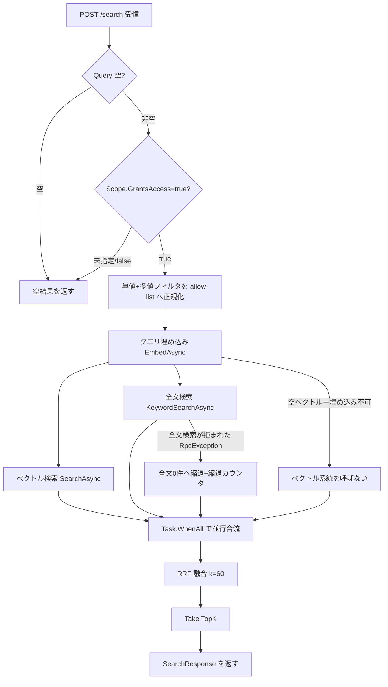

<!-- trace:
ids: [FR-03, FR-02, FR-05, UC-01, FR-04, FR-11, FR-19, SC-02]
adrs: [ADR-0009, ADR-0016, ADR-0017, ADR-0127, ADR-0043, ADR-0057, ADR-0070, ADR-0092, ADR-0010, ADR-0018, ADR-0044, ADR-0061]
iadrs: [IADR-0012, IADR-0014, IADR-0149, IADR-0150, IADR-0151, IADR-0256, IADR-0313, IADR-0318, IADR-0339, IADR-0358, IADR-0388, IADR-0422, IADR-0467, IADR-0497, IADR-0498, IADR-0512]
specs: [20260809_issue-532_search-sort-order, 20260809_issue-536_search-result-updated-at, 20260823_issue-995_bff-search-500, 20260831_issue-1116_qdrant-fulltext-payload-index, 20260902_issue-1118_japanese-bigram-fulltext, 20260903_issue-1193_bodyless-document-metadata-index, 20260905_issue-1253-1254_bodyless-index-and-hasbody-vocabulary, 20260926_issue-336_multi-collection-rrf-fusion, 20261005_1746_high-confidentiality-lexical-index, 20261006_1746_claude-rerank, 20261007_1771_ingestion-event-wiring-docs, 20261008_1752_rag-ai-input-exposure-purpose]
issues: [#1746, #336, #536, #995, #1116, #1118, #1193, #1253, #1254, #1771, #1752]
-->

# 機能仕様書: ハイブリッド検索

## 起点となる計画書（トレーサビリティ）

- 機能要求: 「キーワードと自然文の双方で横断検索できる（ベクトル検索＋全文検索のハイブリッド）」
- ユースケース: 検索・質問する
- 業務フロー（04_workflows）: 横断検索 → 根拠提示付き AI 回答
- 計画書リンク: `02_requirements/01_requirements.md`、`07_adr/ADR-0009`（Qdrant ベクトルDB）

## 概要

利用者が 1 つの検索窓（`POST /search`）から、**自然文（意味検索＝ベクトル）** と **キーワード（語句一致＝全文検索）** の
双方で権限内データを横断検索できるようにする。ベクトル検索は型番・固有名詞・略語など埋め込みが苦手な語に弱く、
全文検索は同義・言い換えに弱いため、両系統を並行実行し **Reciprocal Rank Fusion（RRF）** で統合して双方の長所を併せ持つ。
権限制御は ABAC 属性フィルタを両系統に適用し、権限外の文書は候補にも融合結果にも一切現れない（deny-by-default）。
実装は `RetrievalService`（`HybridSearchService` / `IVectorStore`）に閉じ、ベクトルDB は Qdrantを用いる。

## 機能詳細

| 項目 | 内容 |
| --- | --- |
| 入力 | `SearchRequest`（`Query` 必須, `TopK`=10 既定, 後方互換の単値 `AttributeFilters`, ABAC `Scope`） |
| 処理 | fail-closed 検証（`Scope.GrantsAccess=true` のみ実行）→ 単値/多値フィルタを 1 本の allow-list へ正規化 → クエリ埋め込み → ベクトル検索と全文検索を候補数 `max(TopK*4, TopK)` で並行実行 → RRF（k=60）で統合 → `TopK` 件へ切り詰め |
| 出力 | `SearchResponse`（`Results: SearchResultDto[]`, `TotalHits`, `ElapsedMs`）。各結果に出典（`DocumentTitle`/`MarkdownUri`）と融合スコアを付与 |
| 業務ルール | ①`Query` 空・`Scope` 未指定/`GrantsAccess=false` は結果 0 件。②ABAC フィルタは両系統へ適用（フィルタ間 AND、値集合内 OR）。属性キーを持たない文書は不一致。③RRF は順位ベース（`score += 1/(60+rank+1)` を `ChunkId` 単位で加算）でスコアのスケール差を正規化なしに吸収。④全文検索は 2 系統のペイロードの全文インデックスを前提とする —— **識別子・型番・略語・英単語**は `text`（トークナイザ `multilingual`）、**日本語（CJK）の語**は `text_ngram`（取り込み時にアプリ側で CJK の連なりを 2-gram に割って空白区切りで並べた文字列。トークナイザ `prefix`・1〜2 文字）。クエリも同じ規則で CJK 以外と CJK に割り、それぞれの系統へ Match する（両方在れば両方必須）。公式イメージの `multilingual` は日本語の分かち書きを持たず、日本語の語が `text` で当たるかは連なりの切れ目次第で、実配備のチャンクではほぼ当たらない（実機で実測）。索引は取り込みサービスが起動時に、新規・既存のコレクションへ無条件・冪等に張り、`text_ngram` を持たない既存の点には起動後に後付けする（再取り込み不要）。索引が無いと全文側は全文検索として機能しない（ベクトルDB の版により、例外になる場合と、部分文字列の全走査へ黙って落ちる場合がある）。ベクトルDB が全文検索の要求を拒んだ場合はベクトルのみへ縮退し検索全体は失敗させない。⑤クエリ埋め込みが得られない（ゲートウェイが空ベクトルで応答）ときは意味検索の系統を落とし、全文のみで続行する（`semantic` 指定時は 0 件）。**空ベクトルをベクトルDB へ渡さない。** |

### SearchResultDto（検索結果 1 件＝チャンク単位）

| フィールド | 意味 |
| --- | --- |
| `ChunkId` / `DocumentId` | 該当チャンク・元文書の識別子（RRF は `ChunkId` を融合キーとする） |
| `DocumentTitle` | 元文書タイトル（出典表示） |
| `Text` | チャンク本文。**本文を持たない文書（`HasBody=false`）では空文字列**である（索引テキストは題名由来なので抜粋として返さない） |
| `Score` | 融合後スコア（RRF 合算値。順位ベースで再計算） |
| `MarkdownUri` | 正規化 Markdown へのリンク（出典。無い場合あり） |
| `Attributes` | ABAC 属性（`confidentiality`/`department` 等。Qdrant ペイロードから復元） |
| `Tags` | タグ |
| `UpdatedAt` | 文書の更新日時（Qdrant ペイロード `updated_at` から復元。#536 / 裁定 Q6）。**未再索引のチャンクは `null`** とし、`0001-01-01` で埋めない |
| `HasBody` | この結果が**本文由来か**（Qdrant ペイロード `has_body` から復元）。`false` は「本文を持たない文書をメタデータだけで索引した点」で、画面は抜粋の位置へ「本文なし（原本を参照）」を示す。**キーを持たない点は本文ありとして扱う**（既存の点はすべて本文チャンクである） |

## 処理フロー / 状態遷移


```mermaid
flowchart TD
  A[POST /search 受信] --> B{Query 空?}
  B -->|空| Z[空結果を返す]
  B -->|非空| C{Scope.GrantsAccess=true?}
  C -->|未指定/false| Z
  C -->|true| D[単値+多値フィルタを allow-list へ正規化]
  D --> E[クエリ埋め込み EmbedAsync]
  E --> F[ベクトル検索 SearchAsync]
  E --> G[全文検索 KeywordSearchAsync]
  F --> H[Task.WhenAll で並行合流]
  G --> H
  H --> I[RRF 融合 k=60]
  I --> J[Take TopK]
  J --> K[SearchResponse を返す]
  G -->|全文検索が拒まれた RpcException| L[全文0件へ縮退+縮退カウンタ]
  L --> H
  E -->|空ベクトル＝埋め込み不可| M[ベクトル系統を呼ばない]
  M --> H
```

### 本文を持たない文書

本文が取り出せない原本（テキスト層を持たない PDF など）は、取り込み側が**題名・タグ・取り込み元の
パス・データソース名から作った索引テキストを持つ点を 1 つだけ**索引へ載せる（本文由来のチャンク・
埋め込みは 0 件）。検索から見ると:

- **通常の点と同じ 1 点**である —— ABAC フィルタ・削除・並び順・RRF はいずれも書き足しなしで効く。
  **本文が無いことを理由に権限判定は緩めない。**
- 全文検索は索引テキスト（題名・タグ・パス・データソース名）に当たる。**返す `Text` は空**で、
  `HasBody` が `false` になる。
  **［2026-09-05］パスとデータソース名を足した。** 従前は題名でしか当たらず、置き場所や
  取り込み元の名前で探す利用者はその文書へ辿り着けなかった。
  🔴 **本文ありの点にはパスもデータソース名も入らない**（意図した非対称）。入れると
  「本文に書いてある語で当たった」と「置き場所の名前で当たった」が抜粋から区別できなくなる。
- **結果からは除外しない**（存在を知る手段を残す）。ただし **RAG 回答の文脈・出典には入らない** ——
  根拠に使える本文が無いためである。

#### 「本文の有無」の綴りは 1 つである（2026-09-05）

同じ概念の綴りが変換側と検索側で割れていた（変換側が否定形・検索側が肯定形で、極性が逆）。
**肯定形 `hasBody`（`true`＝本文あり）へ寄せ、極性も揃えた。** 読み替えの対応表は
[`docs/data/conversion-job.md`](../data/conversion-job.md) §本文の有無の語彙が正本であり、ここへ複写しない。

- 索引ペイロードのキーは `has_body` のままである（**本文なしの点だけが持つ**。欠落＝本文あり）。
- 変換ジョブ・文書詳細・検索結果はいずれも `hasBody` を読む。**画面ごとに引き直す必要は無い。**

### 機密区分で分けたコレクションを束ねる（2026-09-26）

埋め込みはモデルごとにコレクションを分けている（異なるモデルのベクトルは同じ空間で比べられない）。
高機密の文書はセルフホストのモデル（ティア A）で埋め込まれ、既定のモデル（ティア B）とは**別のコレクション**に入る。
検索は**主コレクション**（`Qdrant:CollectionName`）に加えて、**束ねる追加コレクション**（`Qdrant:FusedCollections`。**既定は空**）も読み、
**1 回の検索で 1 つの並び**を返す。**検索面を機密区分で分けない**（「高機密はこちら」と見せることがその区分の文書の存在を明かすため）。

| 項目 | 内容 |
| --- | --- |
| 束ね方 | コレクションごとにベクトル系統と全文系統を引き、**全系統を 1 回の RRF に平らに入れる**（並び: 主ベクトル → 主全文 → 追加ベクトル → 追加全文）。k=60・候補幅は上表と同じ・重みは全系統 1 |
| スコア | 🔴 **比べない。** モデルが違えばスコアの意味が違う。並びは順位だけで決まり、`Score` は RRF の合算値になる |
| 同点 | 先に現れた方が先（上の並び順。主が追加より先） |
| クエリの埋め込み | 追加コレクションは**そのコレクションのモデルで**埋める。検索サービスは埋め込み要求にコレクション名を名乗り、埋め込みゲートウェイが越境判定の**後で**そのコレクションの送信先へ絞る（許されていない区分を開くことはできない）。主コレクションの要求は名乗らない（従来どおり） |
| 全文 | **全文も束ねる。** 全文検索もコレクションを読むので、束ねないと追加コレクションの文書はキーワードでも見つからない |
| 権限 | 🔴 **ABAC フィルタは全コレクションの全系統に常に掛ける。** 利用者のスコープが高機密を許さなくても問い合わせは省かず、権限外の点はフィルタが落とす（省略を統制の担い手にしない） |
| 権限内属性値・削除 | 属性値の候補は**全コレクションの和集合**（件数は持たない）。文書削除は**全コレクションから**消す |
| 既定 | 追加が空なら、戻り値・`Score`・並び・呼び出し回数は束ねる前と**同一**である。Helm はセルフホスト埋め込み（`embedding.enabled`）を有効にしたときだけティア A のコレクションを追加に描画する |

モードごとの縮退: hybrid では追加コレクションだけ埋め込めないとき、そのコレクションのベクトル系統だけを落として全文は引く。
semantic では埋め込めたコレクションだけで束ね、**全コレクションが埋め込めなければ 0 件**（全文へ振り替えない）。

**束ねないもの**: 二段検索の段（近傍展開の起点と、文書 ID に絞った再検索）は主コレクションのまま。
二段検索（知識グラフの近傍で再ランクする段）は**既定無効**である —— 構成 `GraphExpansion:Enabled` が真のときだけ働き、
配備の構成（Helm・compose）はいずれもこれを注入していない。既存の検索と比べられるよう既定はオフ・明示的に有効化する方式にしている。
全文索引の readiness も主コレクションだけを見る（追加コレクションの索引は取り込みサービスが同じ手順で張る）。

> **［2026-10-05］高機密文書は埋め込まなくなった。** 上の「高機密の文書はセルフホストのモデル（ティア A）で埋め込まれ」は、
> 次節の語彙索引に改まった。セルフホストのコレクションを束ねる仕組み（本節）はそのまま残る（有効にしたときだけ使われる）。
> 本節の「既定は空」「追加が空の既定では束ねる前と同一」は、**語彙索引を常に束ねるようになったため既定では成り立たない**（次節）。

### 高機密文書は語彙索引から全文の系統だけで現れる（2026-10-05）

`confidential`・`restricted`・機密区分が未指定・未知の文書は埋め込みを持たず、**ベクトルを持たない専用のコレクション**
（語彙索引。`Qdrant:LexicalCollection`。既定 `knowledge_chunks_lexical`）にだけ載る（[取り込み 機能仕様書](./FR-02_ingestion.md) §高機密文書）。
検索は語彙索引を**常に**束ねる追加コレクションの最後に置き、**全文の系統だけ**で扱う。

| モード | 語彙索引の扱い |
| --- | --- |
| keyword | 主（と他の追加コレクション）の全文と同じく引き、**全文の並びを RRF で合成する**（`Score` は RRF の値） |
| hybrid（既定） | 全文の系統 1 本として、上の 1 回の RRF に平らに入る。**クエリを埋めない**（埋め込みゲートウェイを呼ばない）・**ベクトル検索を引かない**・縮退の警告を出さない（設計どおりの欠落である） |
| semantic | **問い合わせない**（高機密文書は意味検索のモードに現れない。利用者が選んだモードを系が変えない）。束ねたのが語彙索引だけなら、意味検索は従来の単一コレクションの経路のまま（生スコア） |

- 🔴 **ABAC フィルタは語彙索引の全文の系統にも主と同じものを掛ける。** 権限外の高機密文書は現れない。
- 文書削除・権限内属性値は、追加コレクションの全部（語彙索引を含む）へ効く。
- 語彙索引の名前は取り込みと同じ設定キー・同じ既定名であり、主・追加コレクションと同名なら起動時に止まる。無効化の口は無い。
- 全文索引の readiness は主コレクションだけを見る（語彙索引の索引は取り込みサービスが起動時に張り、失敗は取り込みのログに出る）。

### Claude による再順位付け（2026-10-06・既定は無効）

並び「関連度」の候補を、Claude（LLM ゲートウェイの用途 `rerank`）で並べ替える段である。**構成 `Rerank:Enabled` が真のときだけ働く（既定は偽）**。
段は検索の**唯一の出口**（`HybridSearchService.FinishAsync`）に挟まり、素の検索・二段検索のどちらの出口も通るので、
**検索結果一覧（画面）と RAG 回答の候補（AI 分析は本サービスの検索で候補を得る）の両方**に効く。

```text
候補（ABAC 後・検索の用途の露出トグルで落とした後・切り詰め前。一覧は「横断検索に含める」、RAG 回答の候補は「AI の入力に含める」）
  → 掛けるか（hybrid / keyword・並び relevance・合成監視でない）
  → 窓（先頭 Rerank:CandidateCount 件。既定 20）の中で「AI の入力に含める」が許す候補だけを選ぶ（2 件未満なら呼ばない）
  → 送る候補の最も高い機密区分・用途 rerank で LLM ゲートウェイを 1 回呼ぶ（期限 Rerank:TimeoutSeconds。既定 8 秒）
  → 出力の番号を検証し、送った候補の位置の間だけで並べ替える
  → 並び順を適用して topK へ切る（従来の Finish）
```

| 項目 | 振る舞い |
| --- | --- |
| 掛ける検索 | hybrid・keyword（未指定・未知は hybrid）で、並びが relevance（未指定・未知を含む）。**semantic・updated・合成監視（`X-Synthetic-Traffic`）には掛けない**。高機密を含むかどうかでは分けない |
| 送る候補 | 窓の中で `AiInputExposure.IsAllowed` が真の候補（組織文書は常に真・個人資料は `ai_input` が `included` のときだけ）。**送れない候補は窓の中の元の位置に留まる**。ABAC で落ちた候補・検索の用途の露出トグル（一覧は「横断検索に含める」、RAG 回答の候補は「AI の入力に含める」）が OFF の候補は段に届かない |
| 送る内容 | 検索語・各候補の題名（200 字まで）・本文（`Rerank:MaxCharsPerCandidate` 字まで。既定 400）。本文の無い文書は題名だけ。ID は 1 からの連番（文書 ID を見せない） |
| 越境 | 送る候補の最も高い機密区分（未指定・未知は `restricted`）で判定させる。ゲートウェイは用途 `rerank` を**機密区分によらず ZDR 必須**として扱う（非 ZDR モデル・ティア C を除く） |
| モデル・費用 | 用途 `rerank` → `claude-haiku-4-5`（鎖なし）。費用はゲートウェイの用途別・モデル別の計器に `rerank` として積まれる |
| 出力 | `{"ranking":[番号,...]}`（裸の配列も受ける）。範囲外・重複・小数は捨て、言い漏らしは元の順で後ろに足す。**候補はモデルの出力から作らない**（並べ替えだけ） |
| プロンプト注入 | 題名・本文・検索語は区切りの内側に置き、`<` `>` を全角へ置き換える（区切りを閉じられない）。指示文は区切りの中の命令に従わないと言う |
| `Score` | 検索の値（RRF 等）のまま。並びと単調でなくなる |
| 計器 | `search.rerank.total`（`search.rerank_result` = applied / degraded / skipped、`search.rerank_reason`） |
| 合成監視 | 内周の標識（`X-Synthetic-Traffic`）で見分けて呼ばない。標識は AI 分析の検索の輸送（REST はヘッダ・gRPC はメタデータ）と BFF の横断検索（合成監視の主体のとき）が付ける。ゲートウェイへの呼び出しにも引き継ぐ |
| 取り消し | 利用者の取り消しは取り消しのまま上げる（gRPC の `Cancelled` / `DeadlineExceeded` も取り消しとして扱う）。段の期限は `timeout` として元の順へ戻す |

## 例外・エラー処理

| 条件 | 振る舞い | 備考 |
| --- | --- | --- |
| `Query` が空/空白 | 空結果（`[]`） | 防御。埋め込み・検索を呼ばない |
| `Scope` 未指定（null） | 空結果 | fail-closed。呼び出し側 Scope を無検証で信任しない |
| `Scope.GrantsAccess=false` | 空結果 | 許可ポリシー無し＝閲覧可能文書なし |
| 全文検索の要求が拒まれた（`RpcException`） | 全文 0 件へ縮退しベクトルのみで融合 | `LogWarning` ＋ **縮退カウンタ（理由 `backend_error`）**。検索全体は成功 |
| 🔴 **全文インデックスが無い** | **例外にならない。** ベクトルDB の版により、全文 `Match` が部分文字列の全走査へ黙って落ちる（語でない断片に当たり、語順に依存し、全点を走査する） | **応答からもログからも分からない。** 検索サービスの readiness（`qdrant-fulltext-index` ／ 日本語 2-gram 側は `qdrant-cjk-ngram-index`）が **Degraded** を返し、縮退カウンタ（理由 `missing_index` ／ `missing_ngram_index`）が上がる。**Unhealthy にはしない**（ベクトル側は生きており、検索は継続する） |
| **クエリ埋め込みが得られない（ゲートウェイが 200 ＋ 空ベクトル）** | **意味検索の系統を落とし全文のみで続行**（`semantic` 指定時は 0 件）。HTTP 200 | 送信拒否（越境ポリシーの fail-closed）・次元不整合・呼び出し失敗はいずれもこの形。**故障ではなく設計上の縮退**。`LogWarning` を出力 |
| **埋め込みゲートウェイへ到達できない／非 2xx** | **例外を伝播（HTTP 500）** | 🔴 **潰さない。** 200 ＋ 空へ縮退させると、後段が死んでいても検索が緑に見える |
| **ベクトル検索の `RpcException`** | **例外を伝播（HTTP 500）** | 同上。空ベクトルを渡さなくなったので、残るのは実際のベクトルDB 障害だけである |
| 両系統 0 件 | 空結果（HTTP 200） | エラーにしない |
| **再順位付けが失敗した**（時間切れ・ゲートウェイに届かない・送信を拒否された・モデルが拒否した・出力を解釈できない） | **元の順で返す**（HTTP 200）。ゲートウェイ以外へは送らない・投げ直さない（1 検索あたり最大 1 回） | `LogWarning`（理由と件数だけ）＋ `search.rerank.total{result=degraded}`。利用者の取り消しは取り消しのまま上げる |
| **追加コレクションのクエリだけ埋め込めない**（ティア A の推論基盤の不調・無効） | そのコレクションのベクトル系統だけを落とし、全文と主コレクションは続行（semantic で全コレクションが埋め込めなければ 0 件）。HTTP 200 | コレクション名つきの `LogWarning`。ゲートウェイが別のコレクションを答えた場合もその系統を捨てる |

## 受け入れ基準

- [x] 利用者は 1 つの検索窓（`POST /search`）からキーワード・自然文の双方で横断検索でき、結果に出典（`MarkdownUri`/`DocumentTitle`）が付く。
- [x] ベクトル検索結果と全文検索結果が RRF で統合され、両系統に現れる文書ほど上位になる。
- [x] 権限の無い文書は検索結果に現れない（ABAC 属性フィルタを両系統へ適用、deny-by-default）。**本文の有無で判定は変わらない。**
- [x] 本文を持たない文書が、その題名で検索結果に現れる（除外されない）。抜粋は空で `HasBody=false` を伴う。
- [x] 機密区分で分けたコレクションの文書が、1 つの検索窓・1 つの並びで見つかる（順位で束ね、スコアは比べない。全文も束ねる）。追加が空の既定では束ねる前と同一。
- [x] 束ねたコレクションにも同じ ABAC フィルタが全系統で掛かり、権限外の高機密文書は現れない。
- [x] 高機密文書（`confidential`・`restricted`・機密区分が未指定・未知）は、キーワードとハイブリッドのモードで見つかり、意味検索のモードには現れない。ABAC は語彙索引の系統にも掛かる。
- [x] 再順位付けを有効にすると、検索結果一覧（hybrid / keyword・関連度）と RAG 回答の候補が Claude の判断で並べ替わる。送るのは ABAC 後で「AI の入力に含める」が許す候補だけで、越境は送った候補の最も高い機密区分（未指定・未知は `restricted`）・ZDR 必須で判定される。失敗は元の順で返る。既定は無効。
- [ ] 「全文のみ＋再順位付け」と「ハイブリッド（既定モデル）」の関連性（nDCG@10）の差を、公開可能な標本で測って記録する（閾値は置かない）。
- [ ] 文書更新後 15 分以内に反映（インジェスト経路の責務。本サービスは最新インデックスを参照するのみ）。
- [ ] p95 レイテンシ目標（負荷試験で別途確認。並行実行・候補数制限で素地を用意）。

## 関連仕様

- 作業仕様書: `../../.ai-context/specs/20260627_FR-03_hybrid-search.md`
- テスト仕様書: `../tests/FR-03_hybrid-search.md`
- 通信仕様書: `../api/openapi.yaml`（`/search`）
- データ仕様書: `../data/document-and-version.md`（未整備の場合あり）
- 関連機能: `../functional/FR-05_abac-access-control.md`（ABAC）、`../functional/FR-04_ai-answer-citations.md`（検索結果を出典化）

## 未決事項

- **日本語の全文検索は 2-gram（部分文字列一致に近い意味論）である**（業務ルール④）。実配備のチャンクで
  実在する日本語 25 語が全て当たり、在らない 5 語は 0 件であることを実機で測った。**精度は形態素解析に劣る**
  （`京都` は `東京都` に当たる。助詞を含むクエリはその並びのまま要求する）。ハイブリッド既定では
  ベクトル側と順位融合するため単独の誤ヒットが上位を占めにくいが、キーワード単独モードでは現れる。
  実運用で誤ヒットが問題になるなら、形態素解析器を積んだビルドか別エンジンの採否を計画側の裁定に掛ける
  （どちらも実装裁量の外）。
- RRF の k 値（現状 60）・候補数（`TopK*4`）の最終チューニングは負荷/精度試験の結果で見直す。
- Qdrant ペイロードのドット表現（フラット／ネスト構造体）の実機格納形は統合テストで確認する。
</content>
