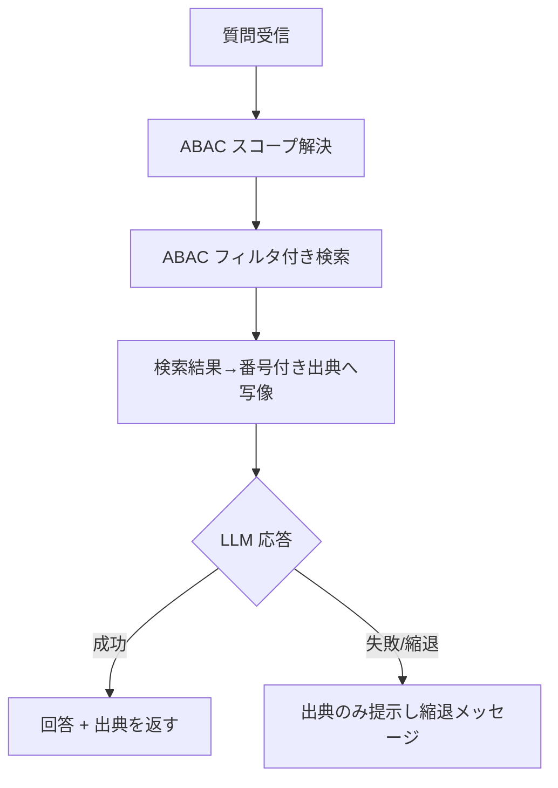

# 機能仕様書: AI 回答・出典提示

## 起点となる計画書（トレーサビリティ）

- 機能要求（FR）: FR-04
- ユースケース（UC）: UC-01, UC-02
- 業務フロー（04_workflows）: 横断検索 → 根拠提示付き AI 回答
- 計画書リンク: `02_requirements/01_requirements.md`、`07_adr/ADR-0010`

## 概要

利用者の質問に対し、権限内のデータソースを横断検索した結果を根拠として AI が回答を生成し、
回答の各記述に対応する**番号付き出典（元文書へのリンク）** を提示する。利用者は出典から
元文書へ辿り、回答の妥当性を自分で検証できる。

## 機能詳細

| 項目 | 内容 |
| --- | --- |
| 入力 | `question`（必須）, `scope`（任意） / 利用者の資格情報（JWT クレーム: clearance, department） |
| 処理 | ABAC スコープ解決 → ABAC フィルタ付きハイブリッド検索（TopK=5）→ 検索結果を番号付き出典へ写像 → 出典文脈で LLM 回答生成 |
| 出力 | `AiAnswerDto`（`Answer`, `Citations[]`, `Model`, `InputTokens`, `OutputTokens`） |
| 業務ルール | 出典番号は 1 始まり連番。回答本文の `[n]` と出典 `Number` を一致させる。元文書リンクは正規化 Markdown URI を優先し、無ければ `/documents/{id}`。根拠の無い情報は回答に含めない。 |

### CitationDto（出典）

| フィールド | 意味 |
| --- | --- |
| `Number` | 出典番号（1 始まり、回答本文 `[n]` と対応） |
| `DocumentId` / `ChunkId` | 元文書・該当チャンクの識別子 |
| `DocumentTitle` | 元文書タイトル |
| `SourceUri` | 元文書へのリンク（Markdown URI もしくは `/documents/{id}`） |
| `Score` | 検索スコア |
| `Snippet` | 該当箇所の抜粋（240 文字で丸め） |

## 処理フロー / 状態遷移

## 例外・エラー処理

| 条件 | 振る舞い | エラー表示 |
| --- | --- | --- |
| 検索結果 0 件 | 出典空・該当なしメッセージ | 「関連する情報が見つかりませんでした。」 |
| LLM 不調 | 検索結果（出典）のみ提示する縮退 | 「LLM が現在利用できないため、関連文書の一覧を返します。」 |
| 権限スコープ解決失敗 | フィルタ無し扱いを避け空スコープで継続 | （権限外文書は後段検索フィルタで除外） |
| BFF→後段が非 2xx | 後段ステータスを透過 | 後段ステータスコード |

## 受け入れ基準

- [ ] AI 回答に番号付き出典が付与され、各出典が元文書リンクを持つ。
- [ ] 出典番号が回答本文・LLM 文脈と一致する。
- [ ] 権限の無い文書は ABAC フィルタにより検索・回答のいずれにも現れない（後段で担保）。
- [ ] `/bff/analysis/ask` から単一窓口で回答＋出典を取得できる。

## 関連仕様

- 画面仕様書: 未設定（SC 確定後にリンク）
- 通信仕様書: `../api/openapi.yaml`（`/analysis/ask`, `/bff/analysis/ask`）
- データ仕様書: 検索結果は `SearchResultDto`、出典は `CitationDto`
- テスト仕様書: `../tests/FR-04_ai-answer-citations.md`
- 作業仕様書: `../specs/20260627_FR-04_ai-answer-citations.md`

## 未決事項

- `SourceUri` の最終 URL 形式は画面（文書詳細）確定後に再調整する。
