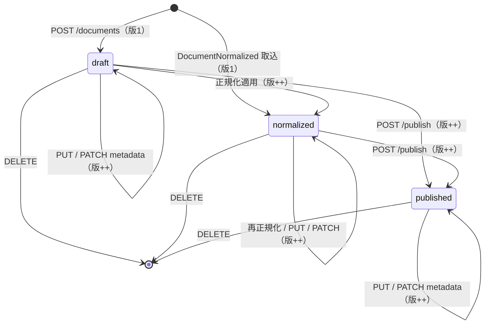

<!-- trace:
ids: [FR-06, UC-03, NFR-09, FR-19]
adrs: [ADR-0119, ADR-0050, ADR-0057]
iadrs: [IADR-0476, IADR-0290, IADR-0296, IADR-0475]
specs: [20260927_issue-1614_document-read-authn-private-note, 20260828_issue-1011_version-body-contract, 20260828_issue-451_deletion-propagation-to-object-storage, 20260926_issue-1575_document-page-and-fingerprint]
issues: [#1614, #201, #1011, #1575, planning#473]
-->

# 機能仕様書: 文書CRUD・バージョン管理

## 起点となる計画書（トレーサビリティ）

- 機能要求: 文書の CRUD・バージョン管理・メタデータ管理
- ユースケース: 文書を管理する（登録・更新・版参照）
- 計画書リンク: `02_requirements/01_requirements.md`、`07_adr/ADR-0002`（サービス境界・DB per Service）、`07_adr/ADR-0014`

## 概要

`DocumentService` は正規化文書（カタログ正本）の CRUD、版履歴（append-only スナップショット）、
メタデータ（ABAC 属性・タグ）管理を担う。`Document` を集約ルートとし、作成・更新・メタデータ更新・
正規化適用・公開の各操作で確定版のスナップショットを `DocumentVersion` として追記する。版番号は
`Document.Version`（単調増加の `int`）と一致し、ID＋版番号で任意時点の状態を再構成できる。更新時には
`DocumentUpdated` イベントを発行し、取り込み（IngestionService）・Wiki 同期（WikiService）へ連鎖させる。

## 機能詳細

| 項目 | 内容 |
| --- | --- |
| 入力 | 作成: `title`（必須）, `originalUri`, `contentType`, `attributes`, `tags` / 更新: `title`（必須）, `attributes`, `tags`, `expectedVersion`（任意）, `changeNote`（任意） / メタデータ更新: `attributes`, `tags`, `expectedVersion`, `changeNote` / 正規化取込: `DocumentNormalized` イベント（`DocumentId`, `Title`, `MarkdownUri`, `Attributes`, `Tags`） |
| 処理 | `Document.Create` で版 1 を記録 → 各更新（`Update` / `UpdateMetadata` / `ApplyNormalized` / `Publish`）が `Version++`・`UpdatedAt` 更新・スナップショット追記を内部で実行 → 更新後 `DocumentUpdated` を発行。`expectedVersion` 指定時は API 層で現在版と照合し不一致なら 409（lost update 防止）。正規化取込は `DocumentId` 一致で冪等 upsert。 |
| 出力 | `DocumentDto`（`Id`, `Title`, `Status`, `MarkdownUri`, `Version`, `Attributes`, `Tags`, `CreatedAt`, `UpdatedAt`, `HasBody`, `SharedWith`, `ContentFingerprint`〔本文指紋。後述〕） / `DocumentPageDto`（`Items`, `NextCursor`） / `DocumentVersionDto`（`DocumentId`, `Version`, `Title`, `Status`, `Attributes`, `Tags`, `ChangeNote`, `CreatedAt`。**本文の参照は持たない** — #1011） / `DocumentUpdated` イベント |
| 業務ルール | バージョン管理の射程は**版の作成・一覧・取得**まで（**復元は含まない**。利用者裁定 2026-08-23）。**版ごとの本文は保持せず、版応答は本文の参照を返さない**（本文のキーは文書 ID で固定・上書き。#1011）。タイトルは作成・更新で必須（空白は 400）。版履歴は append-only で過去版を書き換えない（スナップショットは後続更新の影響を受けない防御的コピー）。版一覧は新しい順（`Version` 降順）。`Status` は `draft`→`normalized`→`published` を取り、公開は `POST /publish` で行い版を追記する。属性（`Attributes`）は下流の ABAC 権限判定・検索フィルタで用いるメタデータ。 |

### エンドポイント一覧

| メソッド / パス | 用途 | 主な応答 |
| --- | --- | --- |
| `GET /documents` | 一覧（`UpdatedAt` 降順）。**認証を要する**。読めない個人資料は現れない | 200 `DocumentDto[]` / 401 |
| `GET /documents/page` | **組織文書**の属性の絞り込み（`attr.<キー>=<値>`・AND・完全一致）とページング（`limit`・`cursor`。作成順）。**認証を要する** | 200 `DocumentPageDto` / 400 / 401 |
| `GET /documents/{id}` | 単一取得。**認証を要する**。読めない個人資料は 404 | 200 / 401 / 404 |
| `POST /documents` | 作成（版 1 記録・`DocumentUpdated` 発行） | 201 `DocumentDto` / 400 |
| `PUT /documents/{id}` | タイトル・メタデータ更新（版追記・並行制御） | 200 / 400 / 404 / 409 |
| `PATCH /documents/{id}/metadata` | 属性・タグのみ更新（版追記） | 200 / 404 / 409 |
| `POST /documents/{id}/publish` | 公開（`status=published`・版追記） | 200 / 404 |
| `GET /documents/{id}/versions` | 版履歴一覧（新しい順）。**認証を要する** | 200 `DocumentVersionDto[]` / 401 / 404 |
| `GET /documents/{id}/versions/{version}` | 特定版取得。**認証を要する** | 200 / 401 / 404 |
| `DELETE /documents/{id}` | 削除（版履歴も連動削除） | 204 / 404 |

### 読み取りの認証と個人資料の可視性

- **読み取りの 5 口（一覧・ページ・単一取得・版履歴一覧・特定版取得）はすべて認証を要する**（ロールは問わない）。
  トークンが無い・検証できない要求は 401。健全性の口（`/health/*`）は匿名のまま。east-west gRPC の読み取り面も同じ判定を通る。
- **主体**は呼び出し元の資格情報である —— 文書閲覧の経路（BFF）が中継した利用者、または機械クライアント自身
  （`service-account-` で始まる利用者名、または利用者名を持たずクライアント識別だけを持つトークン）。
  gRPC の面では要求の利用者文脈が主体になり、無ければ呼び出し元サービス自身になる。
- **個人資料**（`doc_scope=private-note`。値の大文字小文字は問わない）は次の利用者にだけ返る。
  1. 所有者（`owner` 属性が利用者名と一致。本文の投入の所有者判定と同じ比較）
  2. 利用者として共有された相手
  3. グループとして共有された相手 —— 所属は認可サービスへ問う（文書サービスはトークンの所属を読まない）。
     問い合わせは要求ごとに高々 1 回で、所有者・利用者の共有先・組織文書だけの読み取りでは問わない。
     **引けない・未構成のときは読めない側へ倒す**（その資料だけが見えなくなる）。
- 機械の主体と管理者ロールの利用者には、他人の個人資料は返らない。
- 読めない個人資料は一覧から除き（件数にも含めない）、単一取得・版履歴一覧・特定版取得は **404**（不在と区別しない）。
  特定版の可視性は現在の文書で判定する。
- **組織文書**は認証済みの全主体に返る。組織文書の内容による絞り込み（機密・部門・ライフサイクル）は、現在は文書閲覧の経路（BFF）が行う。

### 本文指紋（`ContentFingerprint`）

- 文書の応答（作成・取得・一覧・本文投入・メタデータ更新ほか `DocumentDto` を返すすべての口）が本文指紋を運ぶ。
- 値は**格納した本文の UTF-8 バイト列の SHA-256 小文字 hex**（64 文字）。本文を書くすべての経路が同じ関数で作る。
  **本文を投入した呼び出し側は、送った本文から同じ値を計算して「保存済みの本文が最新か」を判定できる。**
- 本文が変われば変わり、**メタデータだけの更新では変わらない**。本文を持たない文書・指紋化できなかった文書は `null`。
  **原本が本文を持たない文書（`hasBody=false`。テキスト層の無い PDF 等）も `null`** —— 取り込みは空の本文を格納するが、その指紋は返さない（値があれば本文がある）。
- 本文の有無は `HasBody` ではなく `MarkdownUri`（と本指紋）で読む —— `HasBody` は「原本が本文を持っていたか」であり、
  本文なしで作った文書でも既定で `true` である。

### 組織文書の絞り込み・ページング（`GET /documents/page`）

- **見える集合を広げない。** 文書サービスの読み取りは組織文書の内容による権限判定を持たず（実施点は BFF）、直接の呼び出し元に見えている
  組織文書は `GET /documents` の全件である（他人の個人資料は `GET /documents` からも除かれる）。この口はそこから「組織文書」「全絞り込みに一致」で削るだけで、**結果は常にその部分集合**になる。
- **個人資料は、絞り込みの値にも呼び出し元にも依らず返さない**（`attr.doc_scope=private-note` を与えても、所有者本人が呼んでも空）。
- 絞り込み: `attr.<キー>=<値>` を 0 個以上（AND）。キー・値とも大文字小文字を区別する完全一致。同じキーの重複・空のキー・空の値は 400。
- ページング: `limit`（既定 100・1〜500 に丸める）と `cursor`（前ページの `nextCursor`。不透明な文字列・壊れていれば 400）。
  並びは**作成時刻の昇順**（同時刻は ID 昇順）。並びのキーが不変なので、走査の途中で更新・削除・追加があっても、
  **走査の間ずっと在った文書はちょうど 1 回ずつ返る**（途中で作られた文書は末尾に現れる）。
- 絞り込みは台帳を読んだ後に行う（DB の負荷は `GET /documents` と同じ）。
- **認証を要する**（ロールは問わない）。

## 処理フロー / 状態遷移

各遷移後に `DocumentUpdated` を発行し、取り込み・Wiki 同期へ連鎖する。

## 例外・エラー処理

| 条件 | 振る舞い | エラー表示 / ステータス |
| --- | --- | --- |
| 作成・更新でタイトル空白 | 保存しない | 400 ValidationProblem（`title`: 「タイトルは必須です。」） |
| 対象文書が存在しない | 更新・取得・削除を中断 | 404 NotFound |
| `expectedVersion` が現在版と不一致 | 更新を拒否し lost update を防止 | 409 Conflict（`version_conflict`, `expectedVersion`, `currentVersion`） |
| 存在しない版番号の取得 | — | 404 NotFound |
| `DocumentNormalized` 再配信（同一 `DocumentId`） | 冪等 upsert（重複登録しない） | 既存文書を更新し版追記 |

## 受け入れ基準

- [x] `POST /documents` で作成すると版 1 のスナップショットが記録される。
- [x] `PUT` / `PATCH /metadata` / `POST /publish` の各更新で `Version` が加算され、その時点のスナップショットが版履歴へ追記される。
- [x] `GET /documents/{id}/versions` が版履歴を新しい順で返し、各版のタイトル・状態・属性・タグを保持する。
- [x] `GET /documents/{id}/versions/{version}` が指定版を返し、存在しない版は 404。
- [x] 過去版スナップショットは後続更新で書き換わらない（append-only）。
- [x] `PUT` / `PATCH` に古い `expectedVersion` を付与すると 409 を返す。
- [x] `PATCH /metadata` はタイトルを変更せず属性・タグのみ更新する。
- [x] 作成・更新・公開・正規化取込のいずれでも `DocumentUpdated` を発行する。
- [x] タイトル空白の作成は 400 を返す。
- [x] 文書の応答が本文指紋を運び、本文を投入した文書では送った本文の UTF-8 の SHA-256 小文字 hex に一致する。本文の無い文書・原本が本文を持たない文書では `null`。メタデータだけの更新では変わらない。
- [x] `GET /documents/page` は一致する組織文書だけを返し、結果は常に `GET /documents` の部分集合で、個人資料を返さない。絞り込みを足すと狭くなる一方である。
- [x] `GET /documents/page` を `limit` とカーソルで辿ると、走査の途中で更新・削除・追加があっても、ずっと在った文書を重複なく読み飛ばさずに得る。

> 検証: `DocumentVersioningTests`（ドメイン版管理）／`DocumentEndpointVersioningTests`（版・メタ・公開・
> 409・400）／`DocumentLifecycleEventTests`（`DocumentUpdated`/`DocumentDeleted` 発行）／統合
> `DocumentVersioningTests`。テスト仕様は `../tests/FR-06_document-crud-versioning.md`。

## 関連仕様

- テスト仕様書: `../tests/FR-06_document-crud-versioning.md`
- 作業仕様書: `../../.ai-context/specs/20260627_FR-06_document-versioning-metadata.md`
- 通信仕様書: `../api/openapi.yaml`（`/documents` 系）
- データ仕様書: `../data/document-and-version.md`（`Document` / `DocumentVersion` エンティティ）
- 実装ADR: `../../.ai-context/adr/IADR-0001_document-service-owns-catalog.md`

## 未決事項

- 版間の差分（diff）表示・特定版へのロールバック（復元）API は範囲外（後続タスク）。
- 本文（Markdown 本体）は**オブジェクトストレージへ実保存され、DB は参照 URI だけを持つ**。
  削除は**その実体（過去の版が指していた本文と図表資産を含む）まで及ぶ**。
  🔴 ただし**資産の台帳は遡及付与しない**ため、台帳へ資産欄を足す以前に取り込まれた文書の
  図表資産は実体が残る。**「全部消える」とは読まないこと。**
- 楽観的並行制御は API 層の `expectedVersion` 照合のみで、DB 行ロックは導入しない。
- **呼び出し側の自然キー（外部 ID）での引き当て・upsert は持たない。** 文書の同一性は文書 ID ただ 1 つであり、
  別の同一性の概念を足すかは計画の判断を待つ（呼び出し側は `GET /documents/page` の属性の絞り込みで既存の写しを探す）。
- **機械クライアント（サービスアカウント）は、自分が所有する文書でもメタデータ更新・削除をできない**（管理者限定のまま）。
  破壊的操作の管理者限定が機械クライアントへ及ぶかは計画の判断を待つ。
