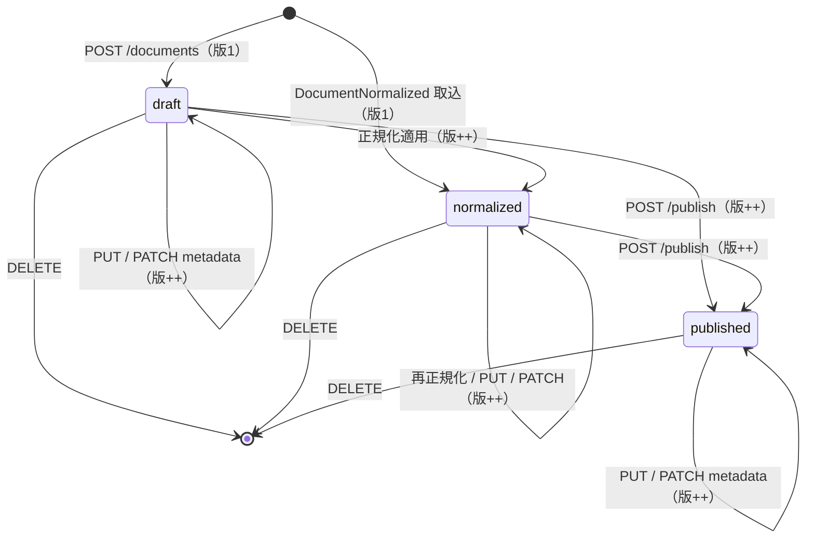

<!-- trace:
ids: [FR-06, UC-03]
adrs: []
iadrs: []
specs: []
issues: [#201, #1011, planning#473]
-->

# 機能仕様書: 文書CRUD・バージョン管理

## 起点となる計画書（トレーサビリティ）

- 機能要求: 文書の CRUD・バージョン管理・メタデータ管理
- ユースケース: 文書を管理する（登録・更新・版参照）
- 計画書リンク: `02_requirements/01_requirements.md`、`07_adr/ADR-0002`（サービス境界・DB per Service）、`07_adr/ADR-0014`

## 概要

`DocumentService` は正規化文書（カタログ正本）の CRUD、版履歴（append-only スナップショット）、
メタデータ（ABAC 属性・タグ）管理を担う。`Document` を集約ルートとし、作成・更新・メタデータ更新・
正規化適用・公開の各操作で確定版のスナップショットを `DocumentVersion` として追記する。版番号は
`Document.Version`（単調増加の `int`）と一致し、ID＋版番号で任意時点の状態を再構成できる。更新時には
`DocumentUpdated` イベントを発行し、取り込み（IngestionService）・Wiki 同期（WikiService）へ連鎖させる。

## 機能詳細

| 項目 | 内容 |
| --- | --- |
| 入力 | 作成: `title`（必須）, `originalUri`, `contentType`, `attributes`, `tags` / 更新: `title`（必須）, `attributes`, `tags`, `expectedVersion`（任意）, `changeNote`（任意） / メタデータ更新: `attributes`, `tags`, `expectedVersion`, `changeNote` / 正規化取込: `DocumentNormalized` イベント（`DocumentId`, `Title`, `MarkdownUri`, `Attributes`, `Tags`） |
| 処理 | `Document.Create` で版 1 を記録 → 各更新（`Update` / `UpdateMetadata` / `ApplyNormalized` / `Publish`）が `Version++`・`UpdatedAt` 更新・スナップショット追記を内部で実行 → 更新後 `DocumentUpdated` を発行。`expectedVersion` 指定時は API 層で現在版と照合し不一致なら 409（lost update 防止）。正規化取込は `DocumentId` 一致で冪等 upsert。 |
| 出力 | `DocumentDto`（`Id`, `Title`, `Status`, `MarkdownUri`, `Version`, `Attributes`, `Tags`, `CreatedAt`, `UpdatedAt`） / `DocumentVersionDto`（`DocumentId`, `Version`, `Title`, `Status`, `Attributes`, `Tags`, `ChangeNote`, `CreatedAt`。**本文の参照は持たない** — #1011） / `DocumentUpdated` イベント |
| 業務ルール | バージョン管理の射程は**版の作成・一覧・取得**まで（**復元は含まない**。利用者裁定 2026-08-23）。**版ごとの本文は保持せず、版応答は本文の参照を返さない**（本文のキーは文書 ID で固定・上書き。#1011）。タイトルは作成・更新で必須（空白は 400）。版履歴は append-only で過去版を書き換えない（スナップショットは後続更新の影響を受けない防御的コピー）。版一覧は新しい順（`Version` 降順）。`Status` は `draft`→`normalized`→`published` を取り、公開は `POST /publish` で行い版を追記する。属性（`Attributes`）は下流の ABAC 権限判定・検索フィルタで用いるメタデータ。 |

### エンドポイント一覧

| メソッド / パス | 用途 | 主な応答 |
| --- | --- | --- |
| `GET /documents` | 一覧（`UpdatedAt` 降順） | 200 `DocumentDto[]` |
| `GET /documents/{id}` | 単一取得 | 200 / 404 |
| `POST /documents` | 作成（版 1 記録・`DocumentUpdated` 発行） | 201 `DocumentDto` / 400 |
| `PUT /documents/{id}` | タイトル・メタデータ更新（版追記・並行制御） | 200 / 400 / 404 / 409 |
| `PATCH /documents/{id}/metadata` | 属性・タグのみ更新（版追記） | 200 / 404 / 409 |
| `POST /documents/{id}/publish` | 公開（`status=published`・版追記） | 200 / 404 |
| `GET /documents/{id}/versions` | 版履歴一覧（新しい順） | 200 `DocumentVersionDto[]` / 404 |
| `GET /documents/{id}/versions/{version}` | 特定版取得 | 200 / 404 |
| `DELETE /documents/{id}` | 削除（版履歴も連動削除） | 204 / 404 |

## 処理フロー / 状態遷移

各遷移後に `DocumentUpdated` を発行し、取り込み・Wiki 同期へ連鎖する。

## 例外・エラー処理

| 条件 | 振る舞い | エラー表示 / ステータス |
| --- | --- | --- |
| 作成・更新でタイトル空白 | 保存しない | 400 ValidationProblem（`title`: 「タイトルは必須です。」） |
| 対象文書が存在しない | 更新・取得・削除を中断 | 404 NotFound |
| `expectedVersion` が現在版と不一致 | 更新を拒否し lost update を防止 | 409 Conflict（`version_conflict`, `expectedVersion`, `currentVersion`） |
| 存在しない版番号の取得 | — | 404 NotFound |
| `DocumentNormalized` 再配信（同一 `DocumentId`） | 冪等 upsert（重複登録しない） | 既存文書を更新し版追記 |

## 受け入れ基準

- [x] `POST /documents` で作成すると版 1 のスナップショットが記録される。
- [x] `PUT` / `PATCH /metadata` / `POST /publish` の各更新で `Version` が加算され、その時点のスナップショットが版履歴へ追記される。
- [x] `GET /documents/{id}/versions` が版履歴を新しい順で返し、各版のタイトル・状態・属性・タグを保持する。
- [x] `GET /documents/{id}/versions/{version}` が指定版を返し、存在しない版は 404。
- [x] 過去版スナップショットは後続更新で書き換わらない（append-only）。
- [x] `PUT` / `PATCH` に古い `expectedVersion` を付与すると 409 を返す。
- [x] `PATCH /metadata` はタイトルを変更せず属性・タグのみ更新する。
- [x] 作成・更新・公開・正規化取込のいずれでも `DocumentUpdated` を発行する。
- [x] タイトル空白の作成は 400 を返す。

> 検証: `DocumentVersioningTests`（ドメイン版管理）／`DocumentEndpointVersioningTests`（版・メタ・公開・
> 409・400）／`DocumentLifecycleEventTests`（`DocumentUpdated`/`DocumentDeleted` 発行）／統合
> `DocumentVersioningTests`。テスト仕様は `../tests/FR-06_document-crud-versioning.md`。

## 関連仕様

- テスト仕様書: `../tests/FR-06_document-crud-versioning.md`
- 作業仕様書: `../../.ai-context/specs/20260627_FR-06_document-versioning-metadata.md`
- 通信仕様書: `../api/openapi.yaml`（`/documents` 系）
- データ仕様書: `../data/document-and-version.md`（`Document` / `DocumentVersion` エンティティ）
- 実装ADR: `../../.ai-context/adr/IADR-0001_document-service-owns-catalog.md`

## 未決事項

- 版間の差分（diff）表示・特定版へのロールバック（復元）API は範囲外（後続タスク）。
- 本文（Markdown 本体）のオブジェクトストレージ実保存は未実装（現状 URI 参照のみ）。
- 楽観的並行制御は API 層の `expectedVersion` 照合のみで、DB 行ロックは導入しない。
