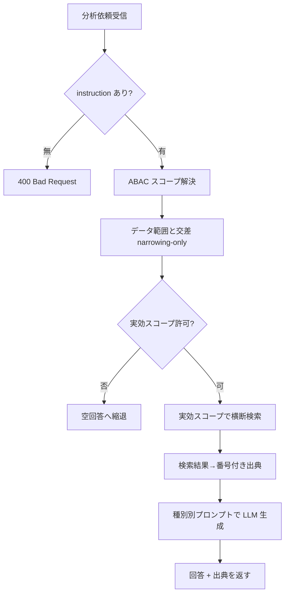

# 機能仕様書: 指定データ範囲での分析・比較・抽出

## 起点となる計画書（トレーサビリティ）

- 機能要求（FR）: FR-07
- ユースケース（UC）: UC-02
- 関連 ADR: ADR-0010、ADR-0004（ABAC）
- 計画書リンク: `02_requirements/01_requirements.md`

## 概要

利用者は分析対象の**データ範囲（属性条件・検索クエリ）を明示**し、種別（**分析 / 比較 / 抽出**）を
選んで AI に作業を依頼できる。AI は権限内の文書を横断検索した結果を根拠に、種別に応じた出力を
**番号付き出典付き**で生成する。指定データ範囲は ABAC 許可スコープと**交差**し、権限を一切広げない。

## 機能詳細

| 項目 | 内容 |
| --- | --- |
| 入力 | `instruction`（必須）, `taskType`（Analyze/Compare/Extract、既定 Analyze）, `range`（任意：`query`, `attributeFilters`, `topK`） / 利用者の資格情報（JWT クレーム: clearance, department） |
| 処理 | ABAC スコープ解決 → **データ範囲と交差（narrowing-only）** → （deny なら空回答へ縮退）→ ハイブリッド検索 → 番号付き出典へ写像 → 種別別プロンプトで LLM 生成 |
| 出力 | `AiAnswerDto`（`Answer`, `Citations[]`, `Model`, `InputTokens`, `OutputTokens`） |
| 業務ルール | データ範囲は ABAC の部分集合に限定（広げない）。範囲が権限外を指せばアクセス拒否（空回答）。出典番号は 1 始まり、本文 `[n]` と一致。 |

### タスク種別（AnalysisTaskType）

| 種別 | 用途 | プロンプトの主旨 |
| --- | --- | --- |
| `Analyze` | 分析 | 範囲内文書の要点・傾向・洞察をまとめる |
| `Compare` | 比較 | 範囲内文書間の共通点・相違点を対比する |
| `Extract` | 抽出 | 範囲内文書から指示された情報を抜き出す（該当なしは明示） |

### データ範囲（AnalysisDataRange）

| フィールド | 意味 |
| --- | --- |
| `query` | 範囲内で関連箇所を絞る検索クエリ（省略時は `instruction` を流用） |
| `attributeFilters` | 属性キー → 許可値集合（例: `department ∈ {sales}`）。retrieval の属性フィルタと同じ意味論 |
| `topK` | 文脈に取り込む最大チャンク数（既定 8） |

## 処理フロー

## 例外・エラー処理

| 条件 | 振る舞い | 表示 |
| --- | --- | --- |
| `instruction` 空 | リクエスト拒否 | 400 `instruction is required` |
| ABAC 未許可 / 範囲が権限外 | 空回答へ縮退（拒否と該当なしを区別しない） | 「閲覧権限のある文書が見つかりませんでした。」 |
| 検索結果 0 件 | 出典空・該当なしメッセージ | 「関連する情報が見つかりませんでした。」 |
| LLM 不調 | 出典のみ提示する縮退 | 「LLM が現在利用できないため、関連文書の一覧を返します。」 |
| BFF→後段が非 2xx | 後段ステータスを透過 | 後段ステータスコード |

## 受け入れ基準

- [x] 利用者は範囲と種別を指定して分析・比較・抽出を依頼でき、結果に出典が付く。
- [x] 指定データ範囲は ABAC を広げない（権限外文書は検索・回答のいずれにも現れない）。
- [x] 種別に応じてプロンプトが切り替わる。
- [x] `/bff/analysis/analyze` から単一窓口で結果＋出典を取得できる。

## 関連仕様

- 通信仕様書: `../api/openapi.yaml`（`/analysis/analyze`, `/bff/analysis/analyze`）
- 実装 ADR: `../adr/IADR-0005_data-range-intersect-abac-narrowing-only.md`
- 作業仕様書: `../specs/20260627_FR-07_data-range-analysis.md`
- 関連機能: `./FR-04_ai-answer-citations.md`（出典付与）、`./FR-05_abac-access-control.md`（ABAC）

## 未決事項

- タグ（`Tags`）による範囲指定（現状は属性キーのみ）。
- 範囲が権限外を含む場合の非露呈な利用者通知（UI 確定後）。
