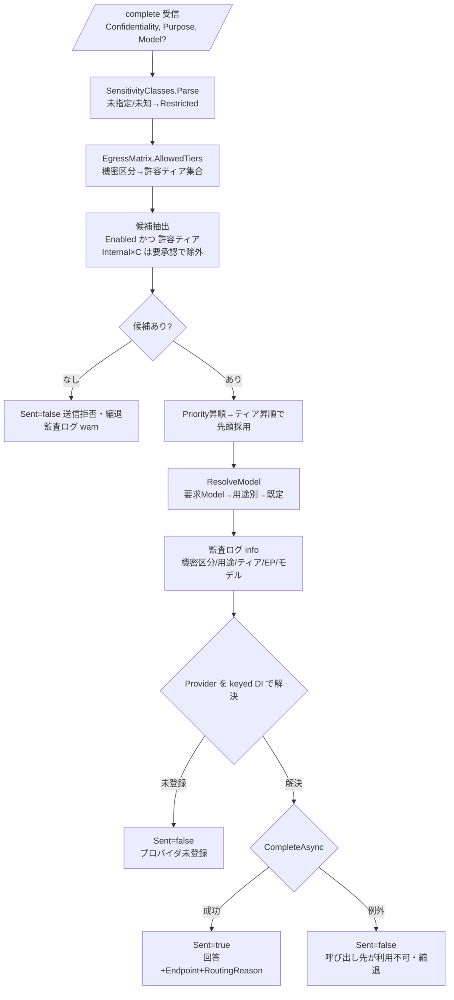

# 機能仕様書: LLM 呼び出し先ルーティング（用途・機密度別）

## 起点となる計画書（トレーサビリティ）

- 機能要求（FR）: FR-11「LLM の呼び出し先（外部マネージドAPI／セルフホスト）を**用途・機密度に応じて切り替えられる**」
- ユースケース（UC）: UC-01（検索・質問する＝用途 `rag-answer`）／UC-02（AI分析を依頼する＝用途 `analysis`）。本仕様書は両用途の用途別ルーティングを扱う（IADR-0106）。
- 非機能要件（NFR）: 「データ越境統制」（機密区分の高いデータを社外へ送信しない）
- 計画書リンク: `02_requirements/01_requirements.md`、`07_adr/ADR-0010`（外部マネージドAPI主体のLLMゲートウェイ）、`06_technical/08_data-egress-policy.md`（機密区分×送信先ティア越境マトリクス）

## 概要

LLM 呼び出しを **LlmGateway（`/complete`）で一元化**し、呼び出しごとに与えられた
**入力文書の最高機密区分（confidentiality）** と **用途（purpose）** から、送信先エンドポイント
（データ保護ティア）・モデルを選択する。あるいは越境ポリシー上送信不可と判定した場合は
**送信せず縮退（`Sent=false`）** を返す。

機密区分の高いデータは外部マネージド API へ送信せず、**セルフホスト LLM（ティアA）でのみ処理する**
ことを越境マトリクス（`EgressMatrix`）で担保する。既定は安全側（deny-by-default）で、
未指定・未知の機密区分は最も強い制約（`Restricted`）へ倒す。呼び出し先は enum 直書きでなく
**設定駆動のエンドポイント定義（`Llm:Routing`）＋固定表の越境マトリクス**で決定する（IADR-0007）。

## 機能詳細

| 項目 | 内容 |
| --- | --- |
| 入力 | `CompletionApiRequest`（`Prompt`, `MaxTokens`, `Model`(任意), `Confidentiality`(任意), `Purpose`(任意)）。呼び出し元（`RagOrchestrator` 等）が入力文脈文書の**最高機密区分**（`SensitivityClasses.Highest`）と用途（`rag-answer` / `analysis` / `diagram-coding` / `report-monthly` / `report-weekly` / `report-daily` / `trade-decision`）を付与する。 |
| 処理 | ① `SensitivityClasses.Parse` で `Confidentiality` を `SensitivityClass`（Public/Internal/Confidential/Restricted）へ写像。② `EgressMatrix.AllowedTiers` で許容ティア集合を算出。③ `LlmRouter.Route` が「有効・許容ティア・（要承認でない）」エンドポイントを `Priority` 昇順→ティア昇順（A<B<C, 保護の強い順）で選び先頭を採用。④ `ResolveModel` で用途→モデルを解決。⑤ `decision.Provider` を keyed DI（`claude` / `selfhosted`）で解決し送信。 |
| 出力 | `CompletionApiResponse`（`Text`, `Model`, `InputTokens`, `OutputTokens`, `Sent`, `Endpoint`, `RoutingReason`）。`Sent=false` 時は呼び出し元が出典のみ返す等の縮退へ切替可能。判定（機密区分・用途・ティア・エンドポイント・モデル・要承認・理由）を監査ログへ記録（ADR-0010）。 |
| 業務ルール | **機密区分→許容ティア**は越境マトリクス（下表）に固定。`Confidential`/`Restricted` は**ティアA/B のみ**でティアC（標準外部API）へは送信不可。`Internal × ティアC` は「条件付き可（要承認）」で、`AllowUnapprovedTierC=false`（既定）の間は候補から除外。許容ティアに送信可能な有効エンドポイントが無ければ**送信拒否（縮退）**。未指定・未知の機密区分は `Restricted` へ倒す（安全側）。 |

### 越境マトリクス（`EgressMatrix` / 08_data-egress-policy.md）

| 機密区分 | ティアA セルフホスト | ティアB 保護契約済み外部API | ティアC 標準外部API |
| --- | --- | --- | --- |
| `public` | 可 | 可 | 可 |
| `internal` | 可 | 可 | 条件付き可（要承認, 既定は不許可） |
| `confidential` | 可 | 可 | 不可 |
| `restricted` | 可 | 可（追加統制下） | 不可 |
| 未知・未指定 | 可（セルフホストのみ） | 不可 | 不可 |

### 用途別モデル解決（`ResolveModel`）

- 優先順位: ① 明示 `Model` 要求が**適格モデル**なら採用 → ② `PurposeModels[purpose]` が適格なら採用 → ③ エンドポイントの `DefaultModel`（適格なら）→ ④ 適格モデル先頭。適格モデルが無ければ空文字を返し送信拒否へ縮退。
- **ZDR（ゼロデータ保持）によるモデル除外（IADR-0022 / 08_data-egress-policy）**: `EgressMatrix.RequiresZeroDataRetention` が真の機密区分（`confidential`/`restricted`、未知区分も安全側で真）では、エンドポイントの `NonZdrModels` に列挙された ZDR 非対応モデル（既定で `claude-fable-5`）を候補から除外する。除外により fable-5 は ZDR 非要件の `public`/`internal` の analysis に限定され、`confidential`/`restricted` の analysis は ZDR 対応の既定モデル（opus）へフォールバックする。
- 既定設定（`appsettings.json`, ADR-0010 `Accepted` / ADR-0022 / ADR-0025 / IADR-0022 / IADR-0101 / IADR-0106 / IADR-0112 / IADR-0113）: 既定 `claude-opus-5`、定型 `rag-answer→claude-sonnet-5` / `diagram-coding→claude-haiku-4-5`、最難関 `analysis→claude-fable-5`（ZDR 非要件区分のみ）、`default→claude-opus-5`、**報告書 `report-monthly→claude-opus-5`（IADR-0113 で `claude-fable-5` から改定）/ `report-weekly→claude-opus-5` / `report-daily→claude-sonnet-5`（IADR-0112）**、**取引判断 `trade-decision→claude-sonnet-5`（版数固定・IADR-0112 決定3）**。
- **用途別モデルは `Models`（利用許可集合）にも登録する（IADR-0102 / IADR-0106）**: `ResolveModel` は `eligible.Contains(purposeModel)` を条件とするため、`PurposeModels` にのみ書いて `Models` へ登録し忘れると、例外もログも出さずに `DefaultModel` へフォールバックし割当が無音で失効する。`Models` は「割当」ではなく「利用を許可するモデル集合」であり、版数改定時は**追加**する（削除は明示 `Model` 要求をしている呼び出し側に対する破壊的変更）。全 `PurposeModels` 値が `Models` に含まれることは T-19 が恒久的に固定する。
- **取引判断のモデルピン留め（`AST/ADR-0011` / IADR-0102 / IADR-0112）**: 取引判断は再現性・監査可能性のため基盤の既定モデル改定に**自動追随させない**。`PurposeModels` に `trade-decision` を固定指定する。ピン留め対象はエンドポイントの `Models` 許可一覧にも含める必要がある（含めないと `ResolveModel` が黙って `DefaultModel` へフォールバックし、ピン留めが無効化される）。本エントリの更新には Stage 0 再検証を要する（設定値の書き換えだけで更新しない）。IADR-0112 決定3 でピンの値を `claude-opus-4-8` → `claude-sonnet-5` へ改定した際は、計画側 ADR の改定依頼（[project-planning#50](https://github.com/endazon/project-planning/issues/50)）を先行させ、`claude-sonnet-5` での Stage 0 再検証を**実弾解禁の必須ゲート**として追跡している（固定する仕組みは維持し、改定したのはピンの値のみ）。
- **報告書の種別別ルーティング（IADR-0112 決定1 / IADR-0113・`AST/04_workflows/03_reporting-cycle`）**: 報告書は取引方針を **月報→週報→日報→取引** の階層で管理する方針書であり、上位ほど難度が高い。用途を種別ごとに分け `report-monthly` / `report-weekly` / `report-daily` を割り当てる。`report-weekly` は `default` と同値だが、**明示エントリが無いと `default` の改定で無音に失効する**ため省略しない。**`report-monthly` は IADR-0113 で `claude-opus-5` へ改定した結果 `report-weekly` と同値になるが、同じ理由で明示エントリを残す**（非 ZDR の `claude-fable-5` を除いた集合に opus-5 より上位が無いための制約下の最善であり、階層の意図はプロンプトと文脈量で表す）。旧来の単一用途 `report-narrative` はエントリを持たず `default` へ着地する（呼び出し側の移行が完了するまでの非破壊性のため維持）。
- **`NonZdrModels` に載るモデルを割り当てた用途は機密区分で失効し得る（IADR-0112 決定2 / IADR-0113 決定4）**: `claude-fable-5` は ZDR 非対応であり、`confidential` / `restricted` では `EligibleModels` から除外され `DefaultModel` へ**黙って**落ちる。**現在該当するのは `analysis` のみ**（ZDR 非要件区分に限って fable-5 を使う意図的な設計・IADR-0022）。`report-monthly` は該当していたが IADR-0113 で ZDR 対応モデルへ改定し解消した。報告書用途（`report-*`）に非 ZDR モデルを割り当てないことは **T-23 の設定ガードが恒久的に固定する**。呼び出し側の機密区分設定（report-service の `LlmGateway:Confidentiality`。既定 `internal`）を上げても報告書の割当モデルは変わらない。
- **`Sent=false` は「越境拒否」だけを意味しない（IADR-0113）**: `/complete` が `Sent=false` を返す分岐は ①越境拒否（`decision.Allowed=false`）②プロバイダ未登録 ③プロバイダ呼び出しの例外 の 3 つである。区別は応答の `RoutingReason` / `Endpoint` に現れる（①は拒否理由、③は「呼び出し先 {Endpoint} が現在利用できません。」）。呼び出し側が `Sent=false` を機密区分による縮退と決め打つと原因を取り違える。なお **ZDR 除外は `internal` では効かない**（`RequiresZeroDataRetention` が真になるのは `confidential`/`restricted`/未知区分のみ）。
- **既定 `max_tokens`（IADR-0101）**: Opus 5 / Sonnet 5 は thinking（拡張思考）が既定で有効であり、`max_tokens` は**思考トークンと本文の合算上限**になる。既定値は 4096（本文想定長＋思考の作業領域）とする。切り詰めると本文が途中で切れ、例外にならず短い回答へ静かに縮退する。
- `PurposeModels` のキーは**呼び出し側が送る purpose 値と一致させる**（`StringComparer.OrdinalIgnoreCase`）。図コード化は契約値 `diagram-coding` に統一済み（旧 `diagram` の不一致を修正、#58 #1 / IADR-0007）。

### エンドポイント定義（`LlmEndpointOptions` / `Llm:Routing:Endpoints`）

- 既定 `claude-managed`（Tier=B, Provider=`claude`, Enabled=true, Priority=10, Models に `claude-fable-5` を含む）、`selfhosted-oss`（Tier=A, Provider=`selfhosted`, Enabled=false, Priority=20）、`copilot-managed`（Tier=C, Provider=`copilot`, Enabled=false, Priority=30）。
- セルフホスト（OpenAI 互換 `/v1/chat/completions`）は ADR-0010 のとおり**後付け可能**とし、既定は無効エンドポイント（`Llm:SelfHosted:BaseUrl` 未設定時は利用不可）。
- GitHub Copilot（最難関の別経路, ADR-0010 / IADR-0022）は `CopilotProvider`（OpenAI 互換 `/chat/completions`）で追加。送信先ティア（08_data-egress-policy の契約条件）が未確定のため**安全側でティアC・既定無効**とし、確定後に設定で有効化・ティア再判定する。

## 処理フロー / 状態遷移

## 例外・エラー処理

| 条件 | 振る舞い | 応答 |
| --- | --- | --- |
| 許容ティアに送信可能な有効エンドポイントが無い | 送信せず縮退（越境ポリシー上の拒否）。監査ログ warn | `Sent=false`, `Endpoint=null`, `Model=""`（未使用）, `RoutingReason=拒否理由`（`Text` に理由） |
| 機密区分が未指定・未知 | `Restricted` へ倒し、ティアC を除外（安全側） | ティアA/B のみで判定（該当なければ上記拒否） |
| `Internal × ティアC` かつ未承認（`AllowUnapprovedTierC=false`） | ティアC 候補を除外（要承認ゲート） | ティアA/B で判定、無ければ拒否 |
| 選択プロバイダが keyed DI 未登録 | 送信せず縮退。監査ログ error | `Sent=false`, `Endpoint=採用EP`, `Model=""`（未使用）（`Text` に未登録メッセージ） |
| 呼び出し先が不調（例外, `OperationCanceledException` 以外） | 500 を伝播させず縮退。監査ログ error | `Sent=false`, `Endpoint=採用EP`, `Model=実 route 結果`（`Text` に利用不可メッセージ） |
| セルフホスト `BaseUrl` 未設定 | `SelfHostedProvider` が `InvalidOperationException`。上記「呼び出し先不調」に集約し縮退 | `Sent=false` |
| 送信は成立したがモデルが拒否（`stop_reason="refusal"`。ADR-0025 / IADR-0104） | 縮退させず送信成立として扱い、**本文（断片を含む）を破棄**。監査ログ warn | `Sent=true`, `StopReason="refusal"`, `Text=""` |
| 送信は成立したが出力上限に到達（`stop_reason="max_tokens"`。IADR-0101 / IADR-0104） | 途中結果は破棄せず返す。監査ログ warn | `Sent=true`, `StopReason="max_tokens"`, `Text=途中結果` |

### プロバイダ横断の終了理由（正準語彙への正規化）

`StopReason` の語彙は **Anthropic の `stop_reason` 由来（`CompletionStopReasons`）を正準**とする。
OpenAI 互換 API を呼ぶプロバイダ（`SelfHostedProvider`＝ティアA / `CopilotProvider`＝ティアC）は
応答の `choices[].finish_reason` を**プロバイダ境界で正準語彙へ写像**する
（[IADR-0109](../adr/IADR-0109_openai-finish-reason-normalization.md) / #394）。呼び出し側が
プロバイダごとに語彙を覚える必要はない。

| OpenAI `finish_reason` | 正準語彙 | 本文の扱い |
| --- | --- | --- |
| `stop` | `end_turn` | そのまま返す |
| `length` | `max_tokens` | **破棄しない**（途中結果は正当な観測対象。IADR-0101） |
| `content_filter` | `refusal` | **破棄する**（IADR-0104 と一貫。断片を下流の判断材料にしない） |
| `tool_calls` / `function_call` | `tool_use` | そのまま返す |
| 上記以外・将来の追加値 | **原文のまま透過** | そのまま返す（warn ログに記録） |

`finish_reason` の欠落・`null` は `StopReason=null`（未対応プロバイダと同じ状態）であり、
未知語彙ではないため warn ログの対象にしない。両プロバイダは `ILlmProvider` の既定 `StreamAsync`
（単一チャンクへ縮退。IADR-0037）を使うため、SSE の `done` にも正規化後の値が載る。

### 可観測性（終了理由のメトリクス）

補完 1 回ごとにカウンタ `llm.completion.total` を計上する（[IADR-0110](../adr/IADR-0110_llm-completion-stop-reason-metrics.md) / #395）。
送信可否（`llm.result` = `sent` / `egress_denied` / `provider_missing` / `upstream_error`）と終了理由
（`llm.stop_reason`）を**別属性**として持つため、「送信していない」と「送ったがモデルが拒否した」を
取り違えずに拒否率を求められる。**送信していない経路も計上する**（分母が欠けると拒否率が過大に見える）。
属性値はすべて有限集合へ丸め、未知の終了理由・未定義の用途は `other` へ集約する（原文はログ側が保持する）。
定義・クエリ例・しきい値の方針は [`docs/observability/llm-completion-metrics.md`](../observability/llm-completion-metrics.md)。

### 縮退応答の `Model`（呼び出し側が名乗る「使用モデル」）

`CompletionApiResponse.Model` / `CompletionStreamEvent.Model` は**ゲートウェイが解決した実 route 結果**を載せる。
一度も呼び出していない縮退（越境拒否・プロバイダ未登録）は**空文字**、呼び出しを試みて失敗した場合は
route 結果（どのモデルへ向けた試行かが監査・障害解析の情報になる）である。

呼び出し側（`RagOrchestrator`）は**この値をそのまま透過し、モデル名を自分で決めない**
（[IADR-0111](../adr/IADR-0111_degraded-answer-model-label.md) / #403）。ゲートウェイに到達できない場合や
ABAC 不許可でゲートウェイを呼ばない場合も空文字（＝モデル未使用）を返す。以前は呼び出し側が存在しない
設定キー `Llm:DefaultModel` を引き、**LLM を呼んでいない応答が常に `claude-opus-5` を名乗っていた**。

### 送信可否（`Sent`）と終了理由（`StopReason`）は独立した軸である

`Sent` は**越境が成立したか**（FR-11 の統制対象）を、`StopReason` は**送信後にモデルがどう終えたか**を表す。
拒否は「外部へ送信し、モデルが応答した」事象であるため `Sent=true` を保つ（`Sent=false` にすると
越境監査・課金集計の意味が壊れる）。両者を混同しないことが本節の要点である（[IADR-0104](../adr/IADR-0104_llm-stop-reason-refusal.md)）。

`refusal` のみ本文を破棄するのは、安全性分類器が本文の途中で停止し得るためである。断片が非空のまま
下流へ渡ると、本文の非空を根拠に処理を進める呼び出し側（AST 取引判断など）で fail-safe が破れる。
`max_tokens` の途中結果は正当な観測対象であり破棄しない。

ストリーミング（`/complete/stream`）では終了理由が末尾の `message_delta` で確定するため、
既に送出したデルタは撤回できない。`done` イベントの `stopReason` を見て表示を破棄・注記するのは
呼び出し側の責務である。`RagOrchestrator` は末尾へ拒否である旨のトークンを追記し、部分本文が
既に流れている場合は空行で区切る（フロントは token を 1 つの文字列へ連結し `white-space: pre-wrap`
で表示するため、区切らないと注記が地の文へ溶け込む）。

## 受け入れ基準

- [x] 機密区分→許容ティアが 08_data-egress-policy の越境マトリクスと一致する（`EgressMatrix.AllowedTiers`）。
- [x] `Confidential` / `Restricted` の入力は外部標準API（ティアC）へ送信されない。ティアA/B のみ候補になる。
- [x] 機密区分が未指定・未知の入力は `Restricted` 相当として扱われる（安全側フォールバック）。
- [x] `Model` 未指定時、用途に応じてモデルが切り替わる（`analysis→fable-5` / `rag-answer→sonnet` / `diagram-coding→haiku`、既定 `opus`。ADR-0010 / IADR-0022）。
- [x] ZDR を要件とする機密区分（`confidential`/`restricted`）では ZDR 非対応モデル（`claude-fable-5`）が選択されず、ZDR 対応モデル（opus）へフォールバックする。ZDR 非要件（`public`/`internal`）では fable-5 が選択できる（IADR-0022 / 08_data-egress-policy）。
- [x] 許容ティアに送信可能な有効エンドポイントが無い場合、送信せず `Sent=false`（縮退）を返す。
- [x] `Internal × ティアC` は既定（未承認）では選択されない。
- [x] 送信判定（機密区分・用途・ティア・エンドポイント・モデル・許否・理由）が監査ログに記録される。
- [x] 呼び出し先不調・プロバイダ未登録時も 500 を伝播させず縮退応答を返す。
- [x] 送信成立後の終了理由（`refusal` / `max_tokens` / 正常終了）が監査ログと応答契約（`StopReason`）で区別できる（#379 / IADR-0104）。
- [x] `refusal` では本文（断片を含む）を返さず、`StopReason` を見ない呼び出し側も安全側へ倒れる（#379 / IADR-0104）。
- [x] OpenAI 互換プロバイダ（セルフホスト / Copilot）の `finish_reason` が正準語彙へ正規化され、`content_filter` は `refusal` として本文破棄まで一貫する。未知値は既定値へ潰さず透過し warn ログに残る（#394 / IADR-0109）。
- [x] 終了理由がメトリクス（`llm.completion.total`）として継続的に観測でき、拒否・上限到達・正常終了・送信拒否・呼び出し失敗が相互に区別できる。属性のカーディナリティは有限（#395 / IADR-0110）。
- [x] 縮退応答（未送信）が使用モデルを名乗らない。呼び出し側はゲートウェイ報告値を透過し、モデル名を自分で決めない（#403 / IADR-0111）。

> 検証（#201）: `LlmRouterTests`（越境マトリクス・ティア除外・フォールバック・ZDR・縮退）／
> `CompletionRoutingEndpointTests`／`EmbeddingRouterTests`・`EmbeddingEndpointTests`（埋め込み egress）。
> 送信判定の記録は `LlmRouter` の構造化ログ（"LLM routing decision"）。
> 終了理由（#379）: `ClaudeProviderStopReasonTests`（`stop_reason` の判別と本文破棄）／
> `CompletionStopReasonEndpointTests`（応答契約への伝達・`Sent` 不変）／
> `RagOrchestratorStopReasonTests`（呼び出し側の判別）。記録は `CompletionEndpoints.LogStopReason` の warn ログ。

## 関連仕様

- テスト仕様書: `../tests/FR-11_llm-egress-routing.md`
- 作業仕様書: `../specs/20260702_FR-11_llm-egress-routing.md`、`../specs/20260704_FR-11_llm-routing-runtime-fixes.md`、`../specs/20260725_issue-379_llm-stop-reason-refusal.md`、`../specs/20260728_issue-394_openai-finish-reason.md`、`../specs/20260728_issue-403_degraded-answer-model.md`、`../specs/20260728_issue-395_refusal-metrics.md`
- 通信仕様書: `../api/openapi.yaml`（`/complete`・`CompletionApiResponse.stopReason`）
- セキュリティ仕様書: `../security/`（データ越境統制 / NFR）
- 実装ADR: `../adr/IADR-0007_llm-egress-routing-config-driven.md`（config 駆動ルーティング）、`../adr/IADR-0014_qdrant-attribute-payload-key.md`（属性ペイロード復元）、`../adr/IADR-0104_llm-stop-reason-refusal.md`（終了理由の判別と拒否の伝達）、`../adr/IADR-0109_openai-finish-reason-normalization.md`（OpenAI 互換 finish_reason の正規化）、`../adr/IADR-0110_llm-completion-stop-reason-metrics.md`（終了理由のメトリクス）、`../adr/IADR-0111_degraded-answer-model-label.md`（縮退応答の「使用モデル」ラベル）
- 可観測性仕様書: `../observability/llm-completion-metrics.md`（終了理由・拒否率のメトリクス）
- 運用仕様書: `../operations/operations.md`（監視・アラート）
- 関連機能仕様書: `./FR-04_ai-answer-citations.md`（`RagOrchestrator` が本ルーティングを利用）

## 未決事項

- ADR-0010 は `Accepted`（既定 Opus / 定型 sonnet・haiku / 最難関 `claude-fable-5`／GitHub Copilot SDK, (b) 実装追従で確定, IADR-0022 で追従）。既定 Opus の版数は ADR-0010 本文凍結後に ADR-0025 が `claude-opus-5` へ改定し、IADR-0101 で追従済み（利用モデルの最新 roster は ADR-0025 を正とする）。08_data-egress-policy.md は `draft` であり、機密区分の値集合・越境マトリクスの最終確定（セキュリティ部門レビュー）待ち。確定時は `EgressMatrix` / `SensitivityClass` / `PurposeModels` を差分レビュー付きで追従する（IADR-0007 フォローアップ）。
- GitHub Copilot（`copilot-managed`）の送信先ティアは 08_data-egress-policy の契約条件（ZDR/学習不使用/レジデンシー）確定待ち。確定まで安全側でティアC・既定無効とし、確定後に設定で有効化・ティア再判定する（IADR-0022 フォローアップ）。
- **Sonnet 5 の実トークン消費の実測**（IADR-0106 フォローアップ）: `rag-answer` は ADR-0022 の確定値 `claude-sonnet-5` へ追随済み（IADR-0106）。Sonnet 5 は thinking が既定有効かつ新トークナイザ（同一テキストで約 +30% トークン）のため、既定 `max_tokens` 4096 は**実測前の出発値**である。実測と再調整は [#380](https://github.com/endazon/microservices-platform/issues/380)。あわせて新トークナイザ前提でのコスト試算・レート制限しきい値・プロンプトキャッシュ最小長を再測定する（ADR-0022 §結果）。
- `Restricted × ティアB` の「追加統制下」（承認フラグ・特別監査マーカー・匿名化/最小化要件）は未具体化で、現状 `Confidential × B` と同等（送信可）に扱う。
- 例外送信（機密区分の一時ダウングレード）の申請・承認ワークフローは未実装。本仕様は要承認ゲート（`AllowUnapprovedTierC`）のみ。
- 実セルフホスト LLM 基盤（GPU）は未構築で、`selfhosted-oss` エンドポイントは既定無効（定義のみ）。
