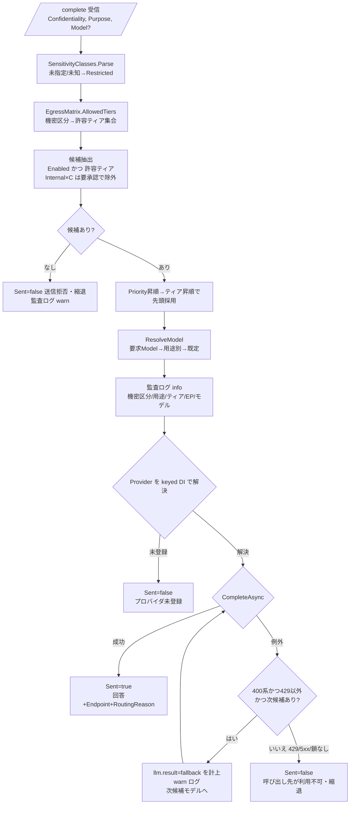

<!-- trace:
ids: [FR-11, UC-01, UC-02]
adrs: [ADR-0010, ADR-0022, ADR-0025, ADR-0038]
iadrs: [IADR-0007, IADR-0022, IADR-0037, IADR-0101, IADR-0102, IADR-0104, IADR-0106, IADR-0109, IADR-0110, IADR-0111, IADR-0112, IADR-0113, IADR-0114, IADR-0225]
specs: []
issues: [#201, #379, #380, #394, #395, #403, #850, #863, AST#290, planning#50]
-->

# 機能仕様書: LLM 呼び出し先ルーティング（用途・機密度別）

## 起点となる計画書（トレーサビリティ）

- 機能要求: 「LLM の呼び出し先（外部マネージドAPI／セルフホスト）を**用途・機密度に応じて切り替えられる**」
- ユースケース: 検索・質問する（用途 `rag-answer`）／AI 分析を依頼する（用途 `analysis`）。本仕様書は両用途の用途別ルーティングを扱う。
- 非機能要件（NFR）: 「データ越境統制」（機密区分の高いデータを社外へ送信しない）
- 計画書リンク: `02_requirements/01_requirements.md`、`07_adr/ADR-0010`（外部マネージドAPI主体のLLMゲートウェイ）、`06_technical/08_data-egress-policy.md`（機密区分×送信先ティア越境マトリクス）

## 概要

LLM 呼び出しを **LlmGateway（`/complete`）で一元化**し、呼び出しごとに与えられた
**入力文書の最高機密区分（confidentiality）** と **用途（purpose）** から、送信先エンドポイント
（データ保護ティア）・モデルを選択する。あるいは越境ポリシー上送信不可と判定した場合は
**送信せず縮退（`Sent=false`）** を返す。

機密区分の高いデータは外部マネージド API へ送信せず、**セルフホスト LLM（ティアA）でのみ処理する**
ことを越境マトリクス（`EgressMatrix`）で担保する。既定は安全側（deny-by-default）で、
未指定・未知の機密区分は最も強い制約（`Restricted`）へ倒す。呼び出し先は enum 直書きでなく
**設定駆動のエンドポイント定義（`Llm:Routing`）＋固定表の越境マトリクス**で決定する。

## 機能詳細

| 項目 | 内容 |
| --- | --- |
| 入力 | `CompletionApiRequest`（`Prompt`, `MaxTokens`, `Model`(任意), `Confidentiality`(任意), `Purpose`(任意)）。呼び出し元（`RagOrchestrator` 等）が入力文脈文書の**最高機密区分**（`SensitivityClasses.Highest`）と用途（`rag-answer` / `analysis` / `diagram-coding` / `report-monthly` / `report-weekly` / `report-daily` / `trade-decision`）を付与する。 |
| 処理 | ① `SensitivityClasses.Parse` で `Confidentiality` を `SensitivityClass`（Public/Internal/Confidential/Restricted）へ写像。② `EgressMatrix.AllowedTiers` で許容ティア集合を算出。③ `LlmRouter.Route` が「有効・許容ティア・（要承認でない）」エンドポイントを `Priority` 昇順→ティア昇順（A<B<C, 保護の強い順）で選び先頭を採用。④ `ResolveModel` で用途→モデルを解決。⑤ `decision.Provider` を keyed DI（`claude` / `selfhosted`）で解決し送信。 |
| 出力 | `CompletionApiResponse`（`Text`, `Model`, `InputTokens`, `OutputTokens`, `Sent`, `Endpoint`, `RoutingReason`）。`Sent=false` 時は呼び出し元が出典のみ返す等の縮退へ切替可能。判定（機密区分・用途・ティア・エンドポイント・モデル・要承認・理由）を監査ログへ記録。 |
| 業務ルール | **機密区分→許容ティア**は越境マトリクス（下表）に固定。`Confidential`/`Restricted` は**ティアA/B のみ**でティアC（標準外部API）へは送信不可。`Internal × ティアC` は「条件付き可（要承認）」で、`AllowUnapprovedTierC=false`（既定）の間は候補から除外。許容ティアに送信可能な有効エンドポイントが無ければ**送信拒否（縮退）**。未指定・未知の機密区分は `Restricted` へ倒す（安全側）。 |

### 越境マトリクス（`EgressMatrix` / 08_data-egress-policy.md）

| 機密区分 | ティアA セルフホスト | ティアB 保護契約済み外部API | ティアC 標準外部API |
| --- | --- | --- | --- |
| `public` | 可 | 可 | 可 |
| `internal` | 可 | 可 | 条件付き可（要承認, 既定は不許可） |
| `confidential` | 可 | 可 | 不可 |
| `restricted` | 可 | 可（追加統制下） | 不可 |
| 未知・未指定 | 可（セルフホストのみ） | 不可 | 不可 |

### 用途別モデル解決（`ResolveModel`）

- 優先順位: ① 明示 `Model` 要求が**適格モデル**なら採用 → ② `PurposeModels[purpose]` が適格なら採用 → ③ エンドポイントの `DefaultModel`（適格なら）→ ④ 適格モデル先頭。適格モデルが無ければ空文字を返し送信拒否へ縮退。
- **ZDR（ゼロデータ保持）によるモデル除外（既定モデル改定の実装 ADR と 08_data-egress-policy）**: `EgressMatrix.RequiresZeroDataRetention` が真の機密区分（`confidential`/`restricted`、未知区分も安全側で真）では、エンドポイントの `NonZdrModels` に列挙された ZDR 非対応モデルを候補から除外する。**［2026-08-18 更新 / #850・分析用途のモデル割当の計画 ADR］既定の `NonZdrModels` は空である** —— 同 ADR 決定 2 により `claude-fable-5` を `Models`（利用許可集合）から外したため、列挙する対象が無くなった。**除外機構そのものは残す**（非 ZDR モデルを将来再び許可集合へ入れるときの唯一の統制点であり、単体カバレッジは `LlmRouterTests` の合成 config が持つ）。
- 既定設定（`appsettings.json`。LLM ゲートウェイ・モデル選定の各計画 ADR と、既定モデル改定・既定 `max_tokens` 引き上げ・RAG 回答の追随・報告書の用途分離とモデル改定を定めた各実装 ADR による）: 既定 `claude-opus-5`、定型 `rag-answer→claude-sonnet-5` / `diagram-coding→claude-haiku-4-5`、最難関 `analysis→claude-opus-5`（**分析用途のモデル割当の計画 ADR 決定 1 で `claude-fable-5` から改定**。#850）、`default→claude-opus-5`、**報告書 `report-monthly→claude-opus-5`（月報のモデル改定の実装 ADR で `claude-fable-5` から改定）/ `report-weekly→claude-opus-5` / `report-daily→claude-sonnet-5`**、**取引判断 `trade-decision→claude-sonnet-5`（版数固定。ピン改定の実装 ADR 決定 3）**。
- **用途別モデルは `Models`（利用許可集合）にも登録する**: `ResolveModel` は `eligible.Contains(purposeModel)` を条件とするため、`PurposeModels` にのみ書いて `Models` へ登録し忘れると、例外もログも出さずに `DefaultModel` へフォールバックし割当が無音で失効する。`Models` は「割当」ではなく「利用を許可するモデル集合」であり、版数改定時は**追加**する（削除は明示 `Model` 要求をしている呼び出し側に対する破壊的変更）。**ただし計画 ADR（`ADR-0038` 決定 2）が利用そのものを禁じたモデルは例外で、`Models` から除去する** —— 破壊的変更であることを承知のうえで、非 ZDR モデルを基盤から無くすことを優先した。全 `PurposeModels` 値が `Models` に含まれることは T-19 が恒久的に固定する。
- **取引判断のモデルピン留め（`AST/ADR-0011` と、ピン留め・その改定を定めた実装 ADR）**: 取引判断は再現性・監査可能性のため基盤の既定モデル改定に**自動追随させない**。`PurposeModels` に `trade-decision` を固定指定する。ピン留め対象はエンドポイントの `Models` 許可一覧にも含める必要がある（含めないと `ResolveModel` が黙って `DefaultModel` へフォールバックし、ピン留めが無効化される）。本エントリの更新には Stage 0 再検証を要する（設定値の書き換えだけで更新しない）。ピン改定の実装 ADR の決定 3 でピンの値を `claude-opus-4-8` → `claude-sonnet-5` へ改定した際は、計画側 ADR の改定依頼を先行させ、`claude-sonnet-5` での Stage 0 再検証を**実弾解禁の必須ゲート**として追跡している（固定する仕組みは維持し、改定したのはピンの値のみ）。
- **報告書の種別別ルーティング（報告書の用途分離と月報のモデル改定を定めた実装 ADR・`AST/04_workflows/03_reporting-cycle`）**: 報告書は取引方針を **月報→週報→日報→取引** の階層で管理する方針書であり、上位ほど難度が高い。用途を種別ごとに分け `report-monthly` / `report-weekly` / `report-daily` を割り当てる。`report-weekly` は `default` と同値だが、**明示エントリが無いと `default` の改定で無音に失効する**ため省略しない。**`report-monthly` は月報のモデル改定の実装 ADR で `claude-opus-5` へ改定した結果 `report-weekly` と同値になるが、同じ理由で明示エントリを残す**（非 ZDR の `claude-fable-5` を除いた集合に opus-5 より上位が無いための制約下の最善であり、階層の意図はプロンプトと文脈量で表す。**#850 以降 `claude-fable-5` は `Models` に無く、選べる集合そのものが ZDR 対応モデルだけになった**）。旧来の単一用途 `report-narrative` はエントリを持たず `default` へ着地する（呼び出し側の移行が完了するまでの非破壊性のため維持）。
- **`NonZdrModels` に載るモデルを割り当てた用途は機密区分で失効し得る（報告書の用途分離の決定 2 / 月報のモデル改定の決定 4）**: `claude-fable-5` は ZDR 非対応であり、`confidential` / `restricted` では `EligibleModels` から除外され `DefaultModel` へ**黙って**落ちる。**［2026-08-18 更新 / #850・分析用途のモデル割当の計画 ADR］現在該当する用途は無い。** `analysis` が唯一の該当（ZDR 非要件区分に限って fable-5 を使う意図的な設計。既定モデル改定の実装 ADR による）であったが、決定 1・2 で `claude-opus-5` へ改め `claude-fable-5` を `Models` から外したため解消した（`report-monthly` は先行して月報のモデル改定で解消済み）。**全 `PurposeModels` の割当が非 ZDR モデルでないことは T-23 の設定ガードが恒久的に固定する**（同ガードの射程は #850 で `report-*` から全用途へ広げた。月報のモデル改定の実装 ADR の決定 4 の射程の改定にあたる旨は、同 ADR の同日追記に記録した）。呼び出し側の機密区分設定（report-service の `LlmGateway:Confidentiality`。既定 `internal`）を上げても報告書の割当モデルは変わらない。
- **`Sent=false` は「越境拒否」だけを意味しない**: `/complete` が `Sent=false` を返す分岐は ①越境拒否（`decision.Allowed=false`）②プロバイダ未登録 ③プロバイダ呼び出しの例外 の 3 つである。区別は応答の `RoutingReason` / `Endpoint` に現れる（①は拒否理由、③は「呼び出し先 {Endpoint} が現在利用できません。」）。呼び出し側が `Sent=false` を機密区分による縮退と決め打つと原因を取り違える。なお **ZDR 除外は `internal` では効かない**（`RequiresZeroDataRetention` が真になるのは `confidential`/`restricted`/未知区分のみ）。
- **既定 `max_tokens`**: Opus 5 / Sonnet 5 は thinking（拡張思考）が既定で有効であり、`max_tokens` は**思考トークンと本文の合算上限**になる。既定値は 4096（本文想定長＋思考の作業領域）とする。切り詰めると本文が途中で切れ、例外にならず短い回答へ静かに縮退する。
- `PurposeModels` のキーは**呼び出し側が送る purpose 値と一致させる**（`StringComparer.OrdinalIgnoreCase`）。図コード化は契約値 `diagram-coding` に統一済み（旧 `diagram` の不一致を修正。#58 #1。設定駆動のエンドポイント定義による）。

### 用途別フォールバック順序（`Llm:Routing:PurposeFallbackModels`・#863）

**用途別モデル解決（前節）は「どのモデルへ投げるか」を決めるだけで、投げた先が失敗したときの
振る舞いは含まない。** 呼び出し先が **HTTP 400 系**（モデル不可・コンテキスト超過等）を返したとき、
**設定した順序に従って次の候補モデルへ切り替える**。

| 項目 | 内容 |
| --- | --- |
| 設定 | `Llm:Routing:PurposeFallbackModels`（用途 → **第 2 候補以降**の順序つきモデル配列）。第 1 候補は `PurposeModels`（無ければ `DefaultModel`） |
| 既定値 | **`analysis: ["claude-sonnet-5"]` のみ**（分析用途のモデル割当の計画 ADR 決定 3。第 1 候補 `claude-opus-5` の 1 段下位） |
| 発火条件 | **上流が HTTP 400〜499（429 を除く）** |
| **発火しない** | **429（レート制限）**・5xx・通信断・ステータスの取れない失敗 |
| 適用範囲 | **非ストリーミング `/complete` のみ**（`/complete/stream` は実装しない） |
| 鎖の適格性 | ルーターが `Models`（利用許可集合）と ZDR 除外（`NonZdrModels`）を第 1 候補と同じ規則で適用し、外れた候補は warn ログを出して鎖から落とす（同計画 ADR の決定 5） |

- **429 は再試行であってフォールバックではない**（分析用途のモデル割当の計画 ADR 決定 4）。429 を「モデルが利用不能」と
  読んで別モデルへ逃がすと、[`llm-model-pin-runbook`](../operations/llm-model-pin-runbook.md) が定めた
  「利用不能時に別モデルへ切り替えない」という禁止を実質的に破る経路になる。
  **429 の再試行そのもの（回数・バックオフ・`Retry-After`）は未実装**である —— 計画側が方針を
  定めておらず、決めていない方針を実装が発明しないため（用途別フォールバックの実装 ADR §フォローアップ 1）。
  現行の 429 の挙動は従来どおり `Sent=false` の縮退である。
- **`trade-decision` は鎖を持たない。** 別モデルで下した取引判断は再現性・監査可能性を失った別物である
  （`AST/ADR-0011` と取引判断のピン留めの実装 ADR）。設定に鎖が足されたら落ちるテストで固定する。
- **`default` / `rag-answer` の第 2 候補は未確定**である（分析用途のモデル割当の計画 ADR §未決事項）。実装側で補わない。
- 鎖を持たない用途の挙動は従来と同一である（1 回試して失敗したら縮退する）。

### エンドポイント定義（`LlmEndpointOptions` / `Llm:Routing:Endpoints`）

- 既定 `claude-managed`（Tier=B, Provider=`claude`, Enabled=true, Priority=10, Models は `claude-opus-5` / `claude-opus-4-8` / `claude-sonnet-5` / `claude-sonnet-4-6` / `claude-haiku-4-5` の 5 モデル。**`claude-fable-5` は分析用途のモデル割当の計画 ADR 決定 2 により除去済み**・#850）、`selfhosted-oss`（Tier=A, Provider=`selfhosted`, Enabled=false, Priority=20）、`copilot-managed`（Tier=C, Provider=`copilot`, Enabled=false, Priority=30）。
- セルフホスト（OpenAI 互換 `/v1/chat/completions`）は LLM ゲートウェイの計画 ADR のとおり**後付け可能**とし、既定は無効エンドポイント（`Llm:SelfHosted:BaseUrl` 未設定時は利用不可）。
- GitHub Copilot（最難関の別経路。LLM ゲートウェイの計画 ADR と既定モデル改定の実装 ADR）は `CopilotProvider`（OpenAI 互換 `/chat/completions`）で追加。送信先ティア（08_data-egress-policy の契約条件）が未確定のため**安全側でティアC・既定無効**とし、確定後に設定で有効化・ティア再判定する。

## 処理フロー / 状態遷移

## 例外・エラー処理

| 条件 | 振る舞い | 応答 |
| --- | --- | --- |
| 許容ティアに送信可能な有効エンドポイントが無い | 送信せず縮退（越境ポリシー上の拒否）。監査ログ warn | `Sent=false`, `Endpoint=null`, `Model=""`（未使用）, `RoutingReason=拒否理由`（`Text` に理由） |
| 機密区分が未指定・未知 | `Restricted` へ倒し、ティアC を除外（安全側） | ティアA/B のみで判定（該当なければ上記拒否） |
| `Internal × ティアC` かつ未承認（`AllowUnapprovedTierC=false`） | ティアC 候補を除外（要承認ゲート） | ティアA/B で判定、無ければ拒否 |
| 選択プロバイダが keyed DI 未登録 | 送信せず縮退。監査ログ error | `Sent=false`, `Endpoint=採用EP`, `Model=""`（未使用）（`Text` に未登録メッセージ） |
| **呼び出し先が HTTP 400 系（429 を除く）を返し、用途に鎖がある**（同計画 ADR の決定 3・4 / 用途別フォールバックの実装 ADR） | **次の候補モデルへ切り替えて再試行**。監査ログ warn（遷移と上流ステータス）、メトリクス `llm.result=fallback` | 成功すれば `Sent=true`, `Model=実際に使った候補` |
| **呼び出し先が 429 を返した**（同計画 ADR の決定 4） | **フォールバックしない**（429 は再試行の対象であってフォールバックの対象ではない）。下段の「呼び出し先が不調」へ合流 | `Sent=false`, `Model=第 1 候補のまま` |
| 呼び出し先が不調（例外, `OperationCanceledException` 以外） | 500 を伝播させず縮退。監査ログ error | `Sent=false`, `Endpoint=採用EP`, `Model=実 route 結果`（鎖がある場合は**最後に試した候補**）（`Text` に利用不可メッセージ） |
| セルフホスト `BaseUrl` 未設定 | `SelfHostedProvider` が `InvalidOperationException`。上記「呼び出し先不調」に集約し縮退 | `Sent=false` |
| 送信は成立したがモデルが拒否（`stop_reason="refusal"`。既定モデルの計画 ADR と `stop_reason` 契約の実装 ADR） | 縮退させず送信成立として扱い、**本文（断片を含む）を破棄**。監査ログ warn | `Sent=true`, `StopReason="refusal"`, `Text=""` |
| 送信は成立したが出力上限に到達（`stop_reason="max_tokens"`。既定 `max_tokens` 引き上げと `stop_reason` 契約の実装 ADR） | 途中結果は破棄せず返す。監査ログ warn | `Sent=true`, `StopReason="max_tokens"`, `Text=途中結果` |

### プロバイダ横断の終了理由（正準語彙への正規化）

`StopReason` の語彙は **Anthropic の `stop_reason` 由来（`CompletionStopReasons`）を正準**とする。
OpenAI 互換 API を呼ぶプロバイダ（`SelfHostedProvider`＝ティアA / `CopilotProvider`＝ティアC）は
応答の `choices[].finish_reason` を**プロバイダ境界で正準語彙へ写像**する
（OpenAI 互換 `finish_reason` をプロバイダ境界で正準語彙へ正規化する実装 ADR / #394）。呼び出し側が
プロバイダごとに語彙を覚える必要はない。

| OpenAI `finish_reason` | 正準語彙 | 本文の扱い |
| --- | --- | --- |
| `stop` | `end_turn` | そのまま返す |
| `length` | `max_tokens` | **破棄しない**（途中結果は正当な観測対象。既定 `max_tokens` 引き上げの実装 ADR） |
| `content_filter` | `refusal` | **破棄する**（`stop_reason` 契約の実装 ADR と一貫。断片を下流の判断材料にしない） |
| `tool_calls` / `function_call` | `tool_use` | そのまま返す |
| 上記以外・将来の追加値 | **原文のまま透過** | そのまま返す（warn ログに記録） |

`finish_reason` の欠落・`null` は `StopReason=null`（未対応プロバイダと同じ状態）であり、
未知語彙ではないため warn ログの対象にしない。両プロバイダは `ILlmProvider` の既定 `StreamAsync`
（単一チャンクへ縮退。SSE ストリーミングの実装 ADR）を使うため、SSE の `done` にも正規化後の値が載る。

### 可観測性（終了理由のメトリクス）

補完 1 回ごとにカウンタ `llm.completion.total` を計上する（補完の終了理由をカウンタ 1 本で計上する実装 ADR / #395）。
送信可否（`llm.result` = `sent` / `egress_denied` / `provider_missing` / `upstream_error` / `fallback`）と終了理由
（`llm.stop_reason`）を**別属性**として持つため、「送信していない」と「送ったがモデルが拒否した」を
取り違えずに拒否率を求められる。**送信していない経路も計上する**（分母が欠けると拒否率が過大に見える）。
属性値はすべて有限集合へ丸め、未知の終了理由・未定義の用途は `other` へ集約する（原文はログ側が保持する）。
**`fallback` は前節のフォールバックが発火した呼び出し**（見送った候補）であり、
**計器は増やしていない**（#863。用途別フォールバックの実装 ADR 決定 5）。フォールバックした 1 リクエストは
`fallback` と `sent` の 2 件になるが、**拒否率の分母（`sent`）はリクエストあたり最大 1 件**のままである。
定義・クエリ例・しきい値の方針は [`docs/observability/llm-completion-metrics.md`](../observability/llm-completion-metrics.md)。

### 縮退応答の `Model`（呼び出し側が名乗る「使用モデル」）

`CompletionApiResponse.Model` / `CompletionStreamEvent.Model` は**ゲートウェイが解決した実 route 結果**を載せる。
一度も呼び出していない縮退（越境拒否・プロバイダ未登録）は**空文字**、呼び出しを試みて失敗した場合は
route 結果（どのモデルへ向けた試行かが監査・障害解析の情報になる）である。

呼び出し側（`RagOrchestrator`）は**この値をそのまま透過し、モデル名を自分で決めない**
（縮退応答の「使用モデル」はゲートウェイ報告値を透過する実装 ADR / #403）。ゲートウェイに到達できない場合や
ABAC 不許可でゲートウェイを呼ばない場合も空文字（＝モデル未使用）を返す。以前は呼び出し側が存在しない
設定キー `Llm:DefaultModel` を引き、**LLM を呼んでいない応答が常に `claude-opus-5` を名乗っていた**。

### 送信可否（`Sent`）と終了理由（`StopReason`）は独立した軸である

`Sent` は**越境が成立したか**（本要求の統制対象）を、`StopReason` は**送信後にモデルがどう終えたか**を表す。
拒否は「外部へ送信し、モデルが応答した」事象であるため `Sent=true` を保つ（`Sent=false` にすると
越境監査・課金集計の意味が壊れる）。両者を混同しないことが本節の要点である（`stop_reason` を応答契約に載せ、`refusal` は本文を破棄して「空応答」と区別する実装 ADR）。

`refusal` のみ本文を破棄するのは、安全性分類器が本文の途中で停止し得るためである。断片が非空のまま
下流へ渡ると、本文の非空を根拠に処理を進める呼び出し側（AST 取引判断など）で fail-safe が破れる。
`max_tokens` の途中結果は正当な観測対象であり破棄しない。

ストリーミング（`/complete/stream`）では終了理由が末尾の `message_delta` で確定するため、
既に送出したデルタは撤回できない。`done` イベントの `stopReason` を見て表示を破棄・注記するのは
呼び出し側の責務である。`RagOrchestrator` は末尾へ拒否である旨のトークンを追記し、部分本文が
既に流れている場合は空行で区切る（フロントは token を 1 つの文字列へ連結し `white-space: pre-wrap`
で表示するため、区切らないと注記が地の文へ溶け込む）。

### 応答 content ブロックの未知型は解析前に除去する（SDK の fail-closed を止める）

Claude プロバイダが使う `Anthropic.SDK` 4.0.0 は content ブロックの判別子を列挙で分岐し、
**`text` / `image` / `tool_use` / `tool_result` 以外**を受け取ると `JsonException: Unknown type <型>` を
投げる。未知型が 1 個混ざるだけで配列全体＝**応答全体**が失われるため、拡張思考（`thinking`）が
既定で有効な現行の割当モデル（`claude-opus-5` / `claude-sonnet-5` / `claude-haiku-4-5`。**#850 以降 `claude-fable-5` は含まれない**）では
非ストリーミング `/complete` が全件失敗する。

そこで `AnthropicClient` へ渡す `HttpClient` に委譲ハンドラを挟み、**既知型の許可リスト**で
未知ブロックを解析前に除去する（Anthropic 応答の未知 content ブロックを許可リストで除去する実装 ADR）。
拒否リストで型名を列挙しないため、将来 API が追加するブロック型にも更新なしで耐える。

- 対象は **2xx かつ `application/json`** のみ。非 2xx は SDK の例外整形へ委ね、SSE
  （`text/event-stream`）は触らない（ストリーム経路は未知型を素通しでき壊れていない）。
- **既知型だけの応答は 1 バイトも触らない**（サニタイズ自体が本文を変える経路を既定で持たない）。
- 全ブロックが未知なら例外にせず `content` 空へ縮退し、既存の空応答分岐（呼び出し側の安全既定）へ合流する。
- 除去したブロック型は warn ログに残す（**型名のみ**。本文は載せない）。

本節は content の解釈に関する規定であり、送信可否（`Sent`）・終了理由（`StopReason`）の
軸（前節）とは独立である。`refusal` の本文破棄は thinking の有無に関わらず維持される。

## 受け入れ基準

- [x] 機密区分→許容ティアが 08_data-egress-policy の越境マトリクスと一致する（`EgressMatrix.AllowedTiers`）。
- [x] `Confidential` / `Restricted` の入力は外部標準API（ティアC）へ送信されない。ティアA/B のみ候補になる。
- [x] 機密区分が未指定・未知の入力は `Restricted` 相当として扱われる（安全側フォールバック）。
- [x] `Model` 未指定時、用途に応じてモデルが切り替わる（`analysis→opus` / `rag-answer→sonnet` / `diagram-coding→haiku`、既定 `opus`。LLM ゲートウェイの計画 ADR と既定モデル改定の実装 ADR による。**`analysis` は分析用途のモデル割当の計画 ADR 決定 1 で `fable-5` から改定**・#850）。
- [x] ZDR を要件とする機密区分（`confidential`/`restricted`）では `NonZdrModels` に載るモデルが選択されず、ZDR 対応モデルへフォールバックする（既定モデル改定の実装 ADR と 08_data-egress-policy）。**［2026-08-18 更新 / #850・分析用途のモデル割当の計画 ADR］既定設定の `NonZdrModels` は空であり、本番経路でこの除外は発火しない**（`claude-fable-5` を `Models` から外したため）。**機構が生きていることは `LlmRouterTests` の合成 config が固定する** —— 合成 config から `NonZdrModels` を外すと除外系 5 本が落ちることを #850 で実測した。
- [x] 許容ティアに送信可能な有効エンドポイントが無い場合、送信せず `Sent=false`（縮退）を返す。
- [x] `Internal × ティアC` は既定（未承認）では選択されない。
- [x] 送信判定（機密区分・用途・ティア・エンドポイント・モデル・許否・理由）が監査ログに記録される。
- [x] 呼び出し先不調・プロバイダ未登録時も 500 を伝播させず縮退応答を返す。
- [x] 送信成立後の終了理由（`refusal` / `max_tokens` / 正常終了）が監査ログと応答契約（`StopReason`）で区別できる。
- [x] `refusal` では本文（断片を含む）を返さず、`StopReason` を見ない呼び出し側も安全側へ倒れる。
- [x] OpenAI 互換プロバイダ（セルフホスト / Copilot）の `finish_reason` が正準語彙へ正規化され、`content_filter` は `refusal` として本文破棄まで一貫する。未知値は既定値へ潰さず透過し warn ログに残る。
- [x] 終了理由がメトリクス（`llm.completion.total`）として継続的に観測でき、拒否・上限到達・正常終了・送信拒否・呼び出し失敗が相互に区別できる。属性のカーディナリティは有限。
- [x] 縮退応答（未送信）が使用モデルを名乗らない。呼び出し側はゲートウェイ報告値を透過し、モデル名を自分で決めない。
- [x] SDK が解釈できない content ブロック型（`thinking` 等）が含まれても応答全体を失わず、本文テキストと既知ブロックを取得できる。未知の将来型でも同様。
- [x] 用途 `analysis` の第 1 候補（`claude-opus-5`）が HTTP 400 系で失敗したとき、`claude-sonnet-5` へフォールバックして応答が返る（#863 / 分析用途のモデル割当の計画 ADR 決定 3 / 用途別フォールバックの実装 ADR）。
- [x] **429 ではフォールバックしない**（429 は再試行であってフォールバックではない。#863 / 分析用途のモデル割当の計画 ADR 決定 4）。5xx・ステータス不明の失敗も同様に従来の縮退へ落ちる。
- [x] フォールバックの発火が `llm.completion.total{llm_result="fallback"}` として観測でき、見送った候補と実際に使った候補が `llm.model` で区別できる（#863 / 分析用途のモデル割当の計画 ADR 決定 6）。
- [x] フォールバック先が `Models`（利用許可集合）に登録済みであることをガードが固定する（#863 / 分析用途のモデル割当の計画 ADR 決定 5。既存 T-19 の射程を拡大）。`trade-decision` は鎖を持たない。

> 検証: `LlmRouterTests`（越境マトリクス・ティア除外・フォールバック・ZDR・縮退）／
> `CompletionRoutingEndpointTests`／`EmbeddingRouterTests`・`EmbeddingEndpointTests`（埋め込み egress）。
> 送信判定の記録は `LlmRouter` の構造化ログ（"LLM routing decision"）。
> 終了理由: `ClaudeProviderStopReasonTests`（`stop_reason` の判別と本文破棄）／
> `CompletionStopReasonEndpointTests`（応答契約への伝達・`Sent` 不変）／
> `RagOrchestratorStopReasonTests`（呼び出し側の判別）。記録は `CompletionEndpoints.LogStopReason` の warn ログ。

## 関連仕様

- テスト仕様書: `../tests/FR-11_llm-egress-routing.md`
- 作業仕様書: `../../.ai-context/specs/20260702_FR-11_llm-egress-routing.md`、`../../.ai-context/specs/20260704_FR-11_llm-routing-runtime-fixes.md`、`../../.ai-context/specs/20260725_issue-379_llm-stop-reason-refusal.md`、`../../.ai-context/specs/20260728_issue-394_openai-finish-reason.md`、`../../.ai-context/specs/20260728_issue-403_degraded-answer-model.md`、`../../.ai-context/specs/20260728_issue-395_refusal-metrics.md`
- 通信仕様書: `../api/openapi.yaml`（`/complete`・`CompletionApiResponse.stopReason`）
- セキュリティ仕様書: `../security/`（データ越境統制 / NFR）
- 実装ADR: `../../.ai-context/adr/IADR-0225_llm-purpose-fallback-chain-and-429-boundary.md`（用途別フォールバック順序・429 の境界・発火の可観測化）、`../../.ai-context/adr/IADR-0007_llm-egress-routing-config-driven.md`（config 駆動ルーティング）、`../../.ai-context/adr/IADR-0014_qdrant-attribute-payload-key.md`（属性ペイロード復元）、`../../.ai-context/adr/IADR-0104_llm-stop-reason-refusal.md`（終了理由の判別と拒否の伝達）、`../../.ai-context/adr/IADR-0109_openai-finish-reason-normalization.md`（OpenAI 互換 finish_reason の正規化）、`../../.ai-context/adr/IADR-0110_llm-completion-stop-reason-metrics.md`（終了理由のメトリクス）、`../../.ai-context/adr/IADR-0111_degraded-answer-model-label.md`（縮退応答の「使用モデル」ラベル）
- 可観測性仕様書: `../observability/llm-completion-metrics.md`（終了理由・拒否率のメトリクス）
- 運用仕様書: `../operations/operations.md`（監視・アラート）
- 関連機能仕様書: `./FR-04_ai-answer-citations.md`（`RagOrchestrator` が本ルーティングを利用）

## 未決事項

- **429（レート制限）の再試行方針**（回数・バックオフ・`Retry-After` の尊重）。計画 `ADR-0038` 決定 4 は
  「429 は再試行である」と述べるだけで再試行の形を定めていない。確定するまで実装しない
  （用途別フォールバックの実装 ADR §フォローアップ 1・#863）。
- **`default` / `rag-answer` のフォールバック第 2 候補**（計画 `ADR-0038` §未決事項・同 §フォローアップ 5）。
  確定したら `PurposeFallbackModels` へ足す。ストリーム経路の用途に鎖が付く場合は、
  `/complete/stream` をフォールバックの射程に含めるかを見直す（用途別フォールバックの実装 ADR 決定 4）。
- LLM ゲートウェイの計画 ADR は `Accepted` である（既定 Opus / 定型 sonnet・haiku / 最難関 `claude-fable-5`／GitHub Copilot SDK。(b) 実装追従で確定し、既定モデル改定の実装 ADR が追従した）。**［2026-08-18 更新 / #850］最難関の割当は計画 `ADR-0038`（Accepted）が `claude-opus-5` へ部分改定した** —— 同計画 ADR の他の決定（ゲートウェイを設ける決定・ルーティング機構・送信可否判定・トークン計測・監査ログの一元化）は有効である。既定 Opus の版数は同 ADR 本文の凍結後に Opus 5 採用の計画 ADR が `claude-opus-5` へ改定し、実装側も追従済みである（利用モデルの最新 roster は Opus 5 採用の計画 ADR を正とする）。08_data-egress-policy.md は `draft` であり、機密区分の値集合・越境マトリクスの最終確定（セキュリティ部門レビュー）待ち。確定時は `EgressMatrix` / `SensitivityClass` / `PurposeModels` を差分レビュー付きで追従する（設定駆動のエンドポイント定義を定めた実装 ADR のフォローアップ）。
- GitHub Copilot（`copilot-managed`）の送信先ティアは 08_data-egress-policy の契約条件（ZDR/学習不使用/レジデンシー）確定待ち。確定まで安全側でティアC・既定無効とし、確定後に設定で有効化・ティア再判定する（既定モデル改定の実装 ADR のフォローアップ）。
- **Sonnet 5 の実トークン消費の実測**（RAG 回答の追随を定めた実装 ADR のフォローアップ）: `rag-answer` は Sonnet 5 採用の計画 ADR の確定値 `claude-sonnet-5` へ追随済み。Sonnet 5 は thinking が既定有効かつ新トークナイザ（同一テキストで約 +30% トークン）のため、既定 `max_tokens` 4096 は**実測前の出発値**である。実測と再調整は [#380](https://github.com/endazon/microservices-platform/issues/380)。あわせて新トークナイザ前提でのコスト試算・レート制限しきい値・プロンプトキャッシュ最小長を再測定する（Sonnet 5 採用の計画 ADR §結果）。
- `Restricted × ティアB` の「追加統制下」（承認フラグ・特別監査マーカー・匿名化/最小化要件）は未具体化で、現状 `Confidential × B` と同等（送信可）に扱う。
- 例外送信（機密区分の一時ダウングレード）の申請・承認ワークフローは未実装。本仕様は要承認ゲート（`AllowUnapprovedTierC`）のみ。
- 実セルフホスト LLM 基盤（GPU）は未構築で、`selfhosted-oss` エンドポイントは既定無効（定義のみ）。
