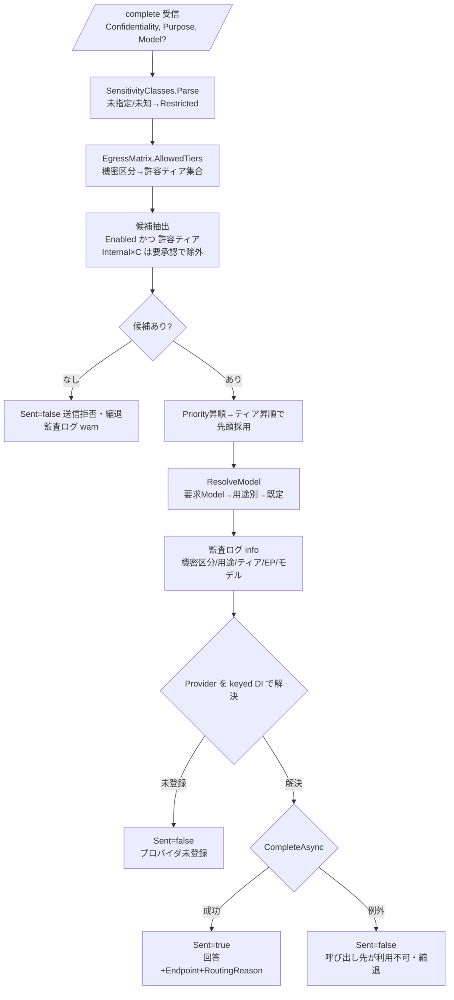

# 機能仕様書: LLM 呼び出し先ルーティング（用途・機密度別）

## 起点となる計画書（トレーサビリティ）

- 機能要求（FR）: FR-11「LLM の呼び出し先（外部マネージドAPI／セルフホスト）を**用途・機密度に応じて切り替えられる**」
- ユースケース（UC）: UC-02
- 非機能要件（NFR）: 「データ越境統制」（機密区分の高いデータを社外へ送信しない）
- 計画書リンク: `02_requirements/01_requirements.md`、`07_adr/ADR-0010`（外部マネージドAPI主体のLLMゲートウェイ）、`06_technical/08_data-egress-policy.md`（機密区分×送信先ティア越境マトリクス）

## 概要

LLM 呼び出しを **LlmGateway（`/complete`）で一元化**し、呼び出しごとに与えられた
**入力文書の最高機密区分（confidentiality）** と **用途（purpose）** から、送信先エンドポイント
（データ保護ティア）・モデルを選択する。あるいは越境ポリシー上送信不可と判定した場合は
**送信せず縮退（`Sent=false`）** を返す。

機密区分の高いデータは外部マネージド API へ送信せず、**セルフホスト LLM（ティアA）でのみ処理する**
ことを越境マトリクス（`EgressMatrix`）で担保する。既定は安全側（deny-by-default）で、
未指定・未知の機密区分は最も強い制約（`Restricted`）へ倒す。呼び出し先は enum 直書きでなく
**設定駆動のエンドポイント定義（`Llm:Routing`）＋固定表の越境マトリクス**で決定する（IADR-0007）。

## 機能詳細

| 項目 | 内容 |
| --- | --- |
| 入力 | `CompletionApiRequest`（`Prompt`, `MaxTokens`, `Model`(任意), `Confidentiality`(任意), `Purpose`(任意)）。呼び出し元（`RagOrchestrator` 等）が入力文脈文書の**最高機密区分**（`SensitivityClasses.Highest`）と用途（`rag-answer` / `analysis` / `diagram-coding`）を付与する。 |
| 処理 | ① `SensitivityClasses.Parse` で `Confidentiality` を `SensitivityClass`（Public/Internal/Confidential/Restricted）へ写像。② `EgressMatrix.AllowedTiers` で許容ティア集合を算出。③ `LlmRouter.Route` が「有効・許容ティア・（要承認でない）」エンドポイントを `Priority` 昇順→ティア昇順（A<B<C, 保護の強い順）で選び先頭を採用。④ `ResolveModel` で用途→モデルを解決。⑤ `decision.Provider` を keyed DI（`claude` / `selfhosted`）で解決し送信。 |
| 出力 | `CompletionApiResponse`（`Text`, `Model`, `InputTokens`, `OutputTokens`, `Sent`, `Endpoint`, `RoutingReason`）。`Sent=false` 時は呼び出し元が出典のみ返す等の縮退へ切替可能。判定（機密区分・用途・ティア・エンドポイント・モデル・要承認・理由）を監査ログへ記録（ADR-0010）。 |
| 業務ルール | **機密区分→許容ティア**は越境マトリクス（下表）に固定。`Confidential`/`Restricted` は**ティアA/B のみ**でティアC（標準外部API）へは送信不可。`Internal × ティアC` は「条件付き可（要承認）」で、`AllowUnapprovedTierC=false`（既定）の間は候補から除外。許容ティアに送信可能な有効エンドポイントが無ければ**送信拒否（縮退）**。未指定・未知の機密区分は `Restricted` へ倒す（安全側）。 |

### 越境マトリクス（`EgressMatrix` / 08_data-egress-policy.md）

| 機密区分 | ティアA セルフホスト | ティアB 保護契約済み外部API | ティアC 標準外部API |
| --- | --- | --- | --- |
| `public` | 可 | 可 | 可 |
| `internal` | 可 | 可 | 条件付き可（要承認, 既定は不許可） |
| `confidential` | 可 | 可 | 不可 |
| `restricted` | 可 | 可（追加統制下） | 不可 |
| 未知・未指定 | 可（セルフホストのみ） | 不可 | 不可 |

### 用途別モデル解決（`ResolveModel`）

- 優先順位: ① 明示 `Model` 要求がエンドポイント対応なら採用 → ② `PurposeModels[purpose]` がエンドポイント対応なら採用 → ③ エンドポイントの `DefaultModel`（無ければ `Models` 先頭）。
- 既定設定（`appsettings.json`）: `rag-answer→claude-sonnet-4-6` / `analysis→claude-opus-4-8` / `diagram-coding→claude-haiku-4-5` / `default→claude-sonnet-4-6`。
- `PurposeModels` のキーは**呼び出し側が送る purpose 値と一致させる**（`StringComparer.OrdinalIgnoreCase`）。図コード化は契約値 `diagram-coding` に統一済み（旧 `diagram` の不一致を修正、#58 #1 / IADR-0007）。

### エンドポイント定義（`LlmEndpointOptions` / `Llm:Routing:Endpoints`）

- 既定 `claude-managed`（Tier=B, Provider=`claude`, Enabled=true, Priority=10）と `selfhosted-oss`（Tier=A, Provider=`selfhosted`, Enabled=false, Priority=20）。
- セルフホスト（OpenAI 互換 `/v1/chat/completions`）は ADR-0010 のとおり**後付け可能**とし、既定は無効エンドポイント（`Llm:SelfHosted:BaseUrl` 未設定時は利用不可）。

## 処理フロー / 状態遷移

## 例外・エラー処理

| 条件 | 振る舞い | 応答 |
| --- | --- | --- |
| 許容ティアに送信可能な有効エンドポイントが無い | 送信せず縮退（越境ポリシー上の拒否）。監査ログ warn | `Sent=false`, `Endpoint=null`, `RoutingReason=拒否理由`（`Text` に理由） |
| 機密区分が未指定・未知 | `Restricted` へ倒し、ティアC を除外（安全側） | ティアA/B のみで判定（該当なければ上記拒否） |
| `Internal × ティアC` かつ未承認（`AllowUnapprovedTierC=false`） | ティアC 候補を除外（要承認ゲート） | ティアA/B で判定、無ければ拒否 |
| 選択プロバイダが keyed DI 未登録 | 送信せず縮退。監査ログ error | `Sent=false`, `Endpoint=採用EP`（`Text` に未登録メッセージ） |
| 呼び出し先が不調（例外, `OperationCanceledException` 以外） | 500 を伝播させず縮退。監査ログ error | `Sent=false`, `Endpoint=採用EP`（`Text` に利用不可メッセージ） |
| セルフホスト `BaseUrl` 未設定 | `SelfHostedProvider` が `InvalidOperationException`。上記「呼び出し先不調」に集約し縮退 | `Sent=false` |

## 受け入れ基準

- [ ] 機密区分→許容ティアが 08_data-egress-policy の越境マトリクスと一致する（`EgressMatrix.AllowedTiers`）。
- [ ] `Confidential` / `Restricted` の入力は外部標準API（ティアC）へ送信されない。ティアA/B のみ候補になる。
- [ ] 機密区分が未指定・未知の入力は `Restricted` 相当として扱われる（安全側フォールバック）。
- [ ] `Model` 未指定時、用途に応じてモデルが切り替わる（`analysis→opus` / `rag-answer→sonnet` / `diagram-coding→haiku`）。
- [ ] 許容ティアに送信可能な有効エンドポイントが無い場合、送信せず `Sent=false`（縮退）を返す。
- [ ] `Internal × ティアC` は既定（未承認）では選択されない。
- [ ] 送信判定（機密区分・用途・ティア・エンドポイント・モデル・許否・理由）が監査ログに記録される。
- [ ] 呼び出し先不調・プロバイダ未登録時も 500 を伝播させず縮退応答を返す。

## 関連仕様

- テスト仕様書: `../tests/FR-11_llm-egress-routing.md`
- 作業仕様書: `../specs/20260702_FR-11_llm-egress-routing.md`、`../specs/20260704_FR-11_llm-routing-runtime-fixes.md`
- 通信仕様書: `../api/openapi.yaml`（`/complete`）
- セキュリティ仕様書: `../security/`（データ越境統制 / NFR）
- 実装ADR: `../adr/IADR-0007_llm-egress-routing-config-driven.md`（config 駆動ルーティング）、`../adr/IADR-0014_qdrant-attribute-payload-key.md`（属性ペイロード復元）
- 関連機能仕様書: `./FR-04_ai-answer-citations.md`（`RagOrchestrator` が本ルーティングを利用）

## 未決事項

- 本実装が根拠とする ADR-0010 は `Proposed`、08_data-egress-policy.md は `draft` であり、機密区分の値集合・越境マトリクスの最終確定（セキュリティ部門レビュー）待ち。確定時は `EgressMatrix` / `SensitivityClass` / `PurposeModels` を差分レビュー付きで追従する（IADR-0007 フォローアップ）。
- `Restricted × ティアB` の「追加統制下」（承認フラグ・特別監査マーカー・匿名化/最小化要件）は未具体化で、現状 `Confidential × B` と同等（送信可）に扱う。
- 例外送信（機密区分の一時ダウングレード）の申請・承認ワークフローは未実装。本仕様は要承認ゲート（`AllowUnapprovedTierC`）のみ。
- 実セルフホスト LLM 基盤（GPU）は未構築で、`selfhosted-oss` エンドポイントは既定無効（定義のみ）。
