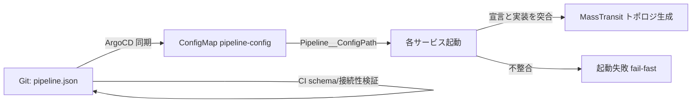

<!-- trace:
ids: [FR-14, FR-15]
adrs: [ADR-0018]
iadrs: [IADR-0027, IADR-0028]
specs: [20260708_issue-102_composability-fixed-variable-separation, 20260708_issue-111_declarative-pipeline-config]
issues: [#444]
-->

# 機能仕様書: コンポーザビリティ（宣言的パイプライン構成による組み替え）

> Issue #118 監査で欠落が判明したため後追いで作成（実装は Issue #102 / #111 で完了済み）。
> 実装済みの挙動を仕様として確定する。

## 起点となる計画書（トレーサビリティ）

- 機能要求: システム構成をコア改修なしに宣言的な構成定義の変更とプラグイン追加のみで組み替えられること
- ユースケース（UC）: —（運用・保守要求）
- 計画書リンク: `02_requirements/01_requirements.md`、`06_technical/10_composability-design.md`、`07_adr/ADR-0018`
- 実装 ADR: 固定/可変分離のフォルダ・名前空間規約（Foundation / Composable）、
  宣言的パイプライン構成は JSON 単一宣言＋起動時 fail-fast 照合で実現する

## 概要

取り込み〜正規化〜索引〜Wiki 同期の処理パイプライン（段構成・イベント接続）を、コード改修なしに
**宣言的構成定義（`deploy/helm/microservices-platform/files/pipeline.json`）** の変更だけで組み替え可能にする。

- **固定部（Foundation）／可変部（Composable）の分離**: 各サービスは `Foundation/`
  （認証・永続化・可観測性等の固定基盤）と `Composable/`（差し替え・組み替え対象の段・ポート実装）に
  フォルダを分離する。Foundation → Composable の参照は禁止（一方向依存）。
- **宣言的段構成**: パイプライン段（MassTransit コンシューマ）は `IPipelineStep` を実装し、
  `pipeline.json` の `steps[]` 宣言（name / service / consumer / input / outputs / enabled / queue）に
  従って登録される。

## 機能詳細

| 項目 | 内容 |
| --- | --- |
| 入力 | `pipeline.json`（Git 管理。events / sources / steps）。Helm ConfigMap（`pipeline-config.yaml`）が `{"Pipeline": {...}}` 形のオーバレイへ変換し、`Pipeline__ConfigPath` で各サービスへ供給 |
| 処理 | 起動時に `AddPlatformPipelineConfig()` が宣言を読み込み、`AddPlatformPipelineStep<TConsumer>()` が宣言に従いコンシューマを登録（`enabled: false` は購読・キューを生成しない） |
| 出力 | 宣言どおりの MassTransit トポロジ（購読・キュー）。実効構成は読み取り専用の構成情報 API で可視化 |
| 業務ルール | 宣言と実装の不整合は起動時 fail-fast（下記） |

### 誤構成対策（起動時 fail-fast。10_composability-design §5 安全弁）

1. 宣言なし（`Steps` 空）→ 既定配線で登録（ローカル・テスト互換）
2. 宣言があり対象段が未宣言 → 起動失敗（適用漏れ・名称ずれ検出）
3. `consumer` 型完全名の不一致 → 起動失敗（段名の付け替え誤り検出）
4. `IConsumer<TIn>` の TIn 型名と `input` の不一致 → 起動失敗（配線ずれ検出）
5. `enabled: false` → 登録しない、`enabled: true` → 登録（`queue` 指定時は受信エンドポイント名を上書き）

### CI・GitOps での検証・適用

- CI（`.github/workflows/ci.yml`）が `scripts/validate-pipeline-config.js` で
  `pipeline.schema.json` 準拠・接続性（発行元のないイベント購読）・循環・型名形式を検証する。
- Helm は `checksum/pipeline-config` アノテーションにより pipeline.json 変更で該当 Deployment を
  ロールアウトする（`pipelineSteps: true` のサービスのみ）。

## 処理フロー

## 例外・エラー処理

| 条件 | 振る舞い | 検出箇所 |
| --- | --- | --- |
| スキーマ違反・接続性欠落・循環 | CI 失敗（マージ不可） | `validate-pipeline-config.js` |
| 宣言と実装の名称・型不整合 | サービス起動失敗（fail-fast） | `PipelineExtensions` |
| 宣言ファイル欠落（ローカル） | 既定配線で動作（警告ログ） | `AddPlatformPipelineConfig` |

## 受け入れ基準

- [x] pipeline.json の変更のみで段の有効/無効・キュー名を組み替えられる（コード改修不要）
- [x] 宣言と実装の不整合が起動時に fail-fast で検出される
- [x] CI が宣言のスキーマ・接続性・循環を検証する
- [x] Foundation → Composable の参照が存在しない

## 関連仕様

- 作業仕様書: 作業仕様書: 既存実装の固定部分と可変部分の分離（フォルダ構成再編） /
  作業仕様書: 宣言的パイプライン構成
- 技術文書: [composability-classification](../tech/composability-classification.md)
- 機能仕様書: [FR-15_config-info-api](FR-15_config-info-api.md)（構成の可視化・ドリフト検出）
- テスト仕様書: [FR-14_composability](../tests/FR-14_composability.md)

## 未決事項

- なし（残項目は Issue #102 のフォローアップとして計画済み）
