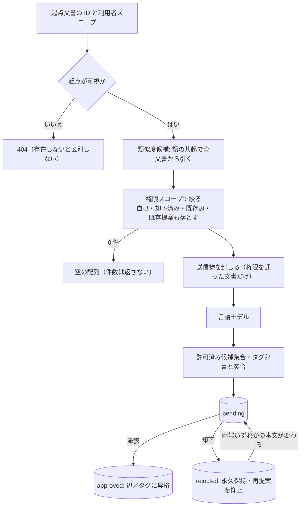

<!-- trace:
ids: [FR-05, FR-17, FR-18, UC-10, SC-03, SC-09, SC-21]
adrs: [ADR-0033, ADR-0034, ADR-0050, ADR-0051, ADR-0063]
iadrs: [IADR-0242, IADR-0266, IADR-0272, IADR-0300, IADR-0323, IADR-0364, IADR-0380]
specs: [20260822_issue-914_ai-suggestion-state-machine, 20260823_issue-915_ai-suggestion-generation, 20260829_issue-450_ai-suggestion-approval, 20260903_issue-1187_tag-suggestion-reflection-and-dictionary, 20260905_issue-1244_similarity-candidate-source]
issues: [#450, #914, #915, #918, #1014, #1187, #1215, #1244]
-->

# 機能仕様書: AI 提案（リンク候補・タグ候補）

> **`status: in-progress` の理由**: 生成・承認・却下・再提示の経路は実装済みだが、**利用者が生成を起動する導線が無い**
> （§未決事項）。本書は 2026-09-05 に、類似度候補の供給元が入った時点で起こした。それまで供給元は「常に空」で、
> **提案は構造的に 0 件だった**（承認・却下・状態遷移はすべて緑のテストを持ちながら、守る対象が 1 件も生まれていなかった）。

## 概要

文書間の関連（リンク候補）と文書へのタグ候補を AI が提案し、**人間の承認を経て**確定リンク・確定タグへ昇格する機能である。
承認されない提案は検索・回答の根拠に用いない。承認の主導線は文書詳細画面、棚卸しの一覧は AI 提案一覧画面（従）である。

**提案を受ける利用者の権限スコープ外の文書を言語モデルへ渡してはならない**（計画の要求文）。本機能の設計はこの 1 行を
中心に組まれている —— 類似度の算出だけは全文書横断で行ってよいが、**言語モデルへ渡す前に必ず権限スコープで絞る**。

## 機能詳細

| 項目 | 内容 |
| --- | --- |
| 入力 | 起点の文書 ID、要求した利用者の権限スコープ（読み取り） |
| 処理 | [1] 起点の可視性 → [2] 類似度候補（全文書横断） → [3] 権限スコープで絞る（自己・却下済み・既存辺・既存提案も落とす） → [4] 送信物を封じる → [5] 言語モデル → [6] 許可済み候補集合・タグ辞書と突き合わせて `pending` で保存 |
| 出力 | 生成できた提案の配列（`pending`）。**件数・落とした件数は返さない** |
| 業務ルール | 1 実行 = 1 利用者のスコープ／権限外は「見つからない」（404）に倒す／却下した組み合わせは再提案しない。両端いずれかの本文が変わったときだけ解除し、理由を添えて再提示する／タグ候補はタグ辞書に定義済みの値に限る／一括承認は提供しない |

### 類似度候補の供給元（[2]）

**語の共起**による決定的な供給元を既定にする。文書ごとに表題と本文から語の出現数（CJK は検索側と同じ 2-gram、
それ以外は小文字化した 2 文字以上の語。表題の語は 3 倍。上位 128 語）を持ち、IDF 重み付きコサインで起点に似た文書を
最大 50 件引く。しきい値（既定 0.1）未満は「無関係」として落とす。**外部の言語モデル・埋め込み・他サービスに依存しない**ので、
埋め込み経路が不安定でも提案が 0 件へ戻らない。同義で語彙が違う文書（「認可」と「アクセス制御」）は結び付かない —— これは
埋め込みに劣る点であり、埋め込み経路が稼働で安定した時点で**追加の供給元**として重ねる余地を残している。

語の出現数は、却下解除・リンク抽出と同じ「本文指紋の変化」を契機に、同じ 1 回の本文読み取りから作り直す。行が無い文書は
表題から候補になるため、既存文書の一括再構築は要らない。**出現数の表は本文・表題・スニペットを持たない**
（権限スコープを跨いで読まれるため）。

**供給元は権限スコープを受け取らない。** 返る候補には権限外の文書が混じる。それを絞るのは [3] であり、
[3] の戻り値は「権限を通った文書」の型しか無いため、**言語モデルへ渡してから捨てる形はコードとして書けない**。

構成: `AiSuggestions:Similarity:Source`（`term-overlap` 既定／`none` で供給元を切る。**未知の値は起動を落とす** ——
綴り間違いで提案が静かに 0 件になる形にしない）・`AiSuggestions:Similarity:MinScore`。

### 承認・却下

文書詳細画面の承認欄で 1 件ずつ行う。資格は「起点文書への書き込み権限 **または** 管理者ロール」。タグ提案の承認は
対象文書のタグへ反映してから承認済みになる（辞書外の値は承認できず、却下のみ）。詳細は画面仕様書と通信仕様書。

## 処理フロー / 状態遷移

## 例外・エラー処理

| 条件 | 振る舞い | エラー表示 |
| --- | --- | --- |
| 起点が存在しない／権限外 | 404。言語モデルを呼ばない | 「見つからない」 |
| 権限スコープが解決できない | 何もしない（deny-by-default）。404 | 同上 |
| 類似度候補が 0 件／絞った結果が 0 件 | 空の配列。**件数を返さない**・ログにも出さない | — |
| 言語モデルが縮退応答（送信拒否・refusal） | 提案を 1 件も作らない | — |
| 言語モデルが渡していない文書 ID を返す | その提案を捨てる | — |
| タグ辞書が引けない | タグ提案を作らない（リンク提案は影響しない） | — |
| 供給元の構成値が未知 | **起動が落ちる**（既定へ倒さない） | 起動ログ |

## 受け入れ基準

- [x] 提案の生成時に、提案先利用者の権限スコープ外の文書が言語モデルへ送信されない（送信ペイロードを捕捉して照合。実供給元でも同じ）
- [x] 提案は `pending` / `approved` / `rejected` の 3 状態を持ち、承認して初めて辺・タグになる
- [x] 却下した組み合わせは再提案されず、両端いずれかの本文が変わったときだけ理由つきで再提示される
- [x] タグ候補はタグ辞書に定義済みの値に限る（生成段・承認段の両方で強制）
- [x] 一括承認の手段が無い（公開 API のルート表を走査して不在を固定）
- [x] **実文書 2 件から提案が 1 件以上生まれる**（本番の依存注入で測る。「0 件でも緑」にならない）
- [ ] 利用者が生成を起動できる（導線が無い。§未決事項）

## 関連仕様

- 画面仕様書: [文書詳細／プレビュー](../screens/SC-03_document-detail.md)（承認欄）・[AI 提案一覧](../screens/SC-21_ai-suggestion-list.md)
- 通信仕様書: [BFF 境界](../api/BFF_bff-surface.md)（個々の要求・応答は [`openapi.yaml`](../api/openapi.yaml) を正とする）
- データ仕様書: [知識グラフ](../data/knowledge-graph.md)（`ai_suggestions`・`graph_document_term_profiles`）
- テスト仕様書: [AI 提案](../tests/FR-18_ai-suggestions.md)

## 未決事項

1. **利用者が生成を起動する導線が無い。** サービスの生成の口は要求時・利用者スコープで走る形で在るが、公開 API に出しておらず、
   文書詳細画面にボタンも無い（計画の文書詳細画面は置く要素を 2 つに限っている）。文書更新時の自動起動・定期のいずれも
   計画が定めていないため、実装で先取りせず計画側へ裁定を依頼する。
2. 類似度のしきい値と候補の質は実データで測っていない（既定 0.1 は合成データで決めた値）。
