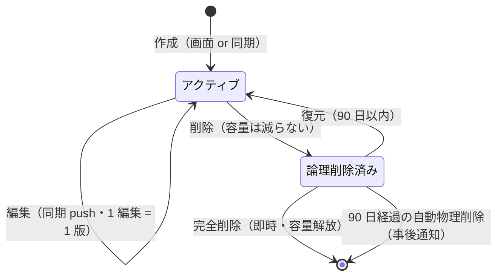

<!-- trace:
ids: [FR-19, FR-20, FR-21, FR-22, UC-11, SC-19, SC-20]
adrs: [ADR-0036, ADR-0037, ADR-0046, ADR-0054, ADR-0056, ADR-0058]
iadrs: [IADR-0253, IADR-0270, IADR-0277, IADR-0278]
specs: [20260823_issue-451_private-note-obsidian-sync-core, 20260828_issue-451b_notification-ingress, 20260828_issue-451a_private-notes-bff, 20260828_issue-451c_sc19-sc20-screens]
issues: [#451, #516, #600, #986, planning#472, planning#475]
-->

# 機能仕様書: 個人資料（private-note）

> **`status: in-progress` の理由と、いま残っているもの**。バックエンド中核（台帳・容量・版保持・
> 論理削除／復元／完全削除・露出トグルの保存・通知の発火検知）は入っている。
> **①画面（個人資料管理・連携設定）も 2026-08-28 に実装した**（BFF 端点は同日実装済み）——
> **ただし公開範囲〔共有先〕の表示・変更、同期状態の列、緊急アクセス、同期対象フォルダの設定・
> 競合解決・同期履歴は、呼ぶ口が公開 API に無いため画面に無い。** 差分は画面仕様書の対応表が正本である。
> **入っていないのは** ③露出トグルの生産側配線（個人資料を索引へ流す発行の解禁。AI 入力トグルの
> 消費側は 2026-08-28 に実装済み・グラフ表示トグルの消費側は未着手） ④退職時規則・
> （②通知は受け口・発火の結線とも 2026-08-28 に実装済み — 通知サービスの配備が残る）
> アカウント無効化時のトークン失効（認可・人事連携側）である。線引きは同名の作業仕様書と
> 実装 ADR（trace 参照）にある。

## 概要

利用者が自身の**個人資料**をナレッジベース上で保持し、公開範囲（共有先）を自ら設定できる機能である。
文書スコープ属性（`doc_scope`）の値 `private-note` が個人資料の判定軸であり、**判定は常に集合帰属**
（`== "private-note"`）で行う。属性を持たない既存の組織文書を巻き込まないためである。

本文の編集手段は Obsidian 同期経路に限る（Wiki.js へは同期しない）。画面からの作成は
タイトルのみ（本文なし）である。

## 機能詳細

| 項目 | 内容 |
| --- | --- |
| 作成 | `POST /private-notes`（タイトルのみ）または同期経路の push。既定値: `doc_scope=private-note`・`owner=本人`・機密区分 `restricted`・露出 3 トグル OFF・共有 0 件 |
| 一覧 | `GET /private-notes`（削除済みを含む）＋容量表示（使用量・上限・百分率） |
| 論理削除 | `DELETE /private-notes/{id}`。90 日間は復元でき、**容量は減らない**（応答の `capacityFreed=false` が根拠） |
| 復元 | `POST /private-notes/{id}/restore`（90 日以内。物理削除後は行が無く 404） |
| 完全削除 | `POST /private-notes/purge`（ids 配列。単票も一括も同じ端点）。応答に**解放される容量**を返す。対象は削除済みのみ |
| 露出設定 | `PUT /private-notes/{id}/exposure`（横断検索／グラフ／AI の 3 トグル。独立に設定・既定 OFF） |
| 上限変更 | `PUT /private-notes/quotas/{ownerId}`（管理者のみ。1 バイト〜1 TB） |
| 共有 | 既存の文書共有 API（`/documents/{id}/shares`。所有者のみ変更可・再共有不可） |

### 保存容量の規則

- 既定 **1 GB**・管理者が最大 **1 TB** まで引き上げ可。
- 算入 = **最新版 ＋ 論理削除済み（90 日の保管中）**。**版履歴は算入しない**
  （台帳が最新版のバイト数しか持たない —— 規則をデータの形で守る）。計上単位は本文の UTF-8 バイト数。
- **80% / 95% の跨ぎで各 1 回警告**（閾値を下回ると再武装）。
- **100% で新規作成のみ拒否（507）**。既存資料の更新は容量を見ずに通す（書きかけを失わせない）。
  上限を跨ぐ新規作成も拒否する（超過は更新の増分に限る）。

### 版履歴の保持

- 編集の回数だけ版を保持する（オフライン 10 編集 → 1 同期でも 10 版）。
- 保持上限は **1 資料あたり直近 50 版かつ 90 日**。**両方の条件を満たさなくなった版**から
  古い順に物理削除する（日次バッチ）。組織文書の版履歴には適用しない。

### 削除と通知

- 論理削除から 90 日で自動物理削除（復元不可）。
- 通知は 3 段構え（週次／完全削除 7 日前／事後）＋容量警告（80/95）＋トークン期限予告。
  いずれも**件数・閾値・期限のみ**を運ぶ（タイトル・本文のフィールドが型として存在しない）。
  検知と送出はデータの在る本サービス、実体は通知サービス（受け口・発火の結線とも実装済み。送出は fail-open・発火記録先行の各 1 回。通知サービスの配備が残る）。

### 露出の既定（deny 側）

個人資料は**取り込み・索引・Wiki 同期へ一切流れない**（文書更新イベントを発行しない）。
露出トグル ON の消費側配線は認可スコープの分岐評価が全サービスへ行き渡ってからの別作業であり、
それまで ON は保存されるだけで何も露出させない。

## 処理フロー / 状態遷移

## エラー・例外

| 状況 | 応答 |
| --- | --- |
| 100% 到達時の新規作成 | 507（拒否理由と自力復帰の手段を本文に含める） |
| 他者の資料への操作 | 404（存在秘匿。403 を返さない） |
| 削除済みでない資料の完全削除 | 409 |
| 本文 1 MB 超 | 413（切り詰めない） |
| `doc_scope` の未知値 | 400。一般文書経路での `private-note` 作成も 400（台帳の無い個人資料を作らせない） |
| `doc_scope` を作成後に変える更新 | **400**。文書スコープは作成時に確定し、以後変更できない。**属性は全置換であるため、既存値の削除も後からの新規付与も「変更」に当たる**（同じ値の同送は通る）。内容を移したい場合は移し先のスコープで新しい文書を作る |

## 関連

- テスト仕様書: [FR-19_private-notes-lifecycle](../tests/FR-19_private-notes-lifecycle.md)
- 画面仕様書: [個人資料管理](../screens/SC-19_private-notes.md) /
  [Obsidian 連携設定](../screens/SC-20_obsidian-settings.md)（**画面に無い要素の一覧はそちらが正本**）
- データ仕様書: [private-note](../data/private-note.md)
- 通信仕様書: [FR-20_obsidian-sync](../api/FR-20_obsidian-sync.md)
- 機能仕様書: [FR-22_user-notifications](FR-22_user-notifications.md)
