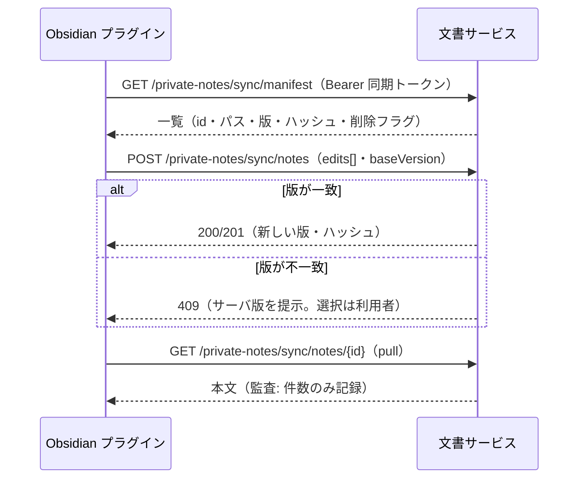

<!-- trace:
ids: [FR-19, FR-20, FR-22, UC-11, SC-20]
adrs: [ADR-0037, ADR-0046, ADR-0054]
iadrs: [IADR-0270, IADR-0338, IADR-0352, IADR-0353]
specs: [20260823_issue-451_private-note-obsidian-sync-core, 20260828_issue-451b_notification-ingress, 20260828_issue-451a_private-notes-bff, 20260902_issue-1098_obsidian-plugin-pull-stage1, 20260903_issue-1153_obsidian-plugin-push-delete-conflict-stage2, 20260903_issue-1176_obsidian-sync-rename-contract]
issues: [#451, #600, #1098, #1153, #1176]
-->

# 機能仕様書: Obsidian 双方向同期

> **`status: in-progress` の理由と、いま残っているもの**。サーバ側の同期プロトコル・
> 同期トークン（端末・発行・失効）・監査・期限予告の検知と、連携設定画面・BFF 端点は入っている。
> **［2026-09-03］Obsidian プラグイン本体（自作・社内配布）は双方向になった**（第 1 段 = 取り込み、
> 第 2 段 = 送信・論理削除・競合の 3 択・サーバ側削除／リネームの伝播。`src/obsidian-plugin/`。
> §Obsidian プラグイン）。**［2026-09-03］名前についても双方向になった** —— ローカル側のリネームを
> ナレッジベースへ伝えるリネームの口を契約へ足した（従前の残件②は解消した）。
> **入っていないのは** ①同期プロトコルをエッジで外へ出す経路（配備済みクラスタからは到達できない）
> ②配布のリリース資産化 である（通知は受け口・発火の結線とも 2026-08-28 に実装済み — 通知サービスの配備が残る）。

## 概要

利用者が**自身が所有する個人資料**をローカルの Obsidian Vault と**双方向に同期**する機能である。
転送方式は自作 Obsidian プラグイン（社内配布）であり、サーバ側は本書のプロトコルを提供する。
**ナレッジベースが唯一の正**であり、Obsidian はクライアントとして位置づける。

同期は egress（外部送信）に当たるが、条件付きで許容される（データ越境ポリシーの例外規定）。
許容条件の実装対応: ①対象は当該利用者の所有資料のみ ②資格情報のスコープ限定（同期トークン）
③経路は本システムの提供する手段のみ ④実行記録を監査ログへ残す（タイトル・内容は記録しない）。

## 機能詳細

### 同期トークン（ブラウザセッションと別系統）

| 規則 | 内容 |
| --- | --- |
| 発行 | 利用者が連携設定画面から自ら発行する。**管理者承認を挟まない**（私物端末を認める） |
| 有効期限 | **30 日**。期限切れは 401（同期が止まる） |
| 更新 | **手動再発行のみ**。自動リフレッシュの経路は存在しない（30 日の統制を実質化する） |
| 失効 | 端末ごとの個別失効＋**全端末の一括失効**（紛失端末を特定できない場面の防御） |
| 保存 | 平文は発行応答で 1 回だけ返す。サーバは SHA-256 ハッシュのみ保存する |
| 期限予告 | 期限の **7 日前に 1 回**通知（当日の追加通知なし） |

### 同期の規則

| 規則 | 内容 |
| --- | --- |
| 方向 | 双方向（push / pull / manifest）。名前（`vaultPath`）も双方向で、Obsidian 側のリネームは専用の口でナレッジベースへ伝わる |
| 対象判定 | **本人が所有する個人資料**のみ。公開範囲（共有）と独立であり、公開範囲を変更しても同期は継続する |
| スコープ外 | 他者の資料（**自身に共有されたものを含む**）・組織文書は、どの端点からも 404（存在秘匿） |
| 粒度 | 対象フォルダはプラグイン側の設定。対象から外れたファイルは**削除ではなく同期停止**（サーバへ削除を送らないだけ） |
| 版 | **1 編集 = 1 版**。push の edits 配列の要素数だけ版が刻まれる |
| 削除 | Obsidian 側の削除はサーバ側で**論理削除**（90 日保管・復元可） |
| 競合 | push の `baseVersion` が現在版と不一致なら 409。**サーバは自動解決しない**（ローカル採用／サーバ採用／両方残すの選択はプラグインが利用者へ提示する） |
| リネーム | 名前だけを動かす専用の口。**版は進めない**（本文が変わっていないため版履歴に行を足さない）。それでも最後に見た版が必須で、ずれていれば 409（古い認識のまま名前を動かさせない）。移動先が既存の有効な資料と重なれば 409 |
| 新規作成 | フェイルセーフ既定（`doc_scope=private-note`・`owner=本人`・機密区分 `restricted`・トグル OFF）をサーバ側で適用する。容量 100% では拒否（507） |
| 本文上限 | 1 MB / 413（本文受け入れ経路と同一の上限） |
| 監査 | push / pull / delete ごとに「誰が・いつ・何件」。タイトル・内容は記録しない |

## 処理フロー

## Obsidian プラグイン（client 側）

`src/obsidian-plugin/`（pnpm workspace メンバ）。Obsidian 本体に依存するのは入口・設定タブ・
競合ダイアログ・Vault アダプタ・`requestUrl` の 5 箇所だけで、同期の中身（client・差分計算・push の計画・
「1 編集」の刻み・競合解決・命名・ハッシュ）は Obsidian なしで単体テストされる。導入手順は
[手順ガイド](../how-to/obsidian-plugin-install.md)。

| 項目 | 挙動 |
| --- | --- |
| 方向 | **双方向**。「同期」は取り込み（pull）→ 送信（push）の順に行う。取り込みのみ・送信のみも選べる。同期の契機は手動（コマンド／設定タブ） |
| 設定 | 接続先 URL（https。loopback だけ http 可）・同期フォルダ・同期トークン |
| トークンの保管 | **端末ローカル**（Obsidian の Vault 固有 localStorage）。プラグイン設定ファイル `data.json` には置かない —— `data.json` は Vault と一緒に他の端末へ複製されるため、端末ごとの発行・失効と矛盾する。保存後は再表示しない |
| 取り込みの差分計算 | manifest の版とハッシュを最終同期時の記録と突き合わせ、変化のある資料だけ pull する。ローカルが既に同じ内容なら書かずに採用する。ローカルで編集済みの資料は上書きしない（送信で送る） |
| 「1 編集」の刻み | 保存イベントを **30 秒の静穏窓**で畳み込んだ単位を 1 編集とし、未送信の編集列を `data.json` に本文つきで積む（1 ファイル 50 件まで）。送信時に `edits[]` として送るので、オフラインで 10 回保存すれば 10 版 |
| 送信の計画 | 未追跡のファイルは新規、変わったファイルは更新（`baseVersion` = 最終同期時の版＝楽観ロック）。**「削除」と「同期フォルダから外す」は Obsidian のイベントで区別し**、削除だけ論理削除を送る。プラグインが見ていない間に消えたファイルは削除を送らない（報告のみ） |
| 競合（409） | **上書きせず**、資料ごとにダイアログで「ローカルを採用（サーバの版の上に編集列を積んで送る）」「サーバを採用（ローカルを上書き）」「両方残す（ローカルを別名で新規送信）」「保留」を提示する。選ぶまでどちらも変わらない |
| サーバ側の削除 | `deleted=true`（または manifest からの消滅）を検知しても**ローカルは消さない**。同期状態に印を残し、送信時に「ローカルを採用（新規として再作成）／サーバを採用（ゴミ箱へ）」を確認する |
| サーバ側のリネーム | ローカルのファイルを新パスへ移す（ローカルで編集していれば旧ファイルを残して通知） |
| ローカルのリネーム | 追跡の紐付けを更新し、**ナレッジベース側の名前も変える**（中身を送るより先に名前を送る）。移動先の名前が埋まっている／版がずれていれば伝わらず、競合として提示する（自動で名前を付け替えない）。名前の失敗は本文の送信を止めない |
| 失敗の可視化 | トークン未設定・401（期限切れ・失効・不正）・接続先不備は**通知で失敗を告げ、Vault のファイルと同期状態を変更しない**。413（1 MB 超）・507（容量）は資料ごとの失敗として通知する |
| 命名 | サーバの `vaultPath` を同期フォルダ配下へ落とす。絶対パス・`..`・制御文字は取り込まない。拡張子が無ければ `.md` を補う。同じローカルパスへ落ちる 2 件は両方取り込まない。送信時の `vaultPath` は同期フォルダを剥がした相対パス、タイトルはファイル名 |
| 消す向きの操作 | プラグインがローカルを消すのは「サーバを採用」とサーバ側リネームの旧パスだけで、いずれもゴミ箱（`.trash`）経由 |

🔴 **接続先の公開経路が無い。** 配備済みクラスタのエッジは `/bff` と SPA しか通しておらず、
`/private-notes/sync/*` へ外から届かない。契約は変えず、配備側で経路を足す（別 issue）。

## エラー・例外

| 状況 | 応答 |
| --- | --- |
| トークン欠落・不正・期限切れ・失効 | いずれも同じ 401（理由と存在を漏らさない） |
| スコープ外の資料 | 404（存在秘匿） |
| 版の競合 | 409（自動解決しない） |
| 容量 100% での新規作成 | 507 |
| 削除済み資料への push・リネーム | 409（復元してから同期する） |
| リネーム先の名前が既存の有効な資料と重なる | 409（上書きしない） |

## 関連

- テスト仕様書: [FR-20_obsidian-sync](../tests/FR-20_obsidian-sync.md)
- 通信仕様書: [FR-20_obsidian-sync](../api/FR-20_obsidian-sync.md)
- データ仕様書: [private-note](../data/private-note.md)
- 機能仕様書: [FR-19_private-notes](FR-19_private-notes.md)
