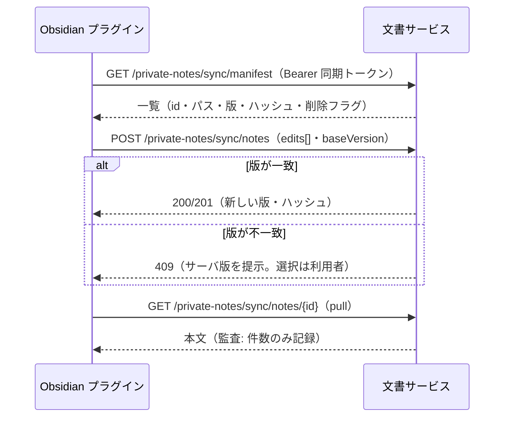

<!-- trace:
ids: [FR-19, FR-20, FR-22, UC-11, SC-20]
adrs: [ADR-0037, ADR-0046, ADR-0054]
iadrs: [IADR-0270]
specs: [20260823_issue-451_private-note-obsidian-sync-core, 20260828_issue-451b_notification-ingress]
issues: [#451, #600]
-->

# 機能仕様書: Obsidian 双方向同期

> **`status: in-progress` の理由と、いま残っているもの**。サーバ側の同期プロトコル・
> 同期トークン（端末・発行・失効）・監査・期限予告の検知は入っている。
> **入っていないのは** ①Obsidian プラグイン本体（自作・社内配布）②連携設定画面と BFF 端点である
> （③通知サービス側の受け口は 2026-08-28 に実装済み — 発火の結線が残る）。

## 概要

利用者が**自身が所有する個人資料**をローカルの Obsidian Vault と**双方向に同期**する機能である。
転送方式は自作 Obsidian プラグイン（社内配布）であり、サーバ側は本書のプロトコルを提供する。
**ナレッジベースが唯一の正**であり、Obsidian はクライアントとして位置づける。

同期は egress（外部送信）に当たるが、条件付きで許容される（データ越境ポリシーの例外規定）。
許容条件の実装対応: ①対象は当該利用者の所有資料のみ ②資格情報のスコープ限定（同期トークン）
③経路は本システムの提供する手段のみ ④実行記録を監査ログへ残す（タイトル・内容は記録しない）。

## 機能詳細

### 同期トークン（ブラウザセッションと別系統）

| 規則 | 内容 |
| --- | --- |
| 発行 | 利用者が連携設定画面から自ら発行する。**管理者承認を挟まない**（私物端末を認める） |
| 有効期限 | **30 日**。期限切れは 401（同期が止まる） |
| 更新 | **手動再発行のみ**。自動リフレッシュの経路は存在しない（30 日の統制を実質化する） |
| 失効 | 端末ごとの個別失効＋**全端末の一括失効**（紛失端末を特定できない場面の防御） |
| 保存 | 平文は発行応答で 1 回だけ返す。サーバは SHA-256 ハッシュのみ保存する |
| 期限予告 | 期限の **7 日前に 1 回**通知（当日の追加通知なし） |

### 同期の規則

| 規則 | 内容 |
| --- | --- |
| 方向 | 双方向（push / pull / manifest） |
| 対象判定 | **本人が所有する個人資料**のみ。公開範囲（共有）と独立であり、公開範囲を変更しても同期は継続する |
| スコープ外 | 他者の資料（**自身に共有されたものを含む**）・組織文書は、どの端点からも 404（存在秘匿） |
| 粒度 | 対象フォルダはプラグイン側の設定。対象から外れたファイルは**削除ではなく同期停止**（サーバへ削除を送らないだけ） |
| 版 | **1 編集 = 1 版**。push の edits 配列の要素数だけ版が刻まれる |
| 削除 | Obsidian 側の削除はサーバ側で**論理削除**（90 日保管・復元可） |
| 競合 | push の `baseVersion` が現在版と不一致なら 409。**サーバは自動解決しない**（ローカル採用／サーバ採用／両方残すの選択はプラグインが利用者へ提示する） |
| 新規作成 | フェイルセーフ既定（`doc_scope=private-note`・`owner=本人`・機密区分 `restricted`・トグル OFF）をサーバ側で適用する。容量 100% では拒否（507） |
| 本文上限 | 1 MB / 413（本文受け入れ経路と同一の上限） |
| 監査 | push / pull / delete ごとに「誰が・いつ・何件」。タイトル・内容は記録しない |

## 処理フロー

## エラー・例外

| 状況 | 応答 |
| --- | --- |
| トークン欠落・不正・期限切れ・失効 | いずれも同じ 401（理由と存在を漏らさない） |
| スコープ外の資料 | 404（存在秘匿） |
| 版の競合 | 409（自動解決しない） |
| 容量 100% での新規作成 | 507 |
| 削除済み資料への push | 409（復元してから同期する） |

## 関連

- テスト仕様書: [FR-20_obsidian-sync](../tests/FR-20_obsidian-sync.md)
- 通信仕様書: [FR-20_obsidian-sync](../api/FR-20_obsidian-sync.md)
- データ仕様書: [private-note](../data/private-note.md)
- 機能仕様書: [FR-19_private-notes](FR-19_private-notes.md)
