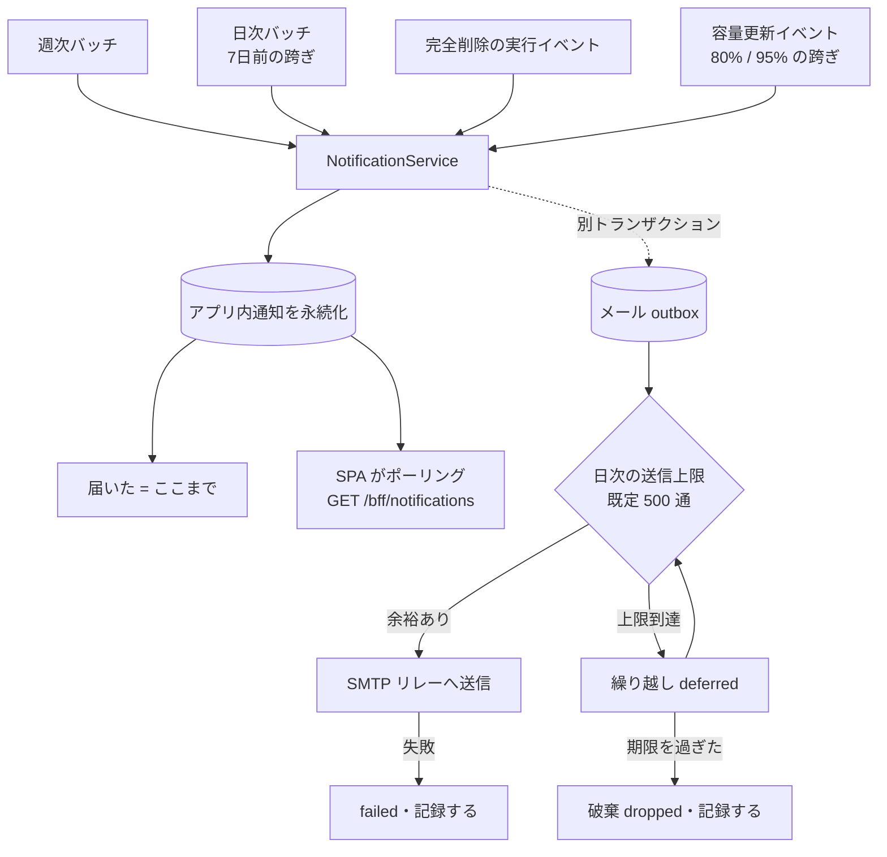

<!-- trace:
ids: [FR-19, FR-20, FR-22, UC-11]
adrs: [ADR-0037, ADR-0045, ADR-0046]
iadrs: [IADR-0056, IADR-0119, IADR-0121, IADR-0125, IADR-0132, IADR-0142, IADR-0215]
specs: [01_requirements, 01_usecases, 20260816_issue-600_fr22-in-app-notifications, ADR-0037_obsidian-sync-method, ADR-0045_mail-delivery-smtp-relay, BFF_notifications, FR-22_user-notifications, IADR-0215_notification-service-and-in-app-delivery]
issues: [#600]
-->

# 機能仕様書: FR-22 利用者本人への通知

> **`status: in-progress` の理由と、いま残っているもの**（`docs/README.md` の語彙）。
> 本書が記述する実装のうち、**アプリ内通知の契約と受け皿（フロント）は入っている**が、
> **送出側（`NotificationService`・メール outbox・レート制御・発火の結線）は入っていない**。
> 線引きの正本は [[IADR-0215]] 決定 6、経緯は 仕様書: FR-22 利用者本人への通知 である。

## 起点となる計画書（トレーサビリティ）

- 機能要求（FR）: **FR-22**（優先度 Should）。発火源として **FR-19**（個人資料・保存容量）・**FR-20**（同期トークン）
- ユースケース（UC）: **UC-11** 例外フロー（削除通知・容量警告）
- 業務フロー（04_workflows）: 該当なし（通知は画面遷移を伴わない）
- 計画書リンク:
  02_requirements/01_requirements.md（計画リポ） FR-22 ／
  03_usecases/01_usecases.md（計画リポ） UC-11 ／
  ADR-0037（計画リポ） 決定 6・17・18 ／
  ADR-0045（計画リポ） 決定 3・8

## 概要

**利用者本人へ通知を届ける機能**である。**アプリ内通知が主・メールが補助**であり、
**メールが送れない場合もアプリ内通知は届く**（メール送信基盤の可用性に通知全体が従属しない）。

計画が確定させているのは「**何を・いつ・誰へ**通知するか」までであり、
**アプリ内通知の実体（保持・既読・配信）と送出主体は実装設計に委ねられている**。
その実装設計は [[IADR-0215]] が持つ（**ここへ複写しない**）。

## 機能詳細

### 通知の 3 契機（計画が確定させたもの）

| # | `kind` | 契機 | 含める値 | 宛先 | 根拠 |
| --- | --- | --- | --- | --- | --- |
| ① -a | `private-note-purge-weekly` | 論理削除済み資料の**週次通知** | **件数** ＋ **完全削除までの期限**（最短のもの） | 所有者本人のみ | ADR-0037 決定 6 |
| ① -b | `private-note-purge-imminent` | 完全削除の **7 日前** | **件数** ＋ **期限** | 所有者本人のみ | ADR-0037 決定 6 |
| ① -c | `private-note-purge-done` | 完全削除の**事後** | **件数**（実行済み） | 所有者本人のみ | ADR-0037 決定 6 |
| ② | `storage-quota-warning` | 保存容量が **80% / 95%** に達した時点で**各 1 回** | **到達した閾値**（80 または 95） | 本人のみ | FR-19 / ADR-0037 決定 17 |
| ③ | `sync-token-expiry` | 同期トークンの期限の **7 日前** | **件数**（対象トークン）＋ **期限** | 所有者本人のみ | ADR-0037 決定 18（**期限切れ当日の追加通知は設けない**） |

### 入力・処理・出力

| 項目 | 内容 |
| --- | --- |
| 入力 | ①-a / ①-b / ③ = **時刻**（バッチ）。①-c = **完全削除の実行イベント**。② = **容量更新イベント**（閾値の跨ぎ） |
| 処理 | 宛先（**所有者本人のみ**）を解決し、**種別・件数・閾値・期限**だけからアプリ内通知を作る。**同一トランザクションにメール送信を含めない**。メールは outbox へ積む |
| 出力 | **アプリ内通知**（`GET /bff/notifications` で読める）＋ **メール**（補助。SMTP リレー） |
| 業務ルール | **本文は件数と期限のみ。資料のタイトル・本文・検索語・回答内容を含めない**。宛先は所有者本人のみ。**メールが送れなくてもアプリ内通知は届く**。**送信上限を超える通知が静かに落ちない** |

### **本文が「件数と期限のみ」であることを、契約の形で守らせる**

**`NotificationDto` に自由文のフィールドを 1 つも置かない**（[[IADR-0215]] 決定 2）。

| 項目 | 型 | 必須 | 説明 |
| --- | --- | --- | --- |
| `id` | uuid | ○ | 通知の識別子 |
| `kind` | 列挙（上表の 5 値） | ○ | 種別。**表示文言はこれから引く** |
| `count` | integer | — | **件数**。①（資料）・③（トークン）で使う。②は持たない |
| `thresholdPercent` | integer（80 / 95） | — | ②で到達した閾値。①③は持たない |
| `deadline` | date-time | — | **期限**。①＝完全削除の実行時刻、③＝トークンの失効時刻。①-c と②は持たない |
| `occurredAt` | date-time | ○ | 発生時刻 |
| `read` | boolean | ○ | 既読フラグ |

- **`title` / `body` / `message` に相当する項目は存在しない。**
- **表示文言はクライアントが Lingui カタログ（ja / en）から組み立てる。**
  `@platform/ui` には表示文言を入れない（[[IADR-0125]] 決定 1）。
- **メールの本文も同じ組み立て規則で作る**（送出側の文言テンプレート）。
  **メールは本システムの ABAC の外側へ出る**ため、この境界が最も重要である。

### 文言の組み立て規則（クライアント側）

| `kind` | ja | en |
| --- | --- | --- |
| `private-note-purge-weekly` | 削除済みの個人資料が {count} 件あります。最短で {deadline} に完全削除されます | {count} deleted personal note(s). The earliest permanent deletion is {deadline} |
| `private-note-purge-imminent` | 個人資料 {count} 件が {deadline} に完全削除されます（7 日前の通知） | {count} personal note(s) will be permanently deleted on {deadline} (7-day notice) |
| `private-note-purge-done` | 個人資料 {count} 件を完全削除しました | {count} personal note(s) have been permanently deleted |
| `storage-quota-warning` | 保存容量が上限の {thresholdPercent}% に達しました | Storage usage has reached {thresholdPercent}% of your limit |
| `sync-token-expiry` | 同期トークン {count} 件が {deadline} に期限切れになります（7 日前の通知） | {count} sync token(s) will expire on {deadline} (7-day notice) |

**資料名・トークン名・本文の断片はどの文言にも現れない。**

**`kind` は上の 5 種に閉じていない**（契約は `type: string`。[`BFF_bff-surface.md`](../api/BFF_bff-surface.md)
§横断の規約 4）。後段が種別を増やしても SPA は壊れず、**未知の種別は既定の文言
「新しいお知らせが {count} 件あります」と tone `neutral` へ落ちる**（テスト仕様書 T-16）。

### 通知パネルの開閉（共通シェルの作法）

**共通シェルへ載る最初のドロップダウンである。**ここで作法を外すと後続がこれに倣うため、
WAI-ARIA の disclosure に揃える。

| 操作 | 挙動 | 理由 |
| --- | --- | --- |
| ベルを押す | 開く／閉じる（トグル） | — |
| **Escape** | 閉じ、**フォーカスをベルへ戻す** | 戻さないとキーボード利用者の位置が失われ、閉じた先が分からなくなる |
| **パネルの外側を押す** | 閉じる | 閉じ手段がベルの再クリックだけだと、画面の他の場所へ移った利用者がパネルを残したままになる |
| **パネルの内側を押す** | **閉じない** | 「既読にする」を押すたびに閉じると、複数件を続けて処理できない |
| Escape 以外のキー | **閉じない** | — |

ハンドラは**開いているあいだだけ** `document` に登録し、閉じるときに外す。
写像は テスト仕様書 T-12〜T-15。

## 処理フロー / 状態遷移

**メール側（点線から右）がどう転んでも、`N`（アプリ内通知の永続化）には触れない。**
これが「メールが送れなくてもアプリ内通知は届く」の実体である。

## 例外・エラー処理

| 条件 | 振る舞い | エラー表示 |
| --- | --- | --- |
| 通知一覧の取得に失敗した | **共通シェルは壊れない**。ベルは未読件数を出さず、開いた一覧に取得失敗を示す | `Alert`（色 ＋ アイコン ＋ テキスト） |
| 通知が 0 件 | 「通知はありません」を出す（**空であることを明示する**。無言で何も描かない形にしない） | 通常表示 |
| 既読化に失敗した | 一覧はそのまま。失敗を伝えて再試行できる | `Alert` |
| メール送信が失敗した | **アプリ内通知には影響しない**。`failed` として記録し、監査ログと SC-10 へ出す | 利用者には出さない（補助経路の失敗である） |
| 日次の送信上限に達した | **繰り越す**（`deferred`）。期限を過ぎるものは `dropped` として**記録して**破棄する | 利用者には出さない。**運用者は SC-10 で観測できる** |
| 未認証 | `401`。SPA は既存の 401 導線（再認証）へ倒す | 既存の共通処理 |

## 受け入れ基準

計画 `02_requirements` の受け入れ基準を実装可能な粒度へ落としたものである。
**本 PR で満たした／backend 待ちの別は 仕様書: FR-22 利用者本人への通知 §受け入れ基準 が正本である**（ここへ複写しない）。

- [ ] **通知が所有者本人にのみ届く**（他の利用者・管理者へは届かない）
- [x] **通知の本文が件数と期限のみで構成される**（**契約にタイトル／本文の項目が無い**ことで守る）
- [ ] **アプリ内通知が主・メールが補助である**（メールが送れない場合もアプリ内通知は届く）
- [ ] **送信上限を超える通知が静かに落ちない**（監査ログと SC-10 で観測できる）
- [x] **状態表示が色だけで意味を持たない**（色 ＋ アイコン ＋ テキスト）
- [x] **文言が ja / en の両方で揃っている**（未翻訳キーは `check-i18n-catalogs.js` が止める）

## 関連仕様

- 画面仕様書: **なし**（通知は共通シェル横断の要素であり、計画に固有の SC 番号が無い。[[IADR-0215]] フォローアップ 4）
- 通信仕様書: [BFF 通知](../api/BFF_notifications.md) ／ [BFF 境界](../api/BFF_bff-surface.md)
- データ仕様書: **未作成**（送出側の永続化は本 PR の射程外。[[IADR-0215]] 決定 6）
- テスト仕様書: [FR-22](../tests/FR-22_user-notifications.md)
- 実装 ADR: [[IADR-0215]]

## 未決事項

1. **通知の一覧を独立画面にするか**は決めていない。計画に SC 番号が無いため、
   必要になったら計画へ環流して SC を起こす（**実装側で画面番号を作らない**）。
2. **メールの宛先アドレスの解決元**（Keycloak のユーザ属性か、独自の連絡先か）は送出側の設計であり、
   本 PR の射程外である。
3. **保持期間 90 日・ポーリング 60 秒は計画に根拠が無い実装側の判断である**（[[IADR-0215]] 決定 2）。
