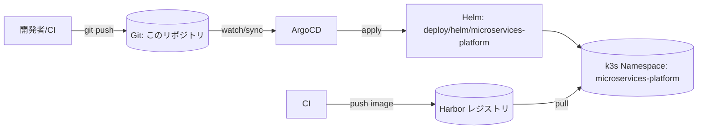

<!-- trace:
ids: [FR-15]
adrs: []
iadrs: [IADR-0017, IADR-0026, IADR-0034, IADR-0046, IADR-0069]
specs: [IADR-0029_config-info-api-placement-and-drift-granularity, IADR-0046_config-version-history-source, README, operations, security]
issues: []
-->

# how-to: デプロイ手順（環境ごと）と GitOps 運用

正本は各設定ファイルとその配置ディレクトリの README（[`deploy/argocd/README.md`](../../deploy/argocd/README.md)・
[`deploy/bootstrap/README.md`](../../deploy/bootstrap/README.md)・[`deploy/istio/README.md`](../../deploy/istio/README.md)・
[`docs/operations/operations.md`](../operations/operations.md)）である。本書はそれらへの入口として、
環境ごとの流れと参照先をまとめる。

## 環境一覧

| 環境 | 実行基盤 | 配備方式 |
| --- | --- | --- |
| dev | ローカル Docker Compose | `docker compose -f deploy/docker-compose.yml up -d`（[local-development.md](local-development.md)参照） |
| 共有 / stg / prod | k3s（Kubernetes） | GitOps（ArgoCD + Helm）。Git を単一の真実源として同期 |

k3s 系（共有/stg/prod）は、`deploy/helm/microservices-platform` の単一 Helm チャートを環境別の
`values.yaml`（または `--set`）で環境分岐させる構成である。

## GitOps 全体像（共有/stg/prod）



Git を単一の真実源とし、ArgoCD が Helm チャート（[`deploy/helm/microservices-platform`](../../deploy/helm/microservices-platform)）を
`microservices-platform` Namespace へ宣言的に同期する（`automated.selfHeal` 有効。out-of-band な手動変更は
Git 状態へ自動復元される）。

## 初回セットアップ（順序が重要）

以下の順で行う。各手順の詳細コマンドはリンク先の README を参照（本書では要約に留める）。

1. **Secret ブートストラップ**（[`deploy/bootstrap/README.md`](../../deploy/bootstrap/README.md)）
   Namespace 作成、DB/LLM/Wiki.js 同期用の Secret、Harbor Pull Secret（`harbor-pull`）を作成する。
   実値は Git にコミットしない（`secret-templates.example.yaml` のプレースホルダを実値に置換して apply）。
2. **Istio 導入**（[`deploy/istio/README.md`](../../deploy/istio/README.md)）
   Istio コントロールプレーンを導入し、Namespace へ `istio-injection=enabled` ラベルを付与する。
   > **前提順序の注意**: Helm チャートは既定 `mesh.enabled: true` で `PeerAuthentication` /
   > `DestinationRule`（Istio CRD）をレンダリングする。Istio CRD 未導入のクラスタへ ArgoCD で先に同期すると
   > 適用が失敗するため、Istio 未導入で先に GitOps を回す場合のみ一時的に `mesh.enabled: false` にする。
3. **ArgoCD 登録**（[`deploy/argocd/README.md`](../../deploy/argocd/README.md)）
   ArgoCD 自体の導入と、`AppProject`（`deploy/argocd/appproject.yaml`）・`Application`
   （`deploy/argocd/application.yaml`）の適用は一度だけ kubectl で行う。以降は Git 更新のみで同期される。

```bash
kubectl create namespace argocd
kubectl apply -n argocd -f https://raw.githubusercontent.com/argoproj/argo-cd/stable/manifests/install.yaml
kubectl apply -f deploy/argocd/appproject.yaml
kubectl apply -f deploy/argocd/application.yaml
```

## サービス単位のデプロイとロールバック

- **デプロイ**: `deploy/helm/microservices-platform/values.yaml` の `services.<name>.tag` を Git 上で更新し
  push する → ArgoCD が自動同期する（NFR: サービス単位の独立デプロイ）。
- **ロールバック**:
  ```bash
  argocd app rollback microservices-platform <revision>
  # もしくは Git 上で当該コミットを revert（GitOps の原則）
  ```
- **同期状態の確認**:
  ```bash
  argocd app get microservices-platform      # Sync/Health ステータス
  argocd app diff microservices-platform     # Git と実クラスタの差分（0 であること）
  ```

## 構成バージョン履歴

BFF の構成情報 API（`GET /bff/admin/config`）は、適用中の構成のバージョン（`Version.GitCommit` /
`AppliedAt` / `AppliedBy`）と適用履歴（`GET /bff/admin/config/history`）を返す。**正データ源は GitOps
層**であり（IADR-0046: 構成バージョン履歴の正データ源は GitOps 層とし、API は注入スライスを surfacing する）、API はプラットフォーム側に
履歴ストアを新設せず、GitOps から注入されたスライスをそのまま返す。

- **k8s（共有/stg/prod）**: 実際の適用リビジョン・日時は CD 側が同期時に上書きする。
  ```bash
  argocd app set microservices-platform \
    --helm-set config.gitCommit=$(git rev-parse HEAD) \
    --helm-set config.appliedAt=$(date -u +%Y-%m-%dT%H:%M:%SZ)
  ```
  （または release automation が `values-<env>.yaml` の `config.*` を更新して Git にコミットする）
  未注入の既定は `appliedBy: argocd` のみで `gitCommit`/`appliedAt` は空。
- **dev（compose）**: [`scripts/compose-up.sh`](../../scripts/README.md) が `git rev-parse --short HEAD` 等を
  自動注入する（[local-development.md](local-development.md) 参照）。
- **保持範囲**は GitOps 側（Git 履歴 / ArgoCD の保持リビジョン数）が決定し、API 側は二重に保持しない。
  履歴が未注入の環境では現在バージョンの単一エントリへ縮退する。
- **履歴（複数エントリ）の注入配線**（IADR-0069: 構成バージョン履歴は現在バージョンと同一注入経路で Helm から env 配列供給する・#192）:
  現在バージョンと同じ経路で Helm values `config.history`（既定 `[]`）を
  `Config__History__<i>__{GitCommit,AppliedAt,AppliedBy,HadDrift}` として BFF へ注入する。CD が各適用を
  新しい順の要素として供給する（例: `--helm-set config.history[0].gitCommit=$(git rev-parse HEAD)
  --helm-set config.history[0].appliedAt=$(date -u +%Y-%m-%dT%H:%M:%SZ) --helm-set config.history[0].appliedBy=argocd`、
  または `values-<env>.yaml` の `config.history` を更新）。既定空は履歴 env を出さず現在バージョン単一へ縮退する。
  実 ArgoCD リビジョン／Git ログからの自動履歴生成は稼働 CD・環境に依存するため後続とする。

## 構成ドリフトの検出

宣言（`deploy/helm/microservices-platform/files/pipeline.json`）と実効構成のドリフトは、BFF が定期
（既定5分）に加え、ArgoCD の PostSync フック（`templates/drift-postsync-job.yaml`）により各同期完了後にも
即時検出する。詳細・手動確認手順（`GET /bff/admin/config/drift`）・失敗時の扱いは
[`docs/operations/operations.md`](../operations/operations.md)「適用直後のドリフト即時検出」を参照。

## サービス間通信（STRICT mTLS）

サービス間認証の第一防御は Istio STRICT mTLS（IADR-0026: Istio STRICT mTLS をサービス間認証の第一防御とし、IADR-0017 を解消する）で、
`PeerAuthentication` / `DestinationRule` を Helm がレンダリングし ArgoCD が同期する。旧来のネットワーク分離
（IADR-0017: mesh 導入までのサービス間認証はネットワーク分離を第一防御とする、compose の `expose` / k8s の NetworkPolicy）は
IADR-0026 に Supersede され、多層防御として存続している。検証コマンド（`istioctl authn tls-check` 等）は
[`deploy/istio/README.md`](../../deploy/istio/README.md) を参照。

## CI ゲート（マージ前の必須チェック）

`.github/workflows/` に定義され、ブランチ保護（GitHub Settings → Branches）で必須化する運用
（[`docs/ai-workflow.md`](../ai-workflow.md)「必須チェックの有効化」参照）。

| ワークフロー | 内容 |
| --- | --- |
| `ci.yml` | コミット規約検査・`doc-links`（相対リンク切れ検査）・宣言的パイプライン構成のスキーマ検証・`dotnet format --verify-no-changes`・`dotnet build` / `dotnet test`（カバレッジ収集） |
| `frontend.yml` | フロントエンドの typecheck / lint / build / Playwright スモーク（`frontend/**` 変更時のみ） |
| `frontend-tests.yml` | フロントエンド単体テスト＋カバレッジ閾値（IADR-0034: フロントエンド カバレッジゲート） |
| `security.yml` | gitleaks（秘密情報混入検査）・dependency-review（PR 差分の既知脆弱性）・推移依存の定期脆弱性スキャン |
| `codeql.yml` | CodeQL（SAST） |
| `pr-title.yml` | PR タイトルの `種別(起点ID): 要約` 規約検査 |
| `changelog.yml` | `develop`/`main` push で `CHANGELOG.md` を自動更新 |
| `openapi.yml` | `docs/api/openapi.yaml` を自動更新 |

## 秘密情報・機密データの取り扱い

デプロイに関わる秘密情報（DB パスワード、Harbor 資格情報、LLM/埋め込みプロバイダの API キー、
Wiki.js 同期用 API キー等）は Git にコミットしない。作成手順は
[`deploy/bootstrap/README.md`](../../deploy/bootstrap/README.md)、機密区分別の埋め込みルーティングと
ゼロ保持設定は [`docs/operations/operations.md`](../operations/operations.md)「埋め込みプロバイダの設定・
ゼロ保持・再索引」、認証・認可・脅威対策の全体は [`docs/security/security.md`](../security/security.md) を参照。

## 関連ドキュメント

- ローカル開発: [`local-development.md`](local-development.md)
- 運用仕様書（デプロイ表・監視・障害対応の正本）: [`../operations/operations.md`](../operations/operations.md)
- セキュリティ仕様書: [`../security/security.md`](../security/security.md)
- AI 駆動の実装ワークフロー全体: [`../ai-workflow.md`](../ai-workflow.md)
