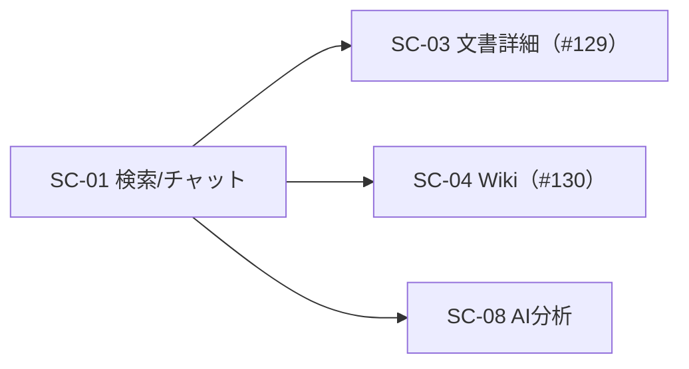

# 画面仕様書: 検索／チャット質問画面（SC-01）

## 起点となる計画書（トレーサビリティ）

- 画面（SC）: **SC-01 検索／チャット質問画面**（[05_screens/01_screens.md](../../planning/projects/microservices-platform/05_screens/01_screens.md) §SC-01）
- 関連ユースケース（UC）: **UC-01**（横断検索・AI 質問）
- 関連機能要求（FR）: FR-03（検索）・FR-04（RAG 回答）・FR-08（フィードバック）・FR-05（ABAC）・FR-11（LLM 越境）
- 関連 ADR: [[IADR-0037]]（SSE ストリーミング）・[[IADR-0033]]（SPA 基盤）・[[IADR-0009]]（存在秘匿）

## 画面概要・目的

本システムの主入口。1 つの入力から横断検索と根拠付き AI 回答（**真の SSE ストリーミング**表示・出典併記）を行う。
認証済みユーザー向け（ロール限定なし）。ABAC は後段（BFF/検索/AI）が narrowing・deny-by-default で適用する。

## データソース（BFF 境界）

| 用途 | エンドポイント | 認可 | 応答 |
| --- | --- | --- | --- |
| 横断検索 | `POST /bff/search` | 認証・ABAC スコープ解決（BFF） | `SearchResponse` |
| AI 回答（ストリーミング） | `POST /bff/analysis/ask/stream` | 認証・ABAC（後段） | SSE（citations→token*→done） |
| フィードバック | `POST /bff/feedback` | 認証 | `FeedbackDto` |

## レイアウト / 主要素

```
┌───────────────────────────────────────────────┐
│ 質問・キーワード [__________________] [質問する]│
├───────────────────────────────────────────────┤
│ 回答（ストリーミング逐次表示）                  │
│ 出典: [1] 文書タイトル（スニペット）→ 出典元    │
│ [👍] [👎]                                       │
├───────────────────────────────────────────────┤
│ 検索結果: 文書タイトル（抜粋）…                 │
└───────────────────────────────────────────────┘
```

## 表示・入力項目

| 項目 | 種別 | 必須 | 形式・制約 | 説明 |
| --- | --- | --- | --- | --- |
| 質問・キーワード | input | 必須 | 1 文字以上 | 送信で検索＋AI 回答 |
| 回答 | 表示 | - | ストリーミング | SSE token を逐次連結。`[n]` は出典番号 |
| 出典 | 表示/リンク | - | 番号・タイトル・スニペット | sourceUri へ遷移（SC-04 Wiki/出典元） |
| 👍/👎 | 操作 | - | up/down | done 後に有効。answerId に紐付け |
| 検索結果 | 表示/リンク | - | タイトル・抜粋 | markdownUri へ遷移 |

## アクション・イベント

| 操作 | 挙動 | 遷移先 |
| --- | --- | --- |
| 質問する | `/bff/search` と `/bff/analysis/ask/stream` を並行実行。回答を逐次表示、出典先行併記 | - |
| 出典クリック | 出典元（Wiki=SC-04 等）を開く。SC-03 文書詳細は #129 実装後に内部遷移へ | 出典元 |
| 👍/👎 | `/bff/feedback` に answerId＋rating を送信 | - |

## 画面遷移



## 権限・表示条件・存在秘匿

- 認証済みユーザーに表示（ナビ「検索 / AI質問」）。ロール限定なし。
- ABAC は後段が narrowing・deny-by-default で適用（BFF 検索はスコープ未許可なら空、AI は空回答へ縮退）。UI は権限有無を開示しない。
- FR-11: LLM 越境判定は LlmGateway が保持（機密区分により送信不可なら理由を本文として表示、外部送信しない）。

## エラー・状態

| 状態 | 表示 |
| --- | --- |
| streaming | 「回答を生成中…」＋逐次本文 |
| done | 本文確定・👍/👎 有効 |
| error（AI） | `role="alert"` 回答の生成に失敗 |
| 検索 loading/ok/error/空 | 検索中／結果一覧／検索失敗／該当なし |

## 関連仕様

- 作業仕様書: `docs/specs/20260708_issue-127_sc01-search-chat.md`
- テスト仕様書: `docs/tests/SC-01_search-chat.md`
- 実装 ADR: [[IADR-0037]]

## 未決事項

- 出典・検索結果からの SC-03（文書詳細）内部遷移は #129 実装後に接続（当面は出典元 URI へ直リンク）。
