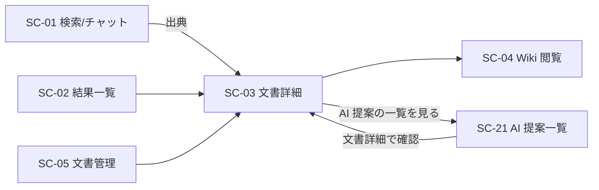

<!-- trace:
ids: [FR-05, FR-06, FR-12, FR-13, FR-17, FR-18, FR-19, FR-20, FR-21, SC-01, SC-02, SC-03, SC-04, SC-05, SC-09, SC-18, SC-21, UC-01, UC-02, UC-07]
adrs: [ADR-0031, ADR-0033, ADR-0034, ADR-0035, ADR-0063, ADR-0073]
iadrs: [IADR-0009, IADR-0038, IADR-0119, IADR-0121, IADR-0124, IADR-0126, IADR-0272, IADR-0276, IADR-0290, IADR-0300, IADR-0323, IADR-0355, IADR-0364, IADR-0365, IADR-0387]
specs: [20260804_issue-502_sc01-03-search-flow, 20260828_issue-1011_version-body-contract, 20260829_issue-450_ai-suggestion-approval, 20260831_issue-1104_suggestion-document-filter, 20260903_issue-1187_tag-suggestion-reflection-and-dictionary, 20260903_issue-1200_sc04-wiki-screen-via-bff, 20260905_issue-1240_sc03-graph-entry-and-placement-e2e]
issues: [#1011, #1014, #1104, #1187, #12, #1200, #1240, #446, #449, #450, #452, #490, #502, #504, #519, #541, #553, #586, #917, #918, planning#197, planning#237, planning#244, planning#473, planning#495]
-->

# 画面仕様書: 文書詳細／プレビュー

> **［実装状態］`status: completed` は「本仕様書が記述する範囲の実装とテストが揃った」ことを表す**
> （`docs/README.md` 運用ルール 6。計画側 `05_screens` の `status` には追随しない）。
> **未実装のまま残っている要素がある**——~~(1) ナレッジグラフビューへの導線~~、(2) 機密区分の表示名、
> (3) 共通シェルの右レール（**パンくずは #446 で実装した**）、(4) 左ナビの「文書詳細」項目。
> 詳細と引き受け先は §hi-fi モックアップとの対応 と §未決事項 を見ること。
> **番号は据え置く**——下の 3 つの追記が番号で参照しており、詰めると参照先がずれる。
>
> **［2026-09-05 / #1240］(1) ナレッジグラフビューへの導線を実装した。** これで、計画が
> 「本画面に置くのはこの 2 つのみ」と定めた**承認欄（2026-08-29）と導線（2026-09-05）が
> 両方とも揃った**。導線の仕様は §レイアウト / 主要素 と §表示項目 に、対応表は #7 にある。
>
> 🔴 **導線が 2026-08-07 から 2026-09-05 まで取り残された理由は「忘れた」ではない。**
> 前提の裁定が確定し、繰り延べの相手だった画面も着地したのに、**解除を実行する主体が
> 名指しされていなかった**（名指し先の issue が判断を残さずに閉じた）。同型を繰り返さないため、
> 本書で保留を書くときは**解除の条件だけでなく解除を実行する主体まで書く**。
>
> **［2026-08-29］AI 提案の承認欄を実装した。** 従前この (1) は「AI 提案の承認欄**と**
> ナレッジグラフビューへの導線」と 2 つを 1 項目にまとめており、**承認欄だけが先に着地したので
> その形が誤りになった**。承認欄の仕様は §AI 提案の承認欄 に、対応表は #8 にある。
>
> **［2026-08-10 訂正 / #553］(2) の理由書き「計画が 4 値中 2 値しか持たない」は失効した。**
> 4 値すべての表示名は裁定（2026-08-05 **Q7 / Q8 / 派生 Q30**）で確定しており、正は
> 計画リポジトリ `project-planning` の `docs/glossary.md` である（`restricted`＝**取扱制限**）。
> **未実装なのは写像であって、決まっていないのではない。引き受け先は #541。**
> **(4) は裁定 Q11 で「置かない」が確定した**ので、未実装ではなく**確定した設計**である
> （§左ナビに出さない理由 の追記）。

> **［2026-08-04 / #502］新スタックでの再実装に合わせて全面改訂した。**
> ルート `/docs/:id` は #490（ルート木の実装 ADR の決定 6）で計画へ是正済みであり、本改訂でも変えていない。

## 起点となる計画書（トレーサビリティ）

- 画面: **文書詳細／プレビュー**（計画側の画面設計 §文書詳細）
- 関連ユースケース: **検索・質問する**（出典から到達する終点）・**Wiki で閲覧する**
  - issue #502 は本画面を **AI 分析を依頼する**に対応づけている。AI 分析の**出典クリックの遷移先**が本画面であるため
    （計画側 03_usecases の AI 分析 基本フロー 4「結果と出典を返す」／
    画面遷移図 `SC08 -- 出典 --> SC03`）。計画の画面一覧が本画面に挙げる関連ユースケースは**検索・質問する／Wiki で閲覧する**である。
- 関連機能要求: **ABAC アクセス制御**・**文書 CRUD・版管理**・**正規化変換**（の閲覧面）
- モックアップ（**実装の正**）: hi-fi/sc-03.html（計画リポ） ／ wireframe/sc-03.html（計画リポ）
- 関連する実装 ADR: BFF 読み取りの ABAC ゲート・権限外は 404 とする存在秘匿・**関係探索から個人資料までの着手保留**

## 画面概要・目的

正規化文書（Markdown）を 1 件表示し、出典元・Wiki への導線と属性・タグ・版履歴を示す。

- ルート: `/docs/:id`（TanStack の表記は `/docs/$id`）
- アクセス: 認証済みユーザー。ロール限定なし（`RequireAuth` のみ）。ABAC はサーバ側（BFF）で適用し、
  権限外・不在はいずれも 404（存在秘匿）。

## hi-fi モックアップとの対応（実装する要素／実装しない要素）

行番号は planning `d980a01` の hi-fi/sc-03.html（計画リポ） に対するものである。
**粒度の規則は [検索／チャット質問画面 §hi-fi モックアップとの対応](./SC-01_search-chat.md) と共通である**——
(a) メイン領域の要素は個別に 1 行、(b) 共通シェルはまとめて 1 行（引き受け先を書く）、
(c) モックに無い状態は本表に入れず §エラー・状態 で扱う。

> **［対応表の凡例］「実装」列は 3 値である**（利用者裁定 2026-08-05・質問票 第12回 **Q21**。計画 `01_screens.md:408`）。
>
> | 値 | 意味 |
> | --- | --- |
> | **する** | モックの要素を満たしている |
> | **一部する** | **満たしていない条件がある。** その条件を備考へ必ず書く（書かない「一部」は二値と同じで、何が足りないか読めない） |
> | **しない** | 実装していない。理由（繰り延べか、裁定で落ちたか）を備考へ書く |
> | **—** | **本画面の射程外**（共通シェル等。引き受け先を備考へ書く）。3 値は本画面が実装する要素への判定であり、射程外の行を「しない」へ畳むと繰り延べと区別できなくなる |

| # | モックの要素（行） | 実装 | 備考 |
| --- | --- | --- | --- |
| 1 | タイトル ＋ 副題「正規化文書（Markdown）プレビュー」（417-418） | **する** | |
| 2 | 本文プレビューのパネル（419-421） | **する** | `Card`。Markdown **原文**を等幅・改行保持で表示（§本文の描画） |
| 3 | 「📖 Wikiで閲覧」（422） | **する** | Wiki 閲覧画面の文書別ディープリンク `/wiki?doc=<id>` へ。**権限内の Wiki 台帳にこの文書が載っているときだけ出す**（§Wiki への導線） |
| 4 | 「原本（ファイルサーバー）↗」（422） | **する** | `http(s)` のときだけリンク。`storage://` 等は等幅表記 |
| 5 | 属性・タグのパネル（432-433） | **一部する** | 機密区分・部門・タグを出す（§属性の表示）。**満たしていない条件: 機密区分の値を表示名へ写像していない** —— モックが「社内限」と描く箇所へ `internal` を**生値のまま**出す。4 値の表示名は裁定 **Q7 / Q8 / 派生 Q30** で確定済み（正は計画リポジトリ `project-planning` の `docs/glossary.md`）であり、**決まっていないのではなく写像が未実装**である。**引き受け先は #541**（`attributes.ts` が「写像を入れる先は #541」と明記）。**［2026-08-10 / #552］本行は従前「する」だった** —— 文書管理画面は同じ論点を別行（#7「しない」）へ切り出しているのに、本画面は 1 行へ畳んでいたため判定に現れていなかった |
| 6 | バージョンのパネル（434） | **する** | 版番号 ＋ 作成日時 ＋ 変更メモ |
| 7 | **「◉ 知識グラフで見る」**（422 右） | **する** | **［2026-09-05 実装］**ナレッジグラフビューの近傍探索へ**本文書を起点として**送る（`/graph?root=<id>&hops=2&by=distance`）。**ラベルはモックの「知識グラフ」ではなく「ナレッジグラフ」に揃えた**（§ラベルを揃える理由）。モックの `（SC-18）` は計画 ID なので画面には出さない |
| 8 | **「AI 提案 — この文書に対するリンク・タグ候補」パネル**（423-429） | **する** | **［2026-08-29 実装］**§AI 提案の承認欄 参照。**［2026-09-03］タグ提案の承認は文書のタグへ反映されるようになった**（従前の「承認だけを理由つきで実行不可にする」は失効）。承認・却下の資格は「その文書への書き込み権限 **または** 管理者」であり、資格の有無で行の描き方を 2 つに分ける（§タグ提案の扱い） |
| 9 | **AI 提案一覧画面への導線**（428 内） | **する** | **［2026-08-29 実装］**承認欄の下に「AI 提案の一覧を見る」を置く（一覧画面は実装済み） |
| 10 | **共通シェル**: 右レール「AIチャットパネル」（437-442） | **しない** | 移行**第 4 段**（SPA 新スタック移行の決定 5） |
| 11 | **共通シェル**: パンくず「ホーム / 検索結果 / …」（413）・ブランド／アバター（412） | — | **対象外（本画面の作業ではない）。** パンくず（**#446 で実装した**。本画面の最後の段は文書タイトルであり、画面側が実行時に渡す）・ブランド・アバターは `app/Layout` が持つ |
| 12 | **共通シェル**: 左ナビの「文書詳細」項目（414） | **しない** | **［2026-08-10 追記 / #553］裁定 Q11 で確定し、実装が追認された**（計画は左ナビ 4 グループから本画面を削除した。`01_screens.md:118` / `:121` / `:236`）。§左ナビに出さない理由 参照。〔当時〕**計画 §共通シェル が本画面を「利用者」グループに挙げていたため、環流の記録へ 1 項目として載せ、計画側へ §付随の論点 として起票した** |

### ラベルを揃える理由（#7）

モックは `◉ 知識グラフで見る（SC-18）` と描くが、**画面には「ナレッジグラフで見る」と出す。**

- ナレッジグラフビューのルート定義が既に同じ判断をしている——モックのパンくずは「知識グラフ」だが、
  **計画の画面名・左ナビは「ナレッジグラフ(ビュー)」**であり、計画は §用語 で
  「同じものに 2 つの名前があると食い違う」ことを名指しで避けている。左ナビ・パンくずは
  「ナレッジグラフ」で揃っているので、**本画面の導線だけを「知識グラフ」にすると、
  押した先の画面名と一致しない**。**新しい判断ではなく、既にある判断への追随である。**
- 括弧内の `（SC-18）` は**画面 ID の露出**であり、利用者に意味を持たない。出さない。
- 表記ゆれそのものは計画側へ環流する（本書では実装の側を揃えるに留める）。

### 繰り延べの記録（#7。**繰り延べであって放棄ではなかった**）

> **［2026-09-05］#7 は実装した。本節はもう「実装しない要素の理由」ではない。**
> 従前この節は #7・#8・#9 の 3 行をまとめて説明しており、
> #8（AI 提案の承認欄）・#9（一覧への導線）が 2026-08-29 に、#7 が 2026-09-05 に着地した。
> 以下の本文は**当時の記録**として残す（3 行のいずれについてももう成り立たない）。
>
> 🔴 **残しておくのは「なぜ 1 か月近く取り残されたか」が本節の形そのものに出ているからである。**
> 予告は「解除の条件」（前提裁定の確定）と「解除の相手」（ナレッジグラフ画面の実装）を書いたが、
> **解除を実行する主体を書かなかった。** 条件が満たされ相手も着地したあと、
> 判断先として名指しされていた issue が判断を残さずに閉じ、**誰の手番でもない状態**が残った。

- **AI 提案の承認欄は AI 提案の要求、知識グラフへの導線は文書間リンクの要求に属する。**
  着手保留の実装 ADR の決定 1 は「**関係探索から個人資料までの一連の要求の実装には着手しない。**保留の対象は当該要求を実現する
  プロダクトコードと、**その受け入れを担う画面**・API・データモデルである」と定めている。
  AI 提案の承認欄はまさに「AI 提案の受け入れを担う画面」であり、ナレッジグラフビューへの導線は
  「保留中の画面へ利用者を送る導線」である。
- **着手条件（決定 2）は前提 ADR が `Accepted` になること**であり、`Proposed` は満たさない。
  `ADR-0033` / `ADR-0034` は 2026-08-02、`ADR-0035` は 2026-08-04 に起案されたが、
  計画リポジトリ `d980a01` 時点でいずれも **`Proposed`** である（着手保留の実装 ADR §コンテキスト 4' の追記も同旨）。
- **後続で実装する。** 前提 ADR が `Accepted` になった時点で、ナレッジグラフビュー・AI 提案一覧の実装と同じ段で本画面へ足す
  （同 ADR の決定 6 の解除手順に従い、着手 issue の作業仕様書へ確認結果を記録する）。

> **［2026-08-07 / #586］上の予告の発火条件が成立した。** `ADR-0033`・`0034`・`0035` は planning `3e58b97`
> （裁定依頼への回答を反映したもの）で **`Accepted`** へ移り、着手保留の実装 ADR の保留は
> **文書間リンクと AI 提案について解除**された（同 ADR の 2026-08-07 追補 §解除で発火した予告）。
> **したがって「後続で実装する」段が来ている**——#586 は planning pin の更新と事実の追随に限り、
> **本画面の実装は変更していない**。
> **［2026-08-29］そのうち AI 提案の承認欄が着地した**（本書 §AI 提案の承認欄）。
> **［2026-09-05］ナレッジグラフビューへの導線も着地した**（本書 §表示項目・対応表 #7）。
> 同じ予告を書いた
> [`DocumentDetailPage.tsx`](../../src/knowledge/frontend/src/features/sc03-document/components/DocumentDetailPage.tsx)
> のコメントと**対**である（コードだけを直して仕様書を残さない非対称を作らない）。
- 計画側の本画面が「ここに置くのは次の 2 つのみである: ①ナレッジグラフビューへの導線、②AI 提案の承認欄」と
  述べているのは、**バックリンク欄・ローカルグラフを Wiki 閲覧側に置く**という分界の説明であり、
  本画面の他の要素（本文・属性・版履歴）を否定するものではない。本改訂はその 2 つだけを保留する。

### 左ナビに出さない理由

計画側の画面設計 §共通シェル の左ナビ 4 グループは「利用者」に **文書詳細**を含めており、
hi-fi モックの左レールにも「文書詳細」がある。しかし**本画面のルートは文書 ID を必須とする**
（`/docs/$id`）ため、ID を持たないナビ項目からは到達できない（`/docs/` は未知パスとして 404 になる）。

計画のグループ分けは**画面の所属を示すもの**であり、各画面が単独のナビ入口を持つことまでは要求していない
（モックのリンクは画面間の遷移例を示すために全画面へ張られている）。よって本画面へは
検索／チャット質問画面の出典・検索結果一覧・文書管理画面から到達する。**これは旧実装からの継続であり、本改訂で変えていない。**
「ID を持たない入口」が必要なら、それは検索結果一覧が既に担っている。

ただし**グループ分けの解釈自体は計画側の判断事項**であるため、
環流の記録 §付-2（環流記録。計画リポ `projects/microservices-platform/10_feedback/20260804_sc01-03-bff-contract-gaps.md` へ移設） に載せ、
**計画側へ §付随の論点 として起票済み**である。**裁定が出るまで実装は変えない。**

> **★［2026-08-10 追記 / #553］裁定が出た。実装は変えないままで正しい。**
>
> 利用者裁定 2026-08-05（質問票 第12回 **Q11**）で計画側が確定し、計画
> `05_screens/01_screens.md:121` / `:236` は現在**「左ナビのグループ分けは画面の『所属』を示すものであり、
> 各画面が単独のナビ入口を持つことを意味しない」「文書詳細は左ナビに置かない」**と書いている
> —— 理由（`/docs/:id` が ID を必須とし、ID を持たないナビ項目からは 404 になる／
> ID を持たない入口は検索結果一覧が既に担う）も**本節と同じ**である。左ナビ 4 グループからも本画面は削除された（`:118`）。
>
> **したがって本節の判断は追認された。** 本文の「裁定が出るまで」は当時の記録として残す。

## データソース（BFF 境界）

| 用途 | エンドポイント | 呼び出し方 | 認可 | 応答 |
| --- | --- | --- | --- | --- |
| 詳細（メタデータ） | `GET /bff/documents/{id}` | **orval 生成フック `useBffDocumentDetail`** | ABAC（BFF 集約・404 秘匿） | `DocumentDto` |
| 本文（Markdown） | `GET /bff/documents/{id}/content` | 同上 | 同上 | `DocumentContentDto` |
| 版履歴 | `GET /bff/documents/{id}/versions` | 同上（詳細の成功後に有効化） | 同上 | `DocumentVersionDto[]` |
| AI 提案（承認待ち） | `GET /bff/graph/suggestions?state=pending` | orval 生成フック `useBffGraphSuggestions` | 認証のみ（可視性は ABAC。**権限外の文書に関する提案は件数を含め現れない**） | `AiSuggestion[]` |
| 辺の型の表示名 | `GET /bff/graph/edge-types` | orval 生成フック `useBffGraphEdgeTypes` | 認証のみ | `EdgeTypeCatalogItem[]` |
| 承認 | `POST /bff/graph/suggestions/{id}/approve` | orval 生成フック（mutation） | 認証のみ。**判定は後段の 4 段**（読み取り可否 → 存在 → 両端が可視 → 書き込み可）。**拒否はすべて 404** | `AiSuggestion` |
| 却下 | `POST /bff/graph/suggestions/{id}/reject` | 同上 | 同上 | `AiSuggestion` |

- `DocumentDto = { id, title, status, markdownUri?, version, attributes{}, tags[], createdAt, updatedAt }`
- `DocumentContentDto = { id, title, markdown, sourceUri? }`（ABAC 判定後にオブジェクトストレージから取得。未配備時はプレースホルダ本文）
- `DocumentVersionDto = { documentId, version, title, status, attributes{}, tags[], changeNote?, createdAt }`
  - **本文の参照は持たない**（#1011）。版ごとの本文は保持されておらず、「その版の本文」を指せる値が存在しないため、
    版履歴から本文へ導線を張らない。本文は現行版の `…/content` だけが返す。
- キャッシュキーは**生成キー**（`['/bff/documents/{id}']` / `[…'/content']` / `[…'/versions']`）。
  「キーは BFF のパスに対応する」という画面のサーバー状態の持ち方の決定 4 の性質はそのまま保たれる。
- **版履歴は詳細の成功後にだけ取りに行く**（`enabled`）。詳細が 404（秘匿）のときに版履歴だけ叩くのは無駄な往復であり、
  BFF 側でも同じ 404 になる。

## レイアウト / 主要素

```text
┌──────────────────────────────────────┬───────────────────────┐
│ 経費精算規程 v3.2                      │ ▸ 属性・タグ           │
│ 正規化文書（Markdown）プレビュー        │   機密区分: internal   │
│ ┌──────────────────────────────────┐ │   部門: accounting     │
│ │ # 経費精算規程                     │ │   タグ: ［経理］［規程］│
│ │ ## 4. 精算スケジュール …            │ │                       │
│ └──────────────────────────────────┘ │ ▸ バージョン           │
│ ┌─ AI 提案（0 件なら欄ごと出ない）──┐ │   v3（2026-05-30）     │
│ │［リンク］A → B（関連する）        │ │                       │
│ │ 根拠 …            ［承認］［却下］ │ │                       │
│ │ AI 提案の一覧を見る                │ │                       │
│ └──────────────────────────────────┘ │                       │
│ 📖 Wikiで閲覧 ｜ 原本 ↗ ｜ ◉ ナレッジ  │                       │
│    グラフで見る                        │                       │
└──────────────────────────────────────┴───────────────────────┘
```

**この 1 行が計画の分界そのものである。** 計画は「本画面に置くのは①ナレッジグラフビューへの導線、
②AI 提案の承認欄の 2 つのみ」と定め、**バックリンク欄・ローカルグラフは Wiki 閲覧画面のみ**に置くと
確定している（2026-08-02 の利用者裁定）。**併置しないことは恒久の決定ではない**ので、
不在は単体テストとブラウザ E2E の両方で固定し、**足したときに落ちて気づける**形にしてある。

## 表示項目

| 項目 | 種別 | 説明 |
| --- | --- | --- |
| タイトル | 表示 | `<h1>` |
| 状態・版・更新日時 | 表示 | `status` / `v{version}` / `updatedAt`（ロケール表記） |
| 本文 | 表示 | Markdown 原文（§本文の描画） |
| Wiki で閲覧 | リンク | `/wiki?doc=<id>`。権限内の Wiki 台帳にこの文書が載っているときだけ出す（§Wiki への導線） |
| 原本 | 表示／リンク | `content.sourceUri ?? doc.markdownUri`。`http(s)` はリンク、それ以外は等幅表記 |
| ナレッジグラフで見る | リンク | `/graph?root=<id>&hops=2&by=distance`。**常に出す**（Wiki と違い、辿り着ける先の有無を前もって引く必要が無い）。**起点を必ず渡す**——遷移先は起点が無いと照会せず案内文を出すため、起点なしの導線は「押しても何も見えない導線」になる。深さ・間引き基準を明示するのは**既定値の複写ではなく明示の要求**である（遷移先の検索パラメータは 3 つとも必須で、feature をまたいで既定を引くことは依存規則が禁じている）。文書が見えないとき（404）は**画面ごと中立表示になるので導線も出ない**——導線だけが残ると存在秘匿がそこで破れる |
| 属性 | 表示 | §属性の表示 |
| タグ | 表示 | `Tag` の並び |
| 版履歴 | 表 | 版・状態・変更メモ・作成日時（`Table`） |
| AI 提案の承認欄 | 表示・操作 | §AI 提案の承認欄。**提案が 0 件のときは欄自体を出さない** |

### 属性の表示

計画側の本画面 §主要素は「属性・タグパネル（**機密区分・部門・タグ**）」と定める。
07_abac-attribute-model（計画リポ） の
基本属性に合わせ、**キーは既知のものだけ日本語ラベルへ写像**する。

| 属性キー | 画面ラベル | 出所 |
| --- | --- | --- |
| `confidentiality` | 機密区分 | 計画側 07_abac-attribute-model §基本属性・本画面 §主要素 |
| `department` | 部門 | 同上 |
| 上記以外 | **キーをそのまま表示** | 未知のキーを勝手に翻訳しない |

**属性の値は変換せず、そのまま表示する。** hi-fi モックは `internal` を「社内限」、`confidential` を「秘」と
描いているが、計画が定める値集合は `public` / `internal` / `confidential` / `restricted` の **4 値**であり、
モックに現れるのは**そのうち 2 値だけ**である（実測: `grep -n "社内限\|秘" mockups/hi-fi/sc-05.html sc-09.html`）。
残る 2 値の表示名は計画のどこにも無く、実装が決めれば**それが事実上の用語定義になってしまう**。
機密区分は取り違えると影響が大きい情報であるため、推測で名前を与えず生値を出す。
表示名は環流の記録に載せ、計画へ環流した（feedback/20260804_sc01-03-bff-contract-gaps.md（環流記録。計画リポ `projects/microservices-platform/10_feedback/20260804_sc01-03-bff-contract-gaps.md` へ移設）。
**計画側へ issue として起票済みであり、裁定を待っている**）。

> **★［2026-08-10 追記 / #553］裁定が出た。上の「2 値しか無い」という前提はもう成り立たない。**
>
> 利用者裁定 2026-08-05（質問票 第12回 **Q7 / Q8 および派生 Q30**）で **4 値すべての表示名が確定**した。
> **正は計画リポジトリ `project-planning` の `docs/glossary.md`** であり、計画側は
> 「同じ表を 2 か所に置くと片方が古くなる」として `01_screens.md` にも `07_abac-attribute-model` にも置いていない（`01_screens.md:224`）。
>
> | 値 | 表示名 |
> | --- | --- |
> | `public` | 公開 |
> | `internal` | 社内限 |
> | `confidential` | 秘 |
> | `restricted` | **取扱制限**（**「極秘」ではない** —— 個人資料が既定で `restricted` であり、すべて「極秘」表示にすると本当に極秘の組織文書を見分けられなくなるため） |
>
> **写像の実装先は #541 である。** 本 PRは記述の追随だけを行い、写像そのものは実装しない。
> 上の本文は**当時の記録**として残す。

### 本文の描画

**Markdown を HTML へレンダリングしない。** 原文を等幅・改行保持（`<pre>`）で表示する。

- 理由 1（**セキュリティ**）: 文書本文は外部データソース由来である。HTML 化は
  サニタイズ方針・許可タグの決定を伴い、誤ると保存型 XSS になる。
- 理由 2（**スタック**）: フロントエンドスタックの計画 ADR の採用技術一覧に Markdown レンダラは無い。依存の追加は
  08_data-egress-policy（計画リポ） の
  検査対象を増やす。
- **繰り延べであって放棄ではない**——レンダリングが必要なら、ライブラリ選定とサニタイズ方針を
  IADR で決めてから入れる（§未決事項）。旧実装からの継続であり、本改訂で変えていない。

### AI 提案の承認欄

計画側の本画面は「**本画面を AI 提案の承認の主導線とする**」と定め、次を確定している
（AI 提案一覧は棚卸し用の**従**であり、承認の実行は本画面だけで行う）。

| 計画の確定事項 | 実装 |
| --- | --- |
| 当該文書を**両端のいずれかとする提案**（リンク候補・タグ候補）を本文の下部に表示する | **する** |
| **提案が 0 件のときは欄自体を表示しない** | **する**（読み込み中も出さない。見出しだけが先に出ると「承認すべきものがある」と読める） |
| 各提案に**種類・相手の文書またはタグ・辺の型・提案の根拠**を示す | **する**（辺の型名は辞書で解決する。§辺の型の表示名） |
| **その場で承認／却下できる** | **する**（資格を持つ利用者に限る。下記「タグ提案の扱い」） |
| 既定で表示するのは `pending` の提案である | **する**（本欄は状態フィルタを持たない。状態を跨いだ棚卸しは AI 提案一覧の仕事である） |
| 本欄から AI 提案一覧への導線を置く | **する** |
| **一括承認を置かない** | **する**（一括のボタンも、複数選択のチェックボックスも置かない。不在をテストが固定する） |
| 却下からの再提示には**理由を必ず添える** | **する**（AI 提案一覧と同一の固定文言） |

#### タグ提案の扱い（［2026-09-03 改訂］反映経路が通り、資格で 2 つに分ける）

> **従前ここには「タグ提案の承認は実行できないものとして描く」と書いてあった。** 計画側の裁定で
> 「承認は文書のタグへ反映するところまでを要求とする」と決まり、反映経路が実装されたため、
> その記述は失効した。

**タグ提案の承認は、対象文書のタグへ反映してから承認済みになる。** 反映は承認者本人の資格で
文書サービスへ書く（サービスが利用者に代わって書く形は採らない）。

- **承認・却下の資格は「その文書への書き込み権限（所有者） または 管理者」の選言**である。
  取り込み文書の所有者は予約値であり所有者ベースでは誰も一致しないため、管理者経路が無いと
  提案が最も多く付く文書を誰も承認（も却下も）できない。**承認と却下は同じ資格に従う。**
- 資格の有無は**一覧の各行がサーバ側で判定した値として運ぶ**。画面は辞書もポリシーも引かず、
  その値だけで行を 2 つに分けて描く:
  - **資格を持つ**: 承認・却下とも押せる。「準備中」「未実装」の文言は存在しない。
  - **資格を持たない**: 承認・却下とも押せず、「この文書のタグを編集する権限がありません。」を
    **画面上のテキストとして**出す（無効なボタンだけを置くと理由が読めない）。
    値が欠けていれば「持たない」側に倒す（「できる」と描いて失敗するより安全側）。
- **反映できる値はタグ辞書に定義済みのタグに限る。** 辞書に無い値を持つ提案は承認できず、
  却下だけができる。承認がその理由で拒まれたときは「このタグは辞書に無いため反映できません。
  却下してください。」を出す（汎用の「操作できませんでした」に畳まない）。
- **隠さない。** 隠すと、AI 提案一覧の全行が持つ「文書詳細で確認」の導線がタグ提案について
  行き止まりになる（同画面は「導線を持たない行」を描いてはならないと定めている）。
- リンク提案の行は従来どおり（資格の値で描き分けない。拒否は汎用エラー）。

#### 辺の型の表示名

提案が持つのは辺の型の識別子だけである。**表示名は辺の型カタログで解決する**（改名に追随させる
ためであり、提案側へ焼き込むと改名後も古い名前を出し続ける）。辞書が引けないときは識別子を
出さず「型不明」に倒す（識別子を利用者へ見せても判断の役に立たない）。

#### 絞り込みの位置

**当該文書での絞り込みはサーバ側で行う。** 一覧の口が文書フィルタを受け、その文書を両端の
いずれかに持つ提案だけを返す（タグ提案は対象文書 1 件を見る）。**画面側では絞り直さない** ——
間引くと表示件数と取得件数がずれ、0 件が「無い」のか「絞られた」のか読めなくなる。

**秘匿の実施点は依然としてサーバ側の権限判定である**（権限外の文書に関する提案は件数を含め
届かない）。文書フィルタは**その判定の前段**に入る絞りであり、転送量と後段の照会回数を
減らすためのものであって、秘匿を担ってはいない。**権限外・不存在の文書 ID を渡しても
「見つからない」とは応えず、提案 0 件のときと同じ空の応答を返す**（「その文書は無い」と
「その文書の提案は 0 件」を区別させない）。

> **［2026-08-31 追記］従前ここには「当該文書での絞り込みは画面側で行っている」と
> 書いてあった。一覧の口に文書フィルタが載ったため、その記述は失効した。**

## アクション・画面遷移



| 操作 | 挙動 | 遷移先 |
| --- | --- | --- |
| 「Wikiで閲覧」 | 内部ルート `/wiki?doc=<id>` へ（Wiki 閲覧画面が当該ページを開く。閲覧範囲は前段ゲートウェイの ABAC が制御） | Wiki 閲覧画面 |

## Wiki への導線

「Wiki で閲覧」は**権限内の Wiki 台帳**（`GET /bff/wiki/pages`。前段ゲートウェイが ABAC を通したメタデータだけが返る）に
この文書が載っているときだけ出し、Wiki 閲覧画面の**文書別ディープリンク** `/wiki?doc=<id>` へ送る。

- **［2026-09-03 是正］従前は実行時 config `wikiBaseUrl` の有無で出し分けていた。** 計画側の裁定「Wiki.js 本体 UI は利用者へ
  露出しない」が stg/prod で `WIKI_BASE_URL` を**設定しない**と定めたため、導線は本番で一度も出なかった。判定の根拠を
  台帳へ移し、実行時 config は見ない。
- 台帳が未取得・取得失敗のときは出さない（到達できない導線を押させない）。本体表示は続く。
- 台帳は検索／チャット質問画面の出典・Wiki 閲覧画面のページツリーと同じ問い合わせであり、キャッシュを共有する。
| 「原本」 | `http(s)` のときだけ新規タブで開く（`rel="noopener noreferrer"`） | 出典元 |
| 「承認」 | その提案 1 件を承認する。リンク提案は辺が生まれる。成功すると欄から消える（`pending` から出るため）。**タグ提案では押せない** | — |
| 「却下」 | その提案 1 件を却下する。再提示は抑止され、**両端いずれかの本文が変わった時点で自動的に解除される** | — |
| 「AI 提案の一覧を見る」 | 棚卸しの一覧を承認待ちの既定で開く | AI 提案一覧 |

## 権限・表示条件・存在秘匿

- ABAC はサーバ側（BFF）で適用する。利用者スコープに合致しない文書と不在の文書は**いずれも 404**であり、
  UI は「文書が見つかりませんでした。」と中立に表示する（存在秘匿と BFF 読み取りの ABAC ゲートによる）。
- 404 と 5xx は**表示を分ける**。404 は中立（存在を示さない）、5xx は「取得に失敗しました」（再試行の余地がある）。
  これは存在秘匿に反しない——5xx は文書の有無ではなくサーバの状態を示すためである。

## エラー・状態

| 状態 | 条件 | 表示 |
| --- | --- | --- |
| loading | 詳細を取得中 | 「読み込み中…」（`role="status"`） |
| ok | 200 | メタ ＋ 本文 ＋ 属性 ＋ 版履歴 |
| notFound | 404（不在／秘匿） | 中立「文書が見つかりませんでした。」 |
| error | 5xx / network | `Alert tone="danger"` `role="alert"` |
| 本文 unavailable | 本文だけ失敗（詳細は成功） | 「本文は利用できません。」（本文領域のみ縮退） |
| 版履歴 失敗 | 版履歴だけ失敗 | 版履歴パネルを出さない（補助情報のため本体表示は継続） |
| 提案 0 件 | 承認待ちの提案が無い | **欄自体を出さない** |
| 提案 取得失敗 | 提案の取得だけ失敗 | 「取得できませんでした。提案の有無は判断できません。」（**空の欄へ縮退しない** —— 「提案が無い」と「引けない」は別の意味である） |
| 承認／却下 失敗 | 409（すでに承認・却下済み）・404（権限外・不在）・5xx | `Alert tone="danger"` `role="alert"`。再読み込みを促す |

## i18n

- 文言はすべて Lingui のカタログ（ja / en）へ載せる。`eslint-plugin-lingui` の適用範囲に本 feature を含める。
- 日時は `Intl`（`toLocaleString`）で整形する。**外部の日時ライブラリを足さない。**

## UI 部品（`@platform/ui`）

`Card` 一式 / `Table` 一式 / `Alert` / `Tag`（新規。判定は [検索／チャット質問画面 §UI 部品](./SC-01_search-chat.md) に記載）。

## 関連仕様

- 作業仕様書: 仕様書: 利用者の主導線（検索・結果一覧・文書詳細）の新スタックでの再実装
- テスト仕様書: [文書詳細／プレビュー](../tests/SC-03_document-detail.md)
- 実装 ADR: BFF 側 ABAC ゲーティングと本文のサーバサイド取得／新スタックでのデータ取得（画面のサーバー状態の持ち方）

## 未決事項

1. ~~**AI 提案の承認欄**・**ナレッジグラフビューへの導線**。着手保留の実装 ADR の解除後に着手する。~~
   **［2026-08-07］前提となる 3 件の計画 ADR は `Accepted` へ移り、保留は解除された。**
   **［2026-08-29］承認欄は実装した**（§AI 提案の承認欄）。
   **［2026-09-05 解消］導線も実装した**（対応表 #7・§表示項目）。**計画が本画面へ置くと定めた 2 つは揃った。**
   🔴 **本項が 2026-08-07 から 1 か月近く「解除済みなのに残る」状態だったこと自体が教訓である**——
   予告に**解除を実行する主体**が無かった。以後、本書で保留を書くときは主体まで書く。
2. **Markdown のレンダリング**。必要になった時点でライブラリ選定とサニタイズ方針を IADR で決める。
3. ~~**機密区分の表示名**（4 値のうち 2 値しか計画に現れない）。**計画側へ起票済み・裁定待ち。**~~
   **［2026-08-10 / #553］裁定で決着した。** 4 値の表示名は **Q7 / Q8 / 派生 Q30** で確定し、
   正は計画リポジトリ `project-planning` の `docs/glossary.md`（`restricted`＝**取扱制限**）。
   **残るのは写像の実装だけで、引き受け先は #541** である（§属性の表示 の追記を参照）。
4. ~~**Wiki の文書別ディープリンク**。現状は Wiki 閲覧画面の `/wiki` までで、ページ単位では飛べない。~~
   **［2026-09-03］解消した。** Wiki 閲覧画面が基盤 SPA のルートになり、`/wiki?doc=<id>` で当該ページを開く（§Wiki への導線）。
5. ~~**タグ提案の承認に反映先が無い**（§タグ提案の扱い）。承認しても文書のタグは増えない。
   計画は「その場で承認／却下できる」と定めており、**計画側へ裁定を仰ぐ**。~~
   **［2026-09-03 解消］計画側の裁定が降り、反映経路を実装した**（§タグ提案の扱い）。
   残るのは**リンク提案の行にも資格の値で表示を分けるか**（現状はタグ提案の行だけ）。

<!-- trace-table:
row1: SC-04
-->
