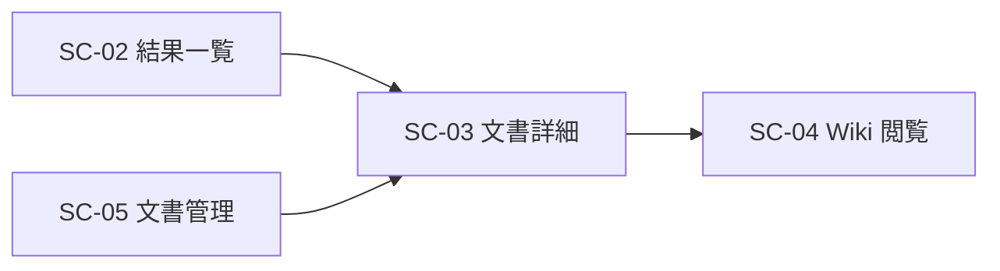

# 画面仕様書: 文書詳細／プレビュー（SC-03）

> 画面（SC）単位で作成する。計画リポジトリの画面設計（05_screens）を実装向けに詳細化する。

## 起点となる計画書（トレーサビリティ）

- 画面（SC）: **SC-03 文書詳細／プレビュー**（[05_screens/01_screens.md](../../planning/projects/microservices-platform/05_screens/01_screens.md) §画面一覧・遷移図）
- 関連ユースケース（UC）: **UC-01**（検索・閲覧）、**UC-07**（Wiki 閲覧）
- 関連機能要求（FR）: **FR-06**（文書管理）、**FR-12**（変換・正規化）、FR-05（ABAC）

## 画面概要・目的

正規化文書（Markdown）本文とメタデータを 1 件表示する画面。検索結果一覧（SC-02）・文書管理（SC-05）から `/documents/:id` へ遷移する。出典元リンクと SC-04（Wiki）への遷移導線を備える。

- 主要利用シーン: 検索・一覧で見つけた文書の本文・属性・版履歴を確認する。
- アクセス: 認証済みユーザー（一般社員）。ロール限定なし（`RequireAuth` のみ）。ABAC はサーバ側（BFF）で適用。

## データソース（BFF 境界）

| 用途 | エンドポイント | 認可 | 応答 |
| --- | --- | --- | --- |
| 詳細（メタデータ） | `GET /bff/documents/{id}` | ABAC（BFF 集約・404 秘匿） | `DocumentDto` |
| 本文（Markdown） | `GET /bff/documents/{id}/content` | 同上 | `DocumentContentDto` |
| 版履歴 | `GET /bff/documents/{id}/versions` | 同上 | `DocumentVersionDto[]` |

- `DocumentDto = { id, title, status, markdownUri?, version, attributes{}, tags[], createdAt, updatedAt }`
- `DocumentContentDto = { id, title, markdown, sourceUri? }`（本文は ABAC 判定後にオブジェクトストレージから取得、未配備時はプレースホルダ）
- `DocumentVersionDto = { documentId, version, title, status, markdownUri?, attributes{}, tags[], changeNote?, createdAt }`

## レイアウト / 主要素

```
┌───────────────────────────────────────────────┐
│ 文書詳細                                        │
├───────────────────────────────────────────────┤
│ [メタ] タイトル / 状態・版・更新日時            │
│        属性(confidentiality 等) / #タグ         │
│ 出典元: storage://… ｜ [Wiki で開く]            │
├───────────────────────────────────────────────┤
│ 本文（Markdown 原文・等幅・改行保持）           │
├───────────────────────────────────────────────┤
│ 版履歴: v3 published 第3条改定 …                │
└───────────────────────────────────────────────┘
```

## 表示項目

| 項目 | 種別 | 説明 |
| --- | --- | --- |
| タイトル/状態/版/更新 | 表示 | メタデータ見出し |
| 属性 attributes | 表示 | ABAC 属性（confidentiality 等）をチップ表示 |
| タグ tags | 表示 | `#tag` |
| 出典元 sourceUri | 表示/リンク | http(s) はリンク、storage:// 等はコード表記 |
| Wiki 導線 | リンク | `wikiBaseUrl` 設定時に `/wiki`（SC-04）へ |
| 本文 markdown | 表示 | 原文を `pre`（改行保持）で安全表示（HTML 描画しない） |
| 版履歴 versions | 表 | 版・状態・変更メモ・作成日時 |

## アクション・画面遷移



| 操作 | 挙動 | 遷移先 |
| --- | --- | --- |
| 出典元リンク押下 | http(s) の場合に出典元を開く | 出典元 |
| 「Wiki で開く」 | 内部ルート `/wiki` へ遷移（閲覧範囲はゲートウェイ ABAC で制御） | SC-04 |

## 権限・表示条件・存在秘匿

- 認証済みユーザーに表示（ナビには出さない・一覧/検索から到達）。
- ABAC はサーバ側（BFF）で適用。利用者スコープに合致しない文書、不在の文書はいずれも 404 で秘匿し、UI は「文書が見つかりませんでした。」と中立表示する（「拒否」と「不在」を区別しない・[[IADR-0009]]/[[IADR-0038]]）。
- 一覧（`/bff/documents`）は権限内文書のみを返す（権限外は列挙しない）。

## エラー・状態

| 状態 | 条件 | 表示 |
| --- | --- | --- |
| loading | 取得中 | `role="status"` 読み込み中… |
| ok | 200 | メタ＋本文＋版履歴 |
| notFound | 404（不在/秘匿） | 中立「文書が見つかりませんでした。」（[[IADR-0009]]） |
| error | 5xx/network | `role="alert"` 取得に失敗 |
| 本文 unavailable | 本文取得失敗（詳細は成功） | 「本文は利用できません。」（本文領域のみ縮退） |

## 関連仕様

- 作業仕様書: `docs/specs/20260709_issue-129_sc03-document-detail.md`
- テスト仕様書: `docs/tests/SC-03_document-detail.md`
- 実装 ADR: [[IADR-0038]]（BFF 側 ABAC ゲーティング・本文取得）、[[IADR-0033]]（SPA 基盤）

## 未決事項

- 本文は Markdown 原文表示（ライブラリ非導入）。将来レンダリングが必要なら別途検討。
- Wiki の文書別ディープリンクは未対応（SC-04 の `/wiki` 遷移まで）。
