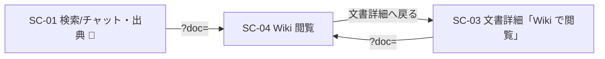

<!-- trace:
ids: [FR-05, FR-13, SC-01, SC-03, SC-04, UC-07]
adrs: [ADR-0011, ADR-0031, ADR-0073]
iadrs: [IADR-0009, IADR-0020, IADR-0124, IADR-0134, IADR-0335, IADR-0355, IADR-0365]
specs: [20260708_issue-130_sc04-wiki-access, 20260903_issue-1199_bff-wiki-routes, 20260903_issue-1200_sc04-wiki-screen-via-bff]
issues: [#129, #130, #1199, #1200]
-->

# 画面仕様書: Wiki 閲覧画面

> **［実装状態］`status: completed` は「本仕様書が記述する範囲の実装とテストが揃った」ことを表す**
> （`docs/README.md` 運用ルール 6）。**残っている要素**は §未決事項 にある —— 共通シェルの左レール置換、
> バックリンク欄・ローカルグラフ、Wiki.js での編集の是非。
>
> **［2026-09-03 全面改訂］** 計画側の裁定「**Wiki.js 本体 UI は利用者へ露出しない。本画面は前段ゲートウェイ経由で描く**」
> により、本画面は**Wiki.js への外部リンク 1 本の遷移導線**から、**ページツリー・本文・検索を基盤 SPA が描く画面**へ
> 作り直した。従前の記述（「Wiki.js を新規タブで開く」「接続先は実行時 config の `wikiBaseUrl`」）は**すべて失効**した。

## 起点となる計画書（トレーサビリティ）

- 画面: **Wiki 閲覧画面**（計画側の画面設計 §Wiki 閲覧画面。§ルート `/wiki`（基盤 SPA）。従前の「Wiki.js 別ホスト・別配信」は
  2026-09-03 に撤回された）
- 関連ユースケース: **Wiki で閲覧する**（基本フロー「開く／検索する」→「ABAC で判定し権限内を表示」。例外フロー
  「権限外の文書は一覧・本文のいずれにも表示しない」）
- 関連機能要求: **正規化文書の Wiki 閲覧**・**ABAC アクセス制御**
- 関連する計画 ADR: **Wiki.js 本体 UI は利用者へ露出しない。本画面は前段ゲートウェイ経由で描く**（決定 1・2・4・5・6）／
  Wiki エンジンの分界（Wiki.js 側は表示制御に留め、認可判定は本システムが単一の真実源）
- 関連する実装 ADR: Wiki の BFF 中継（透過・存在秘匿・未認証は BFF で 401）／**本画面（出典種別の判定・ページツリーの
  取得単位・本文の sanitize・URL の持ち方）**

## 画面概要・目的

権限内の Wiki ページを、**基盤 SPA の中で**閲覧する。ページツリー・本文・検索結果はすべて **BFF（`/bff/wiki/*`）→
WikiService（前段ゲートウェイ）** 経由で取得し、**利用者が Wiki の内容へ到達する経路はその 1 本**に限る。
**本文の描画そのものは引き続き Wiki.js が行い**（ゲートウェイが描画結果をプロキシする）、SPA は Markdown を再レンダリングしない。

- ルート: `/wiki`（基盤 SPA）。開いているページと検索語は**検索パラメータ**で持つ（§URL）。
- アクセス: 認証済みユーザー。ロール限定なし（`RequireAuth` のみ）。**可視性を決めるのは役割ではなく ABAC** であり、
  絞りは後段（WikiService）が行う。画面は届いた一覧・本文をそのまま描く。
- 🔴 **Wiki.js 本体 UI への外部リンクは置かない**（`target="_blank"` は本画面に 1 本も無い）。dev 環境の Wiki.js 直接露出は
  管理 UI のために残るが、**そこでは ABAC の統制が働かない**（`deploy/local/README.md` §Wiki 閲覧の到達）。

## URL（検索パラメータ）

| パラメータ | 意味 | 取得 |
| --- | --- | --- |
| `page=<slug>` | ページツリー・検索結果から開いたページ | `GET /bff/wiki/pages/{slug}` |
| `doc=<documentId>` | 検索／チャット質問画面の出典・文書詳細の「Wiki で閲覧」から開いたページ（**文書別ディープリンク**） | `GET /bff/wiki/pages/by-doc/{documentId}` |
| `q=<検索語>` | 検索語 | `GET /bff/wiki/search?q=` |

- `page` と `doc` が同時に来たら `page` を優先する。どちらも無ければ本文は描かず、ページを選ばせる。
- 文字列でない・空の値は「無い」として扱う（URL は外部由来）。
- パンくずは `ホーム / Wiki`、ページを開くと `ホーム / Wiki / <ページの題名>`（葉は画面が取得後に渡す。「Wiki」の段は
  自画面へのリンクである親の段として置く —— 自画面の段に固定の名を置くと葉が一度も描かれない）。
  **ページを開いていないときの「Wiki」は現在地であり、リンクにしない**（共通シェルが、葉が無く自ルートを指す末尾の
  親の段を現在地へ格下げする）。
- ルートは 1 本のままで、木に載るのはパス `/wiki` だけである（ルートマニフェストの検査はパスの行の有無を見る）。

## レイアウト / 主要素

```
┌ Wiki 閲覧 ──────────────────────────────────────────────────────────┐
│ 閲覧権限のある Wiki ページだけが並びます。ページを選ぶと本文を表示します。 │
├──────────────────────────┬─────────────────────────────────────────┤
│ ▸ 検索                     │ ▸ <ページの題名>                          │
│   [検索語を入力…] [検索]   │   （Wiki.js が描画した本文。sanitize 済み）   │
│   検索結果:                │   …                                       │
│   ・旅費規程               │                                           │
│ ▸ ページツリー              │   最終同期: 2026-09-01 09:00 ｜ 📄 文書詳細へ戻る │
│   ・経費精算規程 ◀ 現在地  │                                           │
│   ・旅費規程               │                                           │
└──────────────────────────┴─────────────────────────────────────────┘
```

| # | 計画 §主要素 | 実装 | 備考 |
| --- | --- | --- | --- |
| 1 | ページツリー（権限内のみ） | **する** | `GET /bff/wiki/pages` の **1 回**。台帳は平坦（`wikiPath` = `doc/<id>`）で後段が題名順に返すため、**題名順の一覧**として描く（階層を SPA 側で捏造しない）。開いているページは `aria-current="page"` |
| 2 | 検索（権限内のみ） | **する** | 検索語を `?q=` に載せ `GET /bff/wiki/search?q=` を引く。並びは Wiki.js の関連度順を保つ。`limit` は載せない（既定・上限は後段が持つ） |
| 3 | Wiki.js 本文 | **する** | `WikiPageView.content`（Wiki.js が描画した HTML）を **DOMPurify で sanitize** して描く（§本文の描画） |
| 4 | 最終同期日時 | **する** | `syncedAt` をロケール表記で |
| 5 | 文書詳細への復帰リンク | **する** | `/docs/$id`（`documentId`） |
| 6 | 左レールをページツリーへ置換（計画 §左ナビ） | **しない** | 共通シェル（platform）の改修であり本画面の作業に含めていない。ページツリーは画面内の側柱に置く。§未決事項 1 |
| 7 | バックリンク欄・ローカルグラフ | **しない** | 計画が実現方式を未確定としている（前提だけが「SPA 側で描く」へ変わった）。§未決事項 2 |
| 8 | 編集導線 | **しない** | Wiki.js での編集を利用者へ開くかは計画 ADR が未決としている。閲覧だけを扱う |

## 表示・入力項目

| 項目 | 種別 | 必須 | 形式・制約 | 説明 |
| --- | --- | --- | --- | --- |
| 検索語 | `Input` | 任意 | 前後の空白を除いて 1 文字以上で検索する | 空白だけでは検索しない（後段も空を返すが往復そのものを起こさない） |
| ページツリー | リンクの一覧（`nav`） | — | 題名順 | 権限内のページだけが並ぶ。空なら「閲覧できる Wiki ページはありません。」 |
| 検索結果 | リンクの一覧（`list`） | — | 関連度順 | 0 件なら「該当するページはありません。」 |
| 本文 | 表示 | — | sanitize 済み HTML | §本文の描画 |
| 最終同期 | 表示 | — | 日時 | `syncedAt` |
| 文書詳細へ戻る | リンク | — | `/docs/$id` | 文書詳細画面へ |

## 本文の描画（sanitize）

`WikiPageView.content` は Wiki.js が Markdown から描画した HTML である。**そのまま `innerHTML` へは入れず、DOMPurify で
sanitize してから描く**（多層防御。本文の原典は取り込み文書＝外部データソース由来であり、Wiki.js 側の sanitize は管理 UI の
トグル 1 つで外れる）。

- **落とすもの**: スクリプト・イベント属性・`javascript:`（既定）、**メディア（`img` / `picture` / `source` / `video` / `audio`）**
  （Wiki.js の資産は SPA オリジンから到達できず、外部 URL の資産をブラウザに取りに行かせない）、`target` 属性（新規タブを開かない）。
- **書き換えるもの**: Wiki.js の正準パス `/(<locale>/)?doc/<documentId>` を指すリンクは `/wiki?doc=<documentId>` へ
  （ページ間リンクが SPA 内で解決する）。それ以外の `href` は触らない。
- 残すもの: 見出し・段落・強調・リスト・表・コードなど Wiki.js が描画した構造。

## アクション・イベント

| 操作 | 挙動 | 遷移先 |
| --- | --- | --- |
| ページツリーの項目 | `?page=<slug>` へ（検索語は保つ） | `/wiki?page=…` |
| 検索 | 入力語を `?q=` に載せ、権限内の当たりを一覧する | `/wiki?q=…` |
| 検索結果の項目 | `?page=<slug>` へ（検索語は保つ） | `/wiki?q=…&page=…` |
| 本文中のページ間リンク | `?doc=<documentId>` へ | `/wiki?doc=…` |
| 文書詳細へ戻る | 文書詳細画面へ | `/docs/$id` |

## 画面遷移



## エラー・状態

| 面 | 状態 | 表示 |
| --- | --- | --- |
| ページツリー | 読み込み中 | `role="status"`「ページツリーを読み込み中…」 |
| ページツリー | 空（権限内に 1 件も無い） | 中立の文「閲覧できる Wiki ページはありません。」（**「権限が無い」とは言わない**） |
| ページツリー | 5xx（Wiki.js 不達の 502 を含む） | `Alert`（danger）「ページツリーを取得できませんでした。」 |
| 本文 | 404 | 中立の文「ページが見つかりませんでした。」（権限外・不存在・アーカイブ済みを区別しない） |
| 本文 | 5xx | `Alert`（danger）「本文を取得できませんでした。」 |
| 検索 | 0 件 | 中立の文「該当するページはありません。」 |
| 検索 | 502 | `Alert`（danger）「Wiki の検索に失敗しました。Wiki に到達できない可能性があります。」（**空で隠さない**） |
| 共通 | 401 | 共通の再ログイン導線（画面は何もしない） |

状態は色だけで意味を持たせない（`Alert` はラベル ＋ アイコン ＋ 文）。

## 権限・表示条件

- 認証済みユーザーに表示（ナビ「Wiki」）。ロール限定なし。
- **閲覧可否は WikiService（ABAC）が判定する。** 一覧・検索は権限内だけが返り、個別取得は権限外・不存在・アーカイブ済みが
  同じ 404 になる（存在秘匿）。画面は権限の有無を示さない。
- **実行時 config `wikiBaseUrl` を読まない。** stg/prod で `WIKI_BASE_URL` を設定しない運用（計画 ADR 決定 1）のまま、本画面は
  正常に描画する。

## 関連仕様

- 作業仕様書: `.ai-context/specs/20260903_issue-1200_sc04-wiki-screen-via-bff.md`（画面）／`20260903_issue-1199_bff-wiki-routes.md`（BFF 口）
- テスト仕様書: [Wiki 閲覧画面](../tests/SC-04_wiki-access.md)／[Wiki で閲覧する](../tests/UC-07_wiki-browsing.md)
- 実装 ADR: Wiki の BFF 中継／本画面（出典種別の判定・ページツリーの取得単位・本文の sanitize・URL の持ち方）

## 未決事項

1. **共通シェルの左レールをページツリーへ置換する**（計画 §左ナビ「閲覧時は左レールを Wiki ページツリーへ置換する」）。
   共通シェルは platform の射程であり、本画面の作業では画面内の側柱に留めた。置換するときはシェル側の作業として切る。
2. **バックリンク欄・ローカルグラフ**。計画は実現方式を未確定としている。描画が SPA 側へ移ったため
   「Wiki.js のテーマ／プラグイン改修を要する」という前提は消えたが、未確定は解消していない。
3. **Wiki.js での編集の是非**。計画 ADR が未決としている。本画面は閲覧だけを扱い、編集導線を作らない。
4. **Wiki.js の資産（画像）**。本文から落としている（資産のプロキシが無い）。必要になれば資産のプロキシを別 issue で切る。
