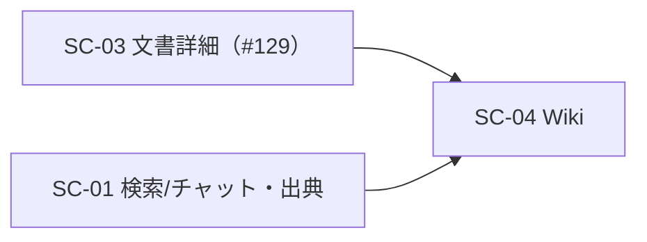

<!-- trace:
ids: [FR-13, SC-03, SC-04, UC-07]
adrs: []
iadrs: [IADR-0009, IADR-0020]
specs: [20260708_issue-130_sc04-wiki-access]
issues: [#129]
-->

# 画面仕様書: Wiki 閲覧画面

## 起点となる計画書（トレーサビリティ）

- 画面: **Wiki 閲覧画面**（計画側の画面設計）
- 関連ユースケース: **Wiki で閲覧する** ／ 関連機能要求: **正規化文書の Wiki 閲覧**
- 関連 ADR（実装）: Wiki.js を配備し `WikiService` を同期・ABAC ゲートウェイへ縮退する

## 画面概要・目的

Wiki 閲覧の実体は Wiki.js（ABAC ゲートウェイ経由・Keycloak SSO 済み）。本画面は SPA からの**遷移導線**を提供する。
ログイン中のアカウントでそのまま閲覧でき、到達はゲートウェイ（ABAC）経由に限定される。権限判定は
Wiki.js/ゲートウェイ側が行う（UI は導線のみ・権限有無を UI で判定しない）。

## レイアウト / 主要素

```
┌───────────────────────────────────┐
│ Wiki 閲覧                          │
│ 説明（SSO・ABAC ゲートウェイ経由） │
│ [Wiki を開く]  ← wikiBaseUrl 設定時 │
└───────────────────────────────────┘
```

## アクション・イベント

| 操作 | 挙動 | 遷移先 |
| --- | --- | --- |
| 「Wiki を開く」 | Wiki.js を新規タブで開く（SSO 済みのためシームレス） | `wikiBaseUrl`（外部・ゲートウェイ経由） |

（未設定時はリンクを出さず `role="note"` の注意書きを表示する。）

## 画面遷移



## 権限・表示条件

- 認証済みユーザーに表示（ナビ「Wiki」）。ロール限定なし。
- 接続先は実行時 config（`appConfig().wikiBaseUrl`、ゲートウェイ URL）。未設定なら導線非表示。
- 閲覧可否は Wiki.js/ゲートウェイ（ABAC）が判定する。UI は権限の有無を示さない（権限外は 404 とする存在秘匿の方針）。

## 関連仕様

- 作業仕様書: `docs/specs/20260708_issue-130_sc04-wiki-access.md`
- テスト仕様書: `docs/tests/SC-04_wiki-access.md`
- 実装 ADR: Wiki.js を配備し `WikiService` を同期・ABAC ゲートウェイへ縮退する

## 未決事項

- 文書詳細画面からの文脈引き継ぎ導線は #129 実装時に併せて検討。
