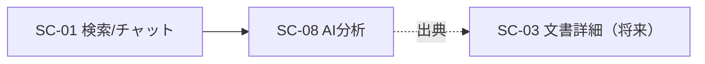

# 画面仕様書: AI分析ダッシュボード（SC-08）

> 画面（SC）単位で作成する。計画リポジトリの画面設計（05_screens）を実装向けに詳細化する。

## 起点となる計画書（トレーサビリティ）

- 画面（SC）: **SC-08 AI分析ダッシュボード**（[05_screens/01_screens.md](../../planning/projects/microservices-platform/05_screens/01_screens.md) §画面一覧）
- 関連ユースケース（UC）: **UC-02**（AI分析を依頼する）
- 関連機能要求（FR）: **FR-07**（指定データ範囲での分析・比較・抽出）、FR-05（ABAC）、FR-11（機密区分によるLLM経路）
- 計画書リンク: 上記 03_usecases §UC-02

## 画面概要・目的

利用者が「データ範囲」を指定して AI に分析・比較・抽出を依頼し、結果を出典付きで受け取る画面。BFF 集約 `POST /bff/analysis/analyze` を唯一のデータソースとする。指定範囲（query / 属性フィルタ）は ABAC 許可スコープと **AND で交差し権限を広げない**（narrowing-only、[[IADR-0005]]）。範囲が権限外を指す場合は空回答へ縮退し、権限の有無は開示しない（存在秘匿、UC-02 例外フロー）。

- 主要利用シーン: 一般社員が対象範囲を絞って要約・比較・項目抽出を依頼する。
- アクセス: 認証済みユーザー（一般社員）。ロール限定なし（`RequireAuth` のみ）。

## データソース（BFF 境界）

| 用途 | エンドポイント | 認可 | 要求 / 応答 |
| --- | --- | --- | --- |
| 分析・比較・抽出の依頼 | `POST /bff/analysis/analyze` | 認証済み（ABAC は後段で narrowing） | `AnalysisTaskRequest` → `AiAnswerDto` |

要求 `AnalysisTaskRequest = { instruction, taskType: "Analyze"|"Compare"|"Extract", range?: { query?, attributeFilters?: {key:[values]}, topK? } }`。
応答 `AiAnswerDto = { answer, citations: CitationDto[], model, inputTokens, outputTokens, answerId }`、
`CitationDto = { number, documentId, documentTitle, chunkId, sourceUri?, score, snippet }`。

## レイアウト / 主要素

```
┌───────────────────────────────────────────────┐
│ AI分析ダッシュボード                            │
├───────────────────────────────────────────────┤
│ 指示(instruction) [テキストエリア・必須]        │
│ タスク種別 [分析/比較/抽出]                     │
│ ▸ 対象範囲(任意): 検索クエリ / TopK / 属性フィルタ│
│                                     [分析を実行] │
├───────────────────────────────────────────────┤
│ 回答(answer 本文, [1][2] マーカー付き)          │
│ 出典: [1] 文書タイトル (score) スニペット → link │
│       [2] ...                                   │
│ （モデル・トークン数の補足）                    │
└───────────────────────────────────────────────┘
```

## 表示・入力項目

| 項目 | 種別 | 必須 | 初期値 | 形式・制約 | 説明 |
| --- | --- | --- | --- | --- | --- |
| 指示 instruction | textarea | 必須 | 空 | 1文字以上 | AI への依頼内容 |
| タスク種別 taskType | select | 必須 | Analyze | Analyze/Compare/Extract | プロンプト種別 |
| 検索クエリ range.query | text | 任意 | 空 | - | 範囲内で関連箇所を絞る（省略時 instruction 流用） |
| TopK range.topK | number | 任意 | 8 | 1〜50 | 文脈チャンク上限 |
| 属性フィルタ range.attributeFilters | key/値の行 | 任意 | なし | key + カンマ区切り値 | 例: department=sales |
| 回答 answer | 表示 | - | - | テキスト | `[n]` は出典番号 |
| 出典 citations | 表示 | - | - | 番号・タイトル・スニペット・link | `sourceUri` があればリンク |
| 使用モデル model | 表示 | - | - | モデル名／空 | 空は「AI へ送信していない縮退」を意味し **「未使用（AI へ送信なし）」** と表示する（FR-11 / IADR-0111・#403） |

## バリデーション

| 項目 | 条件 | エラーメッセージ |
| --- | --- | --- |
| instruction | 空（trim後0文字）は送信不可・実行ボタン無効 | 「分析内容を入力してください。」 |
| instruction | 上限 2000 文字（`textarea maxLength` ＋送信前チェック）。超過は送信不可（400 をクライアントで予防） | （入力抑止） |
| topK | 1〜50 に丸める。明示的な `0`・負値は下限 `1` へクランプ（既定 8 へ戻さない）。非数値は既定 8 | （送信前に補正） |

## アクション・イベント

| 操作 | 挙動 | 遷移先 |
| --- | --- | --- |
| 「分析を実行」 | `POST /bff/analysis/analyze` を送信、結果描画。実行中はボタン無効・読み込み表示 | - |
| 出典リンク押下 | `sourceUri` を開く（将来 SC-03 文書詳細へ接続） | 出典元 |

## 画面遷移



## 権限・表示条件・存在秘匿

- 認証済みユーザーに表示（ナビ「AI分析」）。ロール限定なし。
- ABAC は後段（AiAnalysisService）で narrowing。範囲が権限外を指すと **空回答へ縮退**（answer 空・citations 空）。UI は「該当する情報が見つかりませんでした。」と中立表示し、権限の有無を開示しない（存在秘匿、UC-02 例外フロー・[[IADR-0005]]）。
- 403/404 も中立に扱う（空縮退と同じ「該当する情報が見つかりませんでした。」表示）。「拒否」と「不在」を区別しない（[[IADR-0009]]）。400/5xx/network は取得失敗（`role="alert"`）。

## エラー・状態

| 状態 | 条件 | 表示 |
| --- | --- | --- |
| idle | 未実行 | フォームのみ |
| loading | 実行中 | `role="status"` 実行中… ＋ ボタン無効 |
| ok（結果あり） | 200・answer/citations あり | 回答＋出典 |
| ok（空縮退） | 200・answer 空/citations 空、または 403/404 | 中立「該当する情報が見つかりませんでした。」（存在秘匿。[[IADR-0009]]） |
| error | 400/5xx/network | `role="alert"` 実行に失敗（400 はクライアント検証で予防） |

## 関連仕様

- 作業仕様書: `docs/specs/20260708_issue-134_sc08-ai-analysis-dashboard.md`
- テスト仕様書: `docs/tests/SC-08_ai-analysis-dashboard.md`
- 実装 ADR: [[IADR-0005]]（範囲×ABAC narrowing-only）、[[IADR-0033]]（SPA 基盤）

## 未決事項

- 出典リンク先: 現状は `sourceUri` を直接開く。SC-03（文書詳細）実装後に SC-03 への内部遷移へ差し替える（#129）。
- OpenAPI ドリフト（記録）: `docs/api/openapi.yaml` の `AiAnswerDto.citations` は `SearchResultDto` を参照しているが、実 DTO は `CitationDto`。UI は実 DTO（`CitationDto`）に合わせる。OpenAPI 是正は別途。
