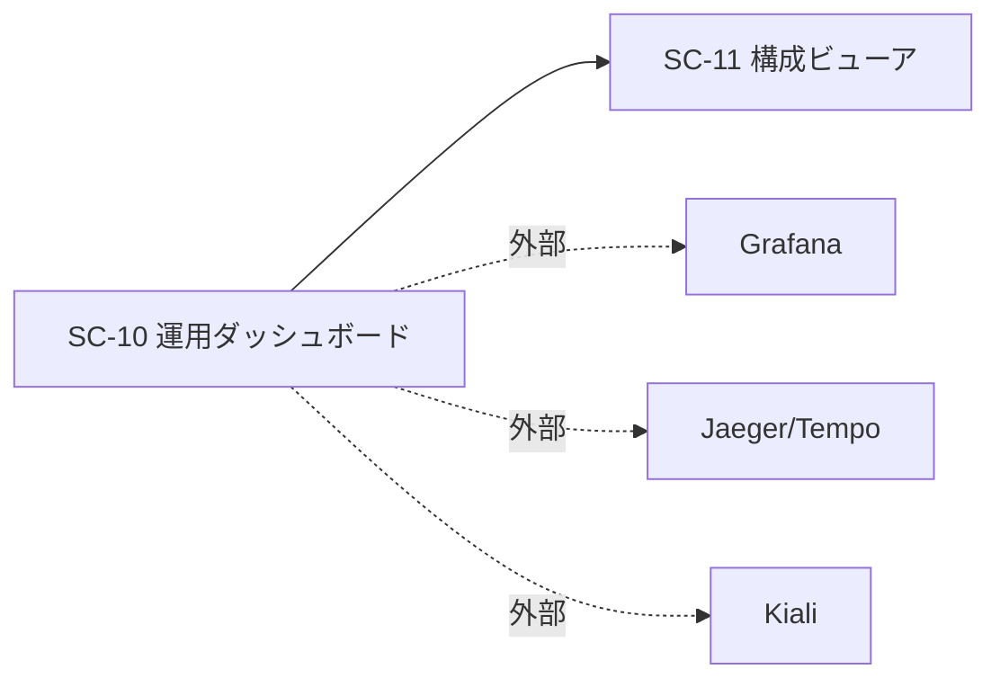

# 画面仕様書: 運用ダッシュボード（SC-10）

> 画面（SC）単位で作成する。計画リポジトリの画面設計（05_screens）を実装向けに詳細化する。

## 起点となる計画書（トレーサビリティ）

- 画面（SC）: **SC-10 運用ダッシュボード**（[05_screens/01_screens.md](../../planning/projects/microservices-platform/05_screens/01_screens.md) §画面一覧・別掲）
- 関連ユースケース（UC）: **UC-05**（管理者・運用者による利用状況・品質の確認）
- 関連機能要求（FR）: **FR-10**（利用状況・検索傾向・回答品質のダッシュボード集計）
- 計画技術検討: [05_observability-ops.md](../../planning/projects/microservices-platform/06_technical/05_observability-ops.md)（Grafana/Kiali/Jaeger は専用ツールで提供し、SC-10 はその入口）

## 画面概要・目的

運用・分析向けに、システムの利用状況・検索傾向・回答品質のサマリを 1 画面で提示する。SLO・リソース・コスト・トレース・メッシュなどの詳細は専用ツール（Grafana / Jaeger・Tempo / Kiali）へ委譲し、本画面はそれらへの**入口（リンク集）**と、既存 BFF 集約（`/bff/dashboard/summary`）の要約表示を担う。構成ビューア（SC-11）への遷移導線も提供する。

- 主要利用シーン: 日次の利用状況確認、回答品質（満足率）の把握、詳細分析ツールへの導線、構成確認（SC-11）への遷移。
- **参照専用**: 本画面から設定変更は行わない。
- アクセスは管理者ロール（`platform-admin`）に限定する。データソース `/bff/dashboard/summary` は `AdminOnly`（[[IADR-0011]]）であり、UI もこれに揃える。権限外にはメニュー・画面を表示しない（存在秘匿、[[IADR-0035]]）。

## データソース（BFF 境界）

| 用途 | エンドポイント | 認可 | 応答 DTO |
| --- | --- | --- | --- |
| 利用状況・傾向・品質サマリ | `GET /bff/dashboard/summary?days&top` | `AdminOnly`（403） | `DashboardSummaryDto` |

`DashboardSummaryDto = { totalSearches, totalAnswers, usageTrend: UsagePointDto[], topSearchTerms: SearchTrendDto[], quality: FeedbackStatsDto }`。
外部ツール（Grafana/Jaeger/Kiali）URL は実行時 config（`appConfig().opsLinks`）から取得し、環境非依存ビルドを保つ（[[IADR-0033]]）。未設定のツールはリンクを描画しない。

## レイアウト / 主要素

```
┌───────────────────────────────────────────────┐
│ 運用ダッシュボード            [構成ビューア →]  │  ← SC-11 へ（ConfigViewer 権限時）
├───────────────────────────────────────────────┤
│ [検索総数] [回答総数] [満足率]  ← サマリカード   │
├───────────────────────────────────────────────┤
│ 利用状況（日次件数）        検索傾向（上位語）   │
│  日付 / 種別 / 件数の一覧    語 / 件数の一覧     │
├───────────────────────────────────────────────┤
│ 詳細ツール: [Grafana] [Jaeger] [Kiali]          │  ← 入口（設定時のみ）
└───────────────────────────────────────────────┘
```

グラフ描画ライブラリは導入せず（基盤の依存を増やさない）、数値・一覧・簡易バーで表現する。可視化の高度化は Grafana 側に委ねる方針（計画の別掲）と整合する。

## 表示・入力項目

| 項目 | 種別 | 必須 | 初期値 | 形式・制約 | 説明 |
| --- | --- | --- | --- | --- | --- |
| 集計期間 days | 入力（任意） | 任意 | 7 | 1〜90 の整数 | BFF が Clamp。未指定は 7 |
| 検索総数 | 表示 | - | - | 整数 | `totalSearches` |
| 回答総数 | 表示 | - | - | 整数 | `totalAnswers` |
| 満足率 | 表示 | - | - | 0〜100% | `quality.satisfactionRate` |
| 利用状況 | 表示 | - | - | 日次 (日付×種別×件数) | `usageTrend` |
| 検索傾向 | 表示 | - | - | 語×件数 | `topSearchTerms` |
| 外部ツール導線 | リンク | - | - | URL | `opsLinks`（設定時のみ） |

## バリデーション

| 項目 | 条件 | エラーメッセージ |
| --- | --- | --- |
| 集計期間 days | 1〜90 の整数以外は送らない（UI で丸め） | （送信前に補正） |

## アクション・イベント

| 操作 | 挙動 | 遷移先 |
| --- | --- | --- |
| 画面表示 | `GET /bff/dashboard/summary` を取得しサマリ描画 | - |
| 期間変更 | days を変えて再取得 | - |
| 「構成ビューア →」 | SC-11 へ遷移（ConfigViewer 権限時のみ表示） | `/config`（SC-11、#137 で実装） |
| 外部ツール押下 | 別タブで Grafana/Jaeger/Kiali を開く | 外部 URL |

## 画面遷移



## 権限・表示条件

- ルート `/ops` は `RequireRole anyOf=['platform-admin']`。権限外は `NotFound`（存在秘匿、[[IADR-0035]]）。
- ナビの「運用」項目は `platform-admin` にのみ表示。
- 「構成ビューア →」導線は ConfigViewer 相当（`platform-admin` または `platform-operator`）にのみ表示。
- サーバが実効境界: `/bff/dashboard/summary` は `AdminOnly`。UI をすり抜けても 403。UI は 403/404 を中立メッセージで扱う（利用可否のみ、詳細を露出しない）。

## エラー・状態

| 状態 | 条件 | 表示 |
| --- | --- | --- |
| loading | 取得中 | `role="status"` 読み込み中 |
| ok | 200 | サマリ描画 |
| forbidden | 403 | 「このダッシュボードを表示する権限がありません。」 |
| notFound | 404 | 「ダッシュボードは利用できません。」（存在秘匿と整合、[[IADR-0009]]） |
| error | 5xx/network | `role="alert"` 取得失敗 |

## 関連仕様

- 実装 ADR: [[IADR-0035]]（ロールベース nav・存在秘匿）、[[IADR-0033]]（SPA 基盤）、[[IADR-0011]]（ダッシュボード集約）
- 画面仕様書: [[SC-11]] 構成ビューア（`docs/screens/SC-11_configuration-viewer.md`）
- テスト仕様書: `docs/tests/SC-10_operations-dashboard.md`
- 作業仕様書: `docs/specs/20260708_issue-136_sc10-operations-dashboard.md`

## 未決事項

- なし（外部ツール URL は環境の実行時 config で注入する。Kiali は未配備のため既定では未設定＝非表示。導線の高度な可視化は Grafana 側に委ねる）。
