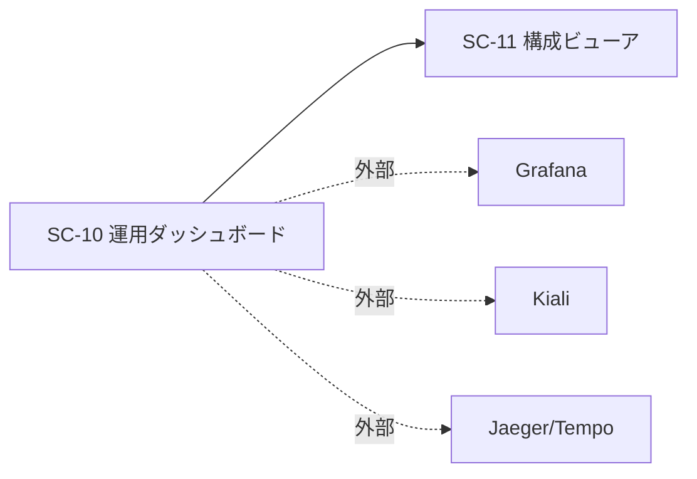

# 画面仕様書: 運用ダッシュボード（SC-10）

> **［実装状態］`status: completed` は「本仕様書が記述する範囲の実装とテストが揃った」ことを表す**
> （`docs/README.md` 運用ルール 6）。**本画面はモックの見た目に最も遠い**——
> hi-fi の KPI カード 3 枚（SLO・利用状況〔人/日〕・LLM コスト）は**いずれも現在の契約から出せない**。
> 「ナレッジ健全性」節は **FR-17 / FR-18 の着手保留**（[[IADR-0119]]）である。
> 詳細と引き受け先は §hi-fi モックアップとの対応 と §未決事項 を見ること。

> **［2026-08-05 / #504］新スタック（ADR-0031: React 19 / TanStack Router / TanStack Query /
> Tailwind v4 ＋ shadcn/ui / Lingui）での再実装に合わせて全面改訂した。**
> 403 と 404 を**同一の中立文言**へ寄せ（[[IADR-0129]] 決定 3）、
> SC-11 への導線から**到達しない条件分岐を外した**（同 決定 4）。

## 起点となる計画書（トレーサビリティ）

- 画面（SC）: **SC-10 運用ダッシュボード**（[05_screens/01_screens.md](../../planning/projects/microservices-platform/05_screens/01_screens.md) §SC-10・別掲）
- 関連ユースケース（UC）: **UC-05**（計画の画面一覧 `:56`。hi-fi のバッジも `UC-05`）
- 関連機能要求（FR）: **FR-10**（利用状況・検索傾向・回答品質の可視化）＋ **非機能要件（運用・可観測性）**
  - **issue #504 §スコープ の表は SC-10 を「UC-07」と書くが、計画とは一致しない**——
    計画で UC-07 は「Wiki で閲覧する」（SC-04）である。**本書は計画を正とした。**
- モックアップ（**実装の正**）:
  [hi-fi/sc-10.html](../../planning/projects/microservices-platform/05_screens/mockups/hi-fi/sc-10.html) ／
  [wireframe/sc-10.html](../../planning/projects/microservices-platform/05_screens/mockups/wireframe/sc-10.html)
- 計画の運用設計: [06_technical/05_observability-ops.md](../../planning/projects/microservices-platform/06_technical/05_observability-ops.md)
  （Grafana / Kiali / Jaeger・Tempo は専用ツールで提供し、SC-10 はその入口）
- 関連 IADR: [[IADR-0129]]（本作業の設計判断）・[[IADR-0035]]（ロール別ナビ・存在秘匿）・
  [[IADR-0119]]（FR-17〜21 の着手保留）・[[IADR-0009]]（存在秘匿）・[[IADR-0011]]（ダッシュボード集約）

## 画面概要・目的

SLO・利用状況・コストの運用 KPI を一覧し、**専用ツール（Grafana / Kiali / Jaeger・Tempo）への入口**となる画面。
本画面から設定を変更する操作は無い（参照専用）。構成ビューア（SC-11）への遷移導線も提供する。

- ルート: **`/admin/ops`**（05_screens §共通シェル「ルートパス」）
- 左ナビ: 「運用」グループの **「ダッシュボード」**（hi-fi の左レール表記に合わせた。従前の実装は「運用ダッシュボード」だった）
- アクセス: **`platform-admin` のみ**（**計画との差異**。§権限・表示条件）。
  権限外は `RequireRole` → `NotFound`（存在秘匿。[[IADR-0009]] / [[IADR-0035]]）。

## hi-fi モックアップとの対応（実装する要素／実装しない要素）

行番号は planning `d980a01` の [hi-fi/sc-10.html](../../planning/projects/microservices-platform/05_screens/mockups/hi-fi/sc-10.html) に対するものである。
粒度の規則は [SC-05](./SC-05_document-management.md) と共通である（(a) メイン領域は個別に 1 行、
(b) 共通シェルはまとめて 1 行、(c) モックに無い状態は表外）。

| # | モックの要素（行） | 実装 | 備考 |
| --- | --- | --- | --- |
| 1 | 見出し「**運用ダッシュボード**」（416） | **する** | `<h1>` |
| 2 | 副題「SLO・利用状況・コスト（詳細は各専用ツールへ）」（417） | **する（文言を変える）** | 実装は「**利用状況・検索傾向・回答品質（SLO・コストは Grafana で参照）**」。SLO・コストを出さない画面が「SLO・コスト」を名乗ると読み手を誤らせる |
| 3 | KPI カード「**SLO** 99.7% / 検索 p95 820ms」（419） | **しない** | **契約の不在**。§実装しない要素の理由 (b) |
| 4 | KPI カード「**利用状況** 312人/日 / 質問 1,840件/週」（420） | **する（部分）** | 「**312 人/日**」は**一意利用者数**であり、契約が返すのは**イベント件数**（`UsagePointDto(Date, EventType, Count)`）。実装は**検索総数・回答総数**を出す。**隠れた部分未実装** |
| 5 | KPI カード「**LLMコスト** ¥184k / 今月（予算内）」（421） | **しない** | **契約の不在**。同 (b) |
| 6 | 節見出し「**ナレッジ健全性 — 運用者・システム管理者のみ閲覧可**」（423） | **しない** | **FR-17 / FR-18 の着手保留**（[[IADR-0119]]）。同 (a) |
| 7 | ナレッジ健全性の 4 KPI（425-428。孤立文書 12 / 未解決リンク 9 / 未要約クラスタ 3 / 陳腐化文書 21） | **しない** | #6 と同じ |
| 8 | 「**辺の型ごとの使用件数**」の見出しと表（431-433） | **しない** | #6 と同じ（**FR-17**。ADR-0033 は 2026-08-05 時点で `Proposed`。**［2026-08-07 / #586］`Accepted` へ移り保留は解除された**——§実装しない要素の理由 (a) を参照） |
| 9 | 「**フォールバック警告**（未定義型 → related 17 件/週）」（434-436） | **しない** | #6 と同じ |
| 10 | 注記「**個人資料（private-note）を除く全体の件数**…」（439） | **しない** | #6 と同じ（ナレッジ健全性節に属する固定文言） |
| 11 | 外部ツール「**Grafana ↗**」（442） | **する** | 実行時 config `opsLinks.grafanaUrl`。**未設定なら出さない**。副題「メトリクス・コスト」（計画 §主要素 / wireframe） |
| 12 | 外部ツール「**Kiali ↗**」（443） | **する** | `opsLinks.kialiUrl`。副題「サービスメッシュ」 |
| 13 | 外部ツール「**Jaeger / Tempo ↗**」（444） | **する** | `opsLinks.jaegerUrl`。副題「分散トレース」 |
| 14 | 「**構成ビューア →**」（445） | **する** | `/admin/config-viewer`（SC-11）への内部リンク。**権限で出し分けない**（[[IADR-0129]] 決定 4） |
| 15 | 注記「運用面は専用ツールで提供: Grafana（メトリクス・コスト）・Kiali（メッシュ）・Jaeger/Tempo（トレース）…」（447） | **する** | `Alert`（`info`） |
| 16 | **共通シェル**: 右レール「AIチャットパネル」（449-454） | **しない** | 移行**第 4 段**（[[IADR-0121]] 決定 1・5） |
| 17 | **共通シェル**: パンくず（413。`ホーム / 運用 / ダッシュボード`）・ブランド／ロールバッジ／アバター（412）・左ナビ（414） | **本画面では作らない** | パンくず・権限バッジは #452 系。他は `foundation/ui/Layout` が既に持つ |

**対応表の行数は 17 行**（数え方は**行数**であって要素名ではない）。内訳は
**する 8 行**（#1・#2・#4・#11〜#15）／**しない 8 行**（**A: FR の着手保留 5 行** = #6〜#10 ／
**B: 契約の不在 2 行** = #3・#5 ／ 右レール 1 行 = #16）／**本画面では作らない 1 行**（#17）である。

**さらに、行数基準では捕まらない部分未実装が 1 件ある**——**利用状況の指標**である
（#4 は KPI カードを実装したので「**する**」だが、モックが示す「人/日」＝**一意利用者数**ではなく**件数**を出す）。
**二値の判定では表に現れない**ため、ここに明記する（#503 の教訓）。

### モックに無いが実装する要素

| 要素 | 計画上の根拠 |
| --- | --- |
| **集計期間**（直近 7 / 30 / 90 日）の切替 | FR-10（利用状況の可視化）。モックの KPI 副題は「/日」「/週」「今月」と**期間で語る**が、契約の期間指定は `?days=` の 1 本だけである（BFF が 1〜90 へ丸める） |
| **回答品質（満足率）**の KPI カード | FR-10「利用状況・検索傾向・**回答品質**を可視化する」／FR-08（フィードバック収集）。契約 `DashboardSummaryDto.Quality` が実在する |
| **利用状況（日次）**の一覧 | FR-10 の 3 本柱の 1 つ。モックは KPI カードの副題に畳んでいるが、契約は日次の内訳（`UsageTrend`）を返す |
| **検索傾向（上位語）**の一覧 | 同上（`TopSearchTerms`） |

## レイアウト / 主要素

```
┌──────────────────────────────────────────────────────────────┐
│ h1 運用ダッシュボード          集計期間 [直近 7 日 ▾]          │
│ 利用状況・検索傾向・回答品質（SLO・コストは Grafana で参照）    │
├──────────────────────────────────────────────────────────────┤
│ [検索総数]      [回答総数]      [満足率]      ← Card ×3        │
├──────────────────────────────────────────────────────────────┤
│ 利用状況（日次）           │ 検索傾向（上位語）                │
│  日付 / 種別 / 件数        │  検索語 / 件数                    │
├──────────────────────────────────────────────────────────────┤
│ 詳細ツール:                                                    │
│  [Grafana ↗][Kiali ↗][Jaeger / Tempo ↗][構成ビューア →]        │
│ (i) 運用面は専用ツールで提供します…                            │
└──────────────────────────────────────────────────────────────┘
```

グラフ描画ライブラリは導入しない（[[IADR-0036]] と同じ向き。可視化の高度化は Grafana 側に委ねる
——計画 §別掲「運用面は専用ツールで提供する」）。数値と一覧で表す。

## 表示・入力項目

| 項目 | 種別 | 出所 | 形式・制約 |
| --- | --- | --- | --- |
| 集計期間 `days` | 入力（任意） | 画面の `Select` | **7 / 30 / 90**。既定 7。BFF が 1〜90 へ丸める |
| 検索総数 | 表示 | `DashboardSummaryDto.TotalSearches` | 整数 |
| 回答総数 | 表示 | `DashboardSummaryDto.TotalAnswers` | 整数 |
| 満足率 | 表示 | `Quality.SatisfactionRate` | 百分率（四捨五入）。副題に 👍 / 👎 の内訳 |
| 利用状況（日次） | 表示 | `UsageTrend[]`（`Date` / `EventType` / `Count`） | 表。0 件は「期間内の利用はありません。」 |
| 検索傾向（上位語） | 表示 | `TopSearchTerms[]`（`Term` / `Count`） | 表。0 件は「検索傾向はまだありません。」 |
| 外部ツール導線 | リンク | 実行時 config `opsLinks` | **未設定のツールは描かない**。すべて未設定なら「外部ツールの導線は未設定です。」 |

**利用イベント種別（`EventType`）は契約の 2 値**（`search` / `answer`）を表示名（検索 / AI 回答）へ写す。
**未知の値は生値のまま**出す（`—`・「不明」へ丸めない。契約が 3 つ目を返したときに気付けるようにする）。

## バリデーション

参照専用のため入力バリデーションは実質なし。集計期間は許可値（7 / 30 / 90）のみを提示する。

## アクション・イベント

| 操作 | 挙動 | 遷移先 |
| --- | --- | --- |
| 画面表示 | `GET /bff/dashboard/summary?days=7` を取得して描画 | 同一画面 |
| 集計期間の変更 | `days` を変えて再取得（キャッシュキーに `days` を含む） | 同一画面 |
| 「構成ビューア →」 | SC-11 へ遷移 | `/admin/config-viewer` |
| 外部ツール押下 | 別タブで Grafana / Kiali / Jaeger・Tempo を開く（`rel="noreferrer"`） | 外部 URL |

## 画面遷移



## 状態・異常系（**存在秘匿の中立化**）

| 状態 | 表示 |
| --- | --- |
| 取得中 | `role="status"`「読み込み中…」 |
| **403（権限不足）** | **中立文言**「運用ダッシュボードは利用できません。」 |
| **404（不在／秘匿）** | **同じ中立文言**（[[IADR-0129]] 決定 3。文言から権限の有無を読ませない） |
| 5xx・ネットワーク断 | `Alert`（`danger`・`role="alert"`）＋ `ApiError` の詳細 |

**旧実装は 403 と 404 で文言を出し分けていた**（「このダッシュボードを表示する権限がありません。」／
「ダッシュボードは利用できません。」）。**画面の文言から権限の有無が読める**状態であり、
[[IADR-0009]] の趣旨に反していたため中立化した。

**5xx は中立化しない。** 系の状態であって資源の存在ではなく、秘匿の対象ではない。
区別しないと運用者が「権限が無い」と誤読して障害を見逃す。

## 実装しない要素の理由

**(a) FR の着手保留（[[IADR-0119]]）— ナレッジ健全性節（#6〜#10）**

計画 §SC-10 の当該節は「**ナレッジ健全性（起案・2026-08-01。Phase 3。集計範囲は 2026-08-02 に確定）**」であり、
辺の型ごとの使用件数・`related` フォールバック警告件数は **ADR-0033 決定3** に由来する。同 ADR は
**本画面の実装時点（2026-08-05・planning `e36b592`）で `Proposed`** だった。
孤立文書・解決できないリンク・未要約クラスタ・陳腐化文書は **FR-17 / FR-18** の指標である。
[[IADR-0119]] 決定 2 の着手条件（前提 ADR の `Accepted`）を満たさなかったため実装しない。

**注記の固定文言（#10）だけを先に置くこともしない**——注記は「その節の件数の読み方」を説明するものであり、
節が無い画面に置くと**何の件数の話か分からない**。

> **［2026-08-07 追記 / #586］この保留は解除された。** `ADR-0033` は planning `3e58b97`
> （PR planning#244。裁定依頼 planning#237 の反映）で **`Accepted`** へ移り、[[IADR-0119]] の保留は
> **FR-17 / FR-18 について解除**された（同 IADR の 2026-08-07 追補。FR-19〜21 は別条件〔**［2026-08-07 / #599］FR-19 / FR-20 の保留は範囲基準へ変わった（[[IADR-0142]]。範囲の正は計画 `ADR-0037` の着手可否の注記）**〕で保留が続く）。
> **したがって上記 (a) の理由はもう成立しない。** ナレッジ健全性節（対応表 #6〜#10）を実装するかどうかは
> **#504 / #452 の作業仕様書で判断する**。#586 は planning pin の更新と事実の追随に限り、
> **本画面の実装は変更していない**（根拠: [[IADR-0129]] の 2026-08-07 追記・
> [作業仕様書 #586](../specs/20260807_issue-586_planning-pin-adr-accepted.md)）。

**(b) 契約の不在 — SLO（#3）・LLM コスト（#5）・一意利用者数（#4 の部分）**

| 要素 | 契約の実測 |
| --- | --- |
| SLO 達成率・検索 p95 | `DashboardSummaryDto(TotalSearches, TotalAnswers, UsageTrend, TopSearchTerms, Quality)` に**該当項目が無い**。レイテンシは可観測性基盤（Prometheus / Grafana）側にあり、BFF は集約していない |
| LLM コスト | 同上。コストの集計はモデル呼び出しの課金情報を要し、**返す口が無い** |
| 一意利用者数（人/日） | `UsagePointDto(Date, EventType, Count)` は**イベント件数**であり、利用者の一意性を持たない |

**「—」の KPI カードを置く**案は採らない。常に「—」のカードは、指標が**未取得なのか未実装なのか**を
区別できず、運用画面としてむしろ有害である（#502 が確立した「動かない UI を置かない」）。

## 権限・表示条件（**計画との差異あり**）

| | 計画 | 実装 |
| --- | --- | --- |
| ~~閲覧ロール~~ **［2026-08-09 / #544］一致した** | §SC-10「**運用者・管理者**ロール限定（モックの「運用」バッジ準拠）」 | **`platform-admin` ＋ `platform-operator`** |

**［2026-08-09 / #544］据え置きは解けた。** 裁定（Q19 / Q28）で**計画が正**となり、
**3 層（画面・BFF・`DashboardService` の集計 3 口）を同時に広げた**。以下は当時の据え置きの記録である。

**据え置きの根拠**（[[IADR-0129]] 決定 4）: データ源 `/bff/dashboard/summary` は `AdminOnly` であり、
**後段 `DashboardService` の集計も `AdminOnly`** である（[[IADR-0011]]）。画面だけを運用者へ開くと、
運用者には「開くと必ず 403 になる画面」が見えることになる——#503 が SC-07 で名指しした
「**画面と API の権限がずれている**」形そのものである。**BFF と後段を同時に広げる判断は計画側の裁定を要する**
（環流記録の提案 7）。planning#198 提案 8（SC-05/06/07 の閲覧ロール）と**同じ類型だが向きが逆**である
（planning#198 は「計画は管理者限定だが実装が広い」、本件は「計画は運用者も許すが実装が狭い」）。

**SC-11 への導線を権限で出し分けない理由**: SC-10 に到達できるのは `platform-admin` だけであり、
`platform-admin` は `ConfigViewer`（admin または operator）の部分集合である。
`useHasAnyRole(Admin, Operator)` は**この画面では常に真**になる——旧実装が持っていたこの分岐は
`CLAUDE.md`「起こり得ないケースへの防御的実装を避ける」に反する到達しない分岐であった
（旧仕様書はこれを「将来の開放に備えた意図的な先取り」と説明していたが、**先取りは分岐ではなくロールの定義で行う**）。
**SC-10 の閲覧ロールが広がる時点で、そのとき必要な出し分けを書く。**

その他:

- 権限外は `RequireRole` → **`NotFound`**（存在秘匿）。**未知パスの `NotFound` と markup が一致する**ことを
  テストで固定する（#490 が確立した作法）。
- **権限外では BFF を呼ばない**（要求の有無から画面の存在を推測させない）。
- 左ナビは `requiresAnyRole: [platform-admin]`・`group: 'ops'`。
- 認可の実効境界はサーバ側であり、UI は表示制御と存在秘匿のためだけに用いる。

## データソース（BFF 境界）

| 用途 | エンドポイント | 応答 | 認可 |
| --- | --- | --- | --- |
| サマリ | `GET /bff/dashboard/summary?days={7\|30\|90}` | `DashboardSummaryDto` | **AdminOnly**（403 / 401） |

- BFF は `DashboardService`（利用状況・検索傾向）と `FeedbackService`（回答品質）を 1 応答へ集約する。
  `days` は BFF が 1〜90 へ丸め、両後段へ同じ値を渡す（期間の起点を揃えるため）。
- **orval 生成フック `useBffDashboardSummary` で呼ぶ**（**#519**。[[IADR-0135]] 決定 1）。
  **本エンドポイントは #506 より前から契約に載っており**、「載っているのに生成フックを使っていない」
  状態だった（#506 §実測 4）。期間は URL の手組みではなくクエリパラメータとして渡す。
- キャッシュキー: 生成キー `['/bff/dashboard/summary', { days }]`（**期間を含める**——期間を変えると別の問い合わせになる）。

## 外部ツール導線（実行時 config）

接続先をビルドへ焼き込まない（[[IADR-0121]] 決定 3）。`platform/frontend/public/config.js` が注入する
`opsLinks` から組み立てる。**未設定のツールは描かない**（Kiali 未配備などを想定した既存の設計）。

| ID | 表示名 | 副題 | config |
| --- | --- | --- | --- |
| `grafana` | Grafana | メトリクス・コスト | `opsLinks.grafanaUrl` |
| `kiali` | Kiali | サービスメッシュ | `opsLinks.kialiUrl` |
| `tracing` | Jaeger / Tempo | 分散トレース | `opsLinks.jaegerUrl` |

**表示名は翻訳しない**（製品の固有名詞）。**副題は翻訳する**（役割の説明であり、計画 §主要素 の記述に由来する）。
**ページから外部 CDN・Web フォント・analytics へ接続することはない**（08_data-egress-policy）——
ここで扱うのは**運用者が自分で押して開くリンク**である。

## 実装

- BFF: `src/knowledge/backend/Bff/Knowledge.Bff.Endpoints/DashboardBffEndpoints.cs`
- フロント: `src/knowledge/frontend/src/features/sc10-operations/`
  （`index.tsx` / `OperationsDashboardPage.tsx` / `useDashboardSummary.ts` / `opsTools.ts`）
- 実行時 config: `src/platform/frontend/src/foundation/config/runtimeConfig.ts`（`OpsLinks`）
- テスト観点は [tests/SC-10_operations-dashboard.md](../tests/SC-10_operations-dashboard.md)。

## 未決事項

1. **SLO 指標の契約**（達成率・p95）——環流記録
   `feedback/20260805_sc09-11-admin-ops-contract-gaps.md` の提案 4。**起票は親**。
2. **LLM コストの契約**——同 提案 5。
3. **一意利用者数（人/日）**——同 提案 6。**部分未実装**の側。
4. ~~**閲覧ロール**（計画=運用者・管理者／実装=管理者のみ）~~ **［2026-08-09 / #544］解決した。** 裁定 Q19 / Q28 で計画が正となり、3 層を広げて一致させた。
5. **ナレッジ健全性節**——[[IADR-0119]] の保留解除待ち（ADR-0033・0034・0035 の `Accepted` 化）。
   **［2026-08-07 / #586］ADR-0033・0034・0035 は `Accepted` へ移り保留は解除された。実装可否は #504 / #452 が判断する。**
   （待っていた条件は成立している。上の §実装しない要素の理由 (a) の追記と対。）
