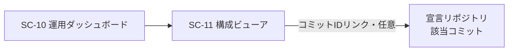

# 画面仕様書: 構成ビューア（SC-11）

> 画面（SC）単位で作成する。計画リポジトリの画面設計（05_screens）を実装向けに詳細化する。
> 本画面は **FR-15（構成情報取得 API）を人間可読に可視化する**ものであり、表示するデータは
> 構成情報 API（Issue #112）を唯一のデータソースとする。**#112 完了後に画面実装へ着手する**。

## 起点となる計画書（トレーサビリティ）

- 画面（SC）: **SC-11 構成ビューア**（[05_screens/01_screens.md](../../planning/projects/microservices-platform/05_screens/01_screens.md) §SC-11）
- 関連機能要求（FR）: **FR-15**（現在有効なシステム構成・構成バージョンの読み取り専用取得、宣言との不一致検出・警告、管理者・運用者限定）
- 関連ユースケース（UC）: —（FR-15 は運用・保守要求。専用 UC は未定義。運用者による構成確認・障害調査・監査を主要シーンとする）
- 関連 ADR: **ADR-0018**（Composable Architecture: 宣言的構成＋プラグイン規約、Accepted）
- 計画技術検討: [10_composability-design.md](../../planning/projects/microservices-platform/06_technical/10_composability-design.md) §設計要素 6（構成情報 API・イントロスペクション）
- 非機能: 存在秘匿（権限外には応答自体を返さない）・監査ログ記録

## 依存関係と前提

| 項目 | 状態 | 備考 |
| --- | --- | --- |
| 構成情報 API（#112） | **未完了（前提）** | 実効構成・ドリフト・履歴の**データソース**。本画面は #112 の応答を表示するだけで、独自に構成を収集・判定しない |
| 宣言的パイプライン構成（#111） | 完了（`develop`） | 宣言（Git）側の正データ。`deploy/helm/knowledge-platform/files/pipeline.json` ＋ `pipeline.schema.json` |
| 固定/可変分離（#102） | 完了 | 段・ポート・コネクタの分類基盤 |
| フロントエンド基盤 | 後続フェーズ | 本リポジトリに SPA 実装は未着手。他 SC 画面群と足並みを揃える |

> **本仕様書のスコープ**: SC-11 の画面設計（表示項目・レイアウト・権限・遷移・API 契約への要求）を確定する。
> 実際の画面実装（フロントエンド）と BFF 集約エンドポイントは #112 完了後に、本仕様書に沿って行う。

## 画面概要・目的

組み替えが自由になるほど「いま何がどう繋がっているか」は自明でなくなる。本画面は、現在有効な
**実効構成**（パイプライン段・イベント接続・ポート実装選択・コネクタ）を機械可読（FR-15 API）に加えて
**人間可読**に可視化し、宣言（Git）との差分（ドリフト）と構成バージョン履歴を確認できるようにする。

- 主要利用シーン: 運用時の構成確認、障害調査（配線・ドリフトの把握）、変更適用直後の反映確認、監査。
- **参照専用**: 本画面から構成は変更しない。構成変更は Git 経由の構成定義変更（GitOps）に限る（FR-15・SC-11 の入力方針）。
- アクセスは管理者・運用者ロールに限定し、権限外にはメニュー・画面自体を表示しない（存在秘匿）。閲覧は監査ログに記録する。

## レイアウト / 主要素

3 つの領域（タブまたは縦積み）で構成する。上部にヘッダ（構成バージョン・全体ドリフト状態）を固定表示する。

```
┌─────────────────────────────────────────────────────────────┐
│ ヘッダ: 構成バージョン(コミットID短縮) / 適用日時 / 適用者    │
│         全体ドリフト状態バッジ [OK | ドリフト検出: N 件]      │
├─────────────────────────────────────────────────────────────┤
│ [構成グラフ] [差分(ドリフト)] [バージョン履歴]  ← タブ       │
├─────────────────────────────────────────────────────────────┤
│ (1) 構成グラフ                                                │
│   - パイプライン段・イベント接続の有向グラフ                  │
│   - ポート実装選択の一覧、コネクタ一覧                        │
│   - ドリフト箇所をノード/エッジ上で強調（色・アイコン）      │
│ (2) 差分(ドリフト)                                            │
│   - 宣言 vs 実効 の不一致一覧（種別・対象・期待/実際）        │
│ (3) バージョン履歴                                            │
│   - 適用履歴（コミットID・日時・適用者・ドリフト有無）        │
└─────────────────────────────────────────────────────────────┘
```

- ワイヤーフレーム（計画）: `05_screens/wireframes/sc-11.drawio`（計画側で別途作成予定）。
- 画面遷移の入口: SC-10 運用ダッシュボードから本画面へ遷移する（[01_screens.md](../../planning/projects/microservices-platform/05_screens/01_screens.md) の遷移図 `SC10 --> SC11`）。

### (1) 実効構成のグラフ表示

計画 §設計要素 6 の「構成取得 API 応答項目」を可視化する。

- **パイプライン段・イベント接続**: イベント型と段（コンシューマ）を節点とする有向グラフ。
  `event → step → outputs(event)` の向きで描画する。`sources`（同期 API 起点の発行）を始点、
  購読を持たない段（`outputs` が空）を終端として示す。無効化された段（`enabled: false`）は
  グレーアウトで区別する。段の入出力イベント型・キュー名・実装コンシューマ完全名を節点詳細に表示する。
- **イベント接続（バインディング）**: イベント型ごとの発行者・購読者の対応を、グラフのエッジおよび
  一覧（イベント型 → 発行元サービス / 購読段）として表示する。
- **ポート実装の選択**: 各差し替えポイント（LLM・埋め込み・ベクトル DB・ストレージ・Wiki 同期）で
  選択中の実装名と接続先識別子を一覧表示する。
- **コネクタ一覧**: 登録済みコネクタと有効・無効状態を一覧表示する。
- **ドリフト強調**: 該当ノード/エッジ/行に警告色とアイコンを付与し、(2) の該当ドリフト明細へリンクする。

グラフ描画はデータ量が小さい（段は初期 5・イベント 6 程度）ため、クライアント側の軽量な
有向グラフ描画（例: mermaid/dagre 系）で足りる。ノード数増大時のレイアウト方針は #112 実装時に確定する。

### (2) 宣言との差分（ドリフト）表示

構成情報 API（#112）が返すドリフト検出結果を一覧・強調表示する。**判定は API 側が行い、本画面は結果を表示するのみ**。

ドリフト種別（計画 §設計要素 6「不一致（適用漏れ・起動失敗・古い段の残留・宣言に無い購読）」に対応）:

| 種別 | 意味 | 表示 |
| --- | --- | --- |
| `missing`（適用漏れ） | 宣言にあり実効に無い段/接続 | 赤・宣言側の内容を表示 |
| `startup-failure`（起動失敗） | 宣言済みだが起動失敗で未稼働 | 赤・失敗理由（API が提供する場合） |
| `stale`（古い段の残留） | 実効にあり宣言に無い段 | 橙・実効側の内容を表示 |
| `undeclared-subscription`（宣言に無い購読） | 宣言に無い購読が実効に存在 | 橙・対象イベント/段 |

- 各明細は「対象（段名/イベント/ポート）・種別・期待（宣言）・実際（実効）・検出時刻」を列に持つ。
- ドリフトが 0 件なら「ドリフトなし（OK）」を明示する（検出が実行済みであることを日時とともに示す）。
- ドリフト検出は API 側で定期（例: 5 分間隔）＋適用直後に実行される。本画面はそのスナップショットを表示する。

### (3) 構成バージョン履歴

- **現在の構成バージョン**（ヘッダ常時表示）: 適用中の構成定義の Git コミット ID・適用日時・適用者。
- **履歴一覧**: 過去の適用（コミット ID・適用日時・適用者・その時点のドリフト有無）を新しい順で表示する。
- コミット ID はリポジトリ（宣言）へのリンクとして提示できるとよい（任意）。
- 履歴の保持範囲・データ源（GitOps/ArgoCD 適用履歴 or API 側の保持）は #112 実装時に確定する。

## 表示・入力項目

参照専用画面のため入力はフィルタ/選択のみ。主な表示項目は下表のとおり（データはすべて #112 API 由来）。

| 項目 | 種別 | 必須 | 初期値 | 形式・制約 | 説明 |
| --- | --- | --- | --- | --- | --- |
| 構成バージョン（コミット ID） | 表示 | 是 | — | 短縮 SHA（クリックで全文/リンク） | 適用中の構成定義バージョン |
| 適用日時 | 表示 | 是 | — | ISO 8601 / ローカル表記 | 現構成の適用時刻 |
| 適用者 | 表示 | 是 | — | 文字列 | 適用を行った主体（GitOps 主体含む） |
| 全体ドリフト状態 | 表示 | 是 | — | `OK` / `ドリフト N 件` | ドリフト明細の集計バッジ |
| 段（ステップ）一覧 | 表示 | 是 | — | 段名・サービス・入出力イベント・consumer・有効/無効・キュー | 実効パイプライン構成 |
| イベント接続 | 表示 | 是 | — | イベント型・発行元・購読段 | バインディング |
| ポート実装選択 | 表示 | 是 | — | ポート名・実装名・接続先識別子 | 差し替えポイントの選択状態 |
| コネクタ一覧 | 表示 | 是 | — | コネクタ名・有効/無効 | 登録済みコネクタ |
| ドリフト明細 | 表示 | 是 | — | 種別・対象・期待・実際・検出時刻 | 宣言 vs 実効の不一致 |
| バージョン履歴 | 表示 | 是 | — | コミット ID・適用日時・適用者・ドリフト有無 | 適用履歴（新しい順） |
| 表示フィルタ（種別/ドリフトのみ） | 入力 | 否 | 全件 | チェック/セレクト | クライアント側の絞り込みのみ |

## バリデーション

参照専用のため入力バリデーションは実質なし。フィルタ選択は許可値のみを提示する。

| 項目 | 条件 | エラーメッセージ |
| --- | --- | --- |
| フィルタ（ドリフト種別） | 許可値のみ選択可 | （UI 上、不正値は選択不可のため発生しない） |

## アクション・イベント

| 操作 | 挙動 | 遷移先 |
| --- | --- | --- |
| タブ切替（グラフ/差分/履歴） | 対応領域を表示（クライアント側） | 同一画面 |
| ノード/エッジ選択 | 段/イベント/ポートの詳細をパネル表示 | 同一画面 |
| ドリフト明細→グラフへ | 該当ノード/エッジを強調表示 | (1) 構成グラフ |
| 再取得（更新） | 構成情報 API を再取得し最新スナップショットを表示 | 同一画面 |
| コミット ID クリック | 宣言リポジトリの当該コミットを開く（任意） | 外部（Git ホスティング） |
| SC-10 からの遷移入口 | 本画面を開く | SC-11（本画面） |

## 画面遷移



## 権限・表示条件

- **ロール限定**: 管理者・運用者ロールのみ閲覧可。権限外にはメニュー項目・画面自体を表示しない
  （存在秘匿方針・FR-05 fail-closed と整合）。BFF/API は権限外に対し**応答自体を返さない**
  （200 で空を返さず、認可不足として遮断する。存在を推測させない）。
- **監査ログ**: 本画面（構成情報 API）の閲覧操作は監査ログに記録する（計画 §設計要素 6・SC-11）。
- **既存実装との整合（要注意点）**: 現行コードの認可ポリシーは `AdminOnly`（ロール `platform-admin`）
  のみで、**「運用者（operator）」ロールは未定義**（`src/Shared/.../AuthExtensions.cs`
  `KnowledgePlatformAuthPolicies`）。SC-11 は「管理者**または**運用者」を求めるため、#112/#113 実装時に
  **運用者ロールと `AdminOrOperator` 相当のポリシー追加**が必要になる。詳細は「未決事項」参照。
- **BFF 経由**: 構成情報は内部構造そのものであり、収集（自己申告）はサービスメッシュ内部に限定する。
  外部公開は BFF 経由の読み取り専用集約エンドポイントに限る（既存の `/bff/dashboard/summary` と同様、
  `RequireAuthorization` ＋資格情報の後段伝播パターンを踏襲する）。

## API への要求（#112 構成情報 API に期待する契約）

本画面が成立するために、#112 の構成情報 API は最低限、以下を読み取り専用で提供する必要がある
（項目は計画 §設計要素 6 の応答項目表に対応）。実際のパス/DTO は #112 で確定する。

- 実効構成の取得（段一覧＋入出力イベント／イベント接続／ポート実装選択／コネクタ一覧／構成バージョン）。
- ドリフト検出結果（種別・対象・期待/実際・検出時刻）。
- 構成バージョン履歴（コミット ID・適用日時・適用者・ドリフト有無）。
- すべて管理者・運用者ロール限定・存在秘匿・監査ログ記録。

宣言側（比較の基準）は #111 の `pipeline.json`（`version`/`events`/`sources`/`steps[name,service,consumer,input,outputs,enabled,queue?]`）が正であり、本画面のグラフ描画モデルは実効構成をこの構造に合わせて表示する。

## 関連仕様

- 機能仕様書: （FR-15 構成情報 API — #112 実装時に `docs/functional/` を作成）
- 通信仕様書: （構成情報 API — #112 実装時に `docs/api/` を作成、`openapi.yaml` へ反映）
- 技術検討（計画）: [10_composability-design.md](../../planning/projects/microservices-platform/06_technical/10_composability-design.md) §設計要素 6
- 宣言的構成（実装）: [20260708_issue-111_declarative-pipeline-config.md](../specs/20260708_issue-111_declarative-pipeline-config.md)

## テスト観点（受け入れ基準への写像）

#112 完了後の画面実装時に、下記を `docs/tests/` のテスト仕様へ展開する。

- 実効構成（段・接続・ポート選択・コネクタ）がグラフ・一覧として閲覧できる。
- 宣言（Git）とのドリフトが 4 種別で一覧・強調表示され、0 件時は「OK」を明示する。
- 構成バージョン（コミット ID・適用日時・適用者）と履歴が表示される。
- 管理者・運用者以外はアクセスできない（権限外は応答自体を返さない＝存在秘匿）。
- 参照専用であり、本画面から構成変更操作が存在しない。
- 閲覧が監査ログに記録される。

## 未決事項

1. **運用者ロールの新設**: 現状は `platform-admin` のみ。SC-11 の「管理者・運用者限定」を満たすため、
   運用者ロール（例: `platform-operator`）と `AdminOrOperator` 相当のポリシー追加が必要。ロール名・
   Keycloak レルムロール定義・既存 `AdminOnly` 画面（SC-10 等）への影響は #112/#113 実装時に確定する。
   計画（05_screens・FR-15）との整合上の論点であり、必要なら `/plan-feedback` で計画側へ確認する。
2. **構成情報 API の実装配置**: BFF 配下の管理 API か既存サービス同居か（独立サービス化はしない方針）。
   #112 で決定する。本画面は BFF 経由の読み取り専用集約を前提とする。
3. **バージョン履歴のデータ源・保持範囲**: GitOps/ArgoCD 適用履歴と API 側保持のいずれを正とするか。
4. **グラフのレイアウト方針**: 段/イベント増大時の可読性（自動レイアウト・折りたたみ）。初期は小規模。
5. **ワイヤーフレーム**: 計画側 `05_screens/wireframes/sc-11.drawio` の作成（計画リポジトリ）。
6. **フロントエンド基盤**: 本リポジトリの SPA 実装方針が未確定。他 SC 画面群の実装方針に合わせる。
