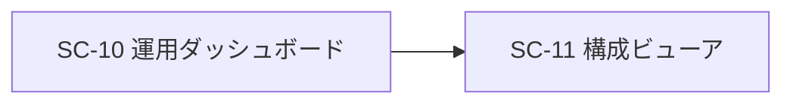

# 画面仕様書: 構成ビューア（SC-11）

> **［実装状態］`status: completed`。3 画面のうち本画面だけは、hi-fi の要素が
> **すべて契約に載っている**（未実装として残るのは共通シェルの 2 行だけである）。**

> **［2026-08-05 / #504］新スタック（ADR-0031: React 19 / TanStack Router / TanStack Query /
> Tailwind v4 ＋ shadcn/ui / Lingui）での再実装に合わせて全面改訂した。**
> 3 本の問い合わせ（実効構成・ドリフト・履歴）を独立に扱う性質と、ドリフト種別・深刻度の写像を
> **純関数へ出した**（[[IADR-0129]] 決定 5・6）。可視化方式（CSS 縦チェーン＋表）は [[IADR-0036]] のまま変えない。

## 起点となる計画書（トレーサビリティ）

- 画面（SC）: **SC-11 構成ビューア**（[05_screens/01_screens.md](../../planning/projects/microservices-platform/05_screens/01_screens.md) §SC-11・遷移図 `SC10 → SC11`）
- 関連機能要求（FR）: **FR-15**（現在有効なシステム構成・構成バージョンの読み取り専用取得、
  宣言との不一致検出・警告、管理者・運用者限定）
- 関連ユースケース（UC）: **—（運用・保守要求）**。計画の画面一覧が「—」とする（issue #504 の表も一致）
- モックアップ（**実装の正**）:
  [hi-fi/sc-11.html](../../planning/projects/microservices-platform/05_screens/mockups/hi-fi/sc-11.html) ／
  [wireframe/sc-11.html](../../planning/projects/microservices-platform/05_screens/mockups/wireframe/sc-11.html)
- 関連 ADR（計画）: **ADR-0018**（Composable Architecture、Accepted）
- 計画技術検討: [10_composability-design.md](../../planning/projects/microservices-platform/06_technical/10_composability-design.md) §設計要素 6（構成情報 API）／
  [05_observability-ops.md](../../planning/projects/microservices-platform/06_technical/05_observability-ops.md) §構成変更の監査ログと適用履歴
- 関連 IADR: [[IADR-0129]]（本作業の設計判断）・[[IADR-0029]]（API 配置・ドリフト粒度）・
  [[IADR-0030]]（`platform-operator` と `ConfigViewer` ポリシー）・[[IADR-0036]]（可視化方式）・
  [[IADR-0046]]（構成バージョン履歴の正データ源）・[[IADR-0009]]（存在秘匿）

## 画面概要・目的

組み替えが自由になるほど「いま何がどう繋がっているか」は自明でなくなる。本画面は、現在有効な
**実効構成**（パイプライン段・イベント接続・ポート実装選択・コネクタ）を機械可読（FR-15 API）に加えて
**人間可読**に可視化し、宣言（Git）との差分（ドリフト）と構成バージョン履歴を確認できるようにする。

- ルート: **`/admin/config-viewer`**（05_screens §共通シェル「ルートパス」）
- 左ナビ: 「運用」グループの **「構成ビューア」**
- 主要利用シーン: 運用時の構成確認、障害調査（配線・ドリフトの把握）、変更適用直後の反映確認、監査。
- **参照専用**: 本画面から構成は変更しない。構成変更は Git 経由（GitOps）に限る。
- アクセスは **`platform-admin` または `platform-operator`**（`ConfigViewer`。[[IADR-0030]]）。
  権限外にはメニュー・画面自体を表示しない（存在秘匿）。閲覧は監査ログに記録する。

## 構成バージョン履歴の正データ源（**計画は 2026-08-04 に確定済み**）

[05_observability-ops.md](../../planning/projects/microservices-platform/06_technical/05_observability-ops.md)
（`:94-96`。planning#190 の裁定）:

- **正データ源は GitOps 層**（Git のコミット履歴・ArgoCD のリビジョン履歴）。
- **プラットフォームのサービスに履歴ストアを持たない**（制約）。API と本画面は**永続化せず surfacing する**。
- **保持範囲**: Git のコミット履歴を正とし**無期限**。**ArgoCD のリビジョン履歴は既定
  （`revisionHistoryLimit` = 10 世代）**を採用し、それを超える遡及は Git で行う。
  **本画面が表示できる履歴の上限はこの規則から定まる。**

これは実装側の [[IADR-0046]]（Accepted・2026-07-09）と**同じ内容**である。**画面は件数を切り詰めない**
（画面が独自の上限を持つと、第二の規則が生まれる。[[IADR-0129]] 決定 5）。

## hi-fi モックアップとの対応（実装する要素／実装しない要素）

行番号は planning `d980a01` の [hi-fi/sc-11.html](../../planning/projects/microservices-platform/05_screens/mockups/hi-fi/sc-11.html) に対するものである。
粒度の規則は [SC-05](./SC-05_document-management.md) と共通である。

| # | モックの要素（行） | 実装 | 備考 |
| --- | --- | --- | --- |
| 1 | 見出し「**実効構成**」（416 左） | **する** | `<h1>` |
| 2 | ヘッダの `Tag`「**コミット a3f81c2**」（416） | **する** | `version.gitCommit` の**先頭 7 桁**（完全な値は `title` 属性）。未注入は `—` |
| 3 | ヘッダの `Tag`「**適用 2026-07-22 14:05**」（416） | **する** | `version.appliedAt` をロケール表記へ。解釈できない値は生値のまま |
| 4 | ヘッダの `Tag`「**適用者 argocd**」（416） | **する** | `version.appliedBy`。未注入は `—` |
| 5 | ヘッダの**ドリフトバッジ**「ドリフト 1件」（416） | **する** | `StatusBadge`。0 件 = `success`「ドリフトなし」／N 件 = `warning`「ドリフト N 件」。**取得不能なら出さない**（「0 件」と紛れるため）。**実効構成が取れないときも出さない**——バッジだけが残ると「何に対する差分か読めない件数」になる（[[IADR-0129]] 決定 5） |
| 6 | 折りたたみ「**(1) 実効構成 — パイプライン段・接続**」（417） | **する** | `<details open>`（[[IADR-0036]]。新規プリミティブを作らない） |
| 7 | **CSS 縦チェーン**の段（418-424。`ingest.consumer（取得）` → … → `wiki-sync（無効）`） | **する** | `consumer` → `outputs` の縦チェーン。`outputs` が空なら「（終端）」 |
| 8 | チェーンの**ドリフト強調**（421。`embed（voyage-3.5）⚠ ドリフト`） | **する** | `finding.target` と段名が一致する段に警告色 ＋ **(2) の明細へのリンク**。`DriftDetector` の `Target` は常に段名である |
| 9 | チェーンの**無効段のグレーアウト**（423。`wiki-sync（無効）`） | **する** | `enabled: false` を淡色 ＋ `StatusBadge`「無効」（**色だけで示さない**。INDEX 決定 21） |
| 10 | 右の表「**イベント接続** / MassTransit / RabbitMQ」（428） | **する** | 契約はイベント型ごとの発行者・購読者を返すため、**イベント / 発行者 / 購読者の表**として出す（モックの 1 行要約より詳しい） |
| 11 | 右の表「**ポート: 埋め込み** / Voyage AI（既定）／Ruri v3（高機密）」（429） | **する** | **ポート / 実装 / 接続先の表**（同上） |
| 12 | 右の表「**コネクタ** / fs / wiki / saas / db（4）」（430） | **する** | **コネクタ名 ＋ 有効/無効**の一覧（同上） |
| 13 | 折りたたみ「**(2) 宣言（Git）との差分 — ドリフト**」（434） | **する** | `<details open>` |
| 14 | ドリフト明細の表（435-436。種別 / 深刻度 / 対象 / 説明） | **する** | 種別は 5 値を表示名へ、深刻度は 2 値を `StatusBadge` へ写す（§状態表示）。0 件は「ドリフトなし（OK）」＋確認時刻 |
| 15 | 折りたたみ「**(3) 構成バージョン履歴（新しい順）**」（438） | **する** | `<details>`（**既定は閉**。モックが `open` を付けていない） |
| 16 | 履歴の表（439-441。コミット / 適用日時 / 適用者 / ドリフト） | **する** | `hadDrift` は あり／なし／**—（不明）**。0 件は「適用履歴はありません。」 |
| 17 | 注記「**参照のみ — 構成変更は Git 経由（GitOps）に限る。閲覧は監査ログに記録。可視化は CSS 縦チェーン＋表（IADR-0036）**」（443） | **する** | `Alert`（`info`）。**IADR 番号は画面に出さない**（利用者向けの文言ではない） |
| 18 | **共通シェル**: 右レール「AIチャットパネル」（445-450） | **しない** | 移行**第 4 段**（[[IADR-0121]] 決定 1・5） |
| 19 | **共通シェル**: パンくず（413。`ホーム / 運用 / ダッシュボード / 構成ビューア`）・ブランド／ロールバッジ／アバター（412）・左ナビ（414） | **本画面では作らない** | パンくず・権限バッジは #452 系。他は `foundation/ui/Layout` が既に持つ |

**対応表の行数は 19 行**（数え方は**行数**であって要素名ではない）。内訳は
**する 17 行**（#1〜#17）／**しない 1 行**（右レール = #18）／**本画面では作らない 1 行**（#19）である。
**A（FR の着手保留）・B（契約の不在）に該当する行は 0 行**——**3 画面のうち本画面だけが
hi-fi の要素をすべて実装できる**（FR-15 の API が #112 / #138 / #139 で揃っているため）。
**行数基準では捕まらない部分未実装も無い。**

### モックに無いが実装する要素

| 要素 | 計画上の根拠 |
| --- | --- |
| **再取得**（更新）ボタン | 05_screens §SC-11 は参照専用と定めるが、再取得は**参照の操作**であり構成を変更しない。障害調査で「いまの実効構成」を取り直す用途（本書 §アクション・イベント が #113 時点から挙げている） |
| ドリフト明細の**確認時刻** | `DriftReportDto.CheckedAt`。0 件のとき「検出が実行済みであること」を示さないと、**未検出**と**未実行**が区別できない |

## レイアウト / 主要素

**タブは用いず**、上部にヘッダ（構成バージョン・全体ドリフト状態）を置き、以下 3 領域を
**折りたたみ可能なセクション（`<details>`）の縦積み**で構成する。グラフ描画ライブラリは導入せず、
パイプライン段は CSS の縦チェーン、イベント接続・ポート・コネクタは表で表現する（[[IADR-0036]]）。

```
┌─────────────────────────────────────────────────────────────┐
│ h1 実効構成   [コミット a3f81c2][適用 …][適用者 …]           │
│               [⚠ ドリフト 1 件]           [再取得]           │
├─────────────────────────────────────────────────────────────┤
│ ▼ (1) 実効構成 — パイプライン段・接続                        │
│   consumer → outputs の CSS 縦チェーン（無効段は淡色＋バッジ）│
│   イベント接続 / ポート実装選択 / コネクタ の 3 表           │
│ ▼ (2) 宣言（Git）との差分 — ドリフト                         │
│   種別 / 深刻度 / 対象 / 説明（0 件は「ドリフトなし（OK）」） │
│ ▶ (3) 構成バージョン履歴（新しい順）                         │
│   コミット / 適用日時 / 適用者 / ドリフト                    │
│ (i) 参照のみ — 構成変更は Git 経由（GitOps）に限ります…      │
└─────────────────────────────────────────────────────────────┘
```

**`<details>` / `<summary>` はネイティブを使う**（[[IADR-0129]] 決定 7）。計画
[13_frontend-stack §shadcn/ui 派生の範囲](../../planning/projects/microservices-platform/06_technical/13_frontend-stack.md)
の 4 基準（フォーカストラップ／複合キーボード操作／ポータル配置計算／`aria-*` の動的同期）の
**いずれにも該当しない**ため、`@platform/ui` へは入れない。

## 状態表示（INDEX 決定 21「色だけで意味を持たせない」）

**ドリフト深刻度**（契約 `DriftDetector` の 2 値）:

| `severity` | 表示 | `StatusBadge` の `tone` | アイコン（`tone` から自動） |
| --- | --- | --- | --- |
| `Warning` | 警告 | `warning`（琥珀） | `AlertTriangle` |
| `Info` | 情報 | `neutral` | `Info` |
| 上記以外（未知の値） | 生値をそのまま | `neutral` | `Info` |

**ドリフト種別**（契約の 5 値。計画 §設計要素 6 の 4 分類に `BindingMismatch` を加えたもの）:

| `kind` | 表示 |
| --- | --- |
| `MissingApply` | 適用漏れ（宣言にあり実効に無い） |
| `UndeclaredSubscription` | 宣言に無い購読 |
| `StaleStage` | 古い段の残留 |
| `BindingMismatch` | 接続の不一致 |
| `Unverifiable` | 検証不能（担当サービスへ到達できない） |
| 上記以外（未知の値） | **生値をそのまま**（`—`・「不明」へ丸めない） |

**全体ドリフト状態**（ヘッダ）: 0 件 = `success`「ドリフトなし」／N 件 = `warning`「ドリフト N 件」。
**取得不能ならバッジを出さない**（「0 件」と見分けが付かなくなるため）。

**段の有効／無効**: 無効段は淡色 ＋ `StatusBadge`（`neutral`「無効」）。**淡色だけに頼らない。**

## 表示・入力項目

参照専用画面のため入力は無い（折りたたみの開閉と再取得のみ）。

| 項目 | 出所 | 形式 |
| --- | --- | --- |
| 構成バージョン（コミット ID） | `version.gitCommit` | 短縮 7 桁 ＋ `title` に完全な値。未注入は `—` |
| 適用日時 | `version.appliedAt` | ロケール表記。解釈できない値は生値 |
| 適用者 | `version.appliedBy` | 文字列。未注入は `—` |
| 段（ステップ）一覧 | `pipeline[]` | 段名・サービス・`consumer`・`input → outputs`・有効/無効 |
| イベント接続 | `eventBindings[]` | イベント型 / 発行者 / 購読者 |
| ポート実装選択 | `ports[]` | ポート / 実装 / 接続先 |
| コネクタ一覧 | `connectors[]` | 名前 / 有効・無効 |
| ドリフト明細 | `drift.findings[]` | 種別 / 深刻度 / 対象 / 説明（＋ 確認時刻） |
| バージョン履歴 | `history[]` | コミット / 適用日時 / 適用者 / ドリフト有無（新しい順） |

## アクション・イベント

| 操作 | 挙動 | 遷移先 |
| --- | --- | --- |
| セクション折りたたみ（実効構成／ドリフト／履歴） | `<details>` の開閉（クライアント側） | 同一画面 |
| ドリフト明細へ（チェーンの ⚠） | ページ内リンクで (2) の明細へ | 同一画面 |
| **再取得** | 3 本の問い合わせを取り直す（`invalidateQueries`） | 同一画面 |
| SC-10 からの遷移入口 | 本画面を開く | SC-11（本画面） |

## 画面遷移



## データソース（BFF 境界）と縮退

| 用途 | エンドポイント | 応答 | 認可 |
| --- | --- | --- | --- |
| 実効構成 | `GET /bff/admin/config` | `EffectiveConfigDto` | **`ConfigViewer`**（admin または operator）。**非権限は 404 で秘匿** |
| ドリフト | `GET /bff/admin/config/drift` | `DriftReportDto` | 同上 |
| 構成バージョン履歴 | `GET /bff/admin/config/history` | `ConfigVersionEntryDto[]` | 同上 |

サーバ側は `RequireAuthorization` を**付けず**にハンドラ内で認可を判定する——付けると無認証が
404 到達前に 401 で短絡し、**存在が漏れる**ためである（[[IADR-0029]]）。取得は許可・拒否とも監査ログへ記録する。

**3 本は独立に扱い、領域ごとに縮退する**（[[IADR-0129]] 決定 5）:

| 問い合わせ | 失敗時 |
| --- | --- |
| **実効構成** | 404 → 中立文言「構成情報は利用できません。」／その他 → `Alert`（`danger`・`role="alert"`）。**この 1 本が落ちたら他の 2 領域も、ヘッダのドリフトバッジも出さない**（構成が無い状態でドリフトだけ出しても何に対する差分か読めない）。3 本は `enabled` を持たず**独立に走る**ため、実効構成が 5xx でドリフトが 200 という組み合わせが実際に起こる |
| ドリフト | ドリフト領域のみ「ドリフト情報は利用できません。」。**ヘッダのバッジも出さない** |
| 履歴 | 履歴領域のみ「バージョン履歴は利用できません。」 |

- **`docs/api/openapi.yaml` に本群が無く orval 生成フックが存在しない**ため、`apiFetch` ＋ 手書き型で呼ぶ（**#506** の射程）。
- キャッシュキー: `['bff','admin','config']` / `['bff','admin','config','drift']` / `['bff','admin','config','history']`。

## 権限・表示条件

- **ロール限定**: `platform-admin` または `platform-operator`（`ConfigViewer`。[[IADR-0030]]）。
  権限外は `RequireRole` → **`NotFound`**（存在秘匿）。**未知パスの `NotFound` と markup が一致する**ことを
  テストで固定する（#490 が確立した作法。本画面の `access.test.tsx` が持つ）。
- **権限外では BFF を呼ばない**（要求の有無から画面の存在を推測させない）。
- 左ナビは `requiresAnyRole: [platform-admin, platform-operator]`・`group: 'ops'`。
- **監査ログ**: 構成情報 API の閲覧は許可・拒否とも監査ログに記録する（サーバ側）。

## 実装

- BFF: `src/platform/backend/Bff/Platform.Bff/Foundation/Endpoints/ConfigBffEndpoints.cs`
- 検査ロジック: `Platform.Shared.Infrastructure/Foundation/Introspection/`（`ConfigInspectionService` / `DriftDetector`）
- フロント: `src/knowledge/frontend/src/features/sc11-config/`
  （`index.tsx` / `ConfigViewerPage.tsx` / `useConfigViewer.ts` / `driftView.ts`）
- 契約: `Platform.Shared.Contracts/Dtos/ConfigInfoDto.cs`
- テスト観点は [tests/SC-11_configuration-viewer.md](../tests/SC-11_configuration-viewer.md)。

## 関連仕様

- 機能仕様書: [FR-15_config-info-api](../functional/FR-15_config-info-api.md)
- 通信仕様書: [openapi.yaml](../api/openapi.yaml)（`/bff/admin/config`・`/bff/admin/config/drift`）
- 技術検討（計画）: [10_composability-design.md](../../planning/projects/microservices-platform/06_technical/10_composability-design.md) §設計要素 6

## 未決事項

1. **ドリフト判定の粒度**（キュー名の相違を情報レベルに留める点）——[[IADR-0029]] の既定を据え置く。
2. **`docs/api/openapi.yaml` への `/bff/admin/config` 群の追加**（#506 の射程）。

> **［2026-08-05 / #504］解決して畳んだ未決事項**
>
> - 旧 1（運用者ロールの新設）・旧 2（構成情報 API の配置）・旧 3（バージョン履歴のデータ源・保持範囲）・
>   旧 4（グラフのレイアウト方針）・旧 6（フロントエンド基盤）は、いずれも #113 / #112 / #139 / #137 /
>   ADR-0031 で解決済みであり、本文（§構成バージョン履歴の正データ源・§状態表示・§データソース）へ畳んだ。
>   **旧 3 は計画側でも 2026-08-04 に確定した**（planning#190。保持範囲 = Git 無期限 ＋ ArgoCD 10 世代）。
> - **旧 5（ワイヤーフレーム `sc-11.drawio` の作成）は取り下げる。** 計画は
>   **HTML モックアップを正とし draw.io を作成しない**方針であり（§HTMLモックアップ が hi-fi / wireframe の
>   HTML を挙げ、SC-11 にも [wireframe/sc-11.html](../../planning/projects/microservices-platform/05_screens/mockups/wireframe/sc-11.html) が揃っている。
>   **`.drawio` は計画リポジトリに 1 件も存在しない**）、計画側へ送る作業自体が成立しない。
