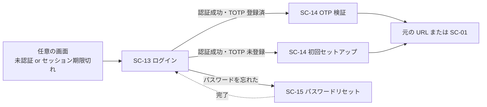

<!-- trace:
ids: [SC-01, SC-13, SC-14, SC-15, SC-16, UC-05, FR-05]
adrs: [ADR-0026, ADR-0078]
iadrs: [IADR-0197, IADR-0261, IADR-0347, IADR-0427]
specs: [20260823_issue-438_keycloak-theme-and-smtp, 20260828_issue-439_sc16-account-settings, 20260911_issue-1245_login-existence-disclosure]
issues: [#438, #1245]
-->

# 画面仕様書: ログイン（Keycloak 統合認証）

> realm 設定（レルム改名・パスワードポリシー等）は先行する実装 ADR で投入済み。**本書は
> Keycloak テーマの実装を反映して新規作成する**——先行して作成されていた
> [ワンタイムコード（OTP）](./SC-14_otp-mfa.md) / [パスワードリセット](./SC-15_password-reset.md) の
> 画面仕様書と異なり、ログイン画面単独の仕様書はこれまで存在しなかった。

## 起点となる計画書（トレーサビリティ）

- 画面: **ログイン**。全コンポーネント（SPA・Wiki.js・Grafana 等）共通の OIDC 認証入口
- 関連ユースケース: ABAC 権限を管理する（認証・認可を伴う利用の前提）
- 関連機能要求（FR）: 非機能要件「セキュリティ: 認証・認可／認証UX／不正ログイン対策」
- 計画書リンク: 計画側の画面設計 §ログイン（Keycloak 統合認証）／認証 UX とアカウント管理の計画 ADR

## 画面概要・目的

全コンポーネント（SPA・Wiki.js・Grafana・ArgoCD・MinIO・Vault・Headlamp）共通の OIDC 認証入口。
**Keycloak のログインテーマとして実装する**（自前 SPA では実装しない）。

- 共通シェル: **適用外**（Keycloak テーマ。左ナビ・AI チャットパネル・パンくずは適用しない）
- 配信ホスト: 認証基盤ホスト `auth.example.co.jp`

## レイアウト / 主要素

| 要素 | 説明 |
| --- | --- |
| 社員ID／メールアドレス入力 | ログイン ID |
| パスワード入力 | — |
| 「このデバイスを記憶（30 日）」 | チェックボックス |
| パスワードリセット導線 | [SC-15](./SC-15_password-reset.md) へ |
| 認証エラー表示 | 存在秘匿の固定文言 |
| 言語切替 | realm の国際化設定による（下記） |

## 表示・入力項目

| 項目 | 種別 | 必須 | 初期値 | 形式・制約 | 説明 |
| --- | --- | --- | --- | --- | --- |
| 社員ID／メールアドレス | テキスト | 必須 | 空 | — | エラー時も ID の存在有無を返さない（存在秘匿） |
| パスワード | パスワード | 必須 | 空 | — | 5 回連続失敗で 15 分の一時ロック |

## バリデーション

| 項目 | 条件 | エラーメッセージ |
| --- | --- | --- |
| 社員ID／メールアドレス・パスワード | **存在秘匿**（ID の存在有無を返さない） | 「社員ID またはパスワードが正しくありません」で固定 |
| パスワード | 5 回連続失敗で 15 分の一時ロック（Brute Force Detection） | ロック中もエラー文言は変えない |

**realm 側の実装値**（`deploy/keycloak/microservices-platform-realm.json`）:

| キー | 値 | 対応する計画 ADR の確定要件 |
| --- | --- | --- |
| `loginTheme` | `platform` | ブランド適用（Keycloak テーマとして実装） |
| `bruteForceProtected` / `failureFactor` / `waitIncrementSeconds` | `true` / `5` / `900` | 5 回連続失敗で 15 分の一時ロック |
| `rememberMe` / `ssoSessionIdleTimeoutRememberMe` / `ssoSessionMaxLifespanRememberMe` | `true` / `2592000` / `2592000` | 「このデバイスを記憶」30 日 |
| `internationalizationEnabled` / `supportedLocales` / `defaultLocale` | `true` / `["ja","en"]` / `"ja"` | **言語切替**（主要素） |
| `displayName` | `汎用プラットフォーム` | ヘッダーに表示するブランド表示名 |

## アクション・イベント

| 操作 | 挙動 | 遷移先 |
| --- | --- | --- |
| 認証成功（TOTP 登録済） | OTP 検証へ | [ワンタイムコード（OTP）検証](./SC-14_otp-mfa.md) |
| 認証成功（TOTP 未登録） | 初回セットアップへ誘導 | [ワンタイムコード初回セットアップ](./SC-14_otp-mfa.md) |
| 未認証アクセス・セッション期限切れ | 全画面から本画面へリダイレクト | ログイン後に元の URL へ復帰 |
| パスワードを忘れた | リセット申請へ | [パスワードリセット](./SC-15_password-reset.md) |

## 画面遷移

## 権限・表示条件

**未認証で到達できる**（全コンポーネント共通の認証入口）。認証済みでも他画面からの遷移で
セッション切れの場合は本画面へリダイレクトされる。

## ルート

| 用途 | ルート |
| --- | --- |
| ログイン | `auth.example.co.jp` の `/realms/platform/protocol/openid-connect/auth?client_id=platform-spa`（Keycloak 標準） |

## 計画（モックアップ・画面設計）との対応

> **判定基準は [ワンタイムコード（OTP）](./SC-14_otp-mfa.md) の同節と共通である。**

| 計画側の要素 | 実装 | 満たしていない条件 / 理由 | 計画側の該当箇所 |
| --- | --- | --- | --- |
| 全コンポーネント共通の OIDC 認証入口 | **する** | レルム `platform`／クライアント `platform-spa` へ改名済み（レルム改名の実装 ADR） | 計画側の画面設計 §ログイン |
| 存在秘匿（応答の区別不能性） | **する（3 面を機械で測る）** | 🔴 **「Keycloak 既定挙動だから成立している」ではない。** ステータス・リダイレクト先・応答本文の 3 面を、実在する利用者名と**同じバイト長の**非実在の利用者名で対にして稼働クラスタで測る（下記「存在秘匿の測り方」）。**所要時間は測って出すが、判定はしていない**（計画側が閾値を実測待ちとしているため） | 同上 |
| 5 回失敗で 15 分ロック | **する** | `bruteForceProtected` 等 | `ADR-0026` §パスワード・ロックアウト |
| 「このデバイスを記憶（30 日）」 | **する** | `rememberMe` / セッション有効期間 | 同上 |
| 言語切替 | **する** | `internationalizationEnabled` / `supportedLocales` | 計画側の画面設計 §ログイン |
| ブランド適用（表示名・配色） | **する** | `loginTheme=platform`（CSS 上書き。テンプレートは Keycloak 既定を継承） | 同上 |
| 未認証アクセス・セッション期限切れのリダイレクトと復帰 | **する** | Keycloak 既定挙動（OIDC 標準フロー） | 同上 |

## 存在秘匿の測り方

計画側は存在秘匿の統制を「**応答の区別不能性**（ステータス・本文・所要時間）」と定め、
**射程に認証系の経路を含める**と明文化している。本画面はその射程に入る。

- **対にするのは「失敗したログイン」**である（成功は実在する利用者名にしか起こり得ないので対にならない）。
  実在する利用者名 ＋ 誤った資格情報 と、**同じバイト長の**非実在の利用者名 ＋ **同じ**誤った資格情報 を比べる。
- 🔴 **長さを揃えるのは手心ではない。** 入力した利用者名は応答へそのまま反映されるため、
  **長さが違えば本文長は必ず違う**（存在の漏れではなく測り方の誤りになる）。
- **判定するのはステータス・リダイレクト先・応答本文の 3 面**で、
  🔴 **所要時間は出すだけで判定していない**（計画側が閾値を「実測してから定める」としており、
  実装側で数字を置くとそれが確定値として固まるため）。
- 🔴 **測っていないもの**: **ロックアウトの発火**。失敗回数しきい値に到達させると
  **実在する利用者だけがロックされる** —— これはもう 1 つの存在判定器だが、
  意図的に作ると測定環境と後続の検査を壊すので、稼働クラスタでの実測として別に扱う。

手順とテストケースは [ログイン画面 テスト仕様書](../tests/SC-13_login.md) を参照。

## 関連仕様

- 実装 ADR: レルムを `platform` へ改名し、計画 ADR の認証ポリシーを realm へ投入する実装 ADR／
  テーマ実装方針・smtp 注入方式を決めた実装 ADR／
  **ログイン経路の存在秘匿を「同じ長さの対」で測ると決めた実装 ADR**
- 画面仕様書: [ワンタイムコード（OTP）](./SC-14_otp-mfa.md)／[パスワードリセット](./SC-15_password-reset.md)／
  [アカウント設定](./SC-16_account-settings.md)

## 未決事項

- ［2026-09-11 解消］**ログイン画面単独のテスト仕様書は在る**
  （[ログイン画面 テスト仕様書](../tests/SC-13_login.md)。本節の旧記述「本作業では新設していない（残件）」は、
  同仕様書が作られた時点で誤りになっていた）。
- **所要時間に有意な差があった場合にどう扱うか**は計画側の裁定事項である（閾値・許容範囲とも未定）。
- **ロックアウト経路（実在する利用者だけが一時ロックされる）は未実測**である。
- **k8s ローカル環境のテーマは自動配線済みである（2026-08-28）。** ConfigMap
  （`keycloak-theme-platform`）の生成は `scripts/k8s-local-up.sh` の `[3/7]` に組み込まれた
  （[ワンタイムコード（OTP）](./SC-14_otp-mfa.md) の画面仕様書と同じ）。
  **実クラスタでの見た目確認のみ環境待ちで残る。**

<!-- trace-table:
row1: SC-14
row2: SC-15
row3: SC-16
-->
