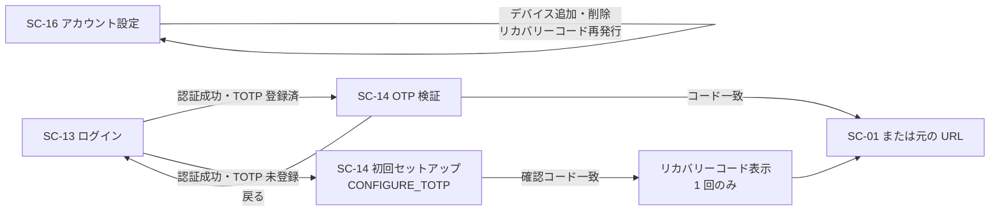

<!-- trace:
ids: [SC-01, SC-13, SC-14, SC-15, SC-16, UC-05]
adrs: [ADR-0026]
iadrs: [IADR-0197, IADR-0261]
specs: [20260823_issue-438_keycloak-theme-and-smtp, 20260828_issue-438_keycloak-theme-k8s-local]
issues: [#438]
-->

# 画面仕様書: ワンタイムコード（OTP／多要素認証）

> **realm 設定に加え、Keycloak テーマ（ブランド適用の CSS）を実装した。** テーマ実体は
> `deploy/keycloak/themes/platform/login/`（`parent=keycloak` を継承し、テンプレートは複製せず
> CSS のみ追加する方式）。**docker-compose 環境では有効。k8s ローカル環境（`deploy/local/`）は
> ConfigMap の手動作成が必要**（残件は本書 §未決事項）。

## 起点となる計画書（トレーサビリティ）

- 画面: **ワンタイムコード／多要素認証**。前段はログイン画面（計画リポ）、デバイス管理はアカウント設定（計画リポ）
- 関連ユースケース: ABAC 権限を管理する（認証・認可を伴う利用）
- 関連機能要求（FR）: 非機能要件「セキュリティ: 認証・認可」
- 計画書リンク: 計画側の画面設計 §ワンタイムコード（OTP）／認証 UX とアカウント管理の計画 ADR

## 画面概要・目的

TOTP による多要素認証。**Keycloak の OTP フォームおよび必須アクション `CONFIGURE_TOTP` で実現する**（自前 SPA では実装しない。認証 UX の計画 ADR の選択肢 1）。
**MFA は必須であり、未登録者はログイン時に初回セットアップへ誘導される。**

- 共通シェル: **適用外**（Keycloak テーマ。左ナビ・AI チャットパネル・パンくずは適用しない）
- 配信ホスト: 認証基盤ホスト `auth.example.co.jp`

## レイアウト / 主要素

| 要素 | 説明 |
| --- | --- |
| 6 桁コード入力 | TOTP コードの入力欄 |
| デバイス選択 | 複数の TOTP デバイスを登録している場合の選択 |
| リカバリーコード導線 | TOTP デバイスを失った場合の代替入口 |
| ログイン画面へ戻る導線 | ログイン画面へ戻る |
| 初回セットアップ | QR コード・手動入力キー・デバイス名・確認コード |

TOTP アプリは Google Authenticator / Microsoft Authenticator 等に対応する（標準の `otpauth://` URI で足りる）。

## 表示・入力項目

| 項目 | 種別 | 必須 | 初期値 | 形式・制約 | 説明 |
| --- | --- | --- | --- | --- | --- |
| ワンタイムコード | 数値 | 必須 | 空 | 数字 6 桁 | TOTP 検証 |
| 確認コード（初回登録） | 数値 | 初回登録時必須 | 空 | 数字 6 桁 | 登録した TOTP デバイスが生成したコードと一致すること |
| デバイス名 | テキスト | 任意 | 空 | — | 複数デバイス識別用 |

## バリデーション

| 項目 | 条件 | エラーメッセージ |
| --- | --- | --- |
| ワンタイムコード | TOTP 検証。**時刻ずれは前後 1 ステップ（30 秒）まで許容** | 不一致は再入力を促す |
| 確認コード | 登録デバイスの生成コードと一致 | 不一致は再入力を促す |

**realm 側の実装値**（`deploy/keycloak/microservices-platform-realm.json`。レルム改名と認証ポリシー投入の実装 ADR による）:

| キー | 値 | 対応する計画 ADR の確定要件 |
| --- | --- | --- |
| `otpPolicyType` | `totp` | TOTP による MFA |
| `otpPolicyDigits` | `6` | 6 桁 |
| `otpPolicyPeriod` | `30` | 30 秒ステップ |
| `otpPolicyLookAheadWindow` | `1` | **前後 1 ステップ（30 秒）まで許容** |
| `otpPolicyAlgorithm` | `HmacSHA1` | 標準 TOTP（RFC 6238 既定。認証アプリの互換性が最も広い） |
| `otpPolicyCodeReusable` | `false` | 同一コードの再利用を許さない |
| `requiredActions[CONFIGURE_TOTP]` | `enabled: true` / **`defaultAction: true`** | **未登録者をログイン時に初回セットアップへ誘導する** |

## アクション・イベント

| 操作 | 挙動 | 遷移先 |
| --- | --- | --- |
| コード入力→送信（検証成功） | 認証完了 | 検索／チャット質問画面（または認証前に要求された元の URL） |
| 初回登録の完了 | **リカバリーコードを 1 回のみ表示する** | 検索／チャット質問画面（または元の URL） |
| 「ログインに戻る」 | 認証セッションを破棄 | —|
| リカバリーコード導線 | リカバリーコードによる検証 | 検索／チャット質問画面（または元の URL） |

## 画面遷移

## 権限・表示条件

**全利用者が対象**（MFA 必須。ロールによる例外を設けない。計画 ADR「MFA なしでの稼働は採らない」）。

## ルート

| 用途 | ルート |
| --- | --- |
| OTP 検証 | `auth.example.co.jp` の `/realms/platform/login-actions/authenticate` |
| 初回登録 | `auth.example.co.jp` の `/realms/platform/login-actions/required-action?execution=CONFIGURE_TOTP` |

**レルムは `platform` である**（レルム改名の実装 ADR により `microservices-platform` から改名済み）。

## 計画（モックアップ・画面設計）との対応

> **判定基準（本表と [パスワードリセット](./SC-15_password-reset.md) で共通）**:
> **Keycloak の既定テーマで機能するが、ブランド適用・共通シェル要件・計画が規範化した文言を満たさないものは
> 「一部する」とする。** 「しない」は**要素そのものが存在しない**場合に限る。
> **「計画側の該当箇所」は行番号ではなく節見出しで指す** —— 計画書は追記が多く行番号が腐りやすいためである
> （テンプレートは `01_screens.md:NNN` を例示しているが、節見出しの方が長持ちする）。

| 計画側の要素 | 実装 | 満たしていない条件 / 理由 | 計画側の該当箇所 |
| --- | --- | --- | --- |
| TOTP による MFA を必須とする | **する** | realm ポリシー（`otpPolicyType` / `CONFIGURE_TOTP` の `defaultAction`）＋テーマ（`loginTheme=platform`）が揃った。k8s ローカル環境も自動配線済み・実クラスタでの見た目確認のみ残件（§未決事項） | 計画側の画面設計 §ワンタイムコード（OTP） |
| 6 桁・前後 1 ステップ許容 | **する** | — | 同上 |
| 6 桁コード入力・デバイス選択・戻る導線 | **する** | Keycloak 既定テーマが 3 要素とも提供し、`platform` テーマでブランド適用済み | 同上 |
| 初回セットアップ（QR・手動キー・デバイス名・確認コード） | **する** | `CONFIGURE_TOTP` を `defaultAction` にしたため既定テーマで誘導が働き、テーマでブランド適用済み | 同上 |
| リカバリーコードを登録完了時に 1 回のみ表示 | **する** | 必須アクション `CONFIGURE_RECOVERY_AUTHN_CODES` は realm へ登録済み（レルム改名と認証ポリシー投入の実装 ADR）。**表示回数の制御は Keycloak 本体の既定挙動**（登録フロー完了時に 1 回のみ表示する）に依存し、テーマは表示の作り込みを追加しない | 同上 |
| リカバリーコードをアカウント設定から再発行 | **する** | provider 登録済み・アカウントコンソールへ `accountTheme=platform` を適用済み。再発行の導線は Keycloak 既定のアカウントコンソールが提供する | 計画側の画面設計 §アカウント設定 |

## 関連仕様

- 実装 ADR: レルムを `platform` へ改名し、計画 ADR の認証ポリシーを realm へ投入する実装 ADR／
  テーマ実装方針・smtp 注入方式を決めた実装 ADR
- テスト仕様書: [ワンタイムコード（OTP）](../tests/SC-14_otp-mfa.md)
- 画面仕様書: [ログイン](./SC-13_login.md)／[パスワードリセット](./SC-15_password-reset.md)／
  [アカウント設定](./SC-16_account-settings.md)

## 未決事項

- **★ `requiredActions` を書くと Keycloak の既定は一切登録されない。** 本作業の初版は 7 件しか列挙せず、**この provider を落としていた**（PR #746 の ADR 監査が検出）。現在は既定 13 件を全列挙し、`check-realm-constraints.js` が宣言漏れを検出する。
- **k8s ローカル環境（`deploy/local/`）のテーマは自動配線済みである（2026-08-28）。** ConfigMap
  （`keycloak-theme-platform`）の生成は `scripts/k8s-local-up.sh` の `[3/7]` に組み込まれ、
  `scripts/k8s-local-up.test.js` が生成コマンドと `deploy/local/infra/keycloak.yaml` の
  `items` キーの一致を固定している。実クラスタでの見た目確認のみ環境待ちで残る。

<!-- trace-table:
row1: SC-13
-->
