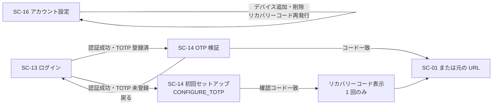

# 画面仕様書: ワンタイムコード（OTP／多要素認証）（SC-14）

> **本仕様書は realm 設定の側だけが実装済みである。** 画面（Keycloak テーマ）の実体は未実装であり、
> **担当は #438**（計画 決定 30）。本書は #578 が引き受けた下位タスク＝「realm 設定と画面仕様書の作成」の成果物である。

## 起点となる計画書（トレーサビリティ）

- 画面（SC）: **SC-14**（ワンタイムコード／多要素認証）。前段は [SC-13](../../planning/projects/microservices-platform/05_screens/01_screens.md)（ログイン）、デバイス管理は [SC-16](../../planning/projects/microservices-platform/05_screens/01_screens.md)（アカウント設定）
- 関連ユースケース（UC）: UC-05（認証・認可を伴う利用）
- 関連機能要求（FR）: 非機能要件「セキュリティ: 認証・認可」
- 計画書リンク: [`05_screens/01_screens.md` §SC-14](../../planning/projects/microservices-platform/05_screens/01_screens.md)／[`ADR-0026`](../../planning/projects/microservices-platform/07_adr/ADR-0026_authentication-ux-and-account-management.md)

## 画面概要・目的

TOTP による多要素認証。**Keycloak の OTP フォームおよび必須アクション `CONFIGURE_TOTP` で実現する**（自前 SPA では実装しない。ADR-0026 選択肢 1）。
**MFA は必須であり、未登録者はログイン時に初回セットアップへ誘導される。**

- 共通シェル: **適用外**（Keycloak テーマ。左ナビ・AI チャットパネル・パンくずは適用しない）
- 配信ホスト: 認証基盤ホスト `auth.example.co.jp`

## レイアウト / 主要素

| 要素 | 説明 |
| --- | --- |
| 6 桁コード入力 | TOTP コードの入力欄 |
| デバイス選択 | 複数の TOTP デバイスを登録している場合の選択 |
| リカバリーコード導線 | TOTP デバイスを失った場合の代替入口 |
| SC-13 へ戻る導線 | ログイン画面へ戻る |
| 初回セットアップ | QR コード・手動入力キー・デバイス名・確認コード |

TOTP アプリは Google Authenticator / Microsoft Authenticator 等に対応する（標準の `otpauth://` URI で足りる）。

## 表示・入力項目

| 項目 | 種別 | 必須 | 初期値 | 形式・制約 | 説明 |
| --- | --- | --- | --- | --- | --- |
| ワンタイムコード | 数値 | 必須 | 空 | 数字 6 桁 | TOTP 検証 |
| 確認コード（初回登録） | 数値 | 初回登録時必須 | 空 | 数字 6 桁 | 登録した TOTP デバイスが生成したコードと一致すること |
| デバイス名 | テキスト | 任意 | 空 | — | 複数デバイス識別用 |

## バリデーション

| 項目 | 条件 | エラーメッセージ |
| --- | --- | --- |
| ワンタイムコード | TOTP 検証。**時刻ずれは前後 1 ステップ（30 秒）まで許容** | 不一致は再入力を促す |
| 確認コード | 登録デバイスの生成コードと一致 | 不一致は再入力を促す |

**realm 側の実装値**（`deploy/keycloak/microservices-platform-realm.json`。[IADR-0197](../adr/IADR-0197_realm-rename-and-auth-policy.md)）:

| キー | 値 | 対応する ADR-0026 の確定要件 |
| --- | --- | --- |
| `otpPolicyType` | `totp` | TOTP による MFA |
| `otpPolicyDigits` | `6` | 6 桁 |
| `otpPolicyPeriod` | `30` | 30 秒ステップ |
| `otpPolicyLookAheadWindow` | `1` | **前後 1 ステップ（30 秒）まで許容** |
| `otpPolicyAlgorithm` | `HmacSHA1` | 標準 TOTP（RFC 6238 既定。認証アプリの互換性が最も広い） |
| `otpPolicyCodeReusable` | `false` | 同一コードの再利用を許さない |
| `requiredActions[CONFIGURE_TOTP]` | `enabled: true` / **`defaultAction: true`** | **未登録者をログイン時に初回セットアップへ誘導する** |

## アクション・イベント

| 操作 | 挙動 | 遷移先 |
| --- | --- | --- |
| コード入力→送信（検証成功） | 認証完了 | SC-01（または認証前に要求された元の URL） |
| 初回登録の完了 | **リカバリーコードを 1 回のみ表示する** | SC-01（または元の URL） |
| 「ログインに戻る」 | 認証セッションを破棄 | SC-13 |
| リカバリーコード導線 | リカバリーコードによる検証 | SC-01（または元の URL） |

## 画面遷移

## 権限・表示条件

**全利用者が対象**（MFA 必須。ロールによる例外を設けない。ADR-0026「MFA なしでの稼働は採らない」）。

## ルート

| 用途 | ルート |
| --- | --- |
| OTP 検証 | `auth.example.co.jp` の `/realms/platform/login-actions/authenticate` |
| 初回登録 | `auth.example.co.jp` の `/realms/platform/login-actions/required-action?execution=CONFIGURE_TOTP` |

**レルムは `platform` である**（[IADR-0197](../adr/IADR-0197_realm-rename-and-auth-policy.md) で `microservices-platform` から改名済み）。

## 計画（モックアップ・画面設計）との対応

| 計画側の要素 | 実装 | 満たしていない条件 / 理由 | 計画側の該当箇所 |
| --- | --- | --- | --- |
| TOTP による MFA を必須とする | **一部する** | **realm ポリシー（`otpPolicyType` / `CONFIGURE_TOTP` の `defaultAction`）は投入済み。画面（Keycloak テーマ）が未実装**のため、利用者から見た体験は成立しない。テーマは #438 の射程 | `01_screens.md` §SC-14 |
| 6 桁・前後 1 ステップ許容 | **する** | — | 同上 |
| 6 桁コード入力・デバイス選択・戻る導線 | **しない** | Keycloak テーマ未実装（#438）。**繰り延べであって放棄ではない** | 同上 |
| 初回セットアップ（QR・手動キー・デバイス名・確認コード） | **しない** | 同上。**ただし `CONFIGURE_TOTP` を `defaultAction` にしたため、Keycloak 既定テーマでは既に誘導が働く**（ブランド適用のみが欠ける） | 同上 |
| リカバリーコードを登録完了時に 1 回のみ表示 | **一部する** | **必須アクション `CONFIGURE_RECOVERY_AUTHN_CODES` を realm へ登録済み**（[IADR-0197](../adr/IADR-0197_realm-rename-and-auth-policy.md) 決定 4）。**「登録完了時に 1 回のみ表示」する導線はテーマ側の作り込みで未実装**（#438） | 同上 |
| リカバリーコードを SC-16 から再発行 | **一部する** | provider は登録済みだが、**SC-16（アカウントコンソールのテーマ）が未実装**のため再発行の導線が無い。#438 の射程 | `01_screens.md` §SC-16 |

## 関連仕様

- 実装 ADR: [IADR-0197](../adr/IADR-0197_realm-rename-and-auth-policy.md)（レルム改名と認証ポリシーの投入）
- テスト仕様書: [SC-14](../tests/SC-14_otp-mfa.md)
- 画面仕様書: [SC-15 パスワードリセット](./SC-15_password-reset.md)

## 未決事項

- **リカバリーコードの表示・再発行の導線**。**provider（`CONFIGURE_RECOVERY_AUTHN_CODES`）は realm へ登録済み**であり、ピン留めしている `quay.io/keycloak/keycloak:24.0` に存在する。残るのはテーマ側の作り込み（#438）。
- **★ `requiredActions` を書くと Keycloak の既定は一切登録されない。** 本作業の初版は 7 件しか列挙せず、**この provider を落としていた**（PR #746 の ADR 監査が検出）。現在は既定 13 件を全列挙し、`check-realm-constraints.js` が宣言漏れを検出する。
- **テーマの実体**（`loginTheme`）。参照先のテーマが存在しないと Keycloak が解決できないため、**テーマ実体と同時に `realm.json` へ入れる**（本作業では投入しない）。
